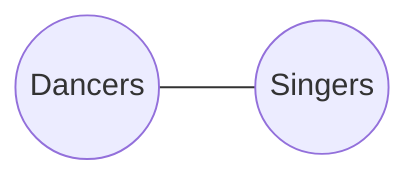

# Foundations of Data: Master class — Numbers, Logic & Structure
> **Pre-Read — Academic Session 5 (Master class)** | Module 1: Foundations of Data
---
## Mental Map
> 📄 Also provided as a printable PDF in this folder: **mental-map: Master class Numbers, Logic & Structure.pdf**

```mermaid
%%{init: {'flowchart': {'useMaxWidth': false, 'htmlLabels': true, 'nodeSpacing': 60, 'rankSpacing': 95, 'wrappingWidth': 620, 'padding': 18}}}%%
flowchart LR

START["<b>Course Start</b>"]

subgraph foundation[" WHERE WE ARE "]
direction TB
    CURMOD["<b>CURRENT MODULE</b><br/><i>Module 1: Foundations of Data</i><br/>&nbsp;<br/><b>Covered so far:</b> AI Landscape & Programming Foundations; Python Fundamentals; Control Flow; Loops & Iteration<br/>This is Session 5 of 39"]
    CURSES["<b>CURRENT SESSION</b><br/><b>Master class: Numbers, Logic & Structure —<br/>The Mathematical Language of Data</b><br/>&nbsp;<br/><i>The shift:</i> from <i>'I can write code that works'</i> to <b>'I understand the mathematics that makes it work'</b><br/>&nbsp;<br/>Binary & Boolean logic · Truth tables & De Morgan's laws<br/>Set theory · Python structures as sets & functions"]
end

subgraph outcome[" OUTCOME OF THIS SESSION "]
direction TB
    OUT["<b>By the end, you can…</b><br/>&nbsp;<br/>Explain why 0s and 1s can represent any decision, build truth tables for compound logic,<br/>and see lists/dicts/sets as implementations of mathematical structures"]
end

subgraph value[" WHY IT MATTERS "]
direction TB
    CVAL["<b>Course Value</b><br/>Every if/elif/else, every list and dictionary, and every function you write from here on is a direct application of today's mathematics"]
    RVAL["<b>Real-Life Value</b><br/>The same logic behind how a railway crossing gate combines two signals, or how a vending machine maps a button code to exactly one snack"]
end

subgraph future[" WHAT COMES NEXT "]
direction TB
    U0["<b>Next Session</b><br/>Writing Reusable Code with Functions<br/><i>Turn today's mathematical idea of a function into real, reusable Python code</i>"]
    U1["<b>Later in Module 1</b><br/>Python Data Structures, File Handling & APIs, NumPy, Pandas"]
    U2["<b>Upcoming Modules</b><br/>Course continues beyond Foundations of Data<br/><i>Details as the curriculum unfolds</i>"]
end

START ==>|" begin "| CURMOD
CURMOD ==>|" progress "| CURSES
CURSES ==>|" you get "| OUT
OUT ==>|" course "| CVAL
OUT ==>|" real life "| RVAL
CURSES ==>|" next up "| U0
U0 -.->|" then "| U1
U1 -.->|" ahead "| U2

classDef startBox fill:#F7FAFC,stroke:#4A5568,stroke-width:2px,color:#1A202C
classDef curModBox fill:#FFF8E6,stroke:#B7791F,stroke-width:2px,color:#1A202C
classDef curSessBox fill:#E6FFFA,stroke:#0D9488,stroke-width:3px,color:#1A202C
classDef outBox fill:#FEF2F2,stroke:#DC2626,stroke-width:3px,color:#1A202C
classDef valueBox fill:#F3E8FF,stroke:#7C3AED,stroke-width:2px,color:#1A202C
classDef futureBox fill:#ECFDF5,stroke:#047857,stroke-width:2px,color:#1A202C

class START startBox
class CURMOD curModBox
class CURSES curSessBox
class OUT outBox
class CVAL,RVAL valueBox
class U0,U1,U2 futureBox
```



## What You'll Learn
In this pre-read, you'll discover:
- Why every decision a computer makes can be reduced to **binary (0s and 1s)**
- How **truth tables** and **De Morgan's laws** let you predict any compound logical expression
- What a mathematical **set** is, and how it relates to Python's lists, dicts, and sets
- What a **function** means mathematically — before it ever means a `def` block in code

---

## A. Binary Numbers & Boolean Logic

- 💡 **Analogy** — Think of a **string of festival lights**, where each bulb is either lit or unlit — nothing in between. Each bulb is one **bit**: a `1` if lit, a `0` if not. A whole string of bulbs, read as a pattern of on/off, can represent any number, any letter, any image — because everything a computer stores is, underneath, just patterns of these two states.

- **Binary is a number system with only two digits, 0 and 1; every value a computer stores — numbers, text, images, decisions — is ultimately represented as patterns of these two states.**

- **Core explanation:**

| Concept | What it means |
|---|---|
| Bit | A single 0 or 1 — the smallest unit of information |
| Binary number | A number written using only 0s and 1s (e.g., `101` = 5 in decimal) |
| Boolean logic | Reasoning using only two values: True and False (which map directly onto 1 and 0) |
| Logical operators | `AND`, `OR`, `NOT` — the same operations Python's `and`, `or`, `not` perform |

- **Worked example:** The number `101` in binary reads (from right to left) as `1×1 + 0×2 + 1×4 = 5`. Every `if is_paid:` you've written is really asking a hardware-level question: is this bit a 1 or a 0?

- ⚠️ **Common trap:** Assuming binary is some exotic separate system computers occasionally use. It isn't occasional — it's the ONLY way information is physically stored; everything else (decimal numbers, letters, colors) is just a human-friendly translation layered on top.

---

## B. Truth Tables & De Morgan's Laws

- 💡 **Analogy** — Think of a **railway crossing gate** that only lowers if EITHER a train is approaching from the north OR from the south. A **truth table** is simply the complete list of every possible combination of "train from north: yes/no" and "train from south: yes/no," alongside what the gate does in each case.

- **A truth table lists every possible combination of True/False inputs for a logical expression, along with the resulting output — it's a complete map of a compound condition's behavior.**

- **Core explanation — truth table for AND, OR, NOT:**

| A | B | A and B | A or B | not A |
|---|---|---|---|---|
| True | True | True | True | False |
| True | False | False | True | False |
| False | True | False | True | True |
| False | False | False | False | True |

- **De Morgan's Laws** — two rules that let you rewrite a "not" spread across an `and`/`or`:

| Rule | In words |
|---|---|
| `not (A and B) == (not A) or (not B)` | "Not both" is the same as "at least one is missing" |
| `not (A or B) == (not A) and (not B)` | "Neither" is the same as "both are missing" |

- **Worked example:** "You're stopped at security if you DON'T have BOTH your ticket AND your ID" is the same rule as "You're stopped if you're missing your ticket OR missing your ID." That's De Morgan's law in plain English — `not (ticket and id)` equals `(not ticket) or (not id)`.

- ⚠️ **Common trap:** Assuming `not (A and B)` is the same as `(not A) and (not B)`. It isn't — De Morgan's law says the `and` flips to an `or` when the `not` moves inside. Mixing this up silently produces the wrong logic.

---

## C. Set Theory Basics

- 💡 **Analogy** — Think of two friend groups at a college fest: everyone who signed up for the **dance competition**, and everyone who signed up for the **singing competition**. Some students are in both lists, some in only one, some in neither. This is exactly what mathematical set theory studies.

- **A set is a collection of distinct items with no particular order and no duplicates — set theory studies how collections combine, overlap, and differ.**

- **Core explanation:**

| Operation | Symbol | Meaning | Example |
|---|---|---|---|
| Union | ∪ | Everyone in either group | Dancers ∪ Singers = everyone in at least one |
| Intersection | ∩ | Only those in both groups | Dancers ∩ Singers = students doing both |
| Complement | ' or ᶜ | Everyone NOT in the group | Dancersᶜ = everyone who isn't dancing |
| Subset | ⊆ | Every item of one set is also in another | Finalists ⊆ Dancers |

- **Worked example:**
```python
dancers = {"Aditi", "Rohan", "Meera"}
singers = {"Rohan", "Priya"}

print(dancers | singers)   # union: everyone in either
print(dancers & singers)   # intersection: {"Rohan"} — in both
print(dancers - singers)   # complement-style: dancers not singing
```

- ⚠️ **Common trap:** Assuming a Python list works like a mathematical set. Lists allow duplicates and care about order — sets don't. If you need "no duplicates, and I don't care about order," a Python `set` is the correct structure, not a `list`.


*(Picture this as a Venn diagram — the overlap is the intersection, the two full circles combined is the union.)*

---

## D. Python Structures as Sets & Functions

- 💡 **Analogy** — Think of a **vending machine**. Every valid button code (like `A3`) maps to exactly one snack. You never press `A3` and get two different snacks on two different days. A mathematical **function** works the same way: every input maps to exactly one output.

- **A mathematical function maps every input (from its domain) to exactly one output (in its codomain) — Python dictionaries implement this idea directly, and Python sets directly implement mathematical sets.**

- **Core explanation:**

| Math concept | Python equivalent | Example |
|---|---|---|
| Set (no duplicates, no order) | `set` | `{"Aditi", "Rohan"}` |
| Function (domain → codomain) | `dict` | `{"A3": "Chips", "B1": "Cola"}` |
| Domain (allowed inputs) | Dictionary keys | `"A3"`, `"B1"` |
| Range (actual outputs produced) | Dictionary values actually used | `"Chips"`, `"Cola"` |
| JSON structure | Nested dicts and lists | `{"name": "Priya", "orders": [1,2,3]}` |

- **Worked example:**
```python
vending_machine = {"A3": "Chips", "B1": "Cola", "C2": "Chocolate"}
print(vending_machine["A3"])   # "Chips" — every key maps to exactly one value
```
The keys (`"A3"`, `"B1"`, `"C2"`) are the domain — the allowed inputs. The values are what the function actually returns for each input.

- ⚠️ **Common trap:** Expecting a dictionary key to map to more than one value directly. If you need one input to produce multiple outputs, the value itself must be a list — e.g., `{"A3": ["Chips", "Extra Chips"]}` — the dictionary itself still maps each key to exactly one thing (which happens to be a list).

---

## Quick Reference — Concept to Python Mapping

| Mathematical idea | Python equivalent | Where you'll use it |
|---|---|---|
| Binary / bits | `bool` (True=1, False=0) | Every condition you've written since Session 2.1 |
| Truth table / AND, OR, NOT | `and`, `or`, `not` | Compound conditions |
| Set, union, intersection | `set`, `|`, `&`, `-` | De-duplicating data, comparing groups |
| Function (domain → codomain) | `dict`, `def` functions | Key-value lookups, reusable code (next session) |

---

## Practice Exercises

**1. Concept Detective**
Convert the binary number `1101` to decimal by hand, showing your working (right to left, powers of 2).

**2. Real-Life Application**
Describe a real "AND" rule and a real "OR" rule from daily life (like an eligibility rule, a discount rule, or an access rule), and write a mini truth table for each.

**3. Spot the Error**
A student claims `not (A and B)` is the same as `(not A) and (not B)`. Use De Morgan's law to show why this is incorrect, and state the correct equivalent.

**4. Pattern Recognition**
Given `class_A = {"Rohan", "Priya", "Aditi"}` and `class_B = {"Priya", "Meera"}`, predict the result of the union, the intersection, and `class_A - class_B`, before checking in Python.

**5. Planning Ahead**
You're about to build a vending-machine-style lookup in Python next session (functions). List, in your own words, what the "domain" and "range" would be for a function that takes a student's roll number and returns their exam result.

---
> ✅ **You're done!** You can now explain why binary underlies every decision a computer makes, build and read truth tables, and see Python's lists, dicts, and sets as real implementations of mathematical structures.
Next session, you'll turn today's mathematical idea of a function into real, reusable Python code in **Writing Reusable Code with Functions**.
