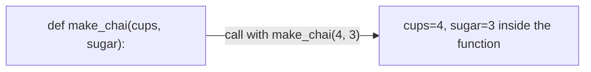

# Foundations of Data: Writing Reusable Code with Functions
> **Pre-Read — Academic Session 6** | Module 1: Foundations of Data
---
## Mental Map
> 📄 Also provided as a printable PDF in this folder: **mental-map: Writing Reusable Code with Functions.pdf**

```mermaid
%%{init: {'flowchart': {'useMaxWidth': false, 'htmlLabels': true, 'nodeSpacing': 60, 'rankSpacing': 95, 'wrappingWidth': 620, 'padding': 18}}}%%
flowchart LR

START["<b>Course Start</b>"]

subgraph foundation[" WHERE WE ARE "]
direction TB
    CURMOD["<b>CURRENT MODULE</b><br/><i>Module 1: Foundations of Data</i><br/>&nbsp;<br/><b>Covered so far:</b> AI Landscape; Python Fundamentals; Control Flow; Loops; Master class: Numbers, Logic & Structure<br/>This is Session 6 of 39"]
    CURSES["<b>CURRENT SESSION</b><br/><b>Writing Reusable Code with Functions</b><br/>&nbsp;<br/><i>The shift:</i> from <i>'I copy-paste the same code again'</i> to <b>'I write it once and reuse it everywhere'</b><br/>&nbsp;<br/>def, parameters & arguments · return values<br/>Scope · Default arguments · Code modularity"]
end

subgraph outcome[" OUTCOME OF THIS SESSION "]
direction TB
    OUT["<b>By the end, you can…</b><br/>&nbsp;<br/>Define and call functions with parameters and return values, explain how scope affects variable access,<br/>and refactor repeated code into clean, reusable functions"]
end

subgraph value[" WHY IT MATTERS "]
direction TB
    CVAL["<b>Course Value</b><br/>Every real project from here on — file handling, NumPy, Pandas — is organized into functions instead of one long unmanageable script"]
    RVAL["<b>Real-Life Value</b><br/>The same idea behind a recipe card you reuse for every batch of chai, instead of re-explaining the steps to yourself each time"]
end

subgraph future[" WHAT COMES NEXT "]
direction TB
    U0["<b>Next Session</b><br/>Python Data Structures<br/><i>Learn the containers your functions will take in and return</i>"]
    U1["<b>Later in Module 1</b><br/>File Handling, JSON & APIs; NumPy; Pandas"]
    U2["<b>Upcoming Modules</b><br/>Course continues beyond Foundations of Data<br/><i>Details as the curriculum unfolds</i>"]
end

START ==>|" begin "| CURMOD
CURMOD ==>|" progress "| CURSES
CURSES ==>|" you get "| OUT
OUT ==>|" course "| CVAL
OUT ==>|" real life "| RVAL
CURSES ==>|" next up "| U0
U0 -.->|" then "| U1
U1 -.->|" ahead "| U2

classDef startBox fill:#F7FAFC,stroke:#4A5568,stroke-width:2px,color:#1A202C
classDef curModBox fill:#FFF8E6,stroke:#B7791F,stroke-width:2px,color:#1A202C
classDef curSessBox fill:#E6FFFA,stroke:#0D9488,stroke-width:3px,color:#1A202C
classDef outBox fill:#FEF2F2,stroke:#DC2626,stroke-width:3px,color:#1A202C
classDef valueBox fill:#F3E8FF,stroke:#7C3AED,stroke-width:2px,color:#1A202C
classDef futureBox fill:#ECFDF5,stroke:#047857,stroke-width:2px,color:#1A202C

class START startBox
class CURMOD curModBox
class CURSES curSessBox
class OUT outBox
class CVAL,RVAL valueBox
class U0,U1,U2 futureBox
```



## What You'll Learn
In this pre-read, you'll discover:
- How to **define and call** a function using `def`, with **parameters** and **arguments**
- How **return values** send a result back out of a function
- How **scope** decides which variables a function can and can't see
- How **default arguments** make some parameters optional
- How to **refactor** repeated code into clean, reusable functions

---

## A. def, Parameters & Arguments

- 💡 **Analogy** — Think of a **recipe card for chai**. The card describes the steps in general terms: "boil ___ cups of water, add ___ spoons of sugar." Those blanks are **parameters** — placeholders. When you actually make chai for 4 people using 4 cups and 3 spoons, those specific numbers are the **arguments** — the real values you plug into the recipe that one time.

- **`def` creates a reusable block of code; parameters are the placeholder names in its definition; arguments are the actual values you pass in when you call it.**

- **Core explanation:**

| Term | What it means |
|---|---|
| `def` | Keyword that defines a function |
| Parameter | The placeholder name listed in the function's definition |
| Argument | The actual value passed in when the function is called |
| Function call | Running the function with specific arguments, e.g. `make_chai(4, 3)` |

- **Worked example:**
```python
def make_chai(cups_of_water, spoons_of_sugar):
    print(f"Boiling {cups_of_water} cups of water with {spoons_of_sugar} spoons of sugar")

make_chai(4, 3)   # cups_of_water=4, spoons_of_sugar=3 — these are the arguments
make_chai(2, 1)   # same recipe, different arguments — reused, not rewritten
```

- ⚠️ **Common trap:** Confusing the words "parameter" and "argument" — it's a minor vocabulary point, but more importantly, forgetting that the ORDER of arguments matters unless you name them explicitly (e.g., `make_chai(spoons_of_sugar=1, cups_of_water=2)`).



---

## B. Return Values

- 💡 **Analogy** — Think of sending a **courier package**. You hand over an item, the courier processes it, and eventually a package comes back to you. `print()` is like shouting the result out loud — nobody can actually use it afterward. `return` is like handing the result back as a package you can store, pass along, or use in further steps.

- **`return` sends a value back out of a function so it can be stored in a variable and reused — `print()` only displays a value, it doesn't give it back to your code.**

- **Core explanation:**

| Task | Code | Can you reuse the result? |
|---|---|---|
| Just display something | `print(total)` | No — it's gone once shown |
| Send a value back | `return total` | Yes — store it in a variable |

- **Worked example:**
```python
def calculate_total(item_count, price):
    return item_count * price

order_total = calculate_total(3, 49.5)   # order_total now holds 148.5
print(f"Your total is ₹{order_total}")
```
Because `calculate_total` used `return`, its result could be stored in `order_total` and reused — a `print()`-only version couldn't have done this.

- ⚠️ **Common trap:** Using `print()` inside a function when you actually need the value later. A function that only prints its result can't have that result stored, compared, or passed into another function — `return` is what makes a function's output usable.

---

## C. Scope

- 💡 **Analogy** — Think of an **office building**. Each employee's private cabin is where they keep their personal notes — nobody outside can see what's in someone else's cabin. But the announcement board in the lobby is visible to everyone. Variables inside a function are like the private cabin notes — **local scope**. Variables defined outside any function are like the lobby board — **global scope**.

- **Scope determines where in your code a variable can be accessed — variables created inside a function are local to it and disappear once the function finishes running.**

- **Core explanation:**

| Scope type | Where it's visible | Example |
|---|---|---|
| Local | Only inside the function it was created in | A variable defined inside `def make_chai():` |
| Global | Anywhere in the program, including inside functions | A variable defined at the top level of your script |

- **Worked example:**
```python
shop_name = "Sharma Tea Stall"   # global — visible everywhere

def greet_customer():
    special_of_the_day = "Ginger Chai"   # local — only exists inside this function
    print(f"Welcome to {shop_name}! Today's special is {special_of_the_day}")

greet_customer()
print(special_of_the_day)   # this line will crash — special_of_the_day doesn't exist out here
```

- ⚠️ **Common trap:** Trying to use a variable outside the function it was defined in. Once a function finishes running, its local variables are gone — attempting to access them from outside raises a `NameError`.

---

## D. Default Arguments

- 💡 **Analogy** — Think of ordering **"chai"** at a tea stall without specifying anything else. You'll get the standard, default version — normal sugar, normal milk. Only if you say "less sugar" does the stall owner make an exception. A **default argument** works the same way: it's used automatically unless you explicitly override it.

- **A default argument gives a parameter a fallback value that's used automatically if the caller doesn't provide one.**

- **Core explanation:**

| Concept | Example |
|---|---|
| Parameter with a default | `def make_chai(cups=1, sugar_level="normal"):` |
| Calling with no override | `make_chai()` → uses `cups=1, sugar_level="normal"` |
| Calling with an override | `make_chai(2, "less")` → uses the values you gave instead |

- **Worked example:**
```python
def make_chai(cups=1, sugar_level="normal"):
    print(f"Making {cups} cup(s) of chai, {sugar_level} sugar")

make_chai()                     # uses both defaults
make_chai(3)                    # overrides only cups
make_chai(2, "less")            # overrides both
```

- ⚠️ **Common trap:** Placing a default parameter BEFORE a non-default one in the function definition, like `def make_chai(sugar_level="normal", cups):` — Python doesn't allow this; all parameters with defaults must come after the ones without.

---

## E. Code Modularity — Refactoring Repeated Code

- 💡 **Analogy** — Think of a **restaurant kitchen with specialized stations** — one for tandoor, one for desserts, one for drinks — instead of a single cook trying to do everything from one confused counter. Breaking a long, repetitive script into small, focused functions is the same idea: each function has one clear job.

- **Modularity means breaking your code into small, focused functions instead of one long repetitive script — each function does one job, and you call it wherever that job is needed.**

- **Core explanation:**

| Sign you should refactor into a function | Why |
|---|---|
| You've copy-pasted the same block 2+ times | A function replaces every copy with one reusable call |
| A block of code does one clear, nameable task | Naming it as a function makes the whole script more readable |
| You need to fix a bug in repeated logic | Fixing it once inside a function fixes it everywhere it's used |

- **Worked example — before and after refactoring:**
```python
# Before: repeated code
print(f"Total for order 1: ₹{3 * 49.5}")
print(f"Total for order 2: ₹{5 * 49.5}")

# After: refactored into a function
def print_order_total(item_count, price):
    print(f"Total: ₹{item_count * price}")

print_order_total(3, 49.5)
print_order_total(5, 49.5)
```

- ⚠️ **Common trap:** Refactoring too early, before you've actually repeated the code. A good rule of thumb: if you're about to copy-paste the same logic a second time, that's usually the moment to turn it into a function instead.

---

## Quick Reference — Functions Checklist

| Your situation | Use this |
|---|---|
| You need to reuse a block of logic multiple times | `def` a function |
| You need the result usable later in your code | `return`, not just `print()` |
| A variable should only exist temporarily, inside one task | Keep it local (inside the function) |
| Most calls will use the same value for a parameter | Give it a default argument |
| You've copy-pasted the same code more than once | Refactor it into a function |

---

## Practice Exercises

**1. Concept Detective**
In `def calculate_total(item_count, price):`, identify which words are parameters, and in `calculate_total(3, 49.5)`, identify which values are arguments.

**2. Real-Life Application**
Describe a repeated task you do in daily life (like making chai, packing a lunchbox, or calculating a monthly bill) and write it out as if it were a function's parameters and steps.

**3. Spot the Error**
A student writes a function that only uses `print()` to show its result, then tries to store the function's output in a variable and use it later. Explain what goes wrong and how to fix it.

**4. Pattern Recognition**
Given a function with a local variable defined inside it, predict what happens if you try to print that variable's value from outside the function, after calling it.

**5. Planning Ahead**
You have three separate blocks of code, each calculating a different customer's order total using the same formula. Rewrite this scenario, in plain words, as a single reusable function with two parameters and a return value.

---
> ✅ **You're done!** You can now define and call functions with parameters and return values, explain how scope affects variable access, and refactor repeated code into clean, reusable functions.
Next session, you'll learn the data structures — lists, dictionaries, tuples, and sets — that your functions will take in and return, in **Python Data Structures**.
