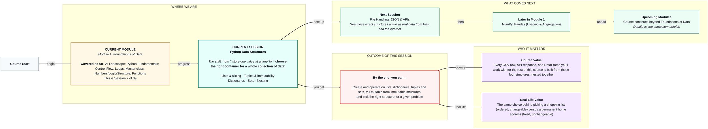

# Mental Map — Python Data Structures
> Academic Session 7 · Module 1: Foundations of Data

```mermaid
%%{init: {"theme": "default", "themeVariables": { "fontSize": "28px", "fontFamily": "sans-serif" }, "flowchart": {"useMaxWidth": false, "htmlLabels": true, "nodeSpacing": 100, "rankSpacing": 140, "wrappingWidth": 700, "padding": 40}}}%%
flowchart LR

START["<b>Course Start</b>"]

subgraph foundation[" WHERE WE ARE "]
direction TB
    CURMOD["<b>CURRENT MODULE</b><br/><i>Module 1: Foundations of Data</i><br/>&nbsp;<br/><b>Covered so far:</b> AI Landscape; Python Fundamentals; Control Flow; Loops; Master class: Numbers/Logic/Structure; Functions<br/>This is Session 7 of 39"]
    CURSES["<b>CURRENT SESSION</b><br/><b>Python Data Structures</b><br/>&nbsp;<br/><i>The shift:</i> from <i>'I store one value at a time'</i> to <b>'I choose the right container for a whole collection of data'</b><br/>&nbsp;<br/>Lists & slicing · Tuples & immutability<br/>Dictionaries · Sets · Nesting"]
end

subgraph outcome[" OUTCOME OF THIS SESSION "]
direction TB
    OUT["<b>By the end, you can…</b><br/>&nbsp;<br/>Create and operate on lists, dictionaries, tuples and sets, tell mutable from immutable structures,<br/>and pick the right structure for a given problem"]
end

subgraph value[" WHY IT MATTERS "]
direction TB
    CVAL["<b>Course Value</b><br/>Every CSV row, API response, and DataFrame you'll work with for the rest of this course is built from these four structures, nested together"]
    RVAL["<b>Real-Life Value</b><br/>The same choice behind picking a shopping list (ordered, changeable) versus a permanent home address (fixed, unchangeable)"]
end

subgraph future[" WHAT COMES NEXT "]
direction TB
    U0["<b>Next Session</b><br/>File Handling, JSON & APIs<br/><i>See these exact structures arrive as real data from files and the internet</i>"]
    U1["<b>Later in Module 1</b><br/>NumPy, Pandas (Loading & Aggregation)"]
    U2["<b>Upcoming Modules</b><br/>Course continues beyond Foundations of Data<br/><i>Details as the curriculum unfolds</i>"]
end

START ==>|" begin "| CURMOD
CURMOD ==>|" progress "| CURSES
CURSES ==>|" you get "| OUT
OUT ==>|" course "| CVAL
OUT ==>|" real life "| RVAL
CURSES ==>|" next up "| U0
U0 -.->|" then "| U1
U1 -.->|" ahead "| U2

classDef startBox fill:#F7FAFC,stroke:#4A5568,stroke-width:2px,color:#1A202C
classDef curModBox fill:#FFF8E6,stroke:#B7791F,stroke-width:2px,color:#1A202C
classDef curSessBox fill:#E6FFFA,stroke:#0D9488,stroke-width:3px,color:#1A202C
classDef outBox fill:#FEF2F2,stroke:#DC2626,stroke-width:3px,color:#1A202C
classDef valueBox fill:#F3E8FF,stroke:#7C3AED,stroke-width:2px,color:#1A202C
classDef futureBox fill:#ECFDF5,stroke:#047857,stroke-width:2px,color:#1A202C

class START startBox
class CURMOD curModBox
class CURSES curSessBox
class OUT outBox
class CVAL,RVAL valueBox
class U0,U1,U2 futureBox
```
