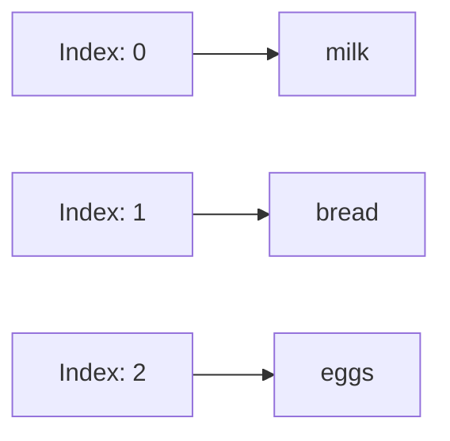

# Foundations of Data: Python Data Structures
> **Pre-Read — Academic Session 7** | Module 1: Foundations of Data
---
## Mental Map
> 📄 Also provided as a printable PDF in this folder: **mental-map: Python Data Structures.pdf**

```mermaid
%%{init: {'flowchart': {'useMaxWidth': false, 'htmlLabels': true, 'nodeSpacing': 60, 'rankSpacing': 95, 'wrappingWidth': 620, 'padding': 18}}}%%
flowchart LR

START["<b>Course Start</b>"]

subgraph foundation[" WHERE WE ARE "]
direction TB
    CURMOD["<b>CURRENT MODULE</b><br/><i>Module 1: Foundations of Data</i><br/>&nbsp;<br/><b>Covered so far:</b> AI Landscape; Python Fundamentals; Control Flow; Loops; Master class: Numbers/Logic/Structure; Functions<br/>This is Session 7 of 39"]
    CURSES["<b>CURRENT SESSION</b><br/><b>Python Data Structures</b><br/>&nbsp;<br/><i>The shift:</i> from <i>'I store one value at a time'</i> to <b>'I choose the right container for a whole collection of data'</b><br/>&nbsp;<br/>Lists & slicing · Tuples & immutability<br/>Dictionaries · Sets · Nesting"]
end

subgraph outcome[" OUTCOME OF THIS SESSION "]
direction TB
    OUT["<b>By the end, you can…</b><br/>&nbsp;<br/>Create and operate on lists, dictionaries, tuples and sets, tell mutable from immutable structures,<br/>and pick the right structure for a given problem"]
end

subgraph value[" WHY IT MATTERS "]
direction TB
    CVAL["<b>Course Value</b><br/>Every CSV row, API response, and DataFrame you'll work with for the rest of this course is built from these four structures, nested together"]
    RVAL["<b>Real-Life Value</b><br/>The same choice behind picking a shopping list (ordered, changeable) versus a permanent home address (fixed, unchangeable)"]
end

subgraph future[" WHAT COMES NEXT "]
direction TB
    U0["<b>Next Session</b><br/>File Handling, JSON & APIs<br/><i>See these exact structures arrive as real data from files and the internet</i>"]
    U1["<b>Later in Module 1</b><br/>NumPy, Pandas (Loading & Aggregation)"]
    U2["<b>Upcoming Modules</b><br/>Course continues beyond Foundations of Data<br/><i>Details as the curriculum unfolds</i>"]
end

START ==>|" begin "| CURMOD
CURMOD ==>|" progress "| CURSES
CURSES ==>|" you get "| OUT
OUT ==>|" course "| CVAL
OUT ==>|" real life "| RVAL
CURSES ==>|" next up "| U0
U0 -.->|" then "| U1
U1 -.->|" ahead "| U2

classDef startBox fill:#F7FAFC,stroke:#4A5568,stroke-width:2px,color:#1A202C
classDef curModBox fill:#FFF8E6,stroke:#B7791F,stroke-width:2px,color:#1A202C
classDef curSessBox fill:#E6FFFA,stroke:#0D9488,stroke-width:3px,color:#1A202C
classDef outBox fill:#FEF2F2,stroke:#DC2626,stroke-width:3px,color:#1A202C
classDef valueBox fill:#F3E8FF,stroke:#7C3AED,stroke-width:2px,color:#1A202C
classDef futureBox fill:#ECFDF5,stroke:#047857,stroke-width:2px,color:#1A202C

class START startBox
class CURMOD curModBox
class CURSES curSessBox
class OUT outBox
class CVAL,RVAL valueBox
class U0,U1,U2 futureBox
```



## What You'll Learn
In this pre-read, you'll discover:
- How **lists** store ordered, changeable collections — and how **indexing & slicing** let you grab parts of them
- How **tuples** protect data that should never change
- How **dictionaries** store key-value pairs for fast lookups
- How **sets** enforce uniqueness (a recap and extension from the Master class)
- How to **nest** these structures inside each other, and how to choose the right one

---

## A. Lists, Indexing & Slicing

- 💡 **Analogy** — Think of your **weekly grocery list**. It's ordered (milk before bread, because that's how you wrote it), you can add or remove items anytime, and you could technically write "onions" twice if you forgot you'd already added it. A Python **list** works exactly like this.

- **A list is an ordered, changeable (mutable) collection that allows duplicate values — items are accessed by their position (index), starting from 0.**

- **Core explanation:**

| Task | Code | Result |
|---|---|---|
| Create a list | `groceries = ["milk", "bread", "eggs"]` | An ordered collection |
| Access one item | `groceries[0]` | `"milk"` — first item, index 0 |
| Slice a range | `groceries[0:2]` | `["milk", "bread"]` — up to, not including, index 2 |
| Add an item | `groceries.append("butter")` | List grows by one |
| Change an item | `groceries[1] = "brown bread"` | Lists can be modified in place |

- **Worked example:**
```python
groceries = ["milk", "bread", "eggs", "butter", "onions"]
print(groceries[1:4])   # ["bread", "eggs", "butter"] — slice from index 1 up to (not including) 4
```

- ⚠️ **Common trap:** Assuming a slice like `[1:4]` includes the item at index `4`. It doesn't — the end index in a slice is always exclusive, exactly like `range()` from Session 2.2.



---

## B. Tuples & Immutability

- 💡 **Analogy** — Think of your **home address's pincode**. It's a fixed sequence of digits — you don't casually rearrange or edit it. A **tuple** is Python's way of saying "this collection is locked once created."

- **A tuple is an ordered collection just like a list, but immutable — once created, its contents can never be changed.**

- **Core explanation:**

| Structure | Ordered? | Changeable (mutable)? | Written as |
|---|---|---|---|
| List | Yes | Yes | `[1, 2, 3]` |
| Tuple | Yes | No | `(1, 2, 3)` |

- **Worked example:**
```python
home_coordinates = (17.3850, 78.4867)   # latitude, longitude — shouldn't change
print(home_coordinates[0])   # 17.3850 — reading works fine

home_coordinates[0] = 18.0   # this line crashes — tuples can't be modified
```

- ⚠️ **Common trap:** Trying to modify a tuple like a list. Python will raise a `TypeError` the moment you attempt it — this is intentional, not a bug, since tuples exist specifically to guarantee data stays fixed.

---

## C. Dictionaries

- 💡 **Analogy** — Think of your **phone's contact list**. You don't search for "the 47th person I saved" — you search by name, and instantly get their number. A **dictionary** stores data the same way: by a meaningful key, not a numbered position.

- **A dictionary stores key-value pairs — you look up a value by its unique key, not by numbered position.**

- **Core explanation:**

| Task | Code | Result |
|---|---|---|
| Create a dictionary | `contact = {"name": "Priya", "phone": "98765xxxxx"}` | Key-value pairs |
| Access a value | `contact["name"]` | `"Priya"` |
| Add/update a key | `contact["city"] = "Hyderabad"` | New key-value pair added |
| Check if a key exists | `"phone" in contact` | `True` |

- **Worked example:**
```python
contact = {"name": "Priya", "phone": "98765xxxxx", "city": "Hyderabad"}
print(contact["phone"])
```

- ⚠️ **Common trap:** Trying to access a dictionary using a numbered index like `contact[0]`. Dictionaries don't have positions the way lists do — you must use the actual key, like `contact["name"]`.

---

## D. Sets

- 💡 **Analogy** — Recall the **college fest sign-up lists** from the Master class: a set of dancers, a set of singers. A Python **set** enforces the same rule — no duplicates, no guaranteed order.

- **A set is an unordered collection of unique items — adding a duplicate has no effect, since a set can't contain the same value twice.**

- **Core explanation:**

| Task | Code | Result |
|---|---|---|
| Create a set | `dancers = {"Aditi", "Rohan", "Meera"}` | Unique items, no order |
| Add a duplicate | `dancers.add("Aditi")` | No change — already present |
| Union / intersection | `dancers | singers`, `dancers & singers` | Combine or overlap two sets |

- **Worked example:**
```python
signups = ["Aditi", "Rohan", "Aditi", "Meera", "Rohan"]
unique_signups = set(signups)
print(unique_signups)   # {"Aditi", "Rohan", "Meera"} — duplicates automatically removed
```

- ⚠️ **Common trap:** Trying to access a set item by index, like `dancers[0]`. Sets have no guaranteed order, so indexing isn't supported — if you need order, use a list instead.

---

## E. Nesting & Choosing the Right Structure

- 💡 **Analogy** — Think of a **customer's full order history** stored as a dictionary — where the value for each customer isn't just one number, but a whole LIST of their past orders, and each order is itself a dictionary of details. This "structures inside structures" pattern is called **nesting**, and it's exactly how real-world data (like JSON from an API) is shaped.

- **Nesting means putting one data structure inside another — a list of dictionaries, a dictionary of lists, and so on — to represent more complex, real-world data.**

- **Core explanation:**

| Situation | Best structure |
|---|---|
| Ordered items, may repeat, may change | List |
| Fixed values that should never change | Tuple |
| Look up values by meaningful name | Dictionary |
| Guarantee no duplicates | Set |
| Complex, real-world records | Nested combination of the above |

- **Worked example:**
```python
customer = {
    "name": "Priya",
    "orders": [
        {"item": "Chai", "price": 20},
        {"item": "Samosa", "price": 15}
    ]
}
print(customer["orders"][0]["item"])   # "Chai" — dictionary, inside a list, inside a dictionary
```

- ⚠️ **Common trap:** Getting lost in nested brackets. Read nested structures from the outside in, one layer at a time — `customer["orders"]` first (a list), then `[0]` (the first dictionary in that list), then `["item"]` (a value inside that dictionary).

---

## Quick Reference — Which Structure, When

| Your situation | Use this | Because |
|---|---|---|
| An ordered collection you'll add to or change | List | Mutable, allows duplicates, preserves order |
| A fixed collection that must never change | Tuple | Immutable, guards against accidental edits |
| You need to look values up by name, not position | Dictionary | Key-value lookup |
| You need to guarantee no duplicates | Set | Automatically enforces uniqueness |
| Your data has structures inside structures | Nested combination | Mirrors real-world, complex records like JSON |

---

## Practice Exercises

**1. Concept Detective**
Given `groceries = ["milk", "bread", "eggs", "butter"]`, predict the result of `groceries[1:3]` and explain why the item at index 3 is NOT included.

**2. Real-Life Application**
Describe one real collection of data you deal with that should be a tuple (fixed, unchangeable) and one that should be a set (must be unique) — explain your reasoning for each.

**3. Spot the Error**
A student writes `home_coordinates = (17.38, 78.48)` and then tries `home_coordinates[0] = 18.0`. Explain exactly why this fails.

**4. Pattern Recognition**
Given the nested structure `customer["orders"][1]["price"]`, explain in plain words, one layer at a time, exactly what each part of this expression accesses.

**5. Planning Ahead**
You're about to store a class roll call where names must never repeat, order doesn't matter, and you'll frequently check "is this name already on the list?" Which structure would you choose, and why?

---
> ✅ **You're done!** You can now create and operate on lists, dictionaries, tuples and sets, tell mutable from immutable structures apart, and choose the right structure for a given problem.
Next session, you'll see these exact structures arrive as real data from files and the internet in **File Handling, JSON & APIs**.
