# Foundations of Data: File Handling, JSON & APIs
> **Pre-Read — Academic Session 8** | Module 1: Foundations of Data
---
## Mental Map
> 📄 Also provided as a printable PDF in this folder: **mental-map: File Handling, JSON & APIs.pdf**

```mermaid
%%{init: {'flowchart': {'useMaxWidth': false, 'htmlLabels': true, 'nodeSpacing': 60, 'rankSpacing': 95, 'wrappingWidth': 620, 'padding': 18}}}%%
flowchart LR

START["<b>Course Start</b>"]

subgraph foundation[" WHERE WE ARE "]
direction TB
    CURMOD["<b>CURRENT MODULE</b><br/><i>Module 1: Foundations of Data</i><br/>&nbsp;<br/><b>Covered so far:</b> AI Landscape; Python Fundamentals; Control Flow; Loops; Master class: Numbers/Logic/Structure; Functions; Python Data Structures<br/>This is Session 8 of 39"]
    CURSES["<b>CURRENT SESSION</b><br/><b>File Handling, JSON & APIs</b><br/>&nbsp;<br/><i>The shift:</i> from <i>'my data lives only inside my code'</i> to <b>'I can read, save, and fetch real data from files and the internet'</b><br/>&nbsp;<br/>File I/O & context managers · JSON structure<br/>The requests library & APIs · Ethical key & rate-limit usage"]
end

subgraph outcome[" OUTCOME OF THIS SESSION "]
direction TB
    OUT["<b>By the end, you can…</b><br/>&nbsp;<br/>Read and write files safely, parse and generate JSON, make API calls with requests,<br/>and apply ethical usage of API keys and rate limits"]
end

subgraph value[" WHY IT MATTERS "]
direction TB
    CVAL["<b>Course Value</b><br/>This is the bridge from 'toy examples' to real data — every dataset and API you'll touch for the rest of the course arrives exactly this way"]
    RVAL["<b>Real-Life Value</b><br/>The same skill behind an app checking Swiggy's menu (GET) or placing your order (POST) behind the scenes"]
end

subgraph future[" WHAT COMES NEXT "]
direction TB
    U0["<b>Next Session</b><br/>NumPy: Numerical Foundation<br/><i>Handle large numerical datasets efficiently, without slow loops</i>"]
    U1["<b>Later in Module 1</b><br/>Pandas (Loading & Aggregation), Master class: Tables & Relationships"]
    U2["<b>Upcoming Modules</b><br/>Course continues beyond Foundations of Data<br/><i>Details as the curriculum unfolds</i>"]
end

START ==>|" begin "| CURMOD
CURMOD ==>|" progress "| CURSES
CURSES ==>|" you get "| OUT
OUT ==>|" course "| CVAL
OUT ==>|" real life "| RVAL
CURSES ==>|" next up "| U0
U0 -.->|" then "| U1
U1 -.->|" ahead "| U2

classDef startBox fill:#F7FAFC,stroke:#4A5568,stroke-width:2px,color:#1A202C
classDef curModBox fill:#FFF8E6,stroke:#B7791F,stroke-width:2px,color:#1A202C
classDef curSessBox fill:#E6FFFA,stroke:#0D9488,stroke-width:3px,color:#1A202C
classDef outBox fill:#FEF2F2,stroke:#DC2626,stroke-width:3px,color:#1A202C
classDef valueBox fill:#F3E8FF,stroke:#7C3AED,stroke-width:2px,color:#1A202C
classDef futureBox fill:#ECFDF5,stroke:#047857,stroke-width:2px,color:#1A202C

class START startBox
class CURMOD curModBox
class CURSES curSessBox
class OUT outBox
class CVAL,RVAL valueBox
class U0,U1,U2 futureBox
```



## What You'll Learn
In this pre-read, you'll discover:
- How to **read and write files** safely using `open()` and context managers
- How **JSON** structures data, and how to convert between JSON and Python
- How to make **API calls** using the `requests` library, and read GET/POST responses and status codes
- How to use **API keys responsibly** — respecting rate limits and terms of service

---

## A. File I/O & Context Managers

- 💡 **Analogy** — Think of **borrowing a book from a library**. You check it out (`open()`), read or write in it, and must return it when done — otherwise the library can't lend it to anyone else. A **context manager** (`with`) is an auto-return system: it guarantees the file gets closed properly, even if something goes wrong while you're using it.

- **`open()` gives you access to a file; a context manager (`with`) ensures it's automatically and safely closed when you're done, even if an error occurs.**

- **Core explanation:**

| Task | Code | Notes |
|---|---|---|
| Open and read a file | `with open("data.txt", "r") as f: content = f.read()` | `"r"` = read mode |
| Open and write a file | `with open("data.txt", "w") as f: f.write("Hello")` | `"w"` overwrites; `"a"` appends |
| File closes automatically | (end of the `with` block) | No need to call `f.close()` manually |

- **Worked example:**
```python
with open("orders.txt", "w") as f:
    f.write("Order 1: Chai, ₹20\n")
    f.write("Order 2: Samosa, ₹15\n")

with open("orders.txt", "r") as f:
    print(f.read())
```

- ⚠️ **Common trap:** Opening a file without `with` and forgetting to call `.close()`. The file may stay locked or unsaved changes may be lost — `with` prevents this class of bug entirely by handling closing for you automatically.

---

## B. JSON Structure

- 💡 **Analogy** — Think of a **filled-out application form** with clearly labeled fields — name, phone, list of previous addresses. **JSON** (JavaScript Object Notation) is exactly this: a standard, text-based way of writing structured data that looks almost identical to Python's nested dictionaries and lists from Session 3.3.

- **JSON is a text format for structured data, built from the same key-value and list ideas as Python dictionaries and lists — `json.loads()` converts JSON text into Python objects, and `json.dumps()` does the reverse.**

- **Core explanation:**

| Task | Code | Direction |
|---|---|---|
| JSON text → Python object | `data = json.loads(json_text)` | Parsing |
| Python object → JSON text | `json_text = json.dumps(data)` | Generating |

- **Worked example:**
```python
import json

json_text = '{"name": "Priya", "orders": ["Chai", "Samosa"]}'
data = json.loads(json_text)
print(data["orders"][0])   # "Chai" — now a normal Python dict/list

python_dict = {"city": "Hyderabad", "pincode": 500081}
print(json.dumps(python_dict))   # back to JSON text
```

- ⚠️ **Common trap:** Assuming JSON and a Python dictionary are literally the same object type. They look almost identical, but JSON is TEXT until you `json.loads()` it — you can't use dictionary methods on raw JSON text directly.

---

## C. APIs & the requests Library

- 💡 **Analogy** — Think of using a **food delivery app**. Checking the menu is a **GET** request — you're asking for information, not sending anything new. Placing an order is a **POST** request — you're sending new data to be processed. The app then tells you the order status — that's a **status code**.

- **An API lets your code talk to another service over the internet; GET retrieves data, POST sends data, and status codes tell you what happened.**

- **Core explanation:**

| Concept | Meaning |
|---|---|
| `requests.get(url)` | Ask a server for data (like checking a menu) |
| `requests.post(url, data=...)` | Send data to a server (like placing an order) |
| `200` status code | Success |
| `404` status code | Not found — the requested resource doesn't exist |
| `429` status code | Too many requests — you've hit a rate limit |
| `500` status code | Server error — something broke on their end |

- **Worked example:**
```python
import requests

response = requests.get("https://api.example.com/weather?city=Hyderabad")
print(response.status_code)   # e.g. 200
data = response.json()        # parses the JSON response directly into a Python dict
print(data)
```

- ⚠️ **Common trap:** Assuming a request always succeeds. Always check `response.status_code` (or wrap the call in error handling) before trusting the data — a `404` or `500` response won't contain the data you expect.

---

## D. Ethical API Usage — Keys & Rate Limits

- 💡 **Analogy** — Recall the **ATM PIN** analogy from Session 1.1: an API key proves you're allowed to use a service, and must never be shared publicly. A **rate limit** is like a shopkeeper telling you "please don't call me every 5 seconds asking for updates" — call too often, and the service may block you entirely.

- **API keys authenticate your requests and must be kept secret; rate limits cap how often you can call an API, and exceeding them (or violating a service's Terms of Service) can get your access revoked.**

- **Core explanation:**

| Practice | Why it matters |
|---|---|
| Store keys in `.env`, never in code | Prevents accidental public exposure (Session 1.1 recap) |
| Respect documented rate limits | Avoids `429` errors and service bans |
| Read the API's Terms of Service (ToS) | Some data can't legally be reused or redistributed |
| Add delays between many requests | Reduces load on the server, avoids being flagged as abuse |

- **Worked example:**
```python
import time
import requests

for city in ["Hyderabad", "Mumbai", "Delhi"]:
    response = requests.get(f"https://api.example.com/weather?city={city}")
    print(response.json())
    time.sleep(1)   # respectful pause between requests
```

- ⚠️ **Common trap:** Looping through hundreds of API calls with no delay or limit-checking. This can trigger rate limiting, get your key suspended, or in some cases violate the provider's terms of service entirely.

---

## Quick Reference — Which Tool, When

| Your situation | Use this | Because |
|---|---|---|
| You need to save or load data from your own machine | `open()` with `with` | Safe, auto-closing file access |
| Your data is structured with nested key-value pairs | JSON (`json.loads`/`json.dumps`) | Standard format for structured data exchange |
| You need to fetch data from an external service | `requests.get()` | Retrieves data without modifying anything |
| You need to send new data to an external service | `requests.post()` | Submits data for processing |
| You're calling an API repeatedly | Respect rate limits, add delays | Avoids bans and respects the provider's infrastructure |

---

## Practice Exercises

**1. Concept Detective**
Explain, in your own words, why using `with open(...) as f:` is safer than calling `open()` and `close()` manually.

**2. Real-Life Application**
Describe an app you use that clearly makes both GET requests (viewing data) and POST requests (submitting data) — name one example of each.

**3. Spot the Error**
A student's code calls an API 500 times in a tight loop with no delay and no status code checking. List two problems with this approach.

**4. Pattern Recognition**
Given a JSON response `{"status": "success", "data": {"price": 150}}`, write the exact Python expression to access the price value after parsing it.

**5. Planning Ahead**
You're about to build a script that checks a weather API every hour for five cities. List the ethical practices from today's session you'd apply, and why each matters.

---
> ✅ **You're done!** You can now read and write files safely, parse and generate JSON, make GET/POST API calls with requests, and use API keys and rate limits responsibly.
Next session, you'll learn to handle large numerical datasets efficiently, without slow loops, in **NumPy: Numerical Foundation**.
