# Foundations of Data: NumPy — Numerical Foundation
> **Pre-Read — Academic Session 9** | Module 1: Foundations of Data
---
## Mental Map
> 📄 Also provided as a printable PDF in this folder: **mental-map: NumPy Numerical Foundation.pdf**

```mermaid
%%{init: {'flowchart': {'useMaxWidth': false, 'htmlLabels': true, 'nodeSpacing': 60, 'rankSpacing': 95, 'wrappingWidth': 620, 'padding': 18}}}%%
flowchart LR

START["<b>Course Start</b>"]

subgraph foundation[" WHERE WE ARE "]
direction TB
    CURMOD["<b>CURRENT MODULE</b><br/><i>Module 1: Foundations of Data</i><br/>&nbsp;<br/><b>Covered so far:</b> AI Landscape through File Handling, JSON & APIs<br/>This is Session 9 of 39"]
    CURSES["<b>CURRENT SESSION</b><br/><b>NumPy: Numerical Foundation</b><br/>&nbsp;<br/><i>The shift:</i> from <i>'I loop through numbers one at a time'</i> to <b>'I operate on entire collections of numbers at once'</b><br/>&nbsp;<br/>Arrays & dtype · Shape, indexing & slicing<br/>Element-wise ops & broadcasting · Reshape & flatten"]
end

subgraph outcome[" OUTCOME OF THIS SESSION "]
direction TB
    OUT["<b>By the end, you can…</b><br/>&nbsp;<br/>Create and manipulate NumPy arrays with indexing and slicing, perform element-wise arithmetic and broadcasting without loops,<br/>and reshape or flatten arrays for downstream use"]
end

subgraph value[" WHY IT MATTERS "]
direction TB
    CVAL["<b>Course Value</b><br/>NumPy is the numerical engine underneath Pandas — every DataFrame column you'll use starting next module is secretly a NumPy array"]
    RVAL["<b>Real-Life Value</b><br/>The same idea behind applying a festival discount to an entire price list instantly, instead of updating each price by hand"]
end

subgraph future[" WHAT COMES NEXT "]
direction TB
    U0["<b>Next Session</b><br/>Pandas: Loading, Inspection & Filtering<br/><i>Put this numerical power inside labeled, spreadsheet-like tables</i>"]
    U1["<b>Later in Module 1</b><br/>Pandas: Aggregation & Merging, Master class: Tables & Relationships"]
    U2["<b>Upcoming Modules</b><br/>Course continues beyond Foundations of Data<br/><i>Details as the curriculum unfolds</i>"]
end

START ==>|" begin "| CURMOD
CURMOD ==>|" progress "| CURSES
CURSES ==>|" you get "| OUT
OUT ==>|" course "| CVAL
OUT ==>|" real life "| RVAL
CURSES ==>|" next up "| U0
U0 -.->|" then "| U1
U1 -.->|" ahead "| U2

classDef startBox fill:#F7FAFC,stroke:#4A5568,stroke-width:2px,color:#1A202C
classDef curModBox fill:#FFF8E6,stroke:#B7791F,stroke-width:2px,color:#1A202C
classDef curSessBox fill:#E6FFFA,stroke:#0D9488,stroke-width:3px,color:#1A202C
classDef outBox fill:#FEF2F2,stroke:#DC2626,stroke-width:3px,color:#1A202C
classDef valueBox fill:#F3E8FF,stroke:#7C3AED,stroke-width:2px,color:#1A202C
classDef futureBox fill:#ECFDF5,stroke:#047857,stroke-width:2px,color:#1A202C

class START startBox
class CURMOD curModBox
class CURSES curSessBox
class OUT outBox
class CVAL,RVAL valueBox
class U0,U1,U2 futureBox
```



## What You'll Learn
In this pre-read, you'll discover:
- What a **NumPy array** is, and why `dtype` makes it different from a Python list
- How **shape**, indexing and slicing work across multiple dimensions
- How **element-wise operations** and **broadcasting** let you skip loops entirely
- How to **reshape** and **flatten** arrays for downstream use

---

## A. Arrays & dtype

- 💡 **Analogy** — Think of a **train coach where every seat is the same class** — all sleeper, or all AC, never mixed. A NumPy array is like this coach: every element must be the same data type (`dtype`), unlike a Python list, which can freely mix types like `["milk", 3, True]`.

- **A NumPy array is a grid of values, all of the same data type — this uniformity is exactly what makes it fast for numerical operations.**

- **Core explanation:**

| Concept | Meaning |
|---|---|
| `np.array([...])` | Creates a NumPy array from a list |
| `dtype` | The single data type shared by every element (e.g., `int64`, `float64`) |
| Why it's faster | Uniform type lets NumPy store and process data far more efficiently than a mixed-type Python list |

- **Worked example:**
```python
import numpy as np

prices = np.array([49.5, 20, 15, 99.9])
print(prices.dtype)   # float64 — NumPy upgraded all values to match
```

- ⚠️ **Common trap:** Mixing types when creating an array, expecting them to stay separate like a Python list. NumPy will silently convert everything to a single common type (often float or string) — this can quietly change your data if you're not paying attention.

---

## B. Shape, Indexing & Slicing

- 💡 **Analogy** — Think of a **stadium seating chart**: block, row, and seat number together locate any single seat. A multi-dimensional NumPy array works the same way — its **shape** tells you the size along each dimension, and you index using multiple coordinates.

- **Shape describes an array's dimensions; indexing and slicing work similarly to lists, but extend across multiple dimensions using comma-separated coordinates.**

- **Core explanation:**

| Task | Code | Notes |
|---|---|---|
| Check shape | `arr.shape` | e.g. `(3, 4)` = 3 rows, 4 columns |
| Access one element (2D) | `arr[1, 2]` | Row 1, column 2 |
| Slice a range | `arr[0:2, :]` | First 2 rows, all columns |

- **Worked example:**
```python
seating = np.array([
    [1, 2, 3, 4],
    [5, 6, 7, 8],
    [9, 10, 11, 12]
])
print(seating.shape)     # (3, 4) — 3 rows, 4 columns
print(seating[1, 2])     # 7 — row 1, column 2
print(seating[0:2, :])   # first two rows, all columns
```

- ⚠️ **Common trap:** Confusing `arr[1][2]` (which also works, but is slower and less idiomatic) with the NumPy-preferred `arr[1, 2]`. Both give the same result for 2D arrays, but `arr[1, 2]` is the standard, more efficient NumPy style.

---

## C. Element-wise Operations & Broadcasting

- 💡 **Analogy** — Think of a shopkeeper announcing **"10% off everything!"** instead of walking around relabeling every single item by hand. That instant, whole-list discount is exactly what NumPy's **broadcasting** does — apply one operation to an entire array at once, no loop required.

- **Element-wise operations apply an action to every element of an array simultaneously; broadcasting lets you combine arrays (or an array and a single number) of different shapes without writing a manual loop.**

- **Core explanation:**

| Task | Loop version (slow) | NumPy version (fast) |
|---|---|---|
| Add 10 to every price | `for p in prices: p + 10` (needs a new list) | `prices + 10` |
| Multiply all by 0.9 (10% off) | Manual loop | `prices * 0.9` |
| Compare two equal-length arrays | Manual loop with zip | `array_a + array_b` |

- **Worked example:**
```python
prices = np.array([49.5, 20, 15, 99.9])
discounted = prices * 0.9   # 10% off everything, instantly
print(discounted)
```
No loop was written — NumPy applied the multiplication to every element automatically, which is both shorter to write and dramatically faster on large datasets.

- ⚠️ **Common trap:** Trying this exact syntax on a plain Python list — `[49.5, 20, 15] * 0.9` doesn't apply the discount element-wise; it either errors or behaves unexpectedly, because plain lists don't support broadcasting.

---

## D. Reshape & Flatten

- 💡 **Analogy** — Think of a **tray of chapatis arranged in a 3×4 grid**, versus the same chapatis lined up in a single row of 12. The chapatis themselves don't change — only how they're arranged. `reshape()` and `flatten()` do exactly this to array data.

- **`reshape()` rearranges an array's data into a different shape (same total number of elements); `flatten()` collapses a multi-dimensional array into a single 1D array.**

- **Core explanation:**

| Task | Code | Result |
|---|---|---|
| Reshape to a new grid | `arr.reshape(2, 6)` | Same 12 values, arranged as 2 rows × 6 columns |
| Flatten to 1D | `arr.flatten()` | All values in a single row |

- **Worked example:**
```python
grid = np.array([[1,2,3,4],[5,6,7,8],[9,10,11,12]])   # shape (3, 4)
reshaped = grid.reshape(2, 6)                           # shape (2, 6) — same 12 values
flat = grid.flatten()                                    # shape (12,) — one long row
```

- ⚠️ **Common trap:** Trying to reshape into dimensions that don't multiply to the same total count. A 12-element array can become `(2,6)`, `(3,4)`, `(1,12)`, or `(12,1)` — but never `(2,5)`, since `2×5=10 ≠ 12`.

---

## Quick Reference — NumPy Essentials

| Your situation | Use this | Because |
|---|---|---|
| You need fast numerical operations on many values | NumPy array, not a Python list | Uniform dtype makes it far faster |
| You need to apply the same math to every element | Element-wise operation | No loop needed — `arr * 0.9` |
| You're combining arrays of different shapes | Broadcasting | NumPy expands automatically where compatible |
| You need to check an array's dimensions | `.shape` | Tells you rows, columns, etc. |
| You need to rearrange data without changing values | `.reshape()` or `.flatten()` | Same data, different layout |

---

## Practice Exercises

**1. Concept Detective**
Explain, in your own words, why `np.array([1, "two", 3])` behaves differently from a Python list containing the same mixed values.

**2. Real-Life Application**
Describe a real scenario where applying one operation to an entire collection at once (like broadcasting) would save significant manual effort.

**3. Spot the Error**
A student tries `[10, 20, 30] * 2` expecting `[20, 40, 60]`, but gets `[10, 20, 30, 10, 20, 30]` instead. Explain why, and how using a NumPy array would fix it.

**4. Pattern Recognition**
Given an array with shape `(4, 3)`, list two other valid reshape targets (same total element count) and one invalid one.

**5. Planning Ahead**
You have a NumPy array of 100 exam scores and want to add 5 bonus marks to every score at once. Write the one line of code that does this, without any loop.

---
> ✅ **You're done!** You can now create and manipulate NumPy arrays with indexing and slicing, apply element-wise operations and broadcasting without loops, and reshape or flatten arrays as needed.
Next session, you'll put this numerical power inside labeled, spreadsheet-like tables in **Pandas: Loading, Inspection & Filtering**.
