# Foundations of Data: Pandas — Loading, Inspection & Filtering
> **Pre-Read — Academic Session 10** | Module 1: Foundations of Data
---
## Mental Map
> 📄 Also provided as a printable PDF in this folder: **mental-map: Pandas Loading, Inspection & Filtering.pdf**

```mermaid
%%{init: {'flowchart': {'useMaxWidth': false, 'htmlLabels': true, 'nodeSpacing': 60, 'rankSpacing': 95, 'wrappingWidth': 620, 'padding': 18}}}%%
flowchart LR

START["<b>Course Start</b>"]

subgraph foundation[" WHERE WE ARE "]
direction TB
    CURMOD["<b>CURRENT MODULE</b><br/><i>Module 1: Foundations of Data</i><br/>&nbsp;<br/><b>Covered so far:</b> AI Landscape through NumPy: Numerical Foundation<br/>This is Session 10 of 39"]
    CURSES["<b>CURRENT SESSION</b><br/><b>Pandas: Loading, Inspection & Filtering</b><br/>&nbsp;<br/><i>The shift:</i> from <i>'numbers in an array'</i> to <b>'labeled, real-world tables I can load, inspect, and filter'</b><br/>&nbsp;<br/>pd.read_csv() · head/info/describe/shape<br/>Boolean indexing · loc vs iloc & sorting"]
end

subgraph outcome[" OUTCOME OF THIS SESSION "]
direction TB
    OUT["<b>By the end, you can…</b><br/>&nbsp;<br/>Load a CSV into a DataFrame, inspect it with head/info/describe, filter rows with boolean conditions and loc/iloc,<br/>and spot data quality issues from inspection output"]
end

subgraph value[" WHY IT MATTERS "]
direction TB
    CVAL["<b>Course Value</b><br/>This is the tool you'll use in almost every remaining session — EDA, visualization, and SQL all assume you can load and filter a DataFrame first"]
    RVAL["<b>Real-Life Value</b><br/>The same skill behind a shop owner scanning through a sales ledger to find only the ₹500+ transactions from last week"]
end

subgraph future[" WHAT COMES NEXT "]
direction TB
    U0["<b>Next Session</b><br/>Pandas: Aggregation, Groupby & Merging<br/><i>Summarize this data and combine it with other tables</i>"]
    U1["<b>Later in Module 1</b><br/>Master class: Tables & Relationships, Data Visualization, EDA"]
    U2["<b>Upcoming Modules</b><br/>Course continues beyond Foundations of Data<br/><i>Details as the curriculum unfolds</i>"]
end

START ==>|" begin "| CURMOD
CURMOD ==>|" progress "| CURSES
CURSES ==>|" you get "| OUT
OUT ==>|" course "| CVAL
OUT ==>|" real life "| RVAL
CURSES ==>|" next up "| U0
U0 -.->|" then "| U1
U1 -.->|" ahead "| U2

classDef startBox fill:#F7FAFC,stroke:#4A5568,stroke-width:2px,color:#1A202C
classDef curModBox fill:#FFF8E6,stroke:#B7791F,stroke-width:2px,color:#1A202C
classDef curSessBox fill:#E6FFFA,stroke:#0D9488,stroke-width:3px,color:#1A202C
classDef outBox fill:#FEF2F2,stroke:#DC2626,stroke-width:3px,color:#1A202C
classDef valueBox fill:#F3E8FF,stroke:#7C3AED,stroke-width:2px,color:#1A202C
classDef futureBox fill:#ECFDF5,stroke:#047857,stroke-width:2px,color:#1A202C

class START startBox
class CURMOD curModBox
class CURSES curSessBox
class OUT outBox
class CVAL,RVAL valueBox
class U0,U1,U2 futureBox
```



## What You'll Learn
In this pre-read, you'll discover:
- How to **load a CSV** into a Pandas DataFrame, and the difference between a DataFrame and a Series
- How to **inspect** a DataFrame using `head()`, `info()`, `describe()`, and `shape`
- How to **filter rows** using boolean indexing
- How to use **loc vs iloc** for lookups, and how to sort and select columns

---

## A. Loading Data & DataFrame vs Series

- 💡 **Analogy** — Think of the **ledger register** at a kirana shop — every row is a transaction, every column is a field like date, item, and amount. A Pandas **DataFrame** is exactly this digital ledger. A single column pulled out on its own — just the "amount" column — is a **Series**.

- **A DataFrame is a labeled, 2D table (rows and columns); a Series is a single labeled column of data — a DataFrame is essentially a collection of Series sharing the same row labels.**

- **Core explanation:**

| Task | Code | Result |
|---|---|---|
| Load a CSV | `df = pd.read_csv("sales.csv")` | A DataFrame |
| Get one column | `df["amount"]` | A Series |
| Get multiple columns | `df[["amount", "item"]]` | A smaller DataFrame |

- **Worked example:**
```python
import pandas as pd

df = pd.read_csv("sales.csv")
print(type(df))            # DataFrame
print(type(df["amount"]))  # Series
```

- ⚠️ **Common trap:** Using single brackets `df["amount"]` when you meant double brackets `df[["amount"]]`. Single brackets give a Series (1D); double brackets give a DataFrame with just that one column (2D) — they look similar but behave differently for later operations.

---

## B. Inspecting a DataFrame

- 💡 **Analogy** — Think of **skimming the first few pages of a ledger** to get a sense of what's in it, checking how many entries are missing, and reading a quick summary of totals. That's exactly what `head()`, `info()`, and `describe()` do.

- **Inspection functions give you a quick, reliable first look at a dataset before you do any real analysis — always inspect before you trust or use a dataset.**

- **Core explanation:**

| Function | What it shows |
|---|---|
| `df.head()` | First 5 rows (by default) |
| `df.info()` | Column names, data types, and non-null counts |
| `df.describe()` | Count, mean, std, min, max, and quartiles for numeric columns |
| `df.shape` | `(rows, columns)` — the size of the DataFrame |

- **Worked example:**
```python
print(df.head())
print(df.info())
print(df.describe())
print(df.shape)
```
`info()` might reveal that the "phone" column has fewer non-null entries than the total row count — a data quality flag worth investigating before analysis.

- ⚠️ **Common trap:** Skipping straight to analysis without inspecting first. Missing values, wrong data types (like a price column read as text), and unexpected row counts are all things `head()`, `info()`, and `describe()` would have caught immediately.

---

## C. Boolean Indexing

- 💡 **Analogy** — Think of a **shop owner going through receipts and pulling out only the big-ticket ones** — anything over ₹500. Boolean indexing does exactly this: it builds a True/False mask for every row and keeps only the ones that are True — the same logic from Session 2.1's conditions.

- **Boolean indexing filters a DataFrame's rows by applying a condition that evaluates to True or False for each row, keeping only the True ones.**

- **Core explanation:**

| Task | Code |
|---|---|
| Filter rows where amount > 500 | `df[df["amount"] > 500]` |
| Combine multiple conditions | `df[(df["amount"] > 500) & (df["city"] == "Hyderabad")]` |

- **Worked example:**
```python
big_orders = df[df["amount"] > 500]
print(big_orders)
```

- ⚠️ **Common trap:** Using Python's plain `and`/`or` instead of `&`/`|` when combining conditions on a DataFrame. Pandas requires `&` and `|` (with each condition wrapped in parentheses) for row-by-row boolean logic — plain `and`/`or` will raise an error or behave incorrectly.

---

## D. loc vs iloc, Sorting & Column Selection

- 💡 **Analogy** — Think of searching a ledger two ways: by a **labeled date column** (like "give me the row for 15th July") — that's `loc`. Or by **pure position** — "give me the 5th row, whatever date it happens to be" — that's `iloc`.

- **`loc` selects by label (row/column names); `iloc` selects by integer position — both can select rows, columns, or specific cells.**

- **Core explanation:**

| Task | Code |
|---|---|
| Select by label | `df.loc[3, "amount"]` — row labeled 3, column "amount" |
| Select by position | `df.iloc[3, 1]` — 4th row, 2nd column, regardless of labels |
| Sort by a column | `df.sort_values("amount", ascending=False)` |
| Select specific columns | `df[["item", "amount"]]` |

- **Worked example:**
```python
top_orders = df.sort_values("amount", ascending=False)
print(top_orders[["item", "amount"]].head())
```

- ⚠️ **Common trap:** Assuming `loc` and `iloc` always give the same result. They match when the DataFrame's row labels happen to be simple 0,1,2,... integers — but after filtering or sorting, row labels often no longer match position, and `loc[3]` and `iloc[3]` can point to completely different rows.

---

## Quick Reference — Pandas Basics Checklist

| Your situation | Use this |
|---|---|
| You have a CSV file to load | `pd.read_csv("file.csv")` |
| You want a quick first look at your data | `head()`, `info()`, `describe()`, `shape` |
| You need only rows meeting a condition | Boolean indexing: `df[df["col"] > value]` |
| You need a specific row/column by name | `.loc[]` |
| You need a specific row/column by position | `.iloc[]` |
| You want data ordered by a column | `.sort_values("col")` |

---

## Practice Exercises

**1. Concept Detective**
Explain the difference between `df["amount"]` and `df[["amount"]]`, including what type each one returns.

**2. Real-Life Application**
Describe a real dataset you might work with (attendance records, expenses, exam scores) and write, in plain words, one boolean-indexing filter you'd apply to it.

**3. Spot the Error**
A student writes `df[df["amount"] > 500 and df["city"] == "Hyderabad"]` and gets an error. Explain what's wrong and how to fix it.

**4. Pattern Recognition**
After sorting a DataFrame with `sort_values()`, explain why `df.iloc[0]` and `df.loc[0]` might no longer return the same row.

**5. Planning Ahead**
You've just loaded a new CSV and want to check for data quality issues before doing any analysis. List, in order, the three inspection functions you'd run first and what each one would tell you.

---
> ✅ **You're done!** You can now load a CSV into a DataFrame, inspect it thoroughly, filter rows with boolean conditions, and use loc/iloc correctly.
Next session, you'll summarize this data with groupby and combine it with other tables in **Pandas: Aggregation, Groupby & Merging**.
