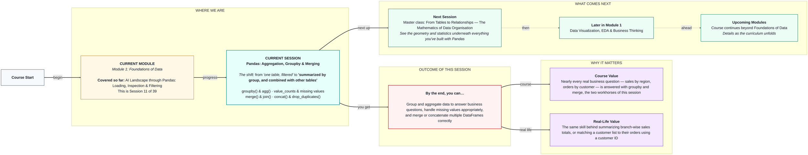

# Mental Map — Pandas: Aggregation, Groupby & Merging
> Academic Session 11 · Module 1: Foundations of Data

```mermaid
%%{init: {"theme": "default", "themeVariables": { "fontSize": "28px", "fontFamily": "sans-serif" }, "flowchart": {"useMaxWidth": false, "htmlLabels": true, "nodeSpacing": 100, "rankSpacing": 140, "wrappingWidth": 700, "padding": 40}}}%%
flowchart LR

START["<b>Course Start</b>"]

subgraph foundation[" WHERE WE ARE "]
direction TB
    CURMOD["<b>CURRENT MODULE</b><br/><i>Module 1: Foundations of Data</i><br/>&nbsp;<br/><b>Covered so far:</b> AI Landscape through Pandas: Loading, Inspection & Filtering<br/>This is Session 11 of 39"]
    CURSES["<b>CURRENT SESSION</b><br/><b>Pandas: Aggregation, Groupby & Merging</b><br/>&nbsp;<br/><i>The shift:</i> from <i>'one table, filtered'</i> to <b>'summarized by group, and combined with other tables'</b><br/>&nbsp;<br/>groupby() & agg() · value_counts & missing values<br/>merge() & join() · concat() & drop_duplicates()"]
end

subgraph outcome[" OUTCOME OF THIS SESSION "]
direction TB
    OUT["<b>By the end, you can…</b><br/>&nbsp;<br/>Group and aggregate data to answer business questions, handle missing values appropriately,<br/>and merge or concatenate multiple DataFrames correctly"]
end

subgraph value[" WHY IT MATTERS "]
direction TB
    CVAL["<b>Course Value</b><br/>Nearly every real business question — sales by region, orders by customer — is answered with groupby and merge, the two workhorses of this session"]
    RVAL["<b>Real-Life Value</b><br/>The same skill behind summarizing branch-wise sales totals, or matching a customer list to their orders using a customer ID"]
end

subgraph future[" WHAT COMES NEXT "]
direction TB
    U0["<b>Next Session</b><br/>Master class: From Tables to Relationships — The Mathematics of Data Organisation<br/><i>See the geometry and statistics underneath everything you've built with Pandas</i>"]
    U1["<b>Later in Module 1</b><br/>Data Visualization, EDA & Business Thinking"]
    U2["<b>Upcoming Modules</b><br/>Course continues beyond Foundations of Data<br/><i>Details as the curriculum unfolds</i>"]
end

START ==>|" begin "| CURMOD
CURMOD ==>|" progress "| CURSES
CURSES ==>|" you get "| OUT
OUT ==>|" course "| CVAL
OUT ==>|" real life "| RVAL
CURSES ==>|" next up "| U0
U0 -.->|" then "| U1
U1 -.->|" ahead "| U2

classDef startBox fill:#F7FAFC,stroke:#4A5568,stroke-width:2px,color:#1A202C
classDef curModBox fill:#FFF8E6,stroke:#B7791F,stroke-width:2px,color:#1A202C
classDef curSessBox fill:#E6FFFA,stroke:#0D9488,stroke-width:3px,color:#1A202C
classDef outBox fill:#FEF2F2,stroke:#DC2626,stroke-width:3px,color:#1A202C
classDef valueBox fill:#F3E8FF,stroke:#7C3AED,stroke-width:2px,color:#1A202C
classDef futureBox fill:#ECFDF5,stroke:#047857,stroke-width:2px,color:#1A202C

class START startBox
class CURMOD curModBox
class CURSES curSessBox
class OUT outBox
class CVAL,RVAL valueBox
class U0,U1,U2 futureBox
```
