# Foundations of Data: Pandas — Aggregation, Groupby & Merging
> **Pre-Read — Academic Session 11** | Module 1: Foundations of Data
---
## Mental Map
> 📄 Also provided as a printable PDF in this folder: **mental-map: Pandas Aggregation, Groupby & Merging.pdf**

```mermaid
%%{init: {'flowchart': {'useMaxWidth': false, 'htmlLabels': true, 'nodeSpacing': 60, 'rankSpacing': 95, 'wrappingWidth': 620, 'padding': 18}}}%%
flowchart LR

START["<b>Course Start</b>"]

subgraph foundation[" WHERE WE ARE "]
direction TB
    CURMOD["<b>CURRENT MODULE</b><br/><i>Module 1: Foundations of Data</i><br/>&nbsp;<br/><b>Covered so far:</b> AI Landscape through Pandas: Loading, Inspection & Filtering<br/>This is Session 11 of 39"]
    CURSES["<b>CURRENT SESSION</b><br/><b>Pandas: Aggregation, Groupby & Merging</b><br/>&nbsp;<br/><i>The shift:</i> from <i>'one table, filtered'</i> to <b>'summarized by group, and combined with other tables'</b><br/>&nbsp;<br/>groupby() & agg() · value_counts & missing values<br/>merge() & join() · concat() & drop_duplicates()"]
end

subgraph outcome[" OUTCOME OF THIS SESSION "]
direction TB
    OUT["<b>By the end, you can…</b><br/>&nbsp;<br/>Group and aggregate data to answer business questions, handle missing values appropriately,<br/>and merge or concatenate multiple DataFrames correctly"]
end

subgraph value[" WHY IT MATTERS "]
direction TB
    CVAL["<b>Course Value</b><br/>Nearly every real business question — sales by region, orders by customer — is answered with groupby and merge, the two workhorses of this session"]
    RVAL["<b>Real-Life Value</b><br/>The same skill behind summarizing branch-wise sales totals, or matching a customer list to their orders using a customer ID"]
end

subgraph future[" WHAT COMES NEXT "]
direction TB
    U0["<b>Next Session</b><br/>Master class: From Tables to Relationships — The Mathematics of Data Organisation<br/><i>See the geometry and statistics underneath everything you've built with Pandas</i>"]
    U1["<b>Later in Module 1</b><br/>Data Visualization, EDA & Business Thinking"]
    U2["<b>Upcoming Modules</b><br/>Course continues beyond Foundations of Data<br/><i>Details as the curriculum unfolds</i>"]
end

START ==>|" begin "| CURMOD
CURMOD ==>|" progress "| CURSES
CURSES ==>|" you get "| OUT
OUT ==>|" course "| CVAL
OUT ==>|" real life "| RVAL
CURSES ==>|" next up "| U0
U0 -.->|" then "| U1
U1 -.->|" ahead "| U2

classDef startBox fill:#F7FAFC,stroke:#4A5568,stroke-width:2px,color:#1A202C
classDef curModBox fill:#FFF8E6,stroke:#B7791F,stroke-width:2px,color:#1A202C
classDef curSessBox fill:#E6FFFA,stroke:#0D9488,stroke-width:3px,color:#1A202C
classDef outBox fill:#FEF2F2,stroke:#DC2626,stroke-width:3px,color:#1A202C
classDef valueBox fill:#F3E8FF,stroke:#7C3AED,stroke-width:2px,color:#1A202C
classDef futureBox fill:#ECFDF5,stroke:#047857,stroke-width:2px,color:#1A202C

class START startBox
class CURMOD curModBox
class CURSES curSessBox
class OUT outBox
class CVAL,RVAL valueBox
class U0,U1,U2 futureBox
```



## What You'll Learn
In this pre-read, you'll discover:
- How **groupby()** and **agg()** summarize data by category
- How **value_counts()** and missing-value handling (`fillna`, `dropna`) clean up messy data
- How **merge()** and **join()** combine tables using a shared key
- How **concat()** and **drop_duplicates()** stack tables together and remove repeats

---

## A. groupby() & agg()

- 💡 **Analogy** — Think of a kirana shop owner **sorting receipts into piles by product category** — one pile for groceries, one for dairy, one for snacks — then totaling each pile separately. That's exactly what `groupby()` does.

- **`groupby()` splits a DataFrame into groups based on a column's values, so you can calculate a summary (like sum or average) separately for each group.**

- **Core explanation:**

| Task | Code |
|---|---|
| Group and sum | `df.groupby("city")["amount"].sum()` |
| Group and get multiple stats | `df.groupby("city")["amount"].agg(["sum", "mean", "count"])` |

- **Worked example:**
```python
city_sales = df.groupby("city")["amount"].sum()
print(city_sales)
```
This gives you total sales per city, in one line — instead of manually filtering and summing for each city separately.

- ⚠️ **Common trap:** Forgetting to specify which column to aggregate. `df.groupby("city").sum()` will attempt to sum EVERY numeric column, which may include columns that don't make sense to total (like an ID column) — always be explicit about which column you actually want.

---

## B. value_counts() & Missing Values

- 💡 **Analogy** — Think of a **form where a customer forgot to fill in their phone number**. You have two choices: write "not provided" in that blank (`fillna`), or discard the incomplete form entirely (`dropna`).

- **`value_counts()` tallies how often each unique value appears in a column; missing values must be deliberately handled — either filled with a placeholder or dropped — since they can silently break calculations.**

- **Core explanation:**

| Task | Code |
|---|---|
| Count occurrences of each value | `df["city"].value_counts()` |
| Fill missing values | `df["phone"].fillna("Not provided")` |
| Drop rows with any missing values | `df.dropna()` |
| Check how many values are missing | `df.isnull().sum()` |

- **Worked example:**
```python
print(df["city"].value_counts())     # how many orders per city
print(df.isnull().sum())              # missing value count per column
df["phone"] = df["phone"].fillna("Not provided")
```

- ⚠️ **Common trap:** Using `dropna()` without thinking about how much data it removes. If even one column has a lot of missing values, `dropna()` (with default settings) drops the ENTIRE row — potentially losing perfectly good data in other columns.

---

## C. merge() & join()

- 💡 **Analogy** — Think of matching a **hostel room allocation list** with a **student ID list**, using student ID as the shared key to connect the two. `merge()` does exactly this — combining two DataFrames based on a common column.

- **`merge()` combines two DataFrames by matching rows on a shared key column, similar to a database join.**

- **Core explanation:**

| Merge type | What it keeps |
|---|---|
| `how="inner"` (default) | Only rows with matching keys in BOTH DataFrames |
| `how="left"` | All rows from the left DataFrame, matched where possible |
| `how="right"` | All rows from the right DataFrame, matched where possible |

- **Worked example:**
```python
customers = pd.DataFrame({"customer_id": [1,2,3], "name": ["Priya","Rohan","Meera"]})
orders = pd.DataFrame({"customer_id": [1,1,2], "item": ["Chai","Samosa","Cola"]})

merged = pd.merge(customers, orders, on="customer_id", how="left")
print(merged)
```
This keeps every customer, even Meera who has no orders — her order columns simply show as missing.

- ⚠️ **Common trap:** Using the default `how="inner"` without realizing it silently drops unmatched rows. If you actually needed to see customers with NO orders, `inner` would have hidden them completely — always choose the merge type deliberately.

---

## D. concat() & drop_duplicates()

- 💡 **Analogy** — Think of **stacking two months' sales ledgers** into one continuous ledger, one after the other. That's `concat()`. If the same transaction accidentally got recorded twice, `drop_duplicates()` removes the repeat.

- **`concat()` stacks DataFrames together (usually by rows); `drop_duplicates()` removes rows that are exact repeats of another row.**

- **Core explanation:**

| Task | Code |
|---|---|
| Stack two DataFrames | `pd.concat([january_sales, february_sales])` |
| Remove duplicate rows | `df.drop_duplicates()` |
| Remove duplicates based on specific columns | `df.drop_duplicates(subset=["order_id"])` |

- **Worked example:**
```python
all_sales = pd.concat([january_sales, february_sales])
all_sales = all_sales.drop_duplicates(subset=["order_id"])
```

- ⚠️ **Common trap:** Confusing `concat()` with `merge()`. `concat()` stacks tables with SIMILAR columns on top of each other (like adding more rows); `merge()` combines DIFFERENT tables side by side using a shared key (like adding more columns). Using the wrong one produces a nonsensical result.

---

## Quick Reference — Combining & Summarizing Checklist

| Your situation | Use this |
|---|---|
| You need totals or averages per category | `groupby()` + `agg()` |
| You need to count how often each value appears | `value_counts()` |
| You have missing values to handle | `fillna()` or `dropna()`, chosen deliberately |
| You need to combine two tables using a shared key | `merge()` |
| You need to stack two similarly-shaped tables | `concat()` |
| You suspect repeated rows | `drop_duplicates()` |

---

## Practice Exercises

**1. Concept Detective**
Explain, in your own words, what `df.groupby("city")["amount"].sum()` calculates and why specifying `["amount"]` matters.

**2. Real-Life Application**
Describe a real scenario where you'd need `merge()` (two related tables) versus one where you'd need `concat()` (two similarly-shaped tables).

**3. Spot the Error**
A student calls `df.dropna()` on a dataset with 1000 rows and ends up with only 200 rows left. What likely happened, and what alternative approach might preserve more data?

**4. Pattern Recognition**
Given a `left` merge between customers and orders, explain what happens to a customer who has never placed an order — what would their order columns show?

**5. Planning Ahead**
You have two CSVs — one with January sales, one with February sales, both with identical columns — and suspect a few transactions were recorded in both files by mistake. Describe, step by step, how you'd combine and clean this data.

---
> ✅ **You're done!** You can now group and aggregate data to answer business questions, handle missing values thoughtfully, and merge or concatenate DataFrames correctly.
Next session is a Master class — **From Tables to Relationships** — where you'll see the geometry and statistics quietly underneath everything you've built with Pandas so far.
