# Foundations of Data: Master class — From Tables to Relationships — The Mathematics of Data Organisation
> **Pre-Read — Academic Session 12 (Master class)** | Module 1: Foundations of Data
---
## Mental Map
> 📄 Also provided as a printable PDF in this folder: **mental-map: Master class From Tables to Relationships.pdf**

```mermaid
%%{init: {'flowchart': {'useMaxWidth': false, 'htmlLabels': true, 'nodeSpacing': 60, 'rankSpacing': 95, 'wrappingWidth': 620, 'padding': 18}}}%%
flowchart LR

START["<b>Course Start</b>"]

subgraph foundation[" WHERE WE ARE "]
direction TB
    CURMOD["<b>CURRENT MODULE</b><br/><i>Module 1: Foundations of Data</i><br/>&nbsp;<br/><b>Covered so far:</b> AI Landscape through Pandas: Aggregation, Groupby & Merging<br/>This is Session 12 of 39"]
    CURSES["<b>CURRENT SESSION</b><br/><b>Master class: From Tables to Relationships —<br/>The Mathematics of Data Organisation</b><br/>&nbsp;<br/><i>The shift:</i> from <i>'I can group and merge tables'</i> to <b>'I understand the geometry and statistics that make sense of them'</b><br/>&nbsp;<br/>Cartesian plane & plotting · Slope<br/>Mean, median, mode · Variance & standard deviation"]
end

subgraph outcome[" OUTCOME OF THIS SESSION "]
direction TB
    OUT["<b>By the end, you can…</b><br/>&nbsp;<br/>Explain why data visualisation is rooted in coordinate geometry,<br/>and compute and interpret mean, variance and standard deviation, including why the mean can mislead"]
end

subgraph value[" WHY IT MATTERS "]
direction TB
    CVAL["<b>Course Value</b><br/>Every chart you'll build next session, and every summary statistic in your EDA after that, is a direct application of today's mathematics"]
    RVAL["<b>Real-Life Value</b><br/>The same logic behind why one crorepati uncle skews a family's 'average income,' or how a bowler's consistency is judged by more than just their average"]
end

subgraph future[" WHAT COMES NEXT "]
direction TB
    U0["<b>Next Session</b><br/>Data Visualization<br/><i>Turn today's coordinate geometry into real Matplotlib and Plotly charts</i>"]
    U1["<b>Later in Module 1</b><br/>EDA & Business Thinking, SQL, Spreadsheets"]
    U2["<b>Upcoming Modules</b><br/>Course continues beyond Foundations of Data<br/><i>Details as the curriculum unfolds</i>"]
end

START ==>|" begin "| CURMOD
CURMOD ==>|" progress "| CURSES
CURSES ==>|" you get "| OUT
OUT ==>|" course "| CVAL
OUT ==>|" real life "| RVAL
CURSES ==>|" next up "| U0
U0 -.->|" then "| U1
U1 -.->|" ahead "| U2

classDef startBox fill:#F7FAFC,stroke:#4A5568,stroke-width:2px,color:#1A202C
classDef curModBox fill:#FFF8E6,stroke:#B7791F,stroke-width:2px,color:#1A202C
classDef curSessBox fill:#E6FFFA,stroke:#0D9488,stroke-width:3px,color:#1A202C
classDef outBox fill:#FEF2F2,stroke:#DC2626,stroke-width:3px,color:#1A202C
classDef valueBox fill:#F3E8FF,stroke:#7C3AED,stroke-width:2px,color:#1A202C
classDef futureBox fill:#ECFDF5,stroke:#047857,stroke-width:2px,color:#1A202C

class START startBox
class CURMOD curModBox
class CURSES curSessBox
class OUT outBox
class CVAL,RVAL valueBox
class U0,U1,U2 futureBox
```

## What You'll Learn
In this pre-read, you'll discover:
- What the **Cartesian plane** is, and why plotting data is really just mapping values to (x, y) coordinates
- What **slope** means, and why "rise over run" is the seed of trend lines and machine learning
- How **mean, median, and mode** each describe the "center" of data differently
- How **variance and standard deviation** reveal spread — and why the mean alone can lie

---

## A. The Cartesian Plane & Plotting as Mapping

- 💡 **Analogy** — Think of a **city map with grid coordinates** — like locating a landmark by "2 km east, 1 km north" of a reference point. The **Cartesian plane** is exactly this idea, formalized: every point is located by two numbers, an x-coordinate and a y-coordinate.

- **The Cartesian plane is a two-dimensional grid where every point is defined by an (x, y) pair — plotting data is simply mapping each data point onto this grid.**

- **Core explanation:**

| Concept | Meaning |
|---|---|
| x-axis | The horizontal position |
| y-axis | The vertical position |
| A point (x, y) | One specific location, defined by both coordinates together |
| A scatter plot | Many (x, y) points plotted at once — each one a row of data |

- **Worked example:** If you plot "hours studied" on the x-axis and "marks scored" on the y-axis, a scatter plot is just every student mapped as one point — a visual answer to "does studying more relate to scoring more?"

- ⚠️ **Common trap:** Treating a chart as decoration rather than a mathematical mapping. Every dot on a scatter plot corresponds to an exact (x, y) pair from your data — there's no "artistic" placement involved, only precise coordinates.

---

## B. Slope — The Seed of Everything in ML

- 💡 **Analogy** — Think of an **auto-rickshaw fare rising with distance travelled** — a certain number of rupees added per kilometre. That rate — how fast the fare rises for every km travelled — is exactly what **slope** measures: rise over run.

- **Slope measures how much y changes for a given change in x — "rise over run" — and it's the mathematical seed behind trend lines, regression, and much of machine learning.**

- **Core explanation:**

| Concept | Formula | Meaning |
|---|---|---|
| Slope | `(change in y) / (change in x)` | How steeply a line rises or falls |
| Positive slope | y increases as x increases | Fare rises with distance |
| Zero slope | y stays flat as x changes | A flat-rate fare, regardless of distance |
| Negative slope | y decreases as x increases | Value declining over time |

- **Worked example:** If an auto fare rises from ₹30 to ₹90 as distance goes from 1 km to 4 km, the slope is `(90-30)/(4-1) = 20` — roughly ₹20 per additional km.

- ⚠️ **Common trap:** Assuming slope is only a "graph" concept with no further use. Slope is literally the starting idea behind linear regression — one of the most widely used techniques in machine learning — predicting an unknown y from a known x using exactly this rise-over-run relationship.

---

## C. Mean, Median & Mode

- 💡 **Analogy** — Think of a **family WhatsApp group's household incomes**. The **mean** (average) adds everyone up and divides by the count. The **median** is the middle value if everyone lined up in order. The **mode** is whichever income appears most often. All three describe "the center," but they can tell very different stories.

- **Mean, median, and mode are three different ways to describe the "typical" value in a dataset — they can diverge sharply when data is skewed.**

- **Core explanation:**

| Measure | How it's calculated | Sensitive to extreme values? |
|---|---|---|
| Mean | Sum of all values ÷ count | Yes — heavily affected |
| Median | The middle value when sorted | No — resistant to outliers |
| Mode | The most frequently occurring value | No — ignores magnitude entirely |

- **Worked example:** Five family members earn ₹25,000, ₹28,000, ₹30,000, ₹32,000, and one crorepati uncle earns ₹50,00,000. The mean shoots up to over ₹10,00,000 — technically correct, but describing almost nobody in the family. The median (₹30,000) is far more representative of the "typical" family member.

- ⚠️ **Common trap:** Always reaching for the mean by default. When data is skewed by extreme values (like the crorepati uncle), the median gives a far more honest picture of "typical" — always check for skew before trusting the mean alone.

---

## D. Variance & Standard Deviation

- 💡 **Analogy** — Think of two bowlers in cricket. Both average the same length of delivery — but one lands consistently in a tight zone, over after over, while the other is wildly scattered — sometimes short, sometimes a full toss. Their AVERAGE might be identical, but their **consistency** is completely different. That consistency (or lack of it) is what variance and standard deviation measure.

- **Variance measures how spread out data is from the mean; standard deviation is the square root of variance, expressed in the same units as the original data, making it easier to interpret.**

- **Core explanation:**

| Measure | What it tells you |
|---|---|
| Variance | Average of the squared differences from the mean — bigger means more spread |
| Standard deviation | Square root of variance — same units as the data, easier to interpret directly |
| Low standard deviation | Data is tightly clustered around the mean (consistent bowler) |
| High standard deviation | Data is widely scattered (erratic bowler) |

- **Worked example:** Bowler A's deliveries land at lengths `[6.0, 6.1, 5.9, 6.0, 6.0]` metres — low standard deviation, highly consistent. Bowler B's deliveries land at `[4.0, 8.0, 5.0, 7.5, 5.5]` metres — same rough average, but a much higher standard deviation, revealing the inconsistency a simple average alone would hide.

- ⚠️ **Common trap:** Judging performance or quality using only the mean. Two datasets can share an identical mean while having wildly different spreads — standard deviation is what reveals that hidden difference.

---

## Quick Reference — Concept to Application

| Mathematical idea | Where you'll use it |
|---|---|
| Cartesian plane / (x, y) mapping | Every scatter plot, line chart, and visualization (next session) |
| Slope | Trend lines, regression, and later machine learning concepts |
| Mean, median, mode | Summarizing a column during EDA (Session 6.3) |
| Variance & standard deviation | Spotting inconsistency and outliers during EDA (Session 6.3) |

---

## Practice Exercises

**1. Concept Detective**
Given the points (1, 3) and (4, 15), calculate the slope between them by hand, showing the rise-over-run working.

**2. Real-Life Application**
Describe a real dataset (like exam scores, delivery times, or salaries) where the mean and median might tell noticeably different stories, and explain why.

**3. Spot the Error**
A report claims "the average delivery time is 20 minutes" as evidence of consistent service, without mentioning standard deviation. Explain what information is missing from this claim.

**4. Pattern Recognition**
Given two bowlers with the same average delivery length but very different standard deviations, explain in your own words which one a captain might trust more in a tense final over, and why.

**5. Planning Ahead**
You're about to build your first chart next session. List, in plain words, what the x-axis and y-axis of a scatter plot represent, using today's coordinate geometry vocabulary.

---
> ✅ **You're done!** You can now explain why data visualisation is rooted in coordinate geometry, and compute and interpret mean, variance, and standard deviation — including why the mean alone can mislead.
Next session, you'll turn today's coordinate geometry into real charts using Matplotlib and Plotly in **Data Visualization**.
