# Foundations of Data: Data Visualization
> **Pre-Read — Academic Session 13** | Module 1: Foundations of Data
---
## Mental Map
> 📄 Also provided as a printable PDF in this folder: **mental-map: Data Visualization.pdf**

```mermaid
%%{init: {'flowchart': {'useMaxWidth': false, 'htmlLabels': true, 'nodeSpacing': 60, 'rankSpacing': 95, 'wrappingWidth': 620, 'padding': 18}}}%%
flowchart LR

START["<b>Course Start</b>"]

subgraph foundation[" WHERE WE ARE "]
direction TB
    CURMOD["<b>CURRENT MODULE</b><br/><i>Module 1: Foundations of Data</i><br/>&nbsp;<br/><b>Covered so far:</b> AI Landscape through Master class: From Tables to Relationships<br/>This is Session 13 of 39"]
    CURSES["<b>CURRENT SESSION</b><br/><b>Data Visualization</b><br/>&nbsp;<br/><i>The shift:</i> from <i>'I understand the math behind a chart'</i> to <b>'I can build the right chart for the right question'</b><br/>&nbsp;<br/>Line & bar charts · Scatter & histogram<br/>Labels, titles & legends · Plotly & choosing the right chart"]
end

subgraph outcome[" OUTCOME OF THIS SESSION "]
direction TB
    OUT["<b>By the end, you can…</b><br/>&nbsp;<br/>Build line, bar, scatter and histogram plots with Matplotlib, create basic interactive Plotly charts,<br/>and choose the right chart type for a given variable and question"]
end

subgraph value[" WHY IT MATTERS "]
direction TB
    CVAL["<b>Course Value</b><br/>Every EDA finding and business insight from here on needs to be SHOWN, not just calculated — this session is how you show it"]
    RVAL["<b>Real-Life Value</b><br/>The same skill behind the interactive stock charts on money-control apps, or the bar charts comparing sales across branches in a business review"]
end

subgraph future[" WHAT COMES NEXT "]
direction TB
    U0["<b>Next Session</b><br/>EDA & Business Thinking<br/><i>Use these charts as tools inside a structured, business-focused investigation of data</i>"]
    U1["<b>Later in Module 1</b><br/>SQL with MySQL Workbench, Data Analysis with Spreadsheets"]
    U2["<b>Upcoming Modules</b><br/>Course continues beyond Foundations of Data<br/><i>Details as the curriculum unfolds</i>"]
end

START ==>|" begin "| CURMOD
CURMOD ==>|" progress "| CURSES
CURSES ==>|" you get "| OUT
OUT ==>|" course "| CVAL
OUT ==>|" real life "| RVAL
CURSES ==>|" next up "| U0
U0 -.->|" then "| U1
U1 -.->|" ahead "| U2

classDef startBox fill:#F7FAFC,stroke:#4A5568,stroke-width:2px,color:#1A202C
classDef curModBox fill:#FFF8E6,stroke:#B7791F,stroke-width:2px,color:#1A202C
classDef curSessBox fill:#E6FFFA,stroke:#0D9488,stroke-width:3px,color:#1A202C
classDef outBox fill:#FEF2F2,stroke:#DC2626,stroke-width:3px,color:#1A202C
classDef valueBox fill:#F3E8FF,stroke:#7C3AED,stroke-width:2px,color:#1A202C
classDef futureBox fill:#ECFDF5,stroke:#047857,stroke-width:2px,color:#1A202C

class START startBox
class CURMOD curModBox
class CURSES curSessBox
class OUT outBox
class CVAL,RVAL valueBox
class U0,U1,U2 futureBox
```



## What You'll Learn
In this pre-read, you'll discover:
- How to build **line and bar charts** with Matplotlib
- How to build **scatter plots and histograms**, and what each reveals
- How **labels, titles, and legends** turn a chart into something a stranger can understand
- How to build a basic **interactive Plotly chart**, and how to choose the right chart type

---

## A. Line & Bar Charts

- 💡 **Analogy** — Think of tracking **daily petrol prices over a month** — that's a story of change over time, best told with a **line chart**. Now think of comparing **total sales across different kirana shop branches** — that's a story of comparison between separate categories, best told with a **bar chart**.

- **Line charts show trends over a continuous sequence (usually time); bar charts compare distinct categories against each other.**

- **Core explanation:**

| Chart | Best for | Matplotlib code |
|---|---|---|
| Line chart | Trends over time or sequence | `plt.plot(dates, prices)` |
| Bar chart | Comparing categories | `plt.bar(branches, sales)` |

- **Worked example:**
```python
import matplotlib.pyplot as plt

dates = ["Mon", "Tue", "Wed", "Thu", "Fri"]
petrol_prices = [102.5, 102.7, 102.6, 103.0, 103.2]
plt.plot(dates, petrol_prices)
plt.show()

branches = ["Hyderabad", "Mumbai", "Delhi"]
sales = [45000, 62000, 38000]
plt.bar(branches, sales)
plt.show()
```

- ⚠️ **Common trap:** Using a line chart for unordered categories (like branch names). A line chart implies a meaningful SEQUENCE between points — connecting "Hyderabad" to "Mumbai" with a line implies a relationship that doesn't actually exist between two unrelated cities.

---

## B. Scatter Plots & Histograms

- 💡 **Analogy** — Think of plotting **study hours vs. marks scored** for a batch of students — each student becomes one dot, revealing whether the two variables move together. That's a **scatter plot**. Now think of counting **how many students fall into each score range** (0-40, 40-60, 60-80, 80-100) — that's a **histogram**, showing the shape of a single variable's distribution.

- **A scatter plot shows the relationship between two numeric variables; a histogram shows the distribution (shape and spread) of one numeric variable.**

- **Core explanation:**

| Chart | Shows | Matplotlib code |
|---|---|---|
| Scatter plot | Relationship between TWO variables | `plt.scatter(hours_studied, marks_scored)` |
| Histogram | Distribution of ONE variable | `plt.hist(exam_scores, bins=10)` |

- **Worked example:**
```python
hours_studied = [2, 4, 5, 7, 8]
marks_scored = [40, 55, 60, 78, 85]
plt.scatter(hours_studied, marks_scored)
plt.show()

exam_scores = [45, 67, 89, 34, 56, 78, 90, 23, 65, 71]
plt.hist(exam_scores, bins=5)
plt.show()
```

- ⚠️ **Common trap:** Confusing a bar chart with a histogram. Both use bars, but a bar chart compares distinct CATEGORIES, while a histogram groups a CONTINUOUS numeric range into "bins" — the bars in a histogram represent ranges of one variable, not separate categories.

---

## C. Labels, Titles & Legends

- 💡 **Analogy** — Think of a **beautifully drawn map with no place names on it**. Technically accurate, completely useless to anyone but you. Labels, titles, and legends are what make a chart understandable to someone who wasn't in your head while you built it.

- **A chart without clear labels, a title, and (when needed) a legend fails at its actual job — communicating a finding to someone else.**

- **Core explanation:**

| Element | Purpose | Matplotlib code |
|---|---|---|
| Title | States what the chart shows | `plt.title("Weekly Petrol Prices")` |
| Axis labels | Explain what each axis represents | `plt.xlabel("Day")`, `plt.ylabel("Price (₹)")` |
| Legend | Distinguishes multiple data series | `plt.legend(["Branch A", "Branch B"])` |

- **Worked example:**
```python
plt.plot(dates, petrol_prices)
plt.title("Weekly Petrol Prices — Hyderabad")
plt.xlabel("Day")
plt.ylabel("Price (₹ per litre)")
plt.show()
```

- ⚠️ **Common trap:** Treating labels as optional polish added at the end. A chart presented without a title or axis labels forces the viewer to guess what they're looking at — always add these as you build the chart, not as an afterthought.

---

## D. Plotly & Choosing the Right Chart Type

- 💡 **Analogy** — Think of the **interactive stock charts on a money-control app**, where you can hover over any point to see the exact value, or zoom into a specific date range. Static Matplotlib charts are like a printed newspaper graph; **Plotly** charts are like that same graph, but touchable and explorable.

- **Plotly builds interactive charts — hover, zoom, and pan — useful when a viewer needs to explore data themselves, not just see a fixed snapshot.**

- **Core explanation:**

| Situation | Chart type |
|---|---|
| Trend over time | Line chart |
| Comparing categories | Bar chart |
| Relationship between two numeric variables | Scatter plot |
| Distribution/shape of one numeric variable | Histogram |
| Viewer needs to explore, hover, or zoom | Plotly (interactive) |

- **Worked example:**
```python
import plotly.express as px

fig = px.line(x=dates, y=petrol_prices, title="Weekly Petrol Prices")
fig.show()
```

- ⚠️ **Common trap:** Reaching for the fanciest chart type available instead of the one that actually answers the question. A simple, correctly-chosen static bar chart communicates far better than an unnecessarily complex interactive chart that obscures the actual finding.

---

## Quick Reference — Which Chart, When

| Your situation | Use this |
|---|---|
| Showing change over time or sequence | Line chart |
| Comparing totals across distinct categories | Bar chart |
| Showing the relationship between two numeric variables | Scatter plot |
| Showing the shape/spread of one numeric variable | Histogram |
| A viewer needs to explore the data interactively | Plotly |

---

## Practice Exercises

**1. Concept Detective**
Explain why connecting "Hyderabad," "Mumbai," and "Delhi" branch sales with a line chart would be misleading, and what chart type should be used instead.

**2. Real-Life Application**
Describe a real dataset you might visualize (attendance over a semester, expenses by category, exam score spread) and name the correct chart type for each.

**3. Spot the Error**
A student builds a chart with no title, no axis labels, and no legend, then shares it with a classmate who has no idea what it shows. List what's missing and why it matters.

**4. Pattern Recognition**
Given a dataset of exam scores for 200 students, explain whether a scatter plot or a histogram would better show "how the scores are distributed across the class," and why.

**5. Planning Ahead**
You want to show your manager how daily app downloads changed over the past 30 days, AND let them explore specific dates by hovering. Which two tools from today would you combine, and why?

---
> ✅ **You're done!** You can now build line, bar, scatter, and histogram charts with Matplotlib, create basic interactive Plotly charts, and choose the right chart type for a given question.
Next session, you'll use these exact charts as tools inside a structured, business-focused investigation of data in **EDA & Business Thinking**.
