# Foundations of Data: EDA & Business Thinking
> **Pre-Read — Academic Session 14** | Module 1: Foundations of Data
---
## Mental Map
> 📄 Also provided as a printable PDF in this folder: **mental-map: EDA & Business Thinking.pdf**

```mermaid
%%{init: {'flowchart': {'useMaxWidth': false, 'htmlLabels': true, 'nodeSpacing': 60, 'rankSpacing': 95, 'wrappingWidth': 620, 'padding': 18}}}%%
flowchart LR

START["<b>Course Start</b>"]

subgraph foundation[" WHERE WE ARE "]
direction TB
    CURMOD["<b>CURRENT MODULE</b><br/><i>Module 1: Foundations of Data</i><br/>&nbsp;<br/><b>Covered so far:</b> AI Landscape through Data Visualization<br/>This is Session 14 of 39"]
    CURSES["<b>CURRENT SESSION</b><br/><b>EDA & Business Thinking</b><br/>&nbsp;<br/><i>The shift:</i> from <i>'I can build a chart or a statistic'</i> to <b>'I can investigate a dataset systematically and connect findings to business questions'</b><br/>&nbsp;<br/>EDA checklist · Distributions, outliers & skewness<br/>Correlation · Funnels, conversion & retention"]
end

subgraph outcome[" OUTCOME OF THIS SESSION "]
direction TB
    OUT["<b>By the end, you can…</b><br/>&nbsp;<br/>Run a structured EDA on a raw dataset, interpret distributions, outliers and correlations,<br/>and connect data findings to real business questions like funnel drop-off and retention"]
end

subgraph value[" WHY IT MATTERS "]
direction TB
    CVAL["<b>Course Value</b><br/>This session ties together every Pandas, statistics, and visualization skill from this module into one repeatable investigation process"]
    RVAL["<b>Real-Life Value</b><br/>The same thinking behind a business asking 'why do so many app users add to cart but never checkout?'"]
end

subgraph future[" WHAT COMES NEXT "]
direction TB
    U0["<b>Next Session</b><br/>SQL with MySQL Workbench<br/><i>Ask these exact same questions directly against a database, not just a DataFrame</i>"]
    U1["<b>Later in Module 1</b><br/>Data Analysis with Spreadsheets"]
    U2["<b>Upcoming Modules</b><br/>Course continues beyond Foundations of Data<br/><i>Details as the curriculum unfolds</i>"]
end

START ==>|" begin "| CURMOD
CURMOD ==>|" progress "| CURSES
CURSES ==>|" you get "| OUT
OUT ==>|" course "| CVAL
OUT ==>|" real life "| RVAL
CURSES ==>|" next up "| U0
U0 -.->|" then "| U1
U1 -.->|" ahead "| U2

classDef startBox fill:#F7FAFC,stroke:#4A5568,stroke-width:2px,color:#1A202C
classDef curModBox fill:#FFF8E6,stroke:#B7791F,stroke-width:2px,color:#1A202C
classDef curSessBox fill:#E6FFFA,stroke:#0D9488,stroke-width:3px,color:#1A202C
classDef outBox fill:#FEF2F2,stroke:#DC2626,stroke-width:3px,color:#1A202C
classDef valueBox fill:#F3E8FF,stroke:#7C3AED,stroke-width:2px,color:#1A202C
classDef futureBox fill:#ECFDF5,stroke:#047857,stroke-width:2px,color:#1A202C

class START startBox
class CURMOD curModBox
class CURSES curSessBox
class OUT outBox
class CVAL,RVAL valueBox
class U0,U1,U2 futureBox
```



## What You'll Learn
In this pre-read, you'll discover:
- The **EDA checklist** — a systematic first look at any new dataset
- How to spot **distributions, outliers, and skewness**
- How **correlation** reveals (and can mislead about) relationships between variables
- How to connect data to **business thinking** — funnels, conversion rate, retention, and cohorts

---

## A. The EDA Checklist

- 💡 **Analogy** — Think of a **doctor's initial checkup routine** — checking vitals, asking basic questions — BEFORE attempting any real diagnosis. Exploratory Data Analysis (EDA) is exactly this for a dataset: a systematic first look before drawing any real conclusions.

- **EDA is a structured, repeatable process of getting to know a dataset — its shape, quality, and patterns — before attempting any deeper analysis or conclusions.**

- **Core explanation — a basic EDA checklist:**

| Step | What you're checking | Tools from earlier sessions |
|---|---|---|
| Shape & structure | How many rows/columns, what types | `shape`, `info()` |
| Missing data | Which columns have gaps | `isnull().sum()` |
| Summary statistics | Central tendency and spread | `describe()`, mean/median/std |
| Distributions | Shape of each numeric column | Histograms |
| Relationships | How variables relate to each other | Scatter plots, correlation |

- **Worked example:** Before analyzing a sales dataset, you'd run `df.shape`, `df.info()`, `df.isnull().sum()`, and `df.describe()` — in that order — before ever attempting to answer "which product sells best."

- ⚠️ **Common trap:** Jumping straight to an interesting-looking chart or a favorite metric before completing the checklist. Skipping steps means you might build an entire analysis on top of a data quality issue you never caught.

---

## B. Distributions, Outliers & Skewness

- 💡 **Analogy** — Think of **one customer who ordered 500 pizzas in a single day** — clearly unusual compared to everyone else's 1-2 orders. That's an **outlier**: a value far outside the typical range, worth investigating before you draw conclusions from it.

- **A distribution shows the shape of a variable's values; an outlier is a value far from the rest; skewness describes when a distribution leans heavily to one side.**

- **Core explanation:**

| Concept | What to look for | Tool |
|---|---|---|
| Distribution | Overall shape — normal, skewed, multiple peaks | Histogram |
| Outlier | A value far outside the typical range | Histogram, or comparing to mean/std |
| Skewness | Distribution leaning heavily left or right | Comparing mean vs. median (from the Master class) |

- **Worked example:**
```python
print(df["order_amount"].describe())
df["order_amount"].hist(bins=20)
```
If `describe()` shows a mean far higher than the median, and the histogram shows a long tail stretching right, that's a right-skewed distribution — likely caused by a few very large orders (like the 500-pizza outlier) pulling the mean upward.

- ⚠️ **Common trap:** Automatically deleting every outlier you find. Some outliers are DATA ERRORS worth removing (a typo entering ₹50,00,000 instead of ₹500) — but others are genuinely real, important events (a legitimate bulk order) that deserve investigation, not automatic deletion.

---

## C. Correlation

- 💡 **Analogy** — Think of **ice cream sales and summer temperatures** — both rise and fall together across the year. That's **correlation**: two variables moving together. But it doesn't mean one CAUSES the other directly — hot weather doesn't force anyone to buy ice cream, it just makes them more inclined to.

- **Correlation measures how strongly two numeric variables move together, ranging from -1 (perfectly opposite) to +1 (perfectly together) — but correlation alone never proves causation.**

- **Core explanation:**

| Correlation value | Meaning |
|---|---|
| Close to +1 | Strong positive relationship — both rise together |
| Close to -1 | Strong negative relationship — one rises as the other falls |
| Close to 0 | Little to no linear relationship |

- **Worked example:**
```python
print(df[["study_hours", "marks_scored"]].corr())
```
A correlation close to +1 here would suggest more study hours are associated with higher marks — but it doesn't prove studying CAUSES better marks; other factors (like prior knowledge or attendance) could also be driving both.

- ⚠️ **Common trap:** Treating correlation as proof of causation. "Ice cream sales correlate with drowning incidents" doesn't mean ice cream causes drowning — both are actually driven by a third factor: hot summer weather bringing more people to both ice cream stalls and swimming pools.

---

## D. Business Thinking — Funnels, Conversion, Retention & Cohorts

- 💡 **Analogy** — Think of a **Swiggy user's journey**: open the app → browse restaurants → add to cart → checkout. At each stage, some users drop off. This staged journey, with drop-off at each step, is a **funnel** — and it's how businesses connect raw data to real decisions.

- **A funnel tracks users through sequential stages, measuring drop-off at each step; conversion rate measures how many complete a stage; retention measures whether users come back over time; cohort thinking groups users by when they joined, to compare fairly.**

- **Core explanation:**

| Business concept | What it measures |
|---|---|
| Funnel | The sequence of stages a user passes through, and where they drop off |
| Conversion rate | The percentage who complete a given stage (e.g., cart → checkout) |
| Retention | Whether the same users return in a later period |
| Cohort | A group of users who joined or started at the same time, compared fairly against each other |

- **Worked example:** If 1000 users open the app, 400 add an item to cart, and only 150 complete checkout, your conversion rate from cart to checkout is `150/400 = 37.5%` — a clear signal that something between "cart" and "checkout" is causing significant drop-off, worth investigating further.

- ⚠️ **Common trap:** Reporting a business metric (like "conversion rate went up") without connecting it back to a specific, investigable data question. A good analyst always asks "up compared to what, and why might that be happening" — not just "the number changed."

---

## Quick Reference — EDA & Business Thinking Checklist

| Your situation | Do this |
|---|---|
| You've just received a new dataset | Run the full EDA checklist before any analysis |
| A histogram shows a long tail | Check for skewness — compare mean vs. median |
| A single value looks unusual | Investigate before deciding to remove it |
| Two variables move together | Check correlation, but never assume causation |
| You're analyzing user behavior over stages | Think in terms of a funnel and conversion rate |
| You're comparing groups of users fairly | Use cohort thinking — group by join date/time |

---

## Practice Exercises

**1. Concept Detective**
List, in order, the five steps of the EDA checklist from today's session, and explain why order matters.

**2. Real-Life Application**
Describe a real outlier you might encounter in a dataset you care about (attendance, expenses, app usage) and explain how you'd decide whether to investigate, keep, or remove it.

**3. Spot the Error**
A report claims "ice cream sales cause more pool accidents" based on a strong correlation between the two. Explain the flaw in this reasoning.

**4. Pattern Recognition**
Given a funnel with 1000 app opens, 400 add-to-carts, and 150 completed checkouts, calculate the conversion rate at each stage and identify where the biggest drop-off occurs.

**5. Planning Ahead**
You're about to investigate why a food delivery app's Diwali-week signups aren't returning as often the following month. Describe, in plain words, how cohort thinking would help you compare this group fairly against users who joined at other times of year.

---
> ✅ **You're done!** You can now run a structured EDA on a raw dataset, interpret distributions, outliers and correlations, and connect data findings to real business questions like funnel drop-off and retention.
Next session, you'll ask these exact same questions directly against a database in **SQL with MySQL Workbench**.
