# Foundations of Data: SQL with MySQL Workbench
> **Pre-Read — Academic Session 15** | Module 1: Foundations of Data
---
## Mental Map
> 📄 Also provided as a printable PDF in this folder: **mental-map: SQL with MySQL Workbench.pdf**

```mermaid
%%{init: {'flowchart': {'useMaxWidth': false, 'htmlLabels': true, 'nodeSpacing': 60, 'rankSpacing': 95, 'wrappingWidth': 620, 'padding': 18}}}%%
flowchart LR

START["<b>Course Start</b>"]

subgraph foundation[" WHERE WE ARE "]
direction TB
    CURMOD["<b>CURRENT MODULE</b><br/><i>Module 1: Foundations of Data</i><br/>&nbsp;<br/><b>Covered so far:</b> AI Landscape through EDA & Business Thinking<br/>This is Session 15 of 39"]
    CURSES["<b>CURRENT SESSION</b><br/><b>SQL with MySQL Workbench</b><br/>&nbsp;<br/><i>The shift:</i> from <i>'I ask these questions in Pandas'</i> to <b>'I can ask the exact same questions directly against a database'</b><br/>&nbsp;<br/>SELECT & WHERE · ORDER BY, LIMIT & DISTINCT<br/>GROUP BY & HAVING · JOINs & aliases"]
end

subgraph outcome[" OUTCOME OF THIS SESSION "]
direction TB
    OUT["<b>By the end, you can…</b><br/>&nbsp;<br/>Write SQL queries to filter, sort and group data, join two or more tables with INNER/LEFT/RIGHT JOIN,<br/>and choose the correct join type for a given multi-table scenario"]
end

subgraph value[" WHY IT MATTERS "]
direction TB
    CVAL["<b>Course Value</b><br/>Most real company data lives in databases, not CSVs — SQL is how you'll actually retrieve it in most real analyst jobs"]
    RVAL["<b>Real-Life Value</b><br/>The same skill behind matching a student roster to their exam results, or asking a system for 'only Hyderabad orders above ₹500, sorted by date'"]
end

subgraph future[" WHAT COMES NEXT "]
direction TB
    U0["<b>Next Session</b><br/>Data Analysis with Spreadsheets<br/><i>Answer these same kinds of questions in the tool most business teams already use daily</i>"]
    U1["<b>Later in Module 1</b><br/>Module 1 concludes with Spreadsheets"]
    U2["<b>Upcoming Modules</b><br/>Course continues beyond Foundations of Data<br/><i>Details as the curriculum unfolds</i>"]
end

START ==>|" begin "| CURMOD
CURMOD ==>|" progress "| CURSES
CURSES ==>|" you get "| OUT
OUT ==>|" course "| CVAL
OUT ==>|" real life "| RVAL
CURSES ==>|" next up "| U0
U0 -.->|" then "| U1
U1 -.->|" ahead "| U2

classDef startBox fill:#F7FAFC,stroke:#4A5568,stroke-width:2px,color:#1A202C
classDef curModBox fill:#FFF8E6,stroke:#B7791F,stroke-width:2px,color:#1A202C
classDef curSessBox fill:#E6FFFA,stroke:#0D9488,stroke-width:3px,color:#1A202C
classDef outBox fill:#FEF2F2,stroke:#DC2626,stroke-width:3px,color:#1A202C
classDef valueBox fill:#F3E8FF,stroke:#7C3AED,stroke-width:2px,color:#1A202C
classDef futureBox fill:#ECFDF5,stroke:#047857,stroke-width:2px,color:#1A202C

class START startBox
class CURMOD curModBox
class CURSES curSessBox
class OUT outBox
class CVAL,RVAL valueBox
class U0,U1,U2 futureBox
```



## What You'll Learn
In this pre-read, you'll discover:
- How to set up **MySQL Workbench** and write basic **SELECT** and **WHERE** queries
- How to **ORDER BY**, **LIMIT**, and get **DISTINCT** values
- How to **GROUP BY** and filter groups with **HAVING**
- How to **JOIN** multiple tables — INNER, LEFT, RIGHT — and use aliases

---

## A. MySQL Workbench Setup & SELECT/WHERE Basics

- 💡 **Analogy** — Think of asking a **librarian** for "all books by this author, published after 2015." You're not browsing the whole library shelf by shelf — you're stating exactly what you want, and the librarian (the database) retrieves it. `SELECT` and `WHERE` work the same way.

- **`SELECT` chooses which columns to retrieve; `WHERE` filters which rows to include — together they're the foundation of nearly every SQL query.**

- **Core explanation:**

| Task | SQL |
|---|---|
| Select all columns | `SELECT * FROM orders;` |
| Select specific columns | `SELECT item, amount FROM orders;` |
| Filter rows | `SELECT * FROM orders WHERE amount > 500;` |
| Combine conditions | `SELECT * FROM orders WHERE amount > 500 AND city = 'Hyderabad';` |

- **Worked example:**
```sql
SELECT item, amount
FROM orders
WHERE amount > 500 AND city = 'Hyderabad';
```
This is the direct SQL equivalent of the Pandas boolean indexing from Session 5.1 — `df[(df["amount"] > 500) & (df["city"] == "Hyderabad")]`.

- ⚠️ **Common trap:** Forgetting the semicolon at the end of a query, or misspelling a table/column name. SQL is strict about exact names — MySQL Workbench will error out rather than guess what you meant.

---

## B. ORDER BY, LIMIT & DISTINCT

- 💡 **Analogy** — Think of asking that same librarian for results **sorted by publication date**, and only the **top 5** — and if you just want a list of unique authors with no repeats, that's `DISTINCT`.

- **`ORDER BY` sorts results, `LIMIT` caps how many rows come back, and `DISTINCT` removes duplicate rows from the result.**

- **Core explanation:**

| Task | SQL |
|---|---|
| Sort ascending | `ORDER BY amount ASC` |
| Sort descending | `ORDER BY amount DESC` |
| Limit results | `LIMIT 5` |
| Unique values only | `SELECT DISTINCT city FROM orders;` |

- **Worked example:**
```sql
SELECT item, amount
FROM orders
ORDER BY amount DESC
LIMIT 5;
```
This retrieves the top 5 highest-value orders — the SQL equivalent of Pandas' `df.sort_values("amount", ascending=False).head()`.

- ⚠️ **Common trap:** Assuming `LIMIT` filters BEFORE sorting. SQL processes `ORDER BY` first, then applies `LIMIT` to the already-sorted result — reversing the clause order in your query doesn't change this underlying execution order.

---

## C. GROUP BY & HAVING

- 💡 **Analogy** — Recall **sorting receipts into piles by category** from Session 5.2's `groupby()`. `GROUP BY` in SQL does exactly this. `HAVING` then filters those PILES themselves — like "only show me categories with more than 10 receipts," which is different from filtering individual receipts.

- **`GROUP BY` groups rows by a column and lets you aggregate each group; `HAVING` filters groups AFTER aggregation — unlike `WHERE`, which filters individual rows BEFORE grouping.**

- **Core explanation:**

| Task | SQL |
|---|---|
| Group and sum | `SELECT city, SUM(amount) FROM orders GROUP BY city;` |
| Filter groups | `SELECT city, SUM(amount) AS total FROM orders GROUP BY city HAVING total > 10000;` |

- **Worked example:**
```sql
SELECT city, SUM(amount) AS total_sales
FROM orders
GROUP BY city
HAVING total_sales > 10000;
```
This is the SQL equivalent of Session 5.2's `df.groupby("city")["amount"].sum()`, followed by a further filter on the grouped result.

- ⚠️ **Common trap:** Using `WHERE` when you meant `HAVING`, or vice versa. `WHERE` filters rows before any grouping happens (and cannot reference an aggregated value like `SUM(amount)`); `HAVING` filters the grouped results afterward, and CAN reference aggregates.

---

## D. JOINs & Aliases

- 💡 **Analogy** — Recall matching a **student roster to their exam results** using student ID, from Session 5.2's `merge()`. SQL JOINs do the exact same thing, directly inside the database, without needing to load anything into Python first.

- **A JOIN combines rows from two or more tables based on a shared column — INNER keeps only matches, LEFT keeps all of the first table, RIGHT keeps all of the second table.**

- **Core explanation:**

| Join type | What it keeps |
|---|---|
| `INNER JOIN` | Only rows with matches in BOTH tables |
| `LEFT JOIN` | All rows from the left table, matched where possible |
| `RIGHT JOIN` | All rows from the right table, matched where possible |
| Alias (`AS`) | A short nickname for a table or column, making queries easier to read |

- **Worked example:**
```sql
SELECT s.name, e.marks
FROM students AS s
LEFT JOIN exam_results AS e ON s.student_id = e.student_id;
```
This keeps EVERY student, even those with no exam result yet — their `marks` column simply shows as `NULL`. Note `s` and `e` are aliases, making the query far more readable than repeating full table names.

- ⚠️ **Common trap:** Defaulting to `INNER JOIN` without thinking about whether unmatched rows matter. If you need to see students who haven't taken an exam yet, an `INNER JOIN` would silently exclude them — exactly the same trap as Pandas' default merge behavior from Session 5.2.

---

## Quick Reference — SQL Essentials

| Your situation | Use this |
|---|---|
| You need specific columns, filtered by a condition | `SELECT ... WHERE ...` |
| You need results sorted, or just the top N | `ORDER BY ... LIMIT ...` |
| You need unique values only | `SELECT DISTINCT` |
| You need totals or counts per category | `GROUP BY` |
| You need to filter those grouped totals | `HAVING` |
| You need data from two related tables at once | `JOIN`, with the correct type chosen deliberately |

---

## Practice Exercises

**1. Concept Detective**
Write a SQL query that selects the `item` and `amount` columns from an `orders` table, filtered to only rows where `amount > 1000`.

**2. Real-Life Application**
Describe a real question you'd answer using `GROUP BY` and `HAVING` together (e.g., "which cities had total sales above a certain amount").

**3. Spot the Error**
A student writes `SELECT city, SUM(amount) FROM orders WHERE SUM(amount) > 10000 GROUP BY city;` and gets an error. Explain what's wrong and how to fix it.

**4. Pattern Recognition**
Given a `LEFT JOIN` between `students` and `exam_results`, explain what a student with no exam record yet would show in the `marks` column.

**5. Planning Ahead**
You need the top 3 highest-spending customers overall. Describe, in order, which SQL clauses you'd use (SELECT, WHERE, GROUP BY, ORDER BY, LIMIT) and why each is needed.

---
> ✅ **You're done!** You can now write SQL queries to filter, sort, and group data, join multiple tables with the correct join type, and use aliases for readability.
Next session, you'll answer these same kinds of questions in the tool most business teams already use daily, in **Data Analysis with Spreadsheets** — the final session of Module 1.
