# Foundations of Data: Data Analysis with Spreadsheets
> **Pre-Read — Academic Session 16** | Module 1: Foundations of Data
---
## Mental Map
> 📄 Also provided as a printable PDF in this folder: **mental-map: Data Analysis with Spreadsheets.pdf**

```mermaid
%%{init: {'flowchart': {'useMaxWidth': false, 'htmlLabels': true, 'nodeSpacing': 60, 'rankSpacing': 95, 'wrappingWidth': 620, 'padding': 18}}}%%
flowchart LR

START["<b>Course Start</b>"]

subgraph foundation[" WHERE WE ARE "]
direction TB
    CURMOD["<b>CURRENT MODULE</b><br/><i>Module 1: Foundations of Data</i><br/>&nbsp;<br/><b>Covered so far:</b> AI Landscape through SQL with MySQL Workbench<br/>This is Session 16 of 39"]
    CURSES["<b>CURRENT SESSION</b><br/><b>Data Analysis with Spreadsheets</b><br/>&nbsp;<br/><i>The shift:</i> from <i>'I answer these questions in code'</i> to <b>'I can answer them in the tool most business teams already use daily'</b><br/>&nbsp;<br/>VLOOKUP & XLOOKUP · Pivot tables<br/>Filters, sorting & conditional formatting · SUM/AVERAGE/COUNTIF & named ranges"]
end

subgraph outcome[" OUTCOME OF THIS SESSION "]
direction TB
    OUT["<b>By the end, you can…</b><br/>&nbsp;<br/>Use VLOOKUP and XLOOKUP to retrieve values across sheets, build pivot tables to summarize data,<br/>and apply COUNTIF and conditional formatting to surface quick insights"]
end

subgraph value[" WHY IT MATTERS "]
direction TB
    CVAL["<b>Course Value</b><br/>This closes Module 1 by showing that every skill you've built — filtering, grouping, joining — exists in spreadsheets too, the tool most non-technical stakeholders will actually open"]
    RVAL["<b>Real-Life Value</b><br/>The same skill behind instantly summarizing a huge sales sheet into 'total sales per city,' or highlighting overdue accounts in red automatically"]
end

subgraph future[" WHAT COMES NEXT "]
direction TB
    U0["<b>Next Module</b><br/>Module 1: Foundations of Data is now complete<br/><i>The course continues into its next module — details as the curriculum unfolds</i>"]
    U1["<b>Skills carried forward</b><br/>Every Pandas, SQL, and spreadsheet skill from this module becomes the foundation for deeper analysis and modeling ahead"]
    U2["<b>Upcoming Modules</b><br/>Course continues beyond Foundations of Data<br/><i>Details as the curriculum unfolds</i>"]
end

START ==>|" begin "| CURMOD
CURMOD ==>|" progress "| CURSES
CURSES ==>|" you get "| OUT
OUT ==>|" course "| CVAL
OUT ==>|" real life "| RVAL
CURSES ==>|" next up "| U0
U0 -.->|" then "| U1
U1 -.->|" ahead "| U2

classDef startBox fill:#F7FAFC,stroke:#4A5568,stroke-width:2px,color:#1A202C
classDef curModBox fill:#FFF8E6,stroke:#B7791F,stroke-width:2px,color:#1A202C
classDef curSessBox fill:#E6FFFA,stroke:#0D9488,stroke-width:3px,color:#1A202C
classDef outBox fill:#FEF2F2,stroke:#DC2626,stroke-width:3px,color:#1A202C
classDef valueBox fill:#F3E8FF,stroke:#7C3AED,stroke-width:2px,color:#1A202C
classDef futureBox fill:#ECFDF5,stroke:#047857,stroke-width:2px,color:#1A202C

class START startBox
class CURMOD curModBox
class CURSES curSessBox
class OUT outBox
class CVAL,RVAL valueBox
class U0,U1,U2 futureBox
```



## What You'll Learn
In this pre-read, you'll discover:
- How **VLOOKUP** and **XLOOKUP** retrieve values across sheets
- How **pivot tables** summarize huge datasets automatically
- How **filters, sorting, and conditional formatting** surface insights at a glance
- How **SUM, AVERAGE, COUNTIF**, and **named ranges** make formulas faster and clearer

---

## A. VLOOKUP & XLOOKUP

- 💡 **Analogy** — Think of checking a **train's PNR status** — you enter one reference number, and the system retrieves everything associated with it from a much larger database. `VLOOKUP` and `XLOOKUP` do exactly this inside a spreadsheet: give it a reference value, and it retrieves a matching value from another sheet or range.

- **`VLOOKUP` and `XLOOKUP` retrieve a value from a table by matching a reference value (like an ID) — `XLOOKUP` is the newer, more flexible version.**

- **Core explanation:**

| Function | Syntax pattern | Notes |
|---|---|---|
| `VLOOKUP` | `=VLOOKUP(lookup_value, table_range, column_number, FALSE)` | Only searches left-to-right; `FALSE` means exact match |
| `XLOOKUP` | `=XLOOKUP(lookup_value, lookup_range, return_range)` | Can search in any direction, more readable |

- **Worked example:** To find a student's marks using their roll number:
```
=VLOOKUP(A2, MarksSheet!A:C, 3, FALSE)
=XLOOKUP(A2, MarksSheet!A:A, MarksSheet!C:C)
```
Both retrieve the same value — the marks corresponding to the roll number in cell A2 — from a separate sheet.

- ⚠️ **Common trap:** Forgetting the `FALSE` (exact match) argument in `VLOOKUP`. Without it, Excel may return an approximate match instead of the exact one you intended — a silent, hard-to-spot error.

---

## B. Pivot Tables

- 💡 **Analogy** — Think of a **massive sales ledger with thousands of rows**, instantly summarized into a compact table showing "total sales per city" — without writing a single formula. That's exactly what a pivot table does.

- **A pivot table automatically summarizes large datasets by grouping and aggregating — the spreadsheet equivalent of Pandas' groupby() and SQL's GROUP BY.**

- **Core explanation:**

| Pivot table area | What it does |
|---|---|
| Rows | The category you're grouping by (e.g., city) |
| Values | The number being summarized (e.g., sum of amount) |
| Columns | An optional second grouping dimension |
| Filters | Restrict the data included before summarizing |

- **Worked example:** Dragging "city" into Rows and "amount" into Values (set to Sum) instantly produces a table of total sales per city — the exact same result as `df.groupby("city")["amount"].sum()` from Session 5.2, or `GROUP BY city` in SQL from Session 7.1.

- ⚠️ **Common trap:** Building a pivot table on unclean data — like a column with inconsistent city name spelling ("Hyderabad" vs "hyderabad" vs "HYD"). The pivot table will treat these as separate categories, silently fragmenting your summary — data cleaning still matters here, exactly like in Pandas.

---

## C. Filters, Sorting & Conditional Formatting

- 💡 **Analogy** — Think of a shop owner **highlighting overdue credit accounts in red** so they jump out immediately, without needing to read every single row. That's conditional formatting — visual filtering built directly into the data.

- **Filters hide rows that don't match a condition; sorting reorders rows; conditional formatting visually highlights cells based on a rule — all without changing the underlying data.**

- **Core explanation:**

| Task | How |
|---|---|
| Filter rows | Data → Filter, then choose criteria per column |
| Sort rows | Data → Sort, by one or more columns |
| Highlight based on a condition | Conditional Formatting → rule (e.g., "greater than", or a formula) |

- **Worked example:** Applying conditional formatting with the rule "amount overdue > 30 days → red fill" instantly makes every overdue account visually obvious, without needing to read the date column row by row.

- ⚠️ **Common trap:** Confusing "filtering" (temporarily hiding rows) with "deleting" data. A filter only changes what's VISIBLE — the underlying data is still there and returns the moment the filter is cleared; this is very different from actually deleting rows.

---

## D. Basic Formulas & Named Ranges

- 💡 **Analogy** — Think of giving a **nickname to a cell range** instead of remembering "B2:B500" every time you write a formula — like saving a frequently-dialed number as a contact instead of memorizing the digits.

- **SUM, AVERAGE, and COUNTIF are core aggregation formulas; a named range lets you refer to a cell range by a meaningful name instead of its raw address.**

- **Core explanation:**

| Formula | What it does |
|---|---|
| `=SUM(B2:B500)` | Adds all values in the range |
| `=AVERAGE(B2:B500)` | Calculates the mean of the range |
| `=COUNTIF(B2:B500, ">500")` | Counts cells meeting a condition |
| Named range | `=SUM(SalesAmount)` instead of `=SUM(B2:B500)` |

- **Worked example:**
```
=COUNTIF(SalesAmount, ">1000")
```
This counts how many sales exceeded ₹1000 — instantly readable, especially with a named range, compared to a raw cell reference.

- ⚠️ **Common trap:** Hardcoding a range like `B2:B500` and then adding new rows below row 500. The formula won't automatically expand to include the new data — named ranges (or Excel Tables) that auto-expand help prevent this silent, easy-to-miss error.

---

## Quick Reference — Spreadsheet Essentials

| Your situation | Use this |
|---|---|
| You need to retrieve a value using a reference ID | VLOOKUP or XLOOKUP |
| You need a quick summary table by category | Pivot table |
| You need to temporarily narrow down what's visible | Filter |
| You need to visually flag values meeting a condition | Conditional formatting |
| You need a running total, average, or conditional count | SUM, AVERAGE, COUNTIF |
| You're referencing the same range repeatedly | Named range |

---

## Practice Exercises

**1. Concept Detective**
Explain why `=VLOOKUP(A2, MarksSheet!A:C, 3, FALSE)` requires the `FALSE` argument, and what could go wrong without it.

**2. Real-Life Application**
Describe a real spreadsheet task (an expense tracker, an attendance sheet, a sales log) where a pivot table would save significant manual effort.

**3. Spot the Error**
A student builds a pivot table on a "city" column containing "Hyderabad," "hyderabad," and "HYD" as separate entries. Explain what will happen in the pivot table and how to fix it.

**4. Pattern Recognition**
Given a formula `=SUM(B2:B500)` and 50 new rows of data added below row 500, explain why the total wouldn't automatically update, and what alternative would prevent this.

**5. Planning Ahead**
You're about to build a dashboard for a manager who wants to see (1) total sales by city, and (2) all overdue accounts highlighted in red. List the two spreadsheet tools from today you'd use for each requirement.

---
> ✅ **You're done!** You can now use VLOOKUP and XLOOKUP to retrieve values across sheets, build pivot tables to summarize data, and apply COUNTIF and conditional formatting to surface quick insights.
This completes **Module 1: Foundations of Data**. Every filtering, grouping, joining, and summarizing skill you've built across Pandas, SQL, and now spreadsheets carries forward as the foundation for everything ahead in this course.
