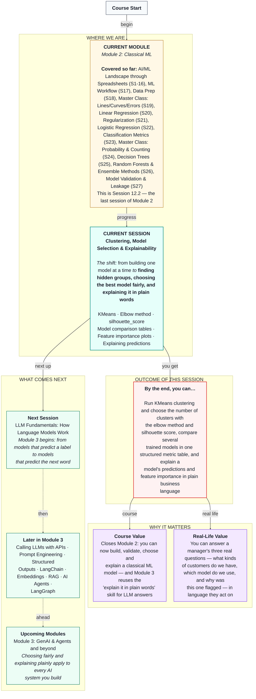

# Mental Map — Clustering, Model Selection & Explainability
> Academic Session 12.2 · Module 2: Classical ML

```mermaid
%%{init: {'themeVariables': {'fontSize': '32px', 'fontFamily': 'sans-serif'}, 'flowchart': {'htmlLabels': true, 'nodeSpacing': 50, 'rankSpacing': 80, 'wrappingWidth': 400, 'padding': 20}}}%%
flowchart TB

START["<b>Course Start</b>"]

subgraph foundation[" WHERE WE ARE "]
direction TB
    CURMOD["<b>CURRENT MODULE</b><br/><i>Module 2: Classical ML</i><br/>&nbsp;<br/><b>Covered so far:</b> AI/ML Landscape through Spreadsheets (S1-16), ML Workflow (S17), Data Prep (S18), Master Class: Lines/Curves/Errors (S19), Linear Regression (S20), Regularization (S21), Logistic Regression (S22), Classification Metrics (S23), Master Class: Probability &amp; Counting (S24), Decision Trees (S25), Random Forests &amp; Ensemble Methods (S26), Model Validation &amp; Leakage (S27)<br/>This is Session 12.2 — the last session of Module 2"]
    CURSES["<b>CURRENT SESSION</b><br/><b>Clustering, Model Selection &amp; Explainability</b><br/>&nbsp;<br/><i>The shift:</i> from building one model at a time <i>to</i> <b>finding hidden groups, choosing the best model fairly, and explaining it in plain words</b><br/>&nbsp;<br/>KMeans · Elbow method · silhouette_score<br/>Model comparison tables · Feature importance plots · Explaining predictions"]
end

subgraph outcome[" OUTCOME OF THIS SESSION "]
direction TB
    OUT["<b>By the end, you can…</b><br/>&nbsp;<br/>Run KMeans clustering and choose the number of clusters with<br/>the elbow method and silhouette score, compare several<br/>trained models in one structured metric table, and explain a<br/>model's predictions and feature importance in plain business<br/>language"]
end

subgraph value[" WHY IT MATTERS "]
direction TB
    CVAL["<b>Course Value</b><br/>Closes Module 2: you can now build, validate, choose and<br/>explain a classical ML model — and Module 3 reuses the<br/>'explain it in plain words' skill for LLM answers"]
    RVAL["<b>Real-Life Value</b><br/>You can answer a manager's three real questions — what kinds<br/>of customers do we have, which model do we use, and why was<br/>this one flagged — in language they act on"]
end

subgraph future[" WHAT COMES NEXT "]
direction TB
    U0["<b>Next Session</b><br/>LLM Fundamentals: How Language Models Work<br/><i>Module 3 begins: from models that predict a label to models<br/>that predict the next word</i>"]
    U1["<b>Later in Module 3</b><br/>Calling LLMs with APIs · Prompt Engineering · Structured<br/>Outputs · LangChain · Embeddings · RAG · AI Agents ·<br/>LangGraph"]
    U2["<b>Upcoming Modules</b><br/>Module 3: GenAI &amp; Agents and beyond<br/><i>Choosing fairly and explaining plainly apply to every AI<br/>system you build</i>"]
end

START ==>|" begin "| CURMOD
CURMOD ==>|" progress "| CURSES
CURSES ==>|" you get "| OUT
OUT ==>|" course "| CVAL
OUT ==>|" real life "| RVAL
CURSES ==>|" next up "| U0
U0 -.->|" then "| U1
U1 -.->|" ahead "| U2

classDef startBox fill:#F7FAFC,stroke:#4A5568,stroke-width:2px,color:#1A202C
classDef curModBox fill:#FFF8E6,stroke:#B7791F,stroke-width:2px,color:#1A202C
classDef curSessBox fill:#E6FFFA,stroke:#0D9488,stroke-width:3px,color:#1A202C
classDef outBox fill:#FEF2F2,stroke:#DC2626,stroke-width:3px,color:#1A202C
classDef valueBox fill:#F3E8FF,stroke:#7C3AED,stroke-width:2px,color:#1A202C
classDef futureBox fill:#ECFDF5,stroke:#047857,stroke-width:2px,color:#1A202C

class START startBox
class CURMOD curModBox
class CURSES curSessBox
class OUT outBox
class CVAL,RVAL valueBox
class U0,U1,U2 futureBox

linkStyle default stroke-width:2px
```
