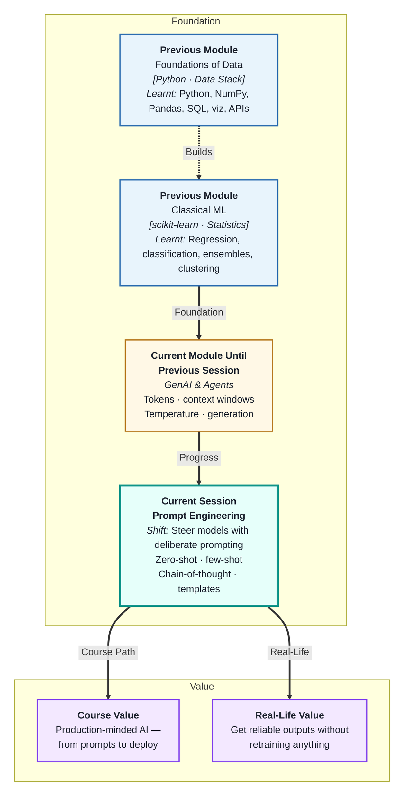
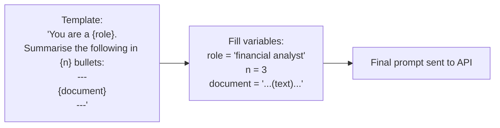

# Prompt Engineering & Reasoning Techniques
---

## Mental Map



## What You'll Learn

In this pre-read, you'll discover:

- The difference between **zero-shot** and **few-shot** prompting — and when each works best
- How **chain-of-thought** prompting dramatically improves reasoning on complex tasks
- How to write **prompt templates** that produce consistent, reusable outputs
- What makes a prompt "good" — and the four most common prompt design mistakes
- How role, instruction, context, and format work together in a well-structured prompt

---

## A. Zero-Shot vs Few-Shot Prompting

> 💡 **Analogy:** Asking a new intern to "write a professional email" with no example is zero-shot — they do their best based on prior knowledge. Showing them three sample emails first and asking "write one like these" is few-shot — the examples steer the style and format precisely.

**One-line definition:** **Zero-shot prompting** asks the model to complete a task with no examples; **few-shot prompting** provides 2–5 worked examples in the prompt itself, teaching the model the expected format and style through demonstration.

```mermaid
flowchart TD
    subgraph zero["Zero-shot"]
        ZP["Prompt:\n'Classify this review as Positive or Negative:\n\"The product broke on day one.\"'"]
        ZO["Output:\n'Negative'"]
    end
    subgraph few["Few-shot"]
        FP["Prompt:\n'Classify these reviews:\nReview: Great! → Positive\nReview: Terrible! → Negative\nReview: \"The product broke on day one.\" →'"]
        FO["Output:\n'Negative'\n(more consistent format)"]
    end
```

| Approach | When to use | Trade-off |
|---|---|---|
| Zero-shot | Simple, well-understood tasks | Fast, cheap; less control over format |
| Few-shot | Specific format or classification needed | More tokens; better consistency |
| One-shot | When one example is enough to anchor style | Compromise between cost and control |

**Rule of thumb:** Try zero-shot first. Add examples only if the output format or style is inconsistent.

---

## B. Chain-of-Thought — Making the Model Reason Step by Step

> 💡 **Analogy:** A student who writes out their working gets partial credit and catches their own arithmetic errors. A student who jumps straight to the answer often gets it wrong on complex problems. **Chain-of-thought** prompting tells the model to "show its working" — producing more reliable answers on multi-step problems.

**One-line definition:** **Chain-of-thought (CoT) prompting** instructs or demonstrates that the model should reason through intermediate steps before giving a final answer — significantly improving accuracy on logic, maths, and multi-step reasoning tasks.

**Two ways to trigger CoT:**

| Method | How | Example |
|---|---|---|
| Zero-shot CoT | Add "Think step by step" to the prompt | "Solve this problem. Think step by step before answering." |
| Few-shot CoT | Include examples that show reasoning steps | See below |

**Few-shot CoT example:**

```
Q: A train travels 120 km in 2 hours. How far in 5 hours?
A: Speed = 120 / 2 = 60 km/h. Distance = 60 × 5 = 300 km. Answer: 300 km.

Q: A shop has 80 items. 25% are sold. How many remain?
A:
```

The model learns to show working before answering. Without CoT, it might jump to a wrong answer. With CoT, intermediate steps reveal and correct errors.

**When CoT is most valuable:**

- Multi-step arithmetic or logic problems
- Reasoning about policies or conditions ("if X then Y")
- Classification with nuanced categories
- Tasks where the wrong answer is plausible-sounding

---

## C. Prompt Templates — Consistency at Scale

> 💡 **Analogy:** A company's customer-service team uses a script — not to remove personality, but to ensure every interaction covers the key points in the right order. A **prompt template** does the same: it gives a fixed, tested structure that variables slot into, producing reliable outputs every time.

**One-line definition:** A **prompt template** is a reusable prompt with placeholder variables that are filled at runtime — separating the fixed instructions (what the model should do) from the dynamic data (what it should process today).



**Template anatomy — the four components:**

| Component | Purpose | Example |
|---|---|---|
| **Role** | Tells model who it is | "You are a senior data analyst..." |
| **Instruction** | Tells model what to do | "Summarise the following report in 3 bullet points." |
| **Context / Input** | Provides the data to process | "---\n{document}\n---" |
| **Format / Output spec** | Tells model how to format output | "Respond only in JSON with keys: summary, key_points, risk." |

**Template best practices:**

1. Separate instructions from data with clear delimiters (`---`, `###`, `<document>...</document>`)
2. Be explicit about format — "respond in JSON" beats "use a structured format"
3. State constraints clearly — "maximum 100 words", "do not add commentary"
4. Version your templates — treat them like code; changes affect all users

---

## D. The Four Most Common Prompt Design Mistakes

> 💡 **Analogy:** A poorly written job posting gets hundreds of unsuitable applicants. The failure is in the specification, not the applicants. Most poor LLM outputs are the same — the model did exactly what the prompt asked, which was not what the writer intended.

**One-line definition:** The four core prompt design mistakes are: **vagueness** (no clear instruction), **missing format specification** (no output structure defined), **context overload** (too much irrelevant text), and **assumed knowledge** (expecting the model to infer unstated constraints).

```mermaid
flowchart TD
    M1["Mistake 1: Vague instruction\n'Write something about climate.'"] --> F1["Fix: Be specific\n'Write a 3-sentence summary of\nthe economic risks of climate change\nfor a non-expert audience.'"]
    M2["Mistake 2: No format spec\n'Extract the key information.'"] --> F2["Fix: Specify format\n'Extract key info as JSON:\n{\"date\": ..., \"amount\": ..., \"party\": ...}'"]
    M3["Mistake 3: Context overload\n(10,000 words of irrelevant context)"] --> F3["Fix: Filter first\nOnly inject the relevant section"]
    M4["Mistake 4: Assumed knowledge\n'Be professional'"] --> F4["Fix: Define it\n'Use formal English, no slang,\naddress as Dear [Name]'"]
```

**Quick diagnostic checklist for any prompt:**

- [ ] Is the task explicitly stated in one sentence?
- [ ] Is the desired output format specified?
- [ ] Is all context relevant — would removing it hurt quality?
- [ ] Would a new employee understand exactly what to produce?

---

## E. Putting It All Together — A Well-Structured Prompt

> 💡 **Analogy:** A good architect's brief is short and complete: who the building is for, what it must contain, what constraints apply, and what success looks like. A well-structured prompt is identical: role, instruction, context, and output format — in the right order.

**One-line definition:** A **well-structured prompt** combines a clear role, an explicit instruction, minimal relevant context, and a defined output format — each section doing exactly one job.

**A complete worked example:**

```
SYSTEM:
You are a customer-support analyst for an e-commerce company.
Your job is to classify incoming support tickets and extract key details.
Always respond in valid JSON. Do not add explanations outside the JSON.

USER:
Classify the following support ticket and extract details.

---
Ticket: "Hi, I ordered item #8823 on Monday and it still hasn't arrived.
The tracking page says 'label created' but nothing more. I need this
for a birthday on Friday. Please help urgently."
---

Respond in this exact JSON format:
{
  "category": "<one of: shipping_delay, wrong_item, refund_request, other>",
  "urgency": "<low | medium | high>",
  "order_id": "<order number if mentioned, else null>",
  "summary": "<one sentence>"
}
```

**Why each part works:**

| Part | What it does |
|---|---|
| Role in system message | Sets consistent behaviour for all turns |
| "Always respond in valid JSON" | Prevents prose mixed into output |
| Clear delimiter `---` | Separates instruction from data |
| Exact JSON schema | Model knows precisely what to output |
| Enum options for category | Constrains classification to valid values |

---

## Practice Exercises

**1. Pattern Recognition**  
Here is a zero-shot prompt: "Summarise this article." The output is always different lengths and sometimes includes opinions. Using sections A and C, rewrite the prompt as a template that produces a 3-bullet-point summary, always in the same format, with no added opinions. Show the role, instruction, context placeholder, and output format.

**2. Concept Detective**  
A developer asks an LLM "Calculate the total cost: items are ₹120, ₹85, ₹340, with 18% GST." Without CoT, the model outputs "₹643.90" (wrong). With "Think step by step" added, it outputs "120+85+340=545, 18% of 545=98.1, total=643.1" (correct). Using section B, explain what changed between the two attempts and why the intermediate steps produced the right answer.

**3. Real-Life Application**  
Design a prompt template for each of the following: (a) extracting product names and prices from an invoice email, (b) generating a one-paragraph personalised follow-up email from a CRM note, (c) classifying a news headline as "positive/negative/neutral" with a one-sentence justification. For each, write the role, instruction, context placeholder, and output format.

**4. Spot the Error**  
A team uses this prompt: "You are a helpful assistant. Here is our 50-page product manual (full text inserted). Answer any question the user asks." Identify at least three mistakes from section D, explain what will go wrong with this approach, and rewrite the strategy (not a full prompt, just the approach) to fix each issue.

**5. Planning Ahead**  
You are building a system to automatically triage incoming job applications. Each application is a 300–500 word cover letter. The system must output: a score (1–5), a hiring category (shortlist / review / reject), and two sentences of justification. Using sections C and E, design the complete prompt template — including role, instruction, input delimiter, and output format — that would produce consistent, structured results for every application.

---

> ✅ **You're done!** You can now design prompts deliberately — using the right technique (zero-shot, few-shot, or chain-of-thought), structuring them consistently as templates, and avoiding the four most common mistakes. Next: **LLM APIs & JSON Handling**, where you will move from designing prompts to calling them programmatically from Python code.
