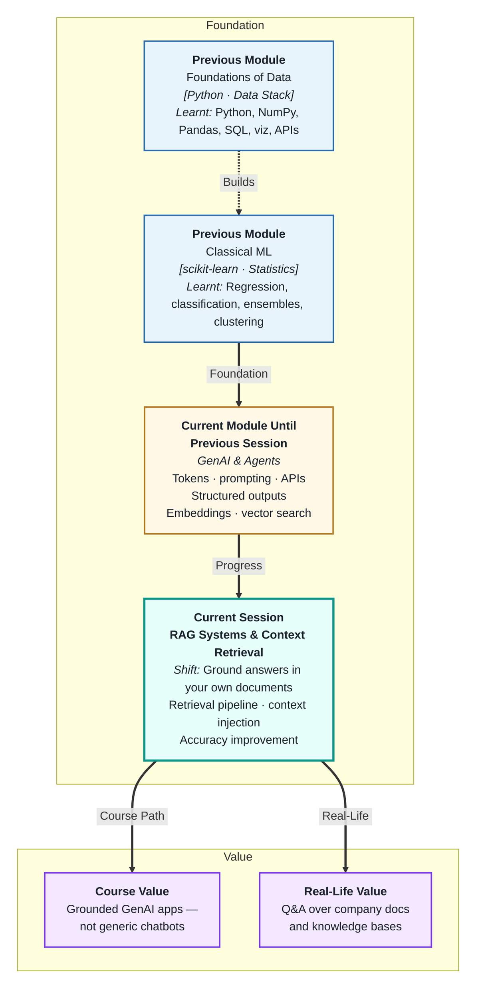
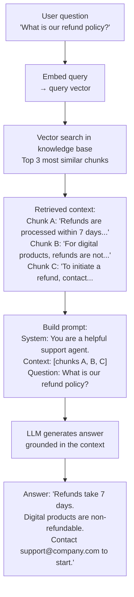
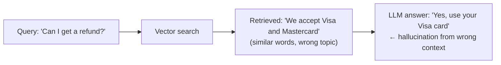
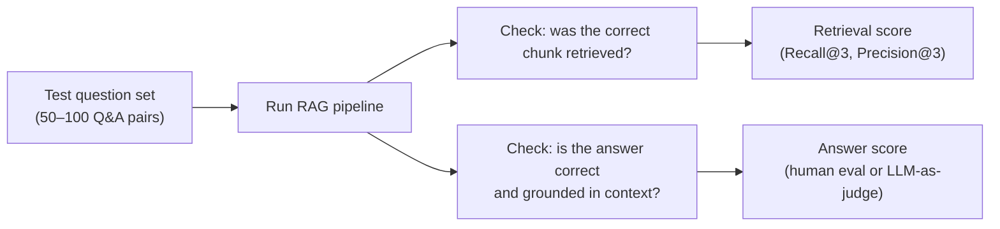

# RAG Systems & Context Retrieval
---

## Mental Map



## What You'll Learn

In this pre-read, you'll discover:

- What **RAG (Retrieval-Augmented Generation)** is and why it beats plain LLM answers
- How the **retrieval pipeline** turns a question into relevant context
- How **context injection** puts retrieved documents into the LLM prompt
- What makes RAG answers more accurate — and where RAG still fails
- How to evaluate whether your RAG system is actually retrieving the right content

---

## A. What Is RAG and Why Does It Exist?

> 💡 **Analogy:** A researcher who answers every question purely from memory will eventually get things wrong or outdated. One who quickly scans the right reference books before answering is far more reliable. **RAG** gives the LLM that reference-book lookup — it retrieves relevant documents first, then generates an answer grounded in them.

**One-line definition:** **RAG (Retrieval-Augmented Generation)** is an architecture that improves LLM accuracy by retrieving relevant documents from a knowledge base and injecting them into the prompt as context — so the model answers from evidence, not just parametric memory.

**The problem RAG solves:**

| Problem | Without RAG | With RAG |
|---|---|---|
| Outdated knowledge | Model knows only its training data | Retrieves from live/updated knowledge base |
| Hallucination | Model generates plausible-but-wrong facts | Answer is grounded in retrieved text |
| Private knowledge | Model has no company-specific information | Company docs indexed in vector DB |
| Long documents | Cannot fit 500 pages in context window | Retrieves only the relevant 3–5 chunks |

---

## B. The RAG Pipeline — Step by Step

> 💡 **Analogy:** A smart librarian receives your question, walks to the right shelf, pulls three relevant pages, and hands them to an expert who reads those pages and answers you. **The RAG pipeline** is that librarian + expert team working in sequence.

**One-line definition:** The **RAG pipeline** is the sequence: embed the query → retrieve top-K similar chunks → inject chunks into prompt → generate grounded answer.



**Two phases — indexing and retrieval:**

| Phase | When | What happens |
|---|---|---|
| Indexing (offline) | Once, or when docs change | Load docs → chunk → embed → store in vector DB |
| Retrieval (online) | Every user query | Embed query → search → retrieve → inject → generate |

---

## C. Context Injection — The Prompt Architecture

> 💡 **Analogy:** A lawyer preparing for court arranges the most relevant case files on their desk before the hearing — not the entire archive. **Context injection** is arranging the retrieved chunks on the model's "desk" (in the prompt) in the most useful order and format.

**One-line definition:** **Context injection** is the process of formatting retrieved chunks into the LLM prompt — with clear delimiters, source attribution, and instructions that tell the model to use only the provided context to answer.

**A well-structured RAG prompt:**

```
SYSTEM:
You are a customer support assistant for Acme Corp.
Answer the user's question using ONLY the information in the provided context.
If the answer is not in the context, say "I don't have that information."
Do not speculate or add information not in the context.

USER:
Context:
---
[Source: refund_policy.pdf, page 3]
Refunds are processed within 7 business days of the return being received.
---
[Source: refund_policy.pdf, page 4]
Digital downloads are non-refundable under any circumstances.
---
[Source: contact.md]
To initiate a refund, email support@acme.com with your order number.
---

Question: What is the refund policy for software I downloaded?
```

**Key design decisions in context injection:**

| Decision | Recommendation | Reason |
|---|---|---|
| Include source citations | Yes — "[Source: filename]" | Model can attribute answers; enables verification |
| Number of chunks (K) | 3–5 for most tasks | More chunks = higher cost; too few = missing info |
| Chunk order | Most similar first | Model tends to use early context more |
| Instruction to not speculate | Always include | Reduces hallucination on missing info |

---

## D. When RAG Works — and When It Fails

> 💡 **Analogy:** A librarian is excellent at answering "what does the policy say?" but cannot help with "what *should* the policy be?" RAG is the same: it excels at fact retrieval from documents but struggles when the answer requires synthesis, reasoning, or information not in the knowledge base.

**One-line definition:** RAG improves accuracy when answers exist verbatim or close to verbatim in the knowledge base — but degrades when retrieval fetches wrong chunks, when answers require synthesising many documents, or when documents are outdated or contradictory.

**Failure modes and fixes:**

| Failure mode | What happens | Fix |
|---|---|---|
| Retrieval miss | Right answer exists but wrong chunks retrieved | Better chunking; hybrid search |
| Context too long | Too many chunks fill the window; model misses key info | Reduce K; re-rank chunks before injection |
| Answer not in docs | Model guesses or hallucinates | "I don't have that information" instruction |
| Contradictory chunks | Two docs say different things | Include source dates; let model flag conflict |
| Query-chunk mismatch | User asks abstractly; chunk is specific | Query rewriting or HyDE (hypothetical doc embedding) |



This is why evaluation of retrieval quality (not just answer quality) is critical — see section E.

---

## E. Evaluating a RAG System

> 💡 **Analogy:** A fire drill is evaluated at two levels: did the alarm sound (system worked), and did everyone reach the assembly point (outcome achieved)? A RAG system is evaluated similarly: did retrieval find the right content (retrieval quality), and did the model answer correctly (generation quality)?

**One-line definition:** RAG evaluation measures **retrieval quality** (did we fetch the right chunks?) and **generation quality** (did the model produce a correct, grounded answer?) — both must be measured independently to diagnose failures.

**Retrieval metrics:**

| Metric | What it measures |
|---|---|
| Recall@K | Of all relevant documents, how many were in the top K? |
| Precision@K | Of the top K retrieved, how many were actually relevant? |
| MRR (Mean Reciprocal Rank) | How high in the ranked list was the first relevant result? |

**Generation metrics:**

| Metric | What it measures |
|---|---|
| Faithfulness | Is every claim in the answer supported by the retrieved context? |
| Answer relevance | Does the answer actually address the question? |
| Groundedness | Did the model avoid adding facts not in the context? |

**Simple evaluation workflow:**



---

## Practice Exercises

**1. Pattern Recognition**  
A RAG system is given these three retrieved chunks for the query "How do I apply for parental leave?": (A) Parental leave policy overview — up to 6 months. (B) How to submit a leave form via the HR portal. (C) Sick leave entitlement — 10 days per year. Using section D, which chunk should NOT have been retrieved, why it was probably retrieved (false positive), and how you would rewrite the retrieval step to reduce this kind of noise.

**2. Concept Detective**  
A company builds a RAG system on 10 years of internal reports. The system works well for recent reports but gives outdated answers for topics covered in both old and new reports. Using section D, explain which failure mode this represents, how context injection could be improved to surface recency, and what a better chunking/metadata strategy might look like.

**3. Real-Life Application**  
Design a RAG system for each of the following: (a) a university bot answering student questions about academic policies, (b) a medical device company bot answering technician questions about device manuals, (c) an e-commerce bot answering product-specific questions. For each: what the knowledge base contains, how documents are chunked, what K to use, and what the "don't speculate" instruction would say.

**4. Spot the Error**  
A developer builds a RAG prompt that says: "Here is some context: [chunks]. Answer the user's question." Without explicit instructions, the LLM sometimes ignores the context entirely and answers from its general training knowledge. Using sections C and D, explain what specific prompt instruction is missing, why the model defaults to its own knowledge, and rewrite the system message to enforce context-grounded answers.

**5. Planning Ahead**  
You are building a RAG-based HR assistant for a company with 400 policy documents totalling 200,000 tokens. Employees ask questions ranging from "how many leaves do I get" to "what is the travel reimbursement process." Design the full system: indexing strategy, chunking method, embedding model choice, vector database, K value for retrieval, context injection template, evaluation approach, and what you would monitor in production.

---

> ✅ **You're done!** You now understand how RAG assembles embeddings, vector search, and prompt engineering into a system that answers questions from your documents — accurately and without hallucinating. Next: **Agents & Reasoning Loops**, where the LLM stops being a single responder and becomes an autonomous decision-maker that plans, acts, and loops until a goal is achieved.
