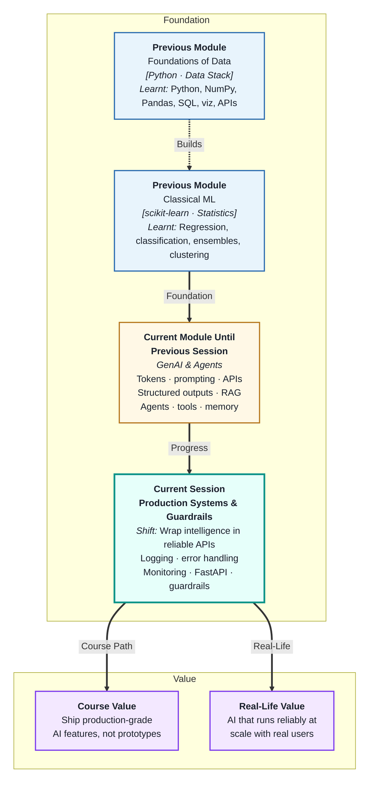
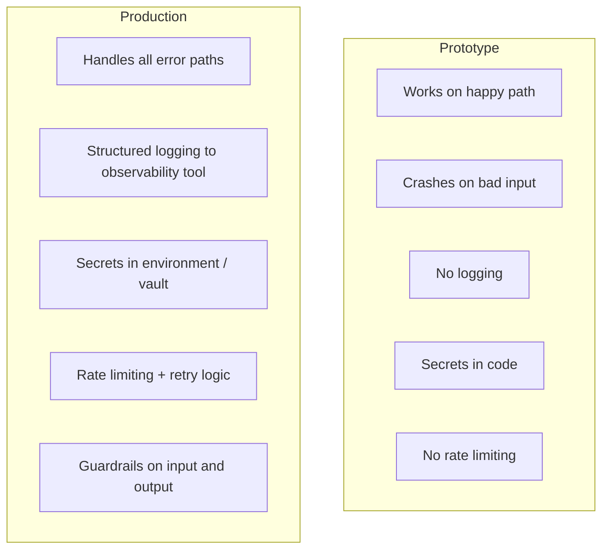
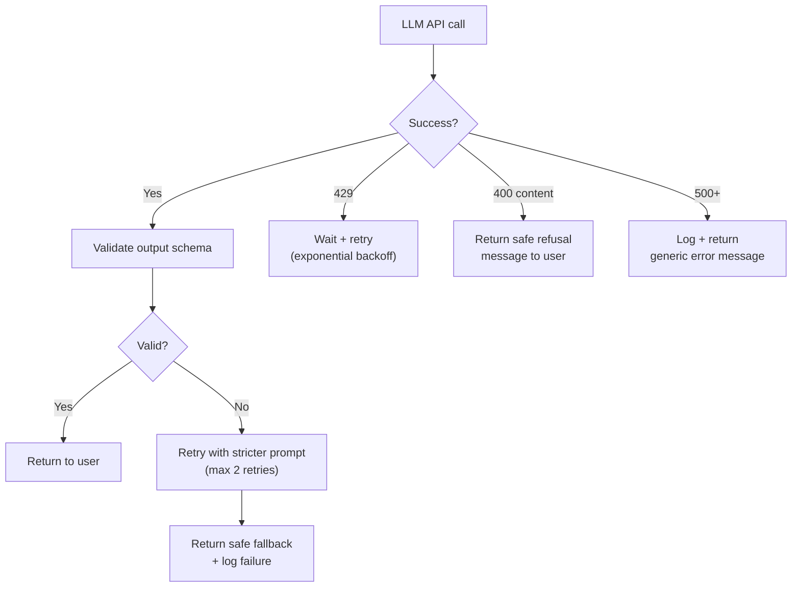
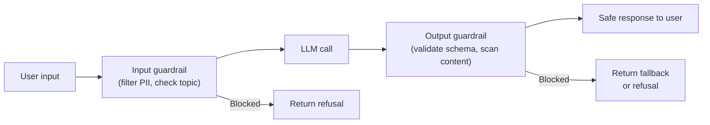

# Production Systems, APIs & Guardrails
---

## Mental Map



## What You'll Learn

In this pre-read, you'll discover:

- What makes an AI system "production-ready" vs a prototype
- How **logging** captures the right information to debug and audit AI behaviour
- What **error handling** patterns prevent cascading failures in LLM pipelines
- How **FastAPI** is used to serve LLM functionality as a REST endpoint
- What **guardrails** are and how they protect users and the system from harmful outputs

---

## A. Production vs Prototype — The Real Gap

> 💡 **Analogy:** A prototype car in a showroom looks identical to the production model but has no seatbelts, no airbags, and no emissions testing. The production model has every safety, reliability, and compliance requirement met. An AI prototype and a production AI system have the same gap.

**One-line definition:** A **production AI system** is one that runs reliably under real user load, handles errors gracefully, logs all interactions for auditing, enforces output guardrails, and can be monitored and updated without downtime.



**The production checklist (preview — each section covers one part):**

| Area | Minimum bar |
|---|---|
| Logging | Every request/response stored with metadata |
| Error handling | No unhandled exceptions; graceful degradation |
| API design | Standardised endpoint, auth, rate limits |
| Guardrails | Input filtering + output validation before returning |
| Monitoring | Alerts on latency, error rate, cost spikes |

---

## B. Logging — Your Window Into What Happened

> 💡 **Analogy:** An aeroplane black box records everything — not because every flight has problems, but because when one does, the recording is the only way to understand what happened. **LLM logging** is that black box: when an AI system behaves unexpectedly, the logs are the only way to diagnose it.

**One-line definition:** **Logging** in LLM systems means recording the inputs (prompts), outputs (completions), metadata (model, tokens, latency, user ID, timestamp), and errors for every API call — enabling debugging, auditing, and cost tracking.

**What to log for every LLM call:**

| Field | Why |
|---|---|
| Timestamp | Correlate with events; measure latency |
| User / session ID | Group calls by user; detect abuse patterns |
| Prompt (or hash) | Debug unexpected outputs |
| Model name + temperature | Reproducibility |
| Completion text | Audit what was said to users |
| Tokens in / out | Cost tracking |
| Latency (ms) | Performance monitoring |
| Finish reason | Detect truncations |
| Error code (if any) | Failure analysis |

**Structured logging format (JSON):**

```json
{
  "timestamp": "2026-06-04T14:32:11Z",
  "user_id": "u_8821",
  "session_id": "s_4902",
  "model": "gpt-4o",
  "prompt_tokens": 412,
  "completion_tokens": 87,
  "latency_ms": 1240,
  "finish_reason": "stop",
  "error": null
}
```

**Never log** raw PII (names, emails, addresses) or sensitive content (passwords, card numbers) — log IDs that can be looked up only when authorised.

---

## C. Error Handling — Graceful Degradation

> 💡 **Analogy:** A well-run restaurant does not close because one dish is unavailable — they remove it from the menu that day and serve what they have. **Graceful degradation** means the AI system continues serving users even when parts of it fail — not crashing, but delivering a reduced or fallback response.

**One-line definition:** **Error handling** in production AI means catching all failure modes (API errors, validation failures, timeouts, content policy violations), logging them, and returning a safe fallback response rather than exposing raw errors to users.

**The error taxonomy for LLM systems:**

| Error type | Example | User-facing response |
|---|---|---|
| API rate limit (429) | Too many requests | "Busy right now, try again in a moment" |
| Context too long | Prompt exceeded window | Summarise and retry |
| Content policy (400) | Prompt triggered safety filter | "I can't help with that request" |
| JSON validation failure | Model returned invalid schema | Retry with stricter prompt |
| Tool failure | External API returned error | Return partial result with caveat |
| Timeout | Model took > 30 seconds | "Taking too long, please try again" |



---

## D. Serving with FastAPI — Turning AI into an Endpoint

> 💡 **Analogy:** A chef makes great food but it stays in the kitchen until there is a serving counter and a menu that customers can order from. **FastAPI** is that counter: it exposes your LLM logic as an HTTP endpoint that any frontend, mobile app, or other service can call.

**One-line definition:** **FastAPI** is a modern Python web framework used to serve AI functionality as REST API endpoints — handling HTTP routing, request/response parsing, authentication, and error responses with minimal boilerplate.

**A minimal LLM endpoint in FastAPI:**

```python
from fastapi import FastAPI, HTTPException
from pydantic import BaseModel
import os
from openai import OpenAI

app = FastAPI()
client = OpenAI(api_key=os.environ["OPENAI_API_KEY"])

class ClassifyRequest(BaseModel):
    text: str

class ClassifyResponse(BaseModel):
    category: str
    confidence: float

@app.post("/classify", response_model=ClassifyResponse)
async def classify_text(req: ClassifyRequest):
    try:
        response = client.chat.completions.create(
            model="gpt-4o",
            messages=[
                {"role": "system", "content": "Classify the text. Return JSON: {\"category\": str, \"confidence\": float}"},
                {"role": "user", "content": req.text}
            ],
            response_format={"type": "json_object"},
            temperature=0
        )
        import json
        data = json.loads(response.choices[0].message.content)
        return ClassifyResponse(**data)
    except Exception as e:
        raise HTTPException(status_code=500, detail=str(e))
```

**What FastAPI handles automatically:**

- Input validation via Pydantic (the request model)
- OpenAPI docs at `/docs` (auto-generated)
- JSON serialisation of responses
- HTTP method routing (`POST /classify`)

---

## E. Guardrails — Protecting Users and the System

> 💡 **Analogy:** A bank's ATM has guardrails at every step: daily withdrawal limits, PIN verification, and fraud detection — not because all users are malicious, but because the system must be safe for all users even in edge cases. **LLM guardrails** do the same.

**One-line definition:** **Guardrails** are rules and checks applied to LLM inputs and outputs that prevent harmful, off-topic, or policy-violating content from entering or exiting the system — implemented as input filters, output validators, and content classifiers.

**Guardrail types:**

| Layer | What it does | Example |
|---|---|---|
| Input filtering | Block or flag harmful prompts before sending to LLM | Detect prompt injection, personal data, profanity |
| System prompt hardening | Instruction in system prompt limits scope | "You only answer questions about product X. Refuse all other topics." |
| Output validation | Check response before returning to user | Validate schema, scan for PII, check for off-topic answers |
| Content moderation API | Use a separate classifier on inputs/outputs | OpenAI Moderation API, Azure Content Safety |



**Guardrail implementation checklist:**

- [ ] System prompt includes scope restriction ("only answer about X")
- [ ] Input length limit (prevent context flooding attacks)
- [ ] PII detector on inputs — do not send customer data to external LLM without checking
- [ ] Output schema validation — Pydantic on every structured response
- [ ] Content moderation check on free-text responses before serving to end users
- [ ] Rate limiting per user/session — prevent abuse and runaway costs

---

## Practice Exercises

**1. Pattern Recognition**  
Design the structured log entry for an LLM classification call: the system prompt was 300 tokens, the user input was 150 tokens, the response was 50 tokens and took 820ms. The model returned valid JSON. The user is user_id=u_4421 on session s_991. Write the full JSON log entry with all fields from section B.

**2. Concept Detective**  
A production chatbot occasionally returns responses that include the user's email address (entered earlier in the conversation) in the response text. A compliance team flags this as a data privacy issue. Using section E, identify which guardrail layer is missing, explain how the email ended up in the output, and design the input and output guardrail steps that would prevent this.

**3. Real-Life Application**  
Design the production system for three AI features: (a) an AI email drafter embedded in a CRM, (b) a public-facing chatbot on an e-commerce website, (c) an internal AI tool for analysing confidential financial reports. For each: list the guardrails you would implement, what you would log (and what you would NOT log), and what the fallback behaviour is when the LLM is unavailable.

**4. Spot the Error**  
A FastAPI endpoint is deployed with this error handler: `except Exception as e: return {"error": str(e)}`. During a security test, an attacker triggers an exception that reveals the API key and internal endpoint URL in the error message. Using sections C and D, explain the mistake, what information was leaked, and rewrite the exception handler to log the full error internally while returning a safe generic message to the user.

**5. Planning Ahead**  
You are deploying an AI customer-service chatbot that will handle 10,000 conversations per day for a fintech company. Design the full production system: logging strategy (what to capture, where to store, how long to retain), error handling for each failure type from section C, the FastAPI endpoint structure, input and output guardrails for a financial services context, and the monitoring alerts you would set up to detect problems before users report them.

---

> ✅ **You're done!** You now understand what separates a prototype from a production AI system — logging, error handling, a proper API layer, and guardrails that protect users and the business. Next (and final session): **Evaluation and Deployment**, where you will learn how to measure whether your AI system is actually performing well and deploy it in a way that you can update, monitor, and improve over time.
