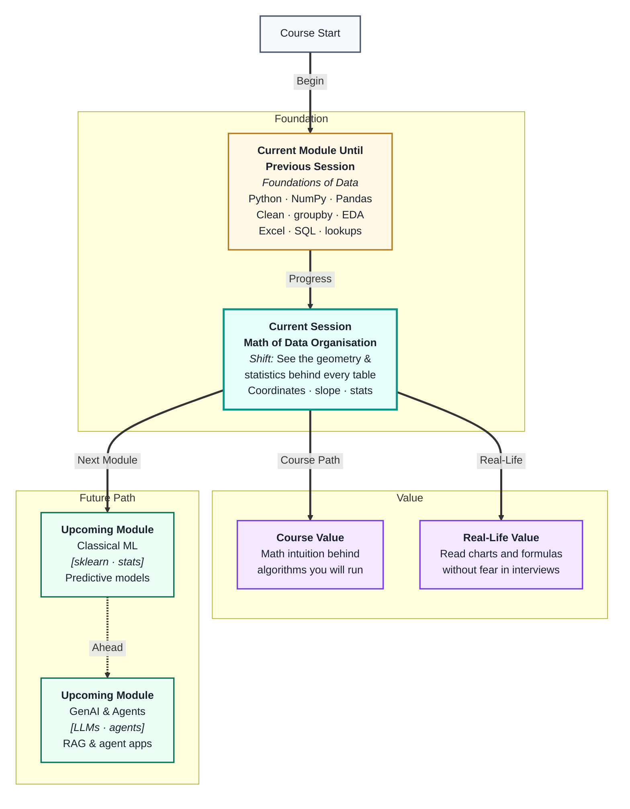
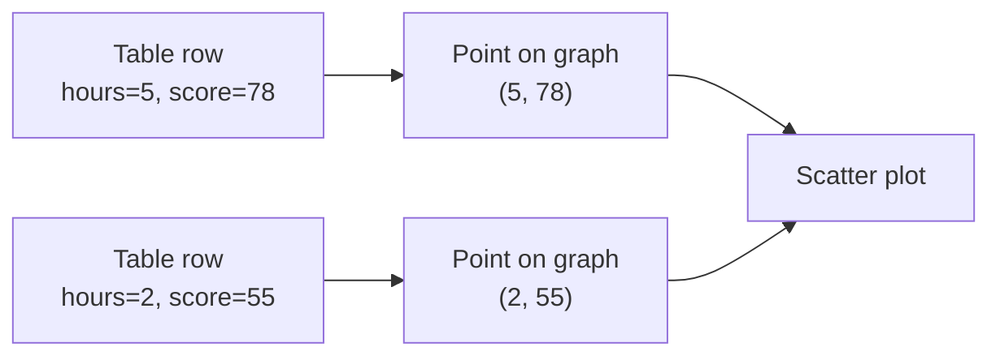
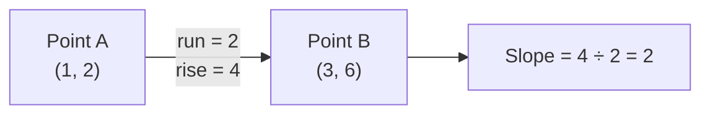
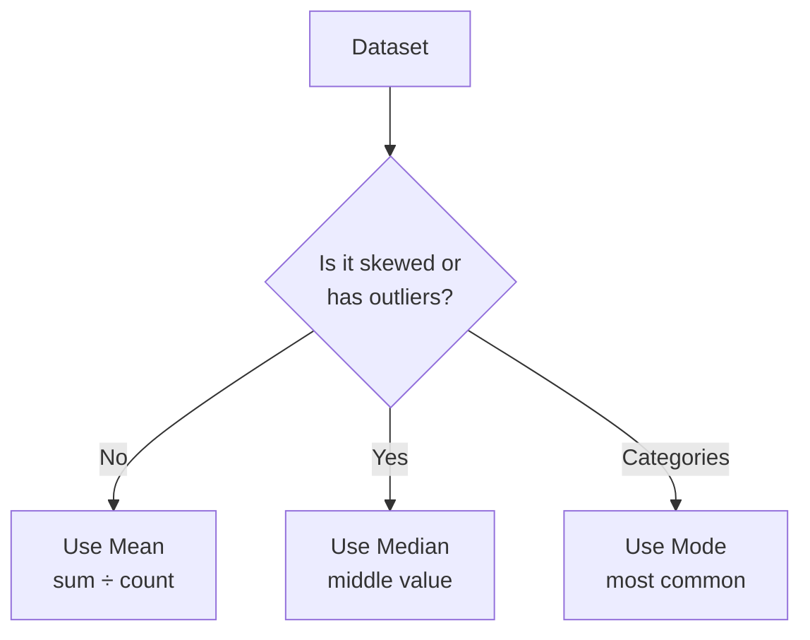
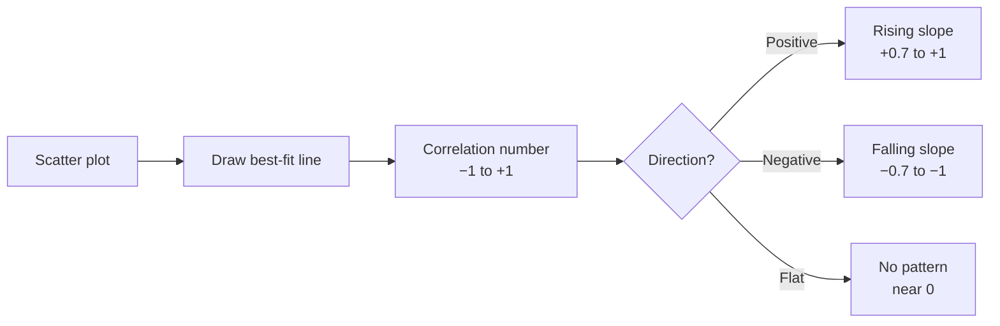

# Master Class: From Tables to Relationships — The Mathematics of Data Organisation
---

## Mental Map



## What You'll Learn

In this pre-read, you'll discover:

- How the **Cartesian plane** lets you visualise any two columns as a scatter plot
- What the **slope of a line** means — and why it is the seed of everything in ML
- How **mean, median, and mode** each tell a different story about your data
- Why the **mean lies** when data is skewed, and what to use instead
- How **variance and standard deviation** measure how spread out your data is

---

## A. The Cartesian Plane — Plotting Two Columns

> 💡 **Analogy:** A cinema seat is described by two numbers — row and column. Every seat is a unique point. A **Cartesian plane** works exactly the same way: any row of data becomes a point described by two numbers.

**One-line definition:** The **Cartesian plane** is a grid with a horizontal x-axis and a vertical y-axis, where any point is located by two coordinates: `(x, y)`.

When you plot data, every row of your table becomes one point on this grid:

- x-axis → one column (e.g. hours studied)
- y-axis → another column (e.g. exam score)



This is all a **scatter plot** is: each row mapped to one `(x, y)` coordinate. When points cluster in a rising pattern from left to right, you are seeing a **relationship** between two columns — the foundation of correlation and regression in ML.

| Table column | Axis | What you see on the plot |
|---|---|---|
| Independent (cause) | x (horizontal) | Spread of input values |
| Dependent (effect) | y (vertical) | Spread of output values |
| Each row | One dot | The relationship between the two |

**Why this matters for ML:** Algorithms like Linear Regression are literally finding the *best line* through a scatter plot. Understanding the plane first makes that idea click instantly when you meet it in Module 2.

---

## B. Slope of a Line — Rise Over Run

> 💡 **Analogy:** A road sign "8% gradient" means for every 100 metres you travel forward, you rise 8 metres. That ratio — *how much you go up for every step forward* — is exactly what **slope** measures.

**One-line definition:** **Slope** is the rate at which y changes for every one-unit increase in x, calculated as rise ÷ run.

```
slope = (change in y) ÷ (change in x)
      = rise ÷ run
```



| Slope value | What it means | Example |
|---|---|---|
| Positive (e.g. +2) | y increases as x increases | More study → higher score |
| Negative (e.g. −1) | y decreases as x increases | More errors → lower grade |
| Zero | y does not change with x | Height vs exam score (no link) |
| Large magnitude | Steep relationship | Small input change, big output change |

The equation of a line is `y = mx + c`, where:
- `m` is the **slope** (how steep)
- `c` is the **y-intercept** (where the line crosses the y-axis when x = 0)

**Connection to ML:** When you train a Linear Regression model, it is finding the `m` and `c` that best fits your data points. The slope you learn here is literally the same number the algorithm will compute — so this is not abstract theory, it is the engine of your first predictive model.

---

## C. Mean, Median, and Mode — Three Ways to Describe the Centre

> 💡 **Analogy:** Three friends describe the "typical" price of meals at a restaurant: one averages all bills, one picks the middle bill, one says the most common price. All three are correct — they answer different questions. That is what mean, median, and mode do.

**One-line definition:** **Mean**, **median**, and **mode** are three measures of the *centre* of a dataset — the typical or most common value — each suited to different situations.

| Measure | How to compute | Best for |
|---|---|---|
| **Mean** | Sum of all values ÷ count | Symmetric data with no extreme outliers |
| **Median** | Middle value when sorted | Skewed data or data with outliers |
| **Mode** | Most frequently occurring value | Categorical data or finding peaks |



**Why the mean lies when data is skewed:**

Imagine 9 employees earn ₹30,000/month and 1 earns ₹10,00,000. The mean salary is about ₹1,27,000 — but nobody actually earns near that. The median (₹30,000) is far more honest. This is why salary and income data always uses median, not mean.

You have already used `df.describe()` in Pandas — that output shows mean, std, min, max, and quartiles. After this session, every number in that table will mean something specific to you.

---

## D. Range, Variance, and Standard Deviation — How Spread Out Is the Data?

> 💡 **Analogy:** Two classes both average 70 marks. In Class A, everyone scored between 65 and 75. In Class B, scores ranged from 10 to 100. Same average, completely different situations. **Spread** is what the average hides.

**One-line definition:** **Variance** and **standard deviation** measure how far values typically stray from the mean — a high value means data is widely spread, a low value means it is tightly clustered.

**Building up from range:**

- **Range** = max − min → simplest measure, but destroyed by one outlier
- **Variance** = average of squared distances from the mean → penalises large gaps more
- **Standard deviation (SD)** = square root of variance → same units as original data, easiest to read

| Measure | Formula idea | What it tells you |
|---|---|---|
| Range | max − min | Total span; fragile with outliers |
| Variance | avg of (each value − mean)² | Overall spread, in squared units |
| Standard deviation | √variance | Typical distance from the mean |

**Reading standard deviation in practice:**

- `mean = 50, SD = 2` → values tightly bunched near 50 (consistent)
- `mean = 50, SD = 30` → values wildly spread (variable, noisy)

In ML, SD is used constantly: to detect outliers, to **standardise** (scale) features before feeding them to a model, and to understand model confidence. The `df.describe()` `std` column you saw in Pandas is exactly this number.

---

## E. From Stats to Relationships — Correlation Preview

> 💡 **Analogy:** You notice that every time it rains, umbrella sales go up. Both variables move *together*. **Correlation** captures how consistently two columns rise or fall in tandem — and puts a single number on it.

**One-line definition:** **Correlation** is a value between −1 and +1 that measures how strongly and in what direction two columns are linearly related.

| Correlation value | Meaning |
|---|---|
| Close to +1 | Strong positive — both go up together |
| Close to −1 | Strong negative — one up, other down |
| Close to 0 | Little or no linear relationship |



**Critical caution — correlation ≠ causation:**  
Ice cream sales and drowning incidents both rise in summer. They are correlated, but ice cream does not cause drowning — hot weather drives both. Always ask "is there a real mechanism here?" before acting on a correlation.

In Pandas, `df.corr(numeric_only=True)` gives you a full correlation matrix — every pair of numeric columns in one table. After this session, you will know exactly what each number in that table means and how to interpret it.

---

## Practice Exercises

**1. Pattern Recognition**  
A dataset has these exam scores: `45, 50, 50, 55, 95`. Compute or estimate the mean, median, and mode. Which one best represents a "typical" student, and why does the mean mislead here?

**2. Concept Detective**  
A data report says "average house price in the city is ₹80 lakh." You look at the raw data and find that 90% of houses are priced below ₹45 lakh, but a handful of luxury apartments go up to ₹5 crore. Which measure should the report have used instead, and which concept from section C explains why?

**3. Real-Life Application**  
Think of three pairs of real-world variables you would expect to correlate (e.g. temperature and electricity bills). For each pair: (a) say whether you expect a positive or negative correlation and why, (b) suggest one confounding factor that might make the correlation misleading.

**4. Spot the Error**  
A student plots hours of screen time vs productivity score and gets a slope of −3. They conclude: "Watching TV *causes* you to be less productive." Identify two conceptual errors in this statement using what you learned about slope and correlation.

**5. Planning Ahead**  
You have a sales dataset with columns `ad_spend`, `units_sold`, `price`, and `region`. Plan how you would use the ideas from this masterclass to describe the dataset before building a model: which statistics you would check for each column, which pairs you would scatter-plot, and what a very high or very low standard deviation on `units_sold` would tell you about the data.

---

> ✅ **You're done!** You now see data through the lens of geometry and statistics — every scatter plot is a pair of columns mapped to coordinates, every slope is a relationship, and every standard deviation tells you how trustworthy an average really is. These ideas underpin every ML algorithm you will meet in Module 2. Up next: **SQL Joins & Relational Analysis**, where you will bring together multiple tables using the mathematical relationships you have just understood.
