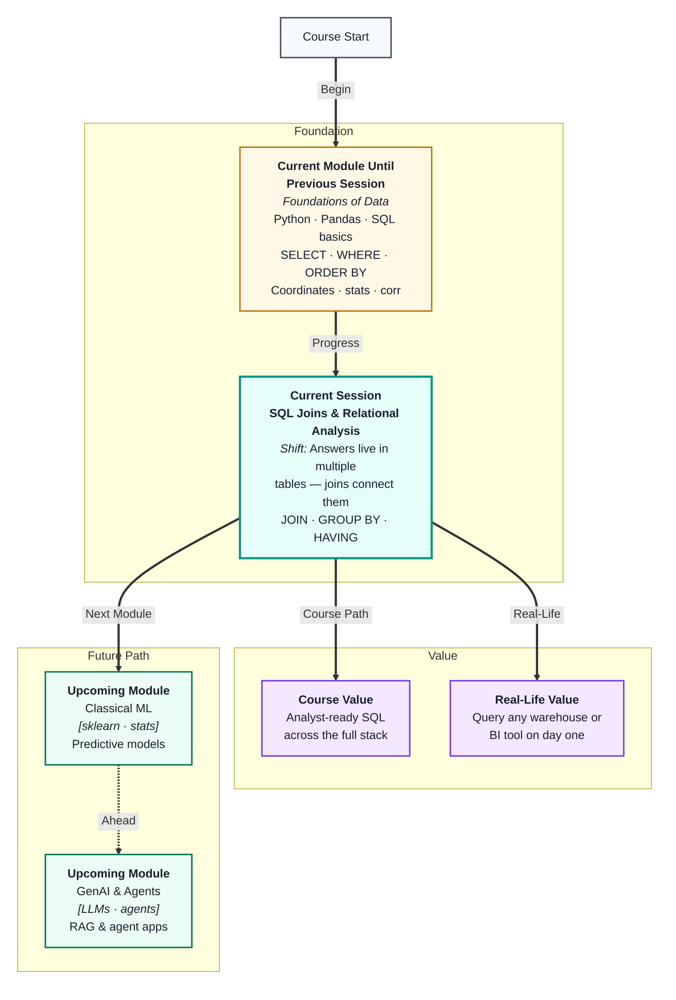
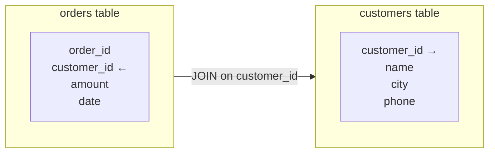
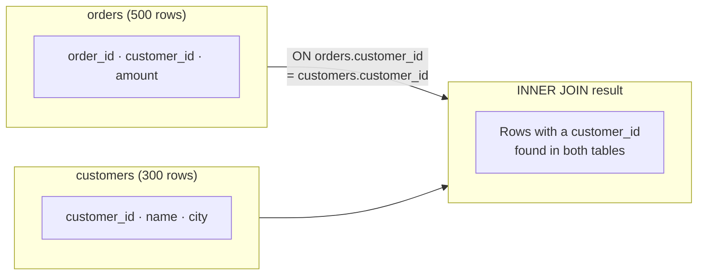
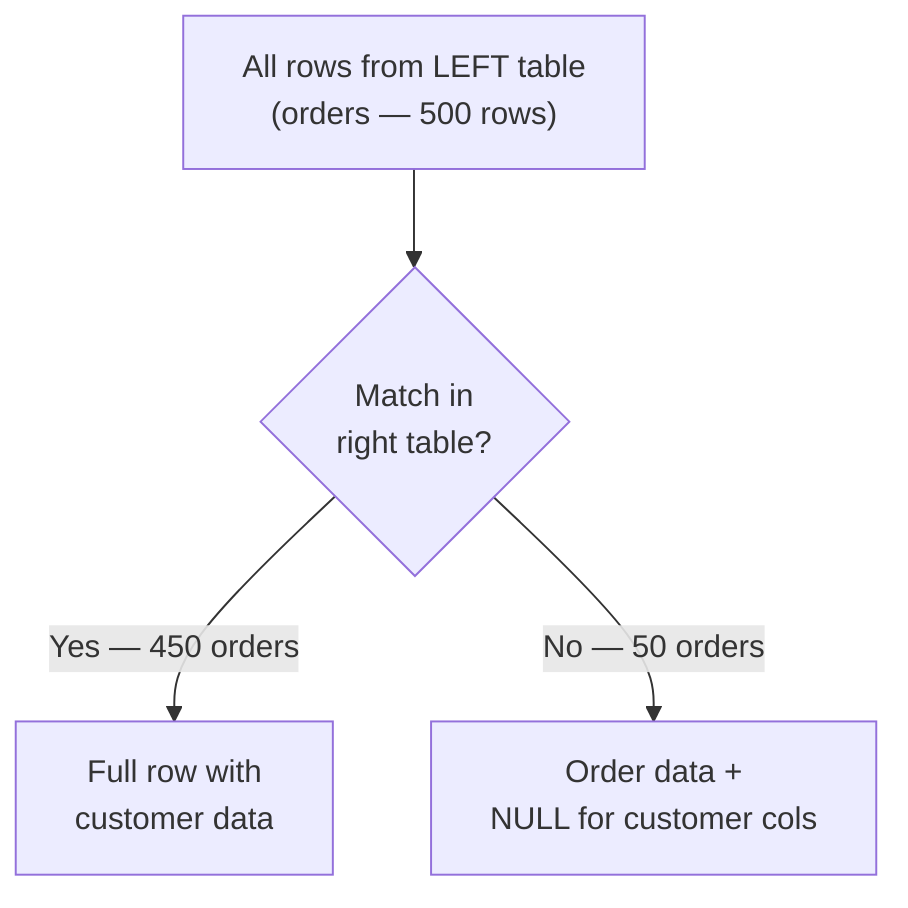

# SQL Joins & Relational Analysis
---

## Mental Map



## What You'll Learn

In this pre-read, you'll discover:

- Why data is stored in **multiple related tables** instead of one giant table
- How SQL **JOINs** connect tables on a shared key column
- The difference between `INNER JOIN`, `LEFT JOIN`, and when each is the right choice
- How `GROUP BY` produces one summary row per category
- How `HAVING` filters those summaries — and why it is not the same as `WHERE`

---

## A. Why Multiple Tables? The Relational Idea

> 💡 **Analogy:** A hospital does not write a patient's address on every test result slip. It records the address once in the patient register and puts only the patient ID on test slips — then looks it up when needed. **Relational databases** use the same logic: store each fact once, link it by ID.

**One-line definition:** A **relational database** organises data into separate tables — each focused on one subject — and connects them through shared key columns, avoiding duplication and keeping data consistent.

**Why not just one big table?**

Imagine a single `orders` table with every customer's name, address, and phone repeated on every order row. If a customer moves, you update hundreds of rows. If you spell their name wrong once, reports split them into two people.

Instead, separate tables solve this:



| Design choice | One big table | Relational tables |
|---|---|---|
| Customer name typo | Repeated on 500 rows | Fix once in `customers` |
| Customer changes city | Update 500 rows | Update 1 row |
| Add a new data point | Add columns for all rows | Add a column to one table |
| Query speed | Slower (wider rows) | Faster (smaller, focused tables) |

The **primary key** is the unique identifier in a table (`customer_id` in `customers`). The **foreign key** is the matching column in another table (`customer_id` in `orders`). A JOIN works by matching these two columns.

---

## B. INNER JOIN — Keep Only Matching Rows

> 💡 **Analogy:** Two party guest lists. You want to know who is on **both** lists — invited and confirmed. An **INNER JOIN** is the intersection: only records that have a match in both tables come through.

**One-line definition:** An `INNER JOIN` returns only rows where the join key has a matching value in **both** tables — unmatched rows from either side are silently dropped.



**Syntax:**

```sql
SELECT orders.order_id, orders.amount, customers.name, customers.city
FROM orders
INNER JOIN customers ON orders.customer_id = customers.customer_id
```

**When rows disappear after an INNER JOIN:**

If 50 orders have a `customer_id` not found in the `customers` table, those 50 orders vanish from the result. This is sometimes correct (ignore orphan orders) and sometimes a data quality problem (orders without a registered customer). Always check the row count before and after to confirm the join behaved as expected.

| INNER JOIN fact | Plain meaning |
|---|---|
| Returns | Only matched rows from both tables |
| Drops | Any row with no match in the other table |
| Use when | You only care about complete, matched records |
| Watch out for | Silent row loss due to missing keys |

---

## C. LEFT JOIN — Keep All Left Rows

> 💡 **Analogy:** A teacher marks attendance and then checks grades. Every student appears in attendance (the left list) — but some may have no grade yet. A **LEFT JOIN** keeps every student and just leaves the grade blank for those without one.

**One-line definition:** A `LEFT JOIN` returns **all rows from the left table** and fills in columns from the right table where a match exists — rows with no match get `NULL` in the right-side columns.



**Syntax:**

```sql
SELECT orders.order_id, orders.amount, customers.name
FROM orders
LEFT JOIN customers ON orders.customer_id = customers.customer_id
```

**INNER vs LEFT — when to choose:**

| Scenario | Join type |
|---|---|
| "Only show orders that have a registered customer" | INNER JOIN |
| "Show all orders — flag ones without a customer" | LEFT JOIN |
| "Find orders with no customer (orphaned records)" | LEFT JOIN + `WHERE customers.customer_id IS NULL` |

**Pandas equivalent:**

```python
pd.merge(orders, customers, on="customer_id", how="inner")   # INNER
pd.merge(orders, customers, on="customer_id", how="left")    # LEFT
```

**The most important rule:** In analytics, `LEFT JOIN` is the safer default. You start from a complete primary table (orders, events, users) and attach optional context. You cannot accidentally lose records you did not know were missing.

---

## D. GROUP BY — Summarising Across Groups

> 💡 **Analogy:** An end-of-term report does not list every quiz score — it shows the final grade per subject. `GROUP BY` collapses all the individual rows for each category into one summary row, just like that report.

**One-line definition:** `GROUP BY` divides query results into groups by one or more columns, then applies aggregate functions (`SUM`, `COUNT`, `AVG`, `MAX`, `MIN`) to compute one value per group.

**Anatomy of a GROUP BY query:**

```sql
SELECT region,
       COUNT(*)            AS total_orders,
       SUM(amount)         AS total_revenue,
       AVG(amount)         AS avg_order_value
FROM orders
WHERE status = 'delivered'
GROUP BY region
ORDER BY total_revenue DESC
```

**The golden rule:** Every column in `SELECT` must either appear in `GROUP BY` or be inside an aggregate function. This prevents ambiguity — you cannot mix group-level summaries with individual row values.

| Business question | GROUP BY key | Aggregate |
|---|---|---|
| "Total sales per region?" | `region` | `SUM(amount)` |
| "Number of orders per customer?" | `customer_id` | `COUNT(*)` |
| "Average score per product category?" | `category` | `AVG(rating)` |
| "Highest sale per salesperson?" | `rep_id` | `MAX(amount)` |
| "Orders per month?" | `MONTH(order_date)` | `COUNT(*)` |

**Combining JOIN with GROUP BY** is the most common real analytics pattern:

```sql
SELECT customers.city, SUM(orders.amount) AS total
FROM orders
INNER JOIN customers ON orders.customer_id = customers.customer_id
GROUP BY customers.city
ORDER BY total DESC
```

---

## E. HAVING — Filtering After Aggregation

> 💡 **Analogy:** `WHERE` is the bouncer at the door who checks tickets before letting people in. `HAVING` is the fire marshal inside the venue who checks whether any section is over capacity *after* everyone is seated. They filter at completely different stages.

**One-line definition:** `HAVING` filters **groups** produced by `GROUP BY` based on aggregate values — it is the only clause that can reference `SUM`, `COUNT`, `AVG` etc. in a filter condition.

**WHERE vs HAVING side by side:**

```sql
SELECT city, COUNT(*) AS order_count
FROM orders
WHERE status = 'delivered'        -- row filter: before grouping
GROUP BY city
HAVING COUNT(*) > 100             -- group filter: after grouping
ORDER BY order_count DESC
```


**Quick decision rule:**

| Your filter involves… | Use |
|---|---|
| A regular column value | `WHERE` |
| An aggregate (`SUM`, `COUNT`, `AVG`…) | `HAVING` |

**Common HAVING patterns:**

| Goal | HAVING clause |
|---|---|
| Cities with more than 100 orders | `HAVING COUNT(*) > 100` |
| Products with total revenue above ₹1 lakh | `HAVING SUM(amount) > 100000` |
| Customers with at least 3 purchases | `HAVING COUNT(order_id) >= 3` |
| Regions where average order is below ₹500 | `HAVING AVG(amount) < 500` |

A memorable mistake: writing `WHERE COUNT(*) > 100`. SQL evaluates `WHERE` before grouping, so aggregate functions do not exist yet at that stage — this always produces an error. `HAVING` is the fix every time.

---

## Practice Exercises

**1. Pattern Recognition**  
You have three tables: `orders(order_id, customer_id, amount)`, `customers(customer_id, name, city)`, `products(product_id, order_id, category)`. For each of these questions, name which JOIN type you would use and which two tables you would join: (a) "All orders with customer city, including orders with no customer record," (b) "Only orders that have a product entry," (c) "All customers even if they have never ordered."

**2. Concept Detective**  
A query uses `WHERE SUM(amount) > 5000` and throws an error. The developer is confused because `HAVING SUM(amount) > 5000` works perfectly. Using section E, explain exactly why `WHERE` cannot reference an aggregate and what stage of execution each clause belongs to.

**3. Real-Life Application**  
Think of three real-world systems with relational data — a school, a hospital, an e-commerce platform. For each: name two tables that would be JOINed, the shared key column, and one business question the join would help answer.

**4. Spot the Error**  
A query is: `SELECT customer_id, name, SUM(amount) FROM orders GROUP BY customer_id`. It returns an error because `name` is in `SELECT` but not in `GROUP BY` or an aggregate. Explain the relational logic error using the golden rule from section D and write what the correct query structure should be.

**5. Planning Ahead**  
You have `orders(order_id, customer_id, amount, date, status)` and `customers(customer_id, name, city, signup_date)`. Plan — in plain steps, no code — a query that answers: "Which cities had more than ₹2 lakh in delivered orders in 2024, sorted by total descending?" Name every clause you would use, in execution order, and whether each is a `WHERE` or `HAVING` filter.

---

> ✅ **You're done!** You now understand why data lives in multiple related tables and how JOINs, GROUP BY, and HAVING let you bring it all together into precise, trustworthy answers. These are the most-used skills in any analyst or data engineer role. Last session of this module coming up: **Data Visualization & APIs**, where you will translate your clean, queried data into charts and connect it to live external services.
