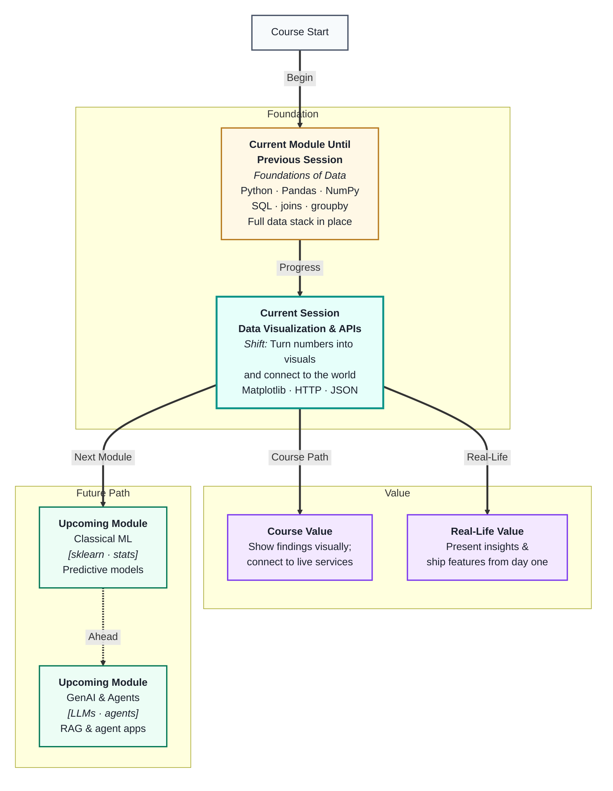
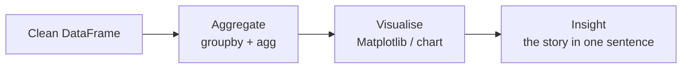
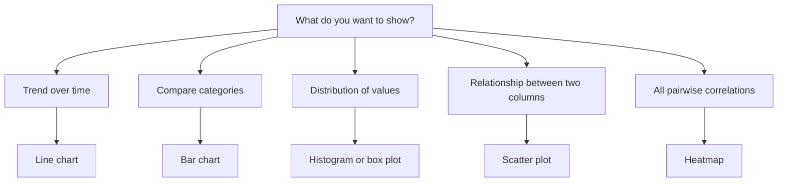
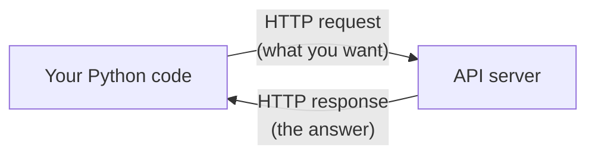
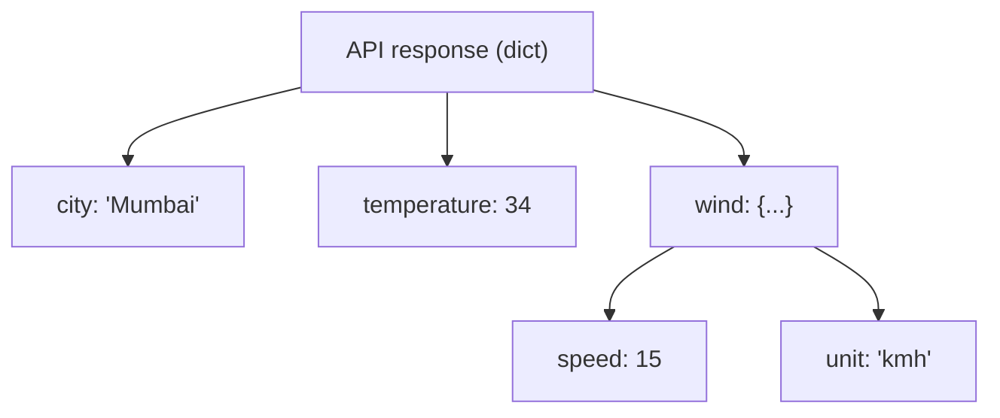

# Data Visualization & APIs
---

## Mental Map



## What You'll Learn

In this pre-read, you'll discover:

- How **Matplotlib** turns a DataFrame column into a chart with one line of code
- Which **chart type** to reach for depending on what you want to show
- How to label and style charts so the message is immediately clear
- What an **API** is and how HTTP lets your code talk to external services
- How to read and use **JSON** — the format every API speaks

---

## A. Why Visualise? — Numbers Need Shape

> 💡 **Analogy:** A weather report could say "temperature readings this week: 28, 31, 35, 34, 29, 26, 22." Or it could show a line dipping at the weekend. The numbers are identical — but the line makes the story instant. **Visualisation** is what gives numbers a shape people can immediately understand.

**One-line definition:** **Data visualisation** is the translation of numbers into a graphical format — charts, plots, and diagrams — so patterns, outliers, and trends become visible at a glance.

You have already cleaned, queried, and aggregated data. Visualisation is the final step that turns your analysis into something a non-technical stakeholder can act on.



| Visualisation role | What it replaces |
|---|---|
| Histogram | A long list of values — shows shape instead |
| Bar chart | A table of category totals — shows ranking instead |
| Line chart | A column of time-stamped numbers — shows trend instead |
| Scatter plot | Two correlated columns — shows relationship instead |
| Heatmap | A correlation matrix — shows strength across all pairs |

A chart that needs a paragraph of explanation has failed its job. A good chart answers one question and makes that answer obvious.

---

## B. Matplotlib — Plots From Python

> 💡 **Analogy:** Matplotlib is like a sketch pad with a set of standard brushes. You tell it what data to use and what type of mark to make — it draws the picture. You can keep it simple, or add labels and colour when the audience needs more context.

**One-line definition:** **Matplotlib** is Python's foundational plotting library — it creates static charts (lines, bars, histograms, scatter plots) from lists or DataFrame columns with a few function calls.

**The essential pattern:**

```
import matplotlib.pyplot as plt

plt.figure(figsize=(8, 4))          # set canvas size
plt.plot(x, y)                      # draw the chart
plt.title("Sales by Month")         # add title
plt.xlabel("Month")                 # label x-axis
plt.ylabel("Revenue (₹)")           # label y-axis
plt.tight_layout()                  # prevent clipping
plt.show()                          # display
```

**The four chart types you will use most:**

| Chart | Function | Use for |
|---|---|---|
| Line | `plt.plot(x, y)` | Trends over time |
| Bar | `plt.bar(categories, values)` | Comparing category totals |
| Histogram | `plt.hist(column, bins=20)` | Distribution of one numeric column |
| Scatter | `plt.scatter(x, y)` | Relationship between two numeric columns |

**Plotting directly from Pandas:**

Pandas wraps Matplotlib so you can go even faster:

```
df["sales"].plot(kind="hist")
df.groupby("city")["revenue"].sum().plot(kind="bar")
df.plot(x="hours", y="score", kind="scatter")
```

The Pandas `.plot()` method is a shortcut to Matplotlib — same charts, one less import.

---

## C. Choosing the Right Chart

> 💡 **Analogy:** A screwdriver works on screws. A hammer works on nails. Using the wrong tool does not just look bad — it actively misleads. Picking the **wrong chart type** does the same: it misrepresents the data even when every number is correct.

**One-line definition:** Every chart type is built for one kind of data relationship; picking the right one makes the insight instant — picking the wrong one hides or distorts it.



**Common mistakes to avoid:**

| Mistake | Why it misleads |
|---|---|
| Pie chart with 8+ slices | Brain cannot compare thin wedges |
| Bar chart y-axis not starting at zero | Exaggerates small differences |
| Line chart for unordered categories | Implies a trend that does not exist |
| 3-D bar charts | Depth distorts relative heights |
| Too many colours | Eye cannot distinguish signal from noise |

**Good chart checklist before sharing:**

- Does the title say *what the chart shows* (not just what the data is)?
- Are both axes labelled with units?
- Is there a legend if more than one series is shown?
- Does the y-axis start at zero for bar charts?
- Can a non-expert understand it in under 5 seconds?

---

## D. APIs and HTTP — Your Code Talks to the World

> 💡 **Analogy:** Ordering at a restaurant: you give the waiter your order (request), the kitchen makes it (the server processes it), and the waiter brings it back (response). You never enter the kitchen. An **API** is that waiter — a defined interface between your code and a service that does the work.

**One-line definition:** An **API (Application Programming Interface)** is a set of rules that lets two programs communicate — you send a structured request, the service sends back a structured response.



**HTTP — the language of web communication:**

Every API call travels over HTTP. The two methods you will use are:

| Method | Purpose | Analogy |
|---|---|---|
| `GET` | Retrieve data | Asking a question |
| `POST` | Send data / trigger action | Submitting a form |

**Using the `requests` library:**

```
import requests

# GET — fetch data from an API
response = requests.get("https://api.example.com/weather",
                        params={"city": "Mumbai"})

print(response.status_code)   # 200 = success
print(response.json())        # parsed response as Python dict
```

**Status codes to know:**

| Code | Meaning | Action |
|---|---|---|
| 200 | OK — success | Use the response |
| 400 | Bad request — your query has an error | Check parameters |
| 401 | Unauthorised — bad or missing API key | Check credentials |
| 404 | Not found — wrong endpoint | Check the URL |
| 500 | Server error — their problem | Retry or contact provider |

Always check `response.status_code` before reading the response — silent failures (a 404 that returns an empty body) are the most common source of bugs when working with APIs.

---

## E. JSON — The Language APIs Speak

> 💡 **Analogy:** When a delivery app sends you a live update, it arrives as a tiny structured message like `{"status": "on the way", "eta_minutes": 8}`. That compact key-value format is **JSON** — the universal language all APIs use to pass data back and forth.

**One-line definition:** **JSON (JavaScript Object Notation)** is a lightweight text format for representing structured data as key-value pairs and lists — Python reads it directly as a dictionary or list.

**JSON maps directly to Python:**

```
{
  "city": "Mumbai",
  "temperature": 34,
  "conditions": ["humid", "partly cloudy"],
  "wind": {
    "speed": 15,
    "unit": "kmh"
  }
}
```

| JSON structure | Python equivalent | How to access |
|---|---|---|
| `{"key": value}` | `dict` | `data["city"]` |
| `[item1, item2]` | `list` | `data["conditions"][0]` |
| Nested object | Nested `dict` | `data["wind"]["speed"]` |

**Navigating nested JSON:**



**Full pipeline — API to DataFrame to chart:**

```
response = requests.get(url, params=params)
data = response.json()                          # dict or list
df = pd.DataFrame(data["results"])              # JSON list → DataFrame
df["value"].plot(kind="bar", title="Results")   # DataFrame → chart
plt.show()
```

This three-step pipeline — call API, parse JSON, visualise — is the backbone of every live data dashboard, every AI demo that fetches real data, and every Streamlit app you will build in Module 3.

---

## Practice Exercises

**1. Pattern Recognition**  
You have a DataFrame with columns `month`, `revenue`, `orders`, and `avg_order_value`. Match each business question below to the chart type that best answers it: (a) How did revenue change each month? (b) What is the distribution of individual order values? (c) Is there a relationship between orders and revenue? (d) Which month had the highest avg order value?

**2. Concept Detective**  
A teammate's API call returns `status_code = 401` when run on their machine but `200` when you run it. The endpoint URL is identical. Using section D, identify the most likely cause and the first thing the teammate should check in their code.

**3. Real-Life Application**  
Name three apps you use that display live data on screen (a weather app, a food delivery tracker, a stock price widget). For each: describe the likely API call being made (GET or POST, what parameter is sent), what the JSON response might contain, and what chart type is probably used to display the result.

**4. Spot the Error**  
A student creates a bar chart of monthly sales but starts the y-axis at ₹90,000 instead of zero. January shows ₹95,000 and December shows ₹1,00,000. On the chart December's bar looks 10× taller than January's. Which charting rule from section C does this violate, and what does the reader incorrectly conclude?

**5. Planning Ahead**  
You want to build a mini Python script that: (1) calls a public weather API for three cities, (2) parses the JSON to extract temperature and humidity, (3) loads the results into a Pandas DataFrame, and (4) plots a bar chart comparing temperatures. Describe each step — which library you use, what you call, what you check, and what the final chart title and axis labels should say.

---

> ✅ **You're done!** You now know how to translate data into charts that communicate instantly, and how to reach beyond your own files to pull live data from any API in the world. These are the final two skills that complete your Module 1 toolkit. You are now fully equipped for **Module 2: Classical ML** — clean data, sharp queries, honest charts, and live connections to services, all ready to feed into your first predictive models.
