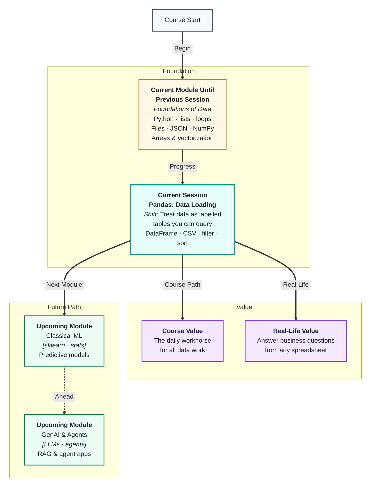
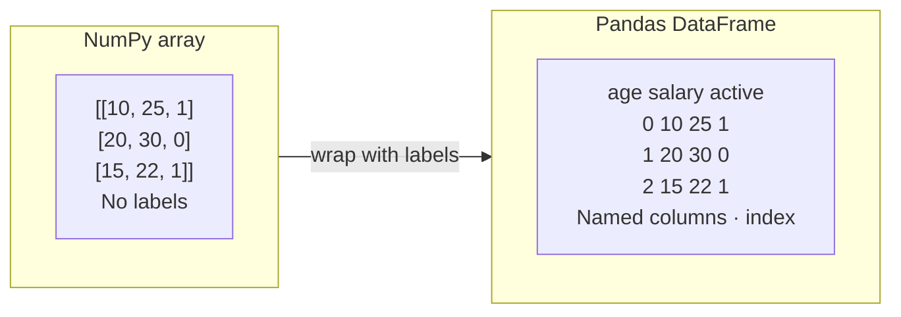
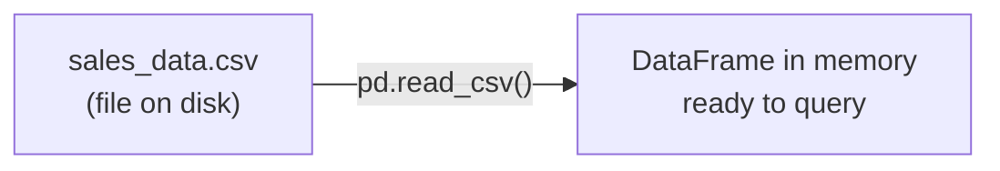
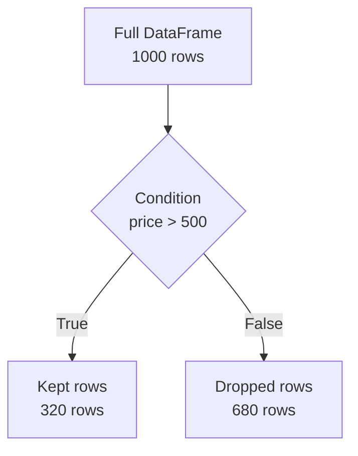

# Pandas: Data Loading & Selection
---

## Mental Map



## What You'll Learn

In this pre-read, you'll discover:

- What a **DataFrame** is and how it relates to the NumPy arrays you already know
- How to **load data** from CSV files and inspect what arrived
- How to **select** specific rows and columns using labels and positions
- How to **filter** rows by conditions to answer real questions
- How to **sort** a DataFrame to surface the highest, lowest, or most recent values

---

## A. The DataFrame — A Labelled Table

> 💡 **Analogy:** A NumPy array is a grid of numbers with no names. A **DataFrame** is the same grid but every row has an index label and every column has a name — like a spreadsheet where you can call a column "price" instead of "column 3."

**One-line definition:** A **DataFrame** is Pandas' core data structure — a 2-D table with labelled rows (index) and named columns, built on top of NumPy arrays.



Every column in a DataFrame is a **Series** — a 1-D labelled array. A DataFrame is just multiple Series sharing the same index.

| Concept | Plain meaning | How to check |
|---|---|---|
| `df.shape` | (rows, columns) | `(1000, 8)` means 1000 rows, 8 cols |
| `df.columns` | List of column names | `['name', 'age', 'salary', …]` |
| `df.dtypes` | Data type per column | `int64`, `float64`, `object` |
| `df.index` | Row labels | `RangeIndex(0, 1000)` by default |

**Quick first look at any DataFrame:**

- `df.head()` — first 5 rows
- `df.tail()` — last 5 rows
- `df.info()` — column names, types, non-null counts
- `df.describe()` — summary stats for numeric columns

---

## B. Loading Data from CSV

> 💡 **Analogy:** Opening a spreadsheet file in Excel is a click. `pd.read_csv()` is the Python equivalent — one line that reads every row and column into a DataFrame you can immediately work with.

**One-line definition:** `pd.read_csv()` reads a comma-separated values file from disk (or a URL) and returns a fully formed DataFrame in one step.



**Common parameters that matter:**

| Parameter | What it does | Example |
|---|---|---|
| `filepath` | Path to the file | `"data/sales.csv"` |
| `sep=` | Column separator if not comma | `sep="\t"` for tab-separated |
| `header=` | Which row is the header | `header=0` (default) |
| `usecols=` | Load only specific columns | `usecols=["name", "price"]` |
| `dtype=` | Force column types on load | `dtype={"id": str}` |
| `parse_dates=` | Auto-parse date columns | `parse_dates=["order_date"]` |
| `nrows=` | Load only the first N rows | `nrows=100` for a quick peek |

**After loading, always run the quick-look sequence:**

```
df = pd.read_csv("sales.csv")
df.shape          # How big is it?
df.head()         # What do the first rows look like?
df.info()         # Any missing values? Right types?
df.describe()     # Do the numbers make sense?
```

This four-step check catches the most common load problems: wrong separator, columns shifted, dates as strings, or unexpected row counts.

---

## C. Selecting Columns and Rows

> 💡 **Analogy:** A hotel reception desk can look up any guest by room number (position) or by name (label). Pandas gives you both options — `iloc` for position, `loc` for label — so you can always find exactly what you need.

**One-line definition:** **Selection** in Pandas means isolating specific columns or rows from a DataFrame using either column names, row labels, or integer positions.

**Selecting columns:**

```
df["price"]              # Single column → returns a Series
df[["name", "price"]]    # Multiple columns → returns a DataFrame
```

**Selecting rows by label — `loc`:**

```
df.loc[5]                # Row with index label 5
df.loc[2:7]              # Rows with labels 2 through 7 (inclusive)
df.loc[0, "price"]       # Row 0, column "price"
df.loc[1:4, ["name", "price"]]   # Rows 1–4, two columns
```

**Selecting rows by position — `iloc`:**

```
df.iloc[0]               # First row (position 0)
df.iloc[-1]              # Last row
df.iloc[0:5]             # First 5 rows (0 up to, not including, 5)
df.iloc[0:5, 1:3]        # First 5 rows, columns at positions 1 and 2
```

| Method | Uses | Endpoint inclusive? |
|---|---|---|
| `loc` | Labels (index values, column names) | Yes — `loc[1:4]` includes 4 |
| `iloc` | Integer positions (0-based) | No — `iloc[1:4]` stops before 4 |

**A common trap:** If your index is `0, 1, 2, 3…` (the default), `loc` and `iloc` look identical — but they differ when your index is non-numeric or has gaps. Always be explicit about which you need.

---

## D. Filtering Rows by Condition

> 💡 **Analogy:** A search filter on a shopping site — "show only items under ₹500, in stock, rated above 4 stars." You are describing the rows you want to *keep*. **Pandas filtering** works the same way: you write a condition, and only matching rows come back.

**One-line definition:** **Filtering** uses a boolean condition to select only the rows where that condition is `True`, returning a smaller DataFrame with the same columns.

**Single condition:**

```
df[df["price"] > 500]            # rows where price exceeds 500
df[df["city"] == "Mumbai"]       # rows where city is Mumbai
df[df["status"] != "cancelled"]  # rows where status is not cancelled
```

**Multiple conditions — use `&` (and) / `|` (or):**

```
df[(df["price"] > 500) & (df["city"] == "Mumbai")]
df[(df["age"] < 25) | (df["age"] > 60)]
```

**Always wrap each condition in parentheses** when combining — Python operator precedence will silently produce wrong results without them.

**Useful filter patterns:**

| Goal | Syntax idea |
|---|---|
| Filter by list of values | `df[df["city"].isin(["Mumbai", "Pune"])]` |
| Filter non-null rows | `df[df["email"].notna()]` |
| Filter text contains | `df[df["name"].str.contains("Kumar")]` |
| Filter by date range | `df[(df["date"] >= "2024-01-01") & (df["date"] <= "2024-03-31")]` |



---

## E. Sorting a DataFrame

> 💡 **Analogy:** A leaderboard automatically re-ranks players when scores change — highest first. **Sorting** does the same for any column: it reorders rows so the answer to "who is top?" is always at the top.

**One-line definition:** `sort_values()` reorders the rows of a DataFrame by the values in one or more columns, either ascending or descending.

**Basic sort:**

```
df.sort_values("sales")                    # ascending (lowest first)
df.sort_values("sales", ascending=False)   # descending (highest first)
```

**Sort by multiple columns — tiebreaker logic:**

```
df.sort_values(["region", "sales"], ascending=[True, False])
# Sort by region A→Z first; within each region, highest sales first
```

**Reset the index after sorting:**

```
df.sort_values("sales", ascending=False).reset_index(drop=True)
```

Without `reset_index`, the original row numbers stay attached and jump around, which looks confusing when you print or slice the result.

| Sorting task | Pattern |
|---|---|
| Top 5 by sales | `.sort_values("sales", ascending=False).head(5)` |
| Alphabetical by name | `.sort_values("name")` |
| Latest dates first | `.sort_values("date", ascending=False)` |
| Multi-column sort | `.sort_values(["col1", "col2"], ascending=[True, False])` |

**Sorting does not modify the original DataFrame** unless you pass `inplace=True` or reassign: `df = df.sort_values(...)`. This is a common point of confusion early on — always save or chain the result.

---

## Practice Exercises

**1. Pattern Recognition**  
You load a CSV and run `df.info()`. It shows `order_date` has dtype `object` instead of `datetime64`, and `customer_id` is `float64` instead of `int64`. Name the likely cause of each, and which `read_csv` parameter would fix each issue at load time.

**2. Concept Detective**  
A teammate writes `df.loc[0:5]` expecting exactly 5 rows, but gets 6. They also write `df.iloc[0:5]` and get exactly 5. Using what you learned about `loc` vs `iloc`, explain why the results differ and which one they should use for "first 5 rows."

**3. Real-Life Application**  
Imagine you have a DataFrame of orders with columns `customer_name`, `city`, `amount`, `status`, `order_date`. Write out — in plain words, not code — the filter conditions you would apply to answer each of these business questions: (a) All delivered orders above ₹2000 from Delhi, (b) Orders from the last 30 days that are still pending, (c) Customers whose name contains "Singh."

**4. Spot the Error**  
A student writes `df[df["age"] > 18 & df["city"] == "Pune"]` and gets unexpected results. Identify the exact mistake using section D, and write the corrected condition in words.

**5. Planning Ahead**  
You receive a 50,000-row e-commerce CSV with columns `order_id`, `product`, `category`, `price`, `quantity`, `city`, `order_date`, `status`. Describe your full load-and-explore plan: what `read_csv` options you would set, the four-step inspection sequence to run, two filter examples to test your understanding, and one sort that would answer a useful business question.

---

> ✅ **You're done!** You now know how to take any CSV, load it into a labelled DataFrame, and immediately start asking real questions — selecting columns, filtering rows, and surfacing the data you need. Next up: **Pandas: Cleaning & Aggregation**, where you will fix what is broken in your table and summarise it into business-ready answers.
