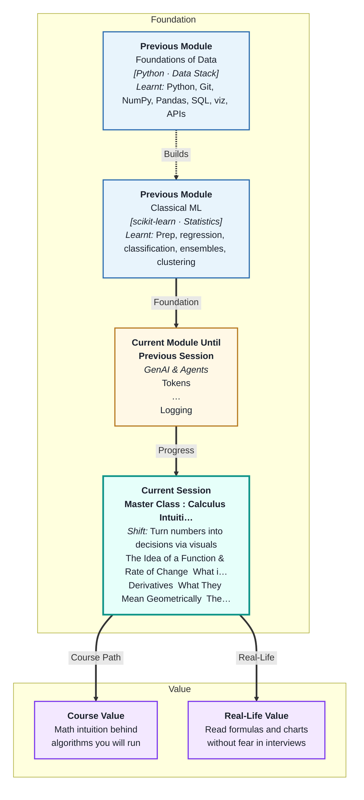

```mermaid
%%{init: {'flowchart': {'nodeSpacing': 55, 'rankSpacing': 65, 'diagramPadding': 24}}}%%
flowchart TB
linkStyle default stroke-width:3px

subgraph foundation[" Foundation "]
direction TB
    P0["<b>Previous Module</b><br/>Foundations of Data<br/><i>[Python · Data Stack]</i><br/><i>Learnt:</i> Python, Git, NumPy, Pandas, SQL, viz, APIs"]
    P1["<b>Previous Module</b><br/>Classical ML<br/><i>[scikit-learn · Statistics]</i><br/><i>Learnt:</i> Prep, regression, classification, ensembles, clustering"]
    CURMOD["<b>Current Module Until<br/>Previous Session</b><br/><i>GenAI & Agents</i><br/>Tokens<br/>…<br/>Logging"]
    CURSES["<b>Current Session</b><br/><b>Master Class : Calculus Intuiti…</b><br/><i>Shift:</i> Turn numbers into decisions via visuals<br/>The Idea of a Function & Rate of Change  What i…<br/>Derivatives  What They Mean Geometrically  The…"]
end

subgraph value[" Value "]
direction LR
    CVAL["<b>Course Value</b><br/>Math intuition behind<br/>algorithms you will run"]
    RVAL["<b>Real-Life Value</b><br/>Read formulas and charts<br/>without fear in interviews"]
end

P1 ==>|&nbsp;Foundation&nbsp;| CURMOD
P0 -.->|&nbsp;Builds&nbsp;| P1
CURMOD ==>|&nbsp;Progress&nbsp;| CURSES
CURSES ==>|&nbsp;Course Path&nbsp;| CVAL
CURSES ==>|&nbsp;Real-Life&nbsp;| RVAL

classDef prevBox fill:#E8F4FC,stroke:#2B6CB0,stroke-width:2px,color:#1A202C
classDef curModBox fill:#FFF8E6,stroke:#B7791F,stroke-width:2px,color:#1A202C
classDef curSessBox fill:#E6FFFA,stroke:#0D9488,stroke-width:3px,color:#1A202C
classDef valueBox fill:#F3E8FF,stroke:#7C3AED,stroke-width:2px,color:#1A202C
classDef futureBox fill:#ECFDF5,stroke:#047857,stroke-width:2px,color:#1A202C
classDef startBox fill:#F7FAFC,stroke:#4A5568,stroke-width:2px,color:#1A202C
class P0,P1 prevBox
class CURMOD curModBox
class CURSES curSessBox
class CVAL,RVAL valueBox
```
