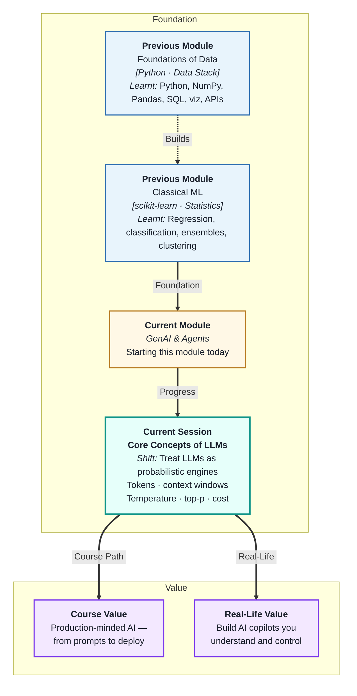
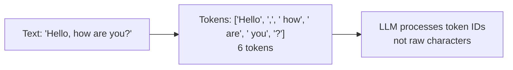
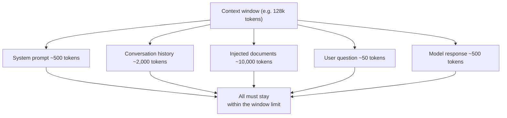
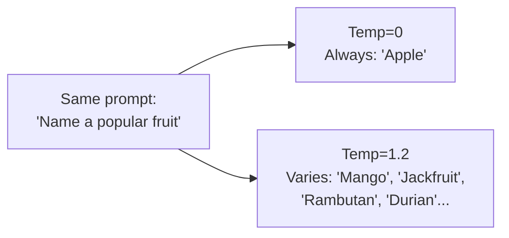
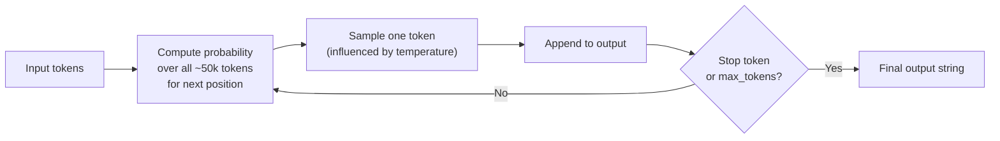
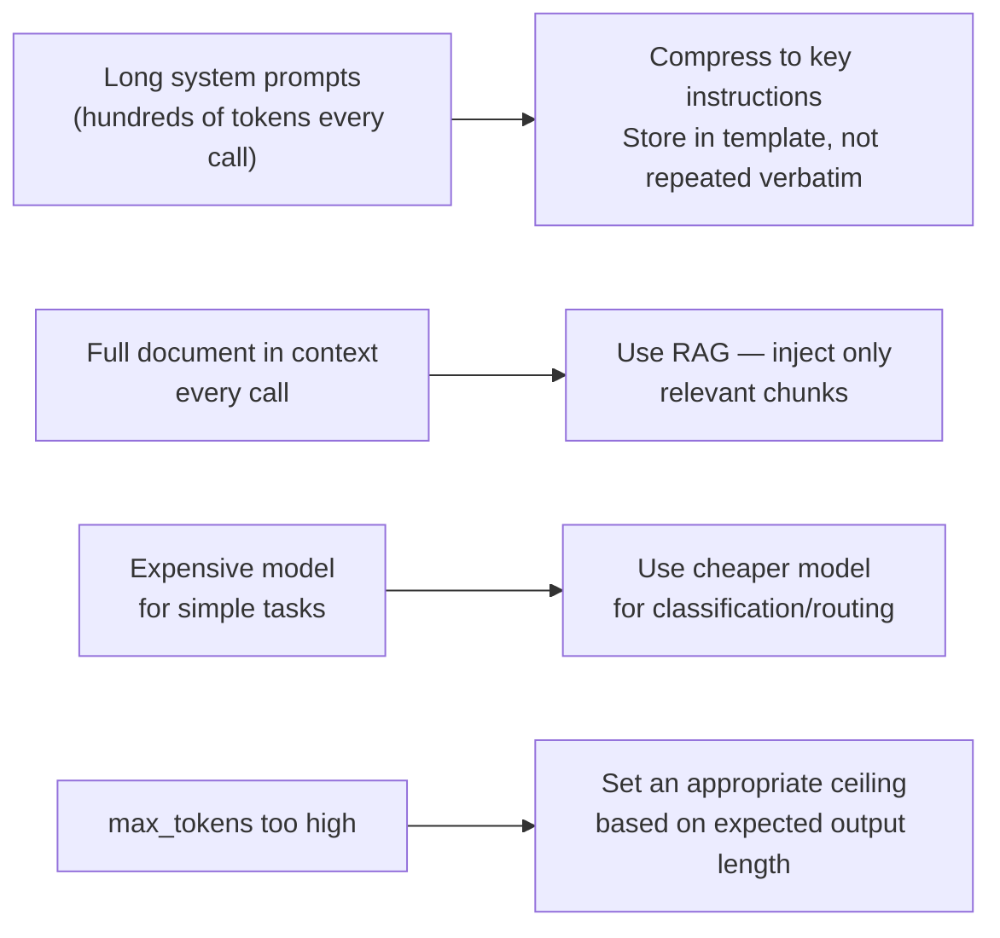

# Core Concepts of Large Language Models
---

## Mental Map

## What You'll Learn

In this pre-read, you'll discover:

- What a **token** is — the actual unit an LLM reads and writes, not a word
- How the **context window** limits what an LLM can "see" at once
- What **temperature** and **top-p** control — and how they shape output style
- Why LLMs are **probabilistic** machines, not calculators
- How to think about **cost and latency** before building anything

---

## A. Tokens — The Real Unit of Language Models

> 💡 **Analogy:** A chef does not count ingredients by "dishes" — they count by grams. An LLM does not count by words — it counts by **tokens**: chunks of roughly 3–4 characters that are the atomic unit of everything it reads and writes.

**One-line definition:** A **token** is a sub-word chunk of text that the LLM processes as its atomic unit. All input is split into tokens before the model reads it; all output is generated token by token.

**Why tokens matter:**

| Fact | Practical consequence |
|---|---|
| ~750 tokens ≈ 1,000 words | Pricing and limits are in tokens, not words |
| Non-English text uses more tokens/word | Same message costs more in Hindi, Arabic, etc. |
| Code is denser than prose | A Python function may cost 30–100 tokens |
| "ChatGPT" = 1 token; "chat GPT" = 2 | Spacing and capitalisation change token count |

**Tokenisation** is the process of converting raw text into a sequence of integer IDs from the model's fixed vocabulary (typically 50k–100k entries). Rare words are split into sub-word pieces — "unbelievable" might become ["un", "believ", "able"].

---

## B. Context Window — The Model's Working Memory

> 💡 **Analogy:** A person reading a long novel cannot keep every page in mind — only the recent chapters. An LLM is the same: its **context window** is the maximum number of tokens it can hold in "memory" at once — everything outside that window is invisible.

**One-line definition:** The **context window** is the maximum token count an LLM can process in a single call — it includes your system prompt, conversation history, injected documents, and the model's own response, all counted together.

**Practical limits:**

| Situation | What happens |
|---|---|
| Conversation grows too long | Oldest messages must be dropped or summarised |
| Large document injected | Less room for history and response |
| Output truncated | Response hits `max_tokens` before finishing |

Window size ≠ quality. Filling a 128k window with irrelevant text degrades quality just as much as running out of space. **What you put in the window matters as much as how much fits.**

---

## C. Temperature and Top-p — Controlling Output Randomness

> 💡 **Analogy:** A music mixer has a "creativity" dial — low for precise, consistent output; high for improvisation. **Temperature** and **top-p** are the two dials on that mixer for LLMs: one controls raw randomness, the other limits which tokens are even considered.

**One-line definition:** **Temperature** scales the probability distribution over next tokens — lower is more deterministic, higher is more varied. **Top-p** (nucleus sampling) restricts sampling to the smallest set of tokens whose cumulative probability reaches p — ignoring very unlikely tokens.

| Setting | Behaviour | Best for |
|---|---|---|
| Temperature 0.0 | Nearly deterministic | Code, JSON extraction, factual Q&A |
| Temperature 0.3–0.7 | Focused with flexibility | Analysis, summaries, classification |
| Temperature 1.0+ | Creative and varied | Brainstorming, storytelling |
| Top-p 0.1 | Only the most likely tokens considered | Very constrained generation |
| Top-p 0.9 (default) | Wide but not unlimited candidate set | Most tasks |

**Practical defaults:** Start temperature at 0.7. For structured output or code, drop to 0.0. Only raise above 1.0 when creative variation is explicitly desired. Leave top-p at 0.9 unless you have a specific reason to change it — do not change both parameters at once.

---

## D. Probabilistic Generation — Why the Same Prompt Gives Different Answers

> 💡 **Analogy:** A weatherman does not know exactly what tomorrow will be — he gives you "70% chance of rain." An LLM is similar: at each step it produces a probability distribution over all possible next tokens, then *samples* from it. The same input can produce different valid outputs.

**One-line definition:** **Probabilistic generation** means the LLM samples from a probability distribution at each token step, making it inherently non-deterministic — the same prompt can legitimately produce different, equally valid completions.

**How generation works step by step:**

**Key consequences:**

| Behaviour | Implication for builders |
|---|---|
| Same prompt → different outputs | Never assume reproducibility at temperature > 0 |
| Confident but wrong answers | Always validate critical outputs — LLMs can hallucinate |
| Early tokens influence later tokens | Long outputs drift more from the original intent |
| Probabilities reflect training data | Model "knows" what was common in training, not absolute truth |

**Hallucination** is a direct result: the model generates plausible-sounding tokens even when they are factually wrong. Grounding techniques (RAG, structured outputs, tool use) defend against it.

---

## E. Cost and Latency — Thinking Like a Builder

> 💡 **Analogy:** Electricity is sold by the kilowatt-hour — not by the appliance. LLM APIs are sold by the token. A builder who does not track token usage is like a factory manager who never reads the electricity bill.

**One-line definition:** **Cost** for LLM APIs is charged per token (input and output separately); **latency** is the time from request to full response — both must be considered before choosing a model and designing a prompt.

**Token cost structure:**

| Component | What it is | Example (approximate) |
|---|---|---|
| Input tokens | System prompt + history + user message | $0.005 per 1k tokens |
| Output tokens | Model's response | $0.015 per 1k tokens (often higher than input) |
| Total per call | Sum of both | 500-token prompt + 200-token response = $0.0055 |

**Cost drivers to control:**

**Latency basics:**

| Factor | Effect on latency |
|---|---|
| Input token count | More input = longer processing time |
| Output token count | More output = longer generation (sequential) |
| Model size | Larger models (GPT-4) are slower than smaller ones |
| Streaming | Using streaming returns first token faster but total time is similar |

Design prompt lengths and max_tokens with both cost and latency in mind — especially for real-time user-facing applications.

---

## Practice Exercises

**1. Pattern Recognition**  
A system prompt is 600 tokens, the conversation history is 2,800 tokens, and the user's question is 80 tokens. The model's response is capped at 400 tokens. (a) What is the total token usage? (b) If the context window is 4,096 tokens, how much headroom is left? (c) If input costs $0.005/1k and output costs $0.015/1k, what does this call cost?

**2. Concept Detective**  
A developer runs the same "extract the total amount from this invoice" prompt 5 times with temperature=1.0. Three times it returns `4500`, once `₹4500`, once `4,500`. Using sections C and D, explain why this happens, whether it is a bug, and what single change makes the output consistent.

**3. Real-Life Application**  
Describe three real applications and for each: (a) the best temperature setting and why, (b) what would go wrong at the opposite extreme, (c) whether top-p should be lowered from the default. Examples: a medical triage classifier, a creative product-description generator, and a code-comment writer.

**4. Spot the Error**  
A team builds a customer chatbot where every API call includes: a 1,200-token system prompt, the full 50-message conversation history (averaging 150 tokens per message), and the user's latest message. After 50 messages, the API starts throwing context-length errors. Using section B, explain what is happening and propose two strategies to keep every call within the window.

**5. Planning Ahead**  
You are building a document Q&A feature. The document is 80,000 tokens. The model has a 32k context window. The expected answer is 200 tokens. Using sections B and E, explain why you cannot inject the document directly, calculate the approximate cost per call if you inject 5 chunks of 500 tokens each instead (at given rates), and describe what you would monitor to keep monthly API costs under ₹10,000.

---

> ✅ **You're done!** You now understand the mechanical foundation of every LLM system: tokens (the unit of cost and memory), context windows (the limit of attention), temperature and top-p (the dials on randomness), probabilistic generation (why outputs vary), and cost/latency (the constraints of real deployments). Next: **Prompt Engineering and Reasoning Strategies**, where you will learn to steer model behaviour precisely through deliberate prompt design.
