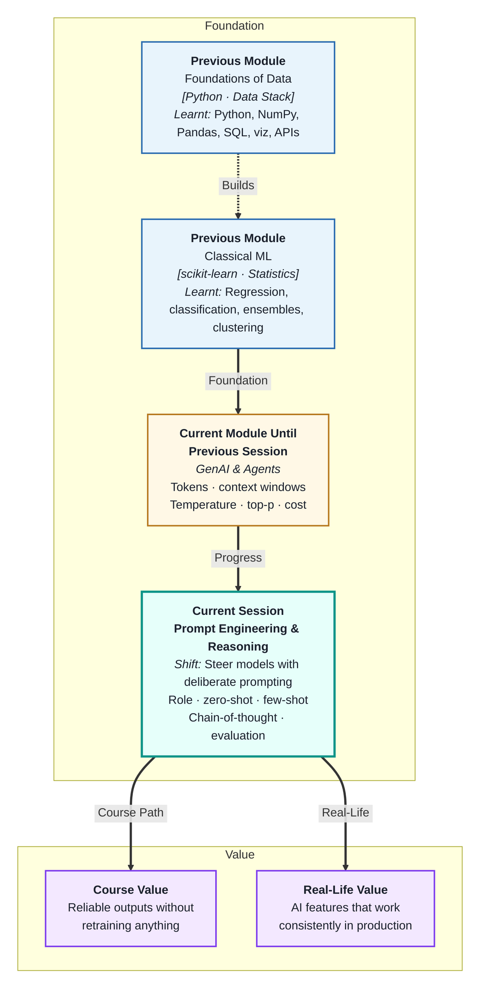
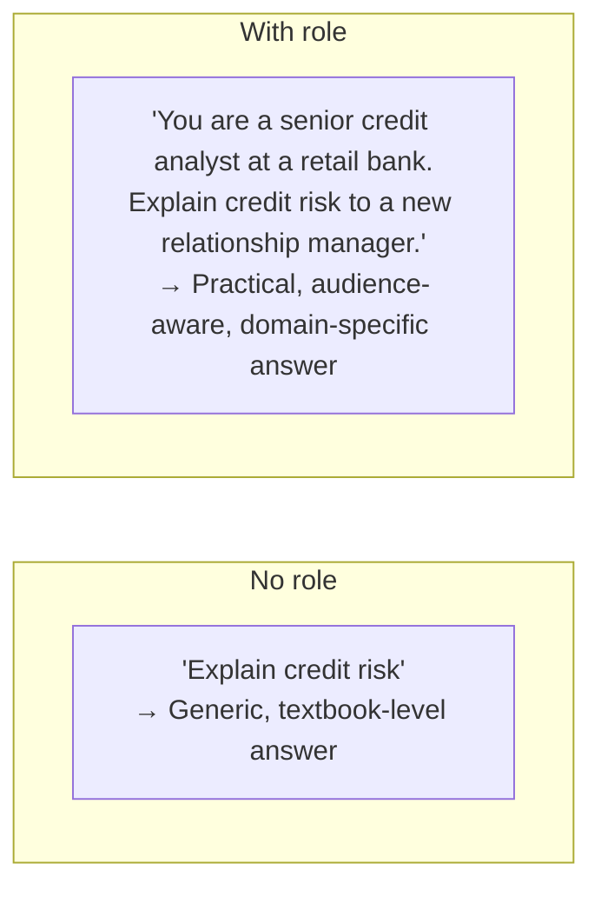
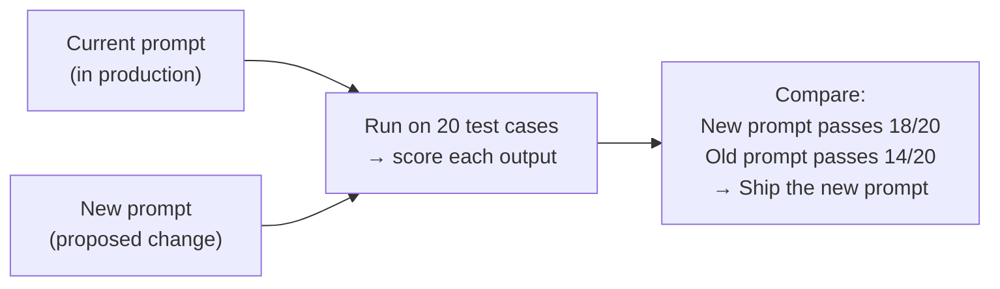

# Prompt Engineering and Reasoning Strategies
---

## Mental Map



## What You'll Learn

In this pre-read, you'll discover:

- How **role prompting** sets the model's persona and domain expertise
- The difference between **zero-shot and few-shot** prompting — and when each works best
- How **chain-of-thought** dramatically improves reasoning accuracy on complex tasks
- How to build a **small test set** to evaluate whether a prompt change is actually an improvement
- How to structure any prompt for reliable, repeatable results

---

## A. Role Prompting — Setting the Model's Persona

> 💡 **Analogy:** Briefing a consultant before a meeting — "You are a supply-chain expert. Speak from operational experience, not theory." The briefing does not change their underlying knowledge, but it frames how they access and present it. **Role prompting** does the same for LLMs.

**One-line definition:** **Role prompting** tells the model who it is and what domain expertise it should draw on — shaping the vocabulary, depth, and perspective of every response in that session.



**Role components that matter:**

| Component | Example | Effect |
|---|---|---|
| Profession / title | "You are a data engineer" | Shapes technical depth |
| Organisation context | "at a logistics company" | Grounds examples in relevant domain |
| Audience | "Explain to a non-technical manager" | Calibrates vocabulary and analogies |
| Constraints | "Do not use jargon. Limit to 3 bullets." | Enforces format and length |

**Best practice:** Put the role in the **system message**, not in the user message. The system message is the persistent persona for the whole conversation; user messages contain the specific task.

---

## B. Zero-Shot and Few-Shot Prompting

> 💡 **Analogy:** Asking a new intern to "write a professional email" with no example is zero-shot. Showing them three sample emails first ("write one like these") is few-shot. The examples anchor style, format, and tone more effectively than any description.

**One-line definition:** **Zero-shot** asks the model to complete a task with no examples; **few-shot** provides 2–5 worked examples in the prompt, teaching the expected format and style through demonstration.

| Approach | When to use | Token cost | Output control |
|---|---|---|---|
| Zero-shot | Simple, well-understood tasks | Low | Moderate |
| One-shot | Format anchoring with minimal cost | Low–Medium | Good |
| Few-shot | Specific classification, format, or style | Higher | Best |

**Few-shot example — classification:**

```
Classify the following support ticket. Categories: billing, shipping, technical, other.

Ticket: "I was charged twice for my last order." → billing
Ticket: "My package shows delivered but I never received it." → shipping
Ticket: "The app crashes when I open the settings page." → technical

Ticket: "I need to update my registered email address." →
```

The model learns the expected single-word format from the three examples — no description of format required.

**Rule of thumb:** Try zero-shot first. Add examples only if the output format or category labels are inconsistent across runs.

---

## C. Chain-of-Thought — Showing the Working

> 💡 **Analogy:** A student who writes out intermediate steps on an exam catches arithmetic mistakes before writing the final answer. A student who jumps to the answer often gets complex problems wrong. **Chain-of-thought prompting** tells the model to "show its working" — producing more reliable answers on multi-step problems.

**One-line definition:** **Chain-of-thought (CoT) prompting** instructs the model to reason through intermediate steps before giving a final answer — significantly improving accuracy on logic, arithmetic, and multi-step reasoning tasks.

**Two ways to trigger CoT:**

| Method | How | Example addition |
|---|---|---|
| Zero-shot CoT | Add "Think step by step" | "Solve this. Think step by step." |
| Few-shot CoT | Include examples that show reasoning | Show worked solution before the question |

**Zero-shot CoT in action:**

```
Without CoT:
Q: A shop has 240 items. 30% are sold on Monday, 25% of remaining on Tuesday.
   How many remain?
A: 126  ← wrong

With CoT ("Think step by step"):
Q: ... Think step by step.
A: After Monday: 240 × 0.7 = 168 remain.
   After Tuesday: 168 × 0.75 = 126 remain.
   Answer: 126  ← same answer but now traceable and more reliable on harder problems
```

**When CoT adds most value:**

- Multi-step arithmetic or logic
- Conditional reasoning ("if X and Y then Z")
- Comparing options across multiple criteria
- Tasks where an intermediate wrong step produces a plausible-looking wrong final answer

---

## D. Prompt Evaluation with Small Test Sets

> 💡 **Analogy:** A chef does not change a restaurant's recipe based on one customer's opinion — they taste-test with a small panel of trusted diners. **Prompt evaluation** is the same: before shipping a new prompt to production, test it on a representative set of inputs to confirm it is actually better.

**One-line definition:** **Prompt evaluation using small test sets** means measuring a prompt's performance across 10–50 representative input/output pairs before deploying it — so you know whether a change improved quality or just changed it.

**Why test sets matter:**

A prompt that works brilliantly on three examples you designed might fail on the seventh real user input. A small test set catches this before it reaches users.



**Building a simple test set:**

| Step | What to do |
|---|---|
| 1. Collect representative inputs | Pull 10–20 real examples from logs or craft representative ones |
| 2. Write expected outputs | What should the model ideally say for each? |
| 3. Define a pass criterion | Exact match, contains-key-phrase, or LLM-as-judge score ≥ 4 |
| 4. Run both prompts on the set | Automate if possible |
| 5. Compare pass rates | Choose the prompt that scores higher |

**Test case types to include:**

- 5+ typical inputs (happy path)
- 2–3 edge cases (empty input, very long input, unusual language)
- 1–2 adversarial cases (inputs designed to confuse the prompt)
- 1–2 regression cases (inputs that previously produced bad outputs)

---

## E. Putting It Together — The Well-Structured Prompt

> 💡 **Analogy:** A good architect's brief has four parts: who the building is for, what it must contain, what constraints apply, and what success looks like. A well-structured prompt has exactly those four parts: role, instruction, context, and output format.

**One-line definition:** A **well-structured prompt** combines a role (who the model is), an explicit instruction (what to do), the minimum relevant context (what to process), and a defined output format — each section doing exactly one job.

**The four-part anatomy:**

```
SYSTEM (role):
You are a customer-support analyst for an e-commerce platform.
Respond only with a valid JSON object. Do not add any text outside the JSON.

USER (instruction + context + format):
Classify the following support ticket and extract key details.

---
Ticket: "Hi, I ordered item #8823 on Monday but it hasn't arrived.
The tracking says 'label created' only. I need this by Friday — it's urgent."
---

Return JSON with exactly these fields:
{
  "category": "shipping_delay | wrong_item | refund | other",
  "urgency": "low | medium | high",
  "order_id": "<string or null>",
  "summary": "<one sentence>"
}
```

**Common mistakes and fixes:**

| Mistake | Problem | Fix |
|---|---|---|
| Vague instruction ("analyse this") | Model guesses what you want | Be explicit: "classify into X, Y, Z" |
| No format spec | Prose instead of structure | "Return JSON with fields: ..." |
| Irrelevant context | Model gets distracted | Only include what is needed for this specific task |
| No delimiter between instruction and data | Model conflates instruction with content | Use `---` or `###` to separate |
| Missing enum values | Model invents new categories | Always list allowed values |

---

## Practice Exercises

**1. Pattern Recognition**  
Take this vague prompt: "Summarise this article for me." Rewrite it using the four-part structure from section E for the following scenario: the model is a communications analyst, the article is pasted after a `---` delimiter, and the output must be exactly three bullet points of no more than 15 words each, in JSON format `{"bullets": [str, str, str]}`.

**2. Concept Detective**  
A team runs the same "classify this ticket" prompt 10 times with temperature=0.7 and gets categories: `["billing", "Billing", "BILLING", "billing issue", "billing", "billing", "billing", "billing", "Billing", "billing"]`. Using sections B and E, explain the root cause and rewrite the relevant part of the prompt to enforce consistent, lowercase, exact-match categories.

**3. Real-Life Application**  
Design a prompt (role + instruction + format) for each of the following: (a) extracting action items from a meeting transcript into a JSON array of objects `{owner, task, deadline}`, (b) generating a two-sentence personalised product recommendation given a customer's purchase history, (c) scoring a job application cover letter on fit (1–5) with a one-line justification.

**4. Spot the Error**  
A team changes their prompt from "Summarise this." to "Write a detailed comprehensive summary covering all major points with extensive context and examples." They test it on 3 examples they wrote themselves and it looks great. They ship it to production. The next day, users report that the assistant is writing 800-word summaries for simple 2-line questions. Using section D, explain what went wrong in their evaluation process and describe the test set they should have built first.

**5. Planning Ahead**  
You are building a prompt to auto-triage 500 incoming job applications per day. The prompt must classify each into shortlist / second-review / reject and provide a one-sentence reason. Design the full prompt (role, instruction, context placeholder, output format) AND describe the 20-case evaluation test set you would build — including what types of cases to include, what the pass criterion is, and how you would compare the current prompt against a proposed improvement.

---

> ✅ **You're done!** You now know how to set a role, choose the right prompting strategy, trigger step-by-step reasoning, and evaluate prompt changes with a test set before shipping. Next: **Fundamentals of AI Agents and Tool Usage**, where the LLM stops just answering and starts taking actions — calling tools, handling retries, and working toward goals autonomously.
