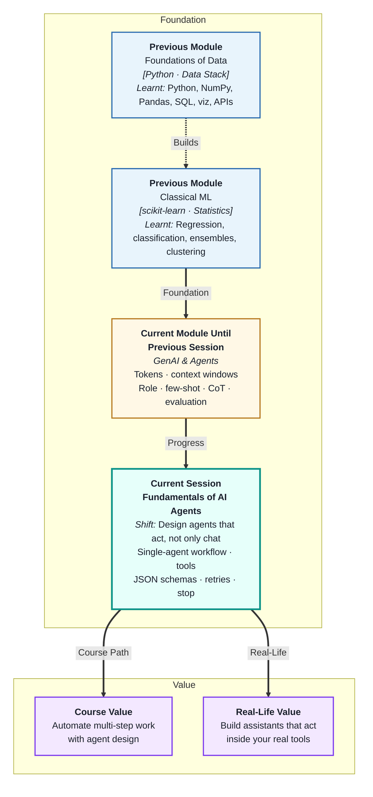
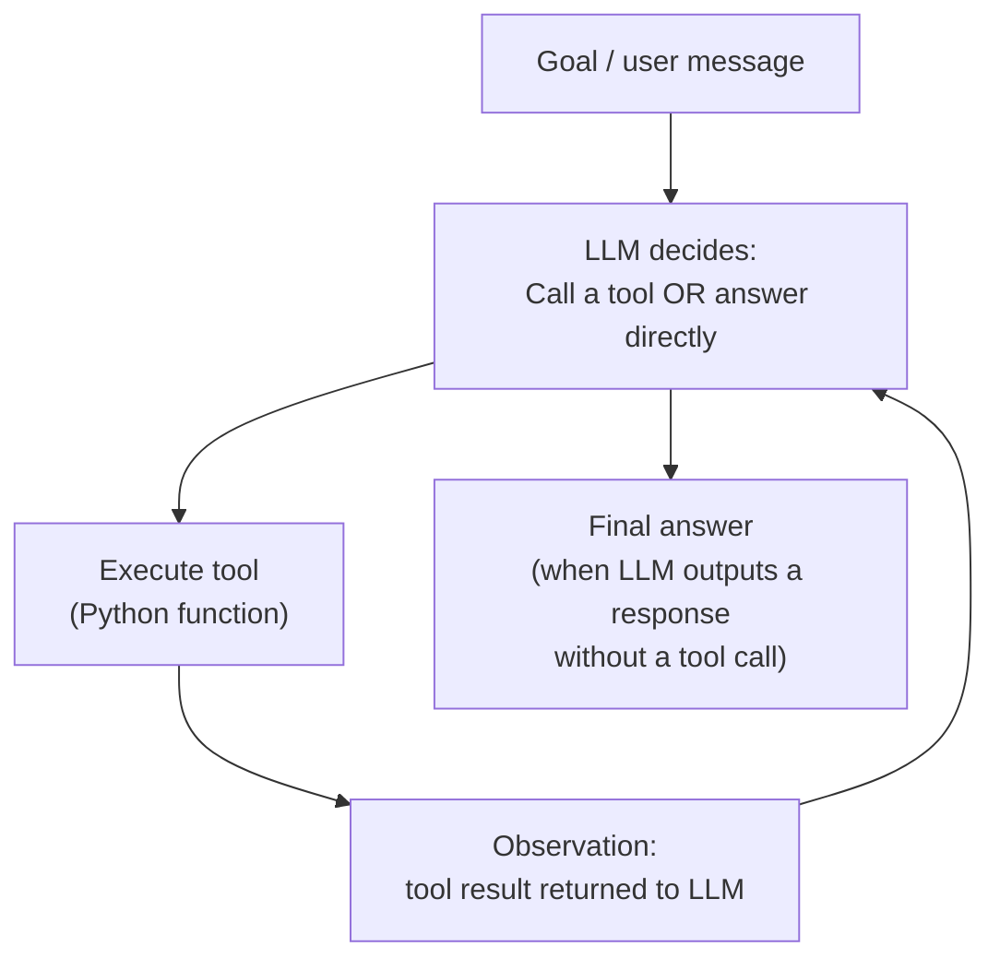
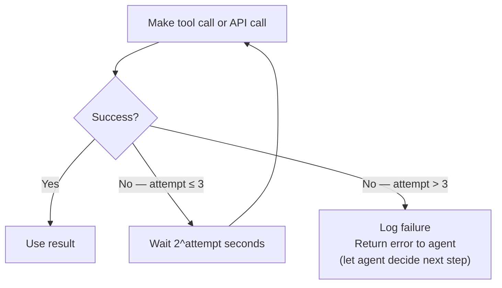
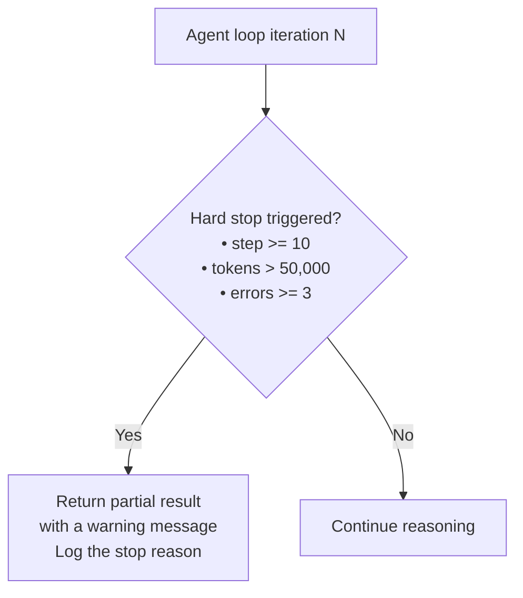

# Fundamentals of AI Agents and Tool Usage
---

## Mental Map



## What You'll Learn

In this pre-read, you'll discover:

- What a **single-agent workflow** is and how it differs from a single LLM call
- How **tool usage** works — giving the LLM the ability to call real Python functions
- How to write **JSON schemas** that describe tools to the model
- Why **retries and exponential backoff** are essential for reliable agent loops
- How **hard stop conditions** prevent agents from looping forever

---

## A. The Single-Agent Workflow

> 💡 **Analogy:** A research intern given a project does not just answer from memory — they search, calculate, read documents, and iterate until they have a complete answer. A **single-agent workflow** is that intern: an LLM that plans, calls tools, observes results, and loops until the goal is met.

**One-line definition:** A **single-agent workflow** is a loop where one LLM receives a goal, decides which tool (if any) to call, receives the result, and decides whether to call another tool or return a final answer — repeating until done.



**What makes it an "agent" vs a chat:**

| Chat (single LLM call) | Agent (single-agent loop) |
|---|---|
| One call, one response | Multiple calls in a loop |
| No external actions | Can call tools, APIs, databases |
| Stateless within turn | Builds on previous tool results |
| Manual multi-step requires human | Autonomous multi-step execution |

**In this session you will build two mini agents:**
- A **CSV Analyst** that reads a CSV, calculates statistics, and answers data questions
- An **FAQ bot** that searches a knowledge base and answers user questions

---

## B. Tool Usage — Giving the LLM Hands

> 💡 **Analogy:** A brilliant analyst locked in a room with only pen and paper is limited. Give them a computer, a phone, and a calculator — they can do real work. **Tool usage** is giving the LLM those instruments: the ability to call functions and receive real results.

**One-line definition:** **Tool usage** (function calling) lets the LLM signal that it wants to invoke a named Python function with specific arguments — your code executes the function and returns the result, which the LLM uses for its next reasoning step.

```mermaid
flowchart LR
    LLM["LLM output:\n{\"function\": \"get_csv_stats\",\n\"args\": {\"column\": \"sales\"}}"] --> CODE["Python executes:\nget_csv_stats('sales')"]
    CODE --> RESULT["Result:\n{\"mean\": 4200, \"max\": 12300, \"min\": 800}"]
    RESULT --> LLM2["LLM receives result\nand generates next step or final answer"]
```

**Key rules of tool usage:**

- The LLM never directly executes code — it only *requests* a tool call
- Your code controls which tools exist and what they do
- The tool result is returned as a special "tool" role message in the conversation
- The LLM can call tools sequentially — the result of tool 1 can inform the call to tool 2

**Start with 1–2 tools.** A common mistake is giving agents too many tools at once. Begin with the minimum set needed for the task, verify those work reliably, then expand.

---

## C. JSON Schemas — Describing Tools to the Model

> 💡 **Analogy:** A hotel concierge menu lists every service with a brief description: "Restaurant booking — reserve a table (inputs: restaurant name, date, party size)." The LLM uses the same kind of menu to know what tools exist and what arguments to provide.

**One-line definition:** A **JSON schema** for a tool is a structured description of its name, purpose, and parameters — provided to the LLM so it knows when to call the tool and exactly what arguments to pass.

**Example tool schema:**

```json
{
  "name": "get_column_stats",
  "description": "Return summary statistics (mean, median, min, max) for a numeric column in the loaded CSV. Use this when the user asks about averages, ranges, or distributions.",
  "parameters": {
    "type": "object",
    "properties": {
      "column_name": {
        "type": "string",
        "description": "The exact name of the column as it appears in the CSV header"
      }
    },
    "required": ["column_name"]
  }
}
```

**Schema design principles:**

| Principle | Why it matters |
|---|---|
| Descriptive name | `get_column_stats` beats `tool_1` — LLM selects by name |
| Detailed description | The LLM chooses tools based on the description; vague = wrong tool selected |
| Use `required` for mandatory params | Prevents the model from omitting essential arguments |
| Use `enum` for constrained values | Limits model choices to valid options — reduces errors |
| One job per tool | Do not combine "search" and "create" into one function |

---

## D. Retries and Exponential Backoff

> 💡 **Analogy:** A polite person calling a busy office does not give up after one unanswered call — they wait a bit and try again, then wait longer, then try once more. **Exponential backoff** is that increasingly patient retry strategy — it avoids hammering a busy API while still eventually getting through.

**One-line definition:** **Retries with exponential backoff** means re-attempting a failed API call after progressively longer wait intervals (1s, 2s, 4s...) — handling transient failures like rate limits and server errors without crashing the agent loop.

**When to retry vs when to stop:**

| Error | Retry? | Wait strategy |
|---|---|---|
| 429 (rate limit) | Yes | Exponential backoff (2^attempt seconds) |
| 500 (server error) | Yes (1–3 times) | Short fixed delay |
| 503 (service unavailable) | Yes (briefly) | Short delay |
| 401 (invalid API key) | No — fix the config | N/A |
| 400 (bad request — invalid schema) | No — fix the prompt | N/A |

**Retry logic pattern:**



**Important:** Retry logic should apply at the tool execution layer — not at the LLM reasoning layer. The LLM should see either a successful tool result or a clear error message, not raw HTTP exceptions.

---

## E. Hard Stop Conditions — Preventing Infinite Loops

> 💡 **Analogy:** An escalator has an emergency stop button — not because it usually needs it, but because the alternative (a runaway escalator) is dangerous. **Hard stop conditions** are that emergency stop for agents: they prevent the loop from running forever when something goes wrong.

**One-line definition:** **Hard stop conditions** are explicit limits baked into every agent loop that terminate it regardless of whether the goal was achieved — preventing infinite loops, runaway API costs, and stuck agents.

**The three essential hard stops:**

| Stop condition | How to implement | Why |
|---|---|---|
| Max iterations | `if step >= MAX_STEPS: break` | Prevents infinite loops |
| Max tokens consumed | Track cumulative tokens; stop at threshold | Cost protection |
| Error count threshold | Stop after N consecutive tool failures | Prevents pointless retrying on broken tools |



**What the agent should return when a hard stop triggers:**

Never return nothing. Return the best partial result the agent achieved, a clear message explaining it stopped early, and the reason (iterations, tokens, or errors). This gives the user something useful and the developer something to debug.

**The mini builds in this session** will demonstrate all of these concepts together:
- A **CSV Analyst** uses `get_column_stats` and `filter_rows` tools with a 5-step iteration limit
- An **FAQ bot** uses a `search_knowledge_base` tool with retry logic and a 3-step limit

---

## Practice Exercises

**1. Pattern Recognition**  
Write the JSON schema for a tool called `search_orders(customer_id: str, status: str) → list[dict]` where status must be one of: `"pending"`, `"shipped"`, `"delivered"`, `"cancelled"`. Include a description that would help the LLM choose this tool only when a customer asks about their order status.

**2. Concept Detective**  
An agent is tasked with "Find the average monthly sales for each product in Q1." It calls `get_column_stats("sales")` and gets the mean. It then stops and says "The average sales is 4,200." But the user asked for a breakdown by product and by month. Using section A, explain what the agent did wrong, what additional tool calls it should have made, and what the agent's next reasoning step should have been after the first tool result.

**3. Real-Life Application**  
Design a single-agent workflow for a travel assistant that: (a) takes a city name as input, (b) searches for current weather, (c) searches for top-3 nearby attractions, (d) outputs a one-paragraph trip summary. List the tools needed (with their JSON schema), the step-by-step agent loop, and the hard stop conditions.

**4. Spot the Error**  
An agent loop runs without a max-iterations limit. The task is "find a product with price under ₹200 in the inventory." The inventory tool returns empty results because no such product exists. The agent rephrases the query and calls the tool again, and again, 50 times, burning through the API budget. Using section E, identify what is missing, add the three essential hard stops, and describe what the agent should return after 5 failed attempts.

**5. Planning Ahead**  
You are building a CSV Analyst agent. The CSV has columns: `date`, `region`, `product`, `units_sold`, `revenue`. Users will ask questions like "Which product had the highest revenue in March?" Design: the tool registry (2–3 tools with full JSON schemas), the agent loop, the retry logic for tool failures, the hard stop conditions, and the format of the final answer the agent returns to the user.

---

> ✅ **You're done!** You now understand what a single-agent workflow is, how tools give agents real capabilities, how to describe tools with JSON schemas, and how retries and hard stops make agent loops production-safe. Next: **Structured Outputs and Tool Integration**, where you will go deeper on enforcing precise, machine-readable formats from agent outputs — making them reliable enough to write directly to databases and downstream systems.
