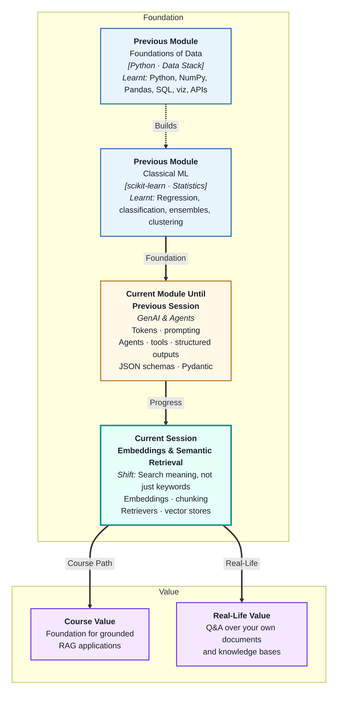
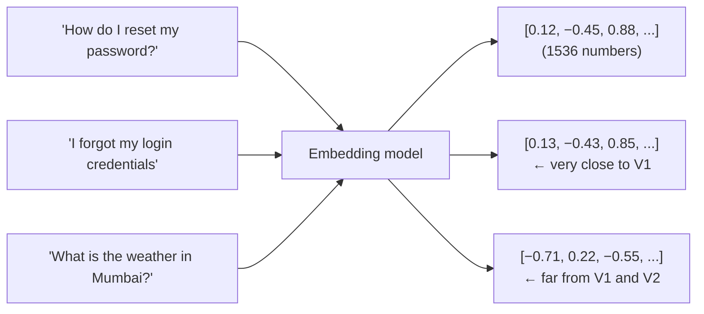
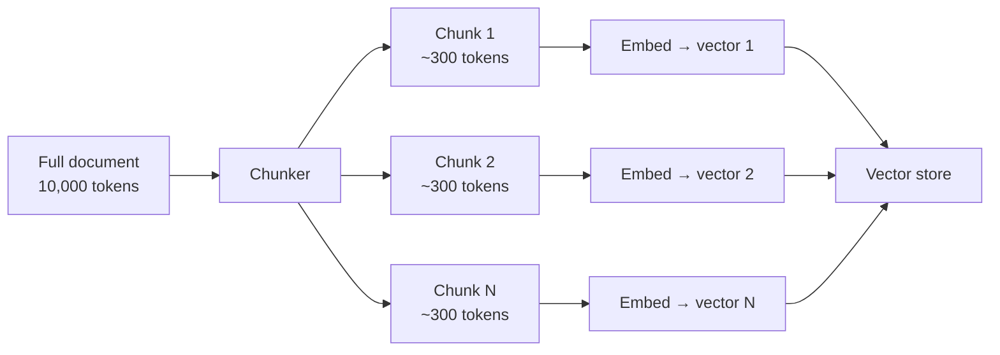
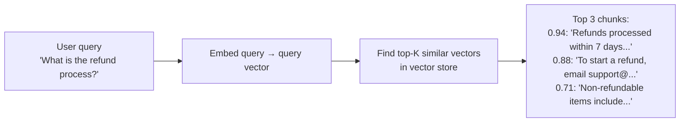
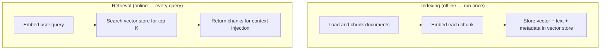
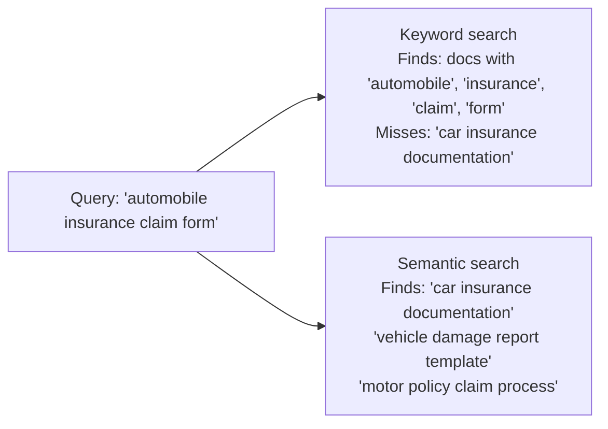

# Embeddings and Semantic Retrieval Systems
---

## Mental Map

## What You'll Learn

In this pre-read, you'll discover:

- What a **text embedding** is — and why it lets computers compare meaning
- How **document chunking** prepares large texts for embedding
- What **retrievers** are and how they find the most relevant chunks for a query
- What a **vector store** does and how it enables fast semantic search
- How semantic search differs from keyword search — and when each is better

---

## A. Text Embeddings — Meaning as Numbers

> 💡 **Analogy:** A map uses (latitude, longitude) coordinates to place every location. Nearby coordinates mean nearby locations. A **text embedding** is a coordinate system for meaning: texts that mean similar things get similar coordinates in a high-dimensional space.

**One-line definition:** A **text embedding** is a list of numbers (a vector) produced by a model trained to place semantically similar texts close together in a high-dimensional space.

**Cosine similarity** measures how close two embedding vectors are:

| Score | Meaning |
|---|---|
| 0.95–1.00 | Near-duplicate or paraphrase |
| 0.80–0.94 | Closely related — same topic |
| Below 0.60 | Likely unrelated |

Embeddings capture **synonyms, paraphrases, and related concepts** automatically — "Car", "automobile", and "vehicle" will embed near each other even though they share no words.

---

## B. Document Chunking — Preparing Text for Embedding

> 💡 **Analogy:** You cannot meaningfully summarise a 300-page book in one sentence. But you can summarise each chapter in one paragraph. **Chunking** is that chapter-by-chapter breakdown — splitting large documents into pieces that can each be embedded meaningfully.

**One-line definition:** **Document chunking** is the process of splitting source documents into smaller segments before embedding — balancing the need for focused, specific embeddings against the need for sufficient context in each retrieved piece.

**Common chunking strategies:**

| Strategy | How | Best for |
|---|---|---|
| Fixed-size with overlap | Every N tokens, overlap of M tokens | General prose |
| By paragraph | Split on double newlines | When each paragraph = one idea |
| By section / heading | Split on `#` headers | Structured documents (policies, manuals) |

**Overlap matters:** A 50-token overlap between adjacent chunks means a concept spanning a boundary appears in both — neither chunk loses it. Typical overlap is 10–20% of chunk size.

**Chunk size guidelines:**

| Too small (< 100 tokens) | Just right (200–500 tokens) | Too large (> 1,000 tokens) |
|---|---|---|
| Loses context | Focused + useful context | Averages out meaning; imprecise retrieval |
| Embedding less meaningful | Good retrieval precision | Wastes context window when injected |

---

## C. Retrievers — Finding the Right Chunks

> 💡 **Analogy:** A librarian who has read every book can fetch the three most relevant pages for any question, even if the exact words never appear in the question. A **retriever** is that librarian — it matches the query's meaning to the stored chunks, not just the words.

**One-line definition:** A **retriever** is a component that takes a query, embeds it, and searches the vector store for the K most semantically similar chunks — returning them as context for the LLM.

**Retriever types:**

| Type | How it works | Best for |
|---|---|---|
| Dense (vector) | Cosine similarity on embeddings | Semantic / paraphrase queries |
| Sparse (BM25) | Keyword frequency matching | Exact term matches, codes, IDs |
| Hybrid | Combine dense + sparse scores | Production systems needing both |

**Choosing K (number of chunks to retrieve):**

- K too small (1–2): May miss the answer if it spans multiple chunks
- K too large (10+): Fills the context window with irrelevant content
- K = 3–5 is a good starting point for most tasks

---

## D. Vector Stores — Storing and Searching Embeddings

> 💡 **Analogy:** A traditional library catalogue searches by title or author keywords. A vector store is a library where every book has been "meaning-fingerprinted" and finding similar books is instant, regardless of whether the titles match.

**One-line definition:** A **vector store** is a database that stores embedding vectors alongside their source texts and provides fast nearest-neighbour search — returning the most semantically similar items to a query vector, even across millions of documents.

**How a vector store is built and used:**

**Vector store options:**

| Tool | Type | Best for |
|---|---|---|
| FAISS | In-memory library | Prototypes, learning |
| Chroma | Local database | Learning + small projects |
| Pinecone | Managed cloud | Production at scale |
| pgvector | PostgreSQL extension | If already using Postgres |

**For this course:** Chroma is recommended — it runs locally, requires no account, and has a clean Python API.

---

## E. Semantic Search vs Keyword Search

> 💡 **Analogy:** Keyword search finds documents containing the exact words you typed. Semantic search finds documents that *mean* what you asked — even when every word is different. "Vehicle registration procedure" and "how to get a car licence" are zero keyword overlap but very high semantic similarity.

**One-line definition:** **Semantic search** retrieves documents by meaning similarity to the query, finding conceptually related content even when no exact words match; **keyword search** requires word-level overlap — each excels in different scenarios.

| Dimension | Keyword search | Semantic search |
|---|---|---|
| Matching basis | Exact word frequency | Meaning similarity |
| Handles synonyms | No | Yes |
| Handles paraphrases | No | Yes |
| Handles product codes / IDs | Yes (exact match) | Less reliable |
| Speed at large scale | Very fast | Fast with ANN index |
| Failure mode | Misses conceptual matches | May retrieve off-topic if poorly trained |

**Hybrid search** combines both approaches — keyword search for exact IDs and product codes, semantic search for conceptual intent. Most production RAG systems use hybrid retrieval.

---

## Practice Exercises

**1. Pattern Recognition**  
Three sentences: "The server response time exceeded 2 seconds", "API latency went above 2000ms", "The network cable was unplugged." (a) Which two would you expect to have the highest embedding similarity? (b) Would a keyword search on "latency" find all three? (c) Would a semantic search on "slow server performance" find all three?

**2. Concept Detective**  
A developer embeds an entire 150-page policy manual as a single vector and searches it with user queries. The system retrieves the "entire manual" as the single matching document and injects all 150 pages into the context window, which immediately overflows. Using sections B and D, explain the two mistakes made and describe the corrected pipeline.

**3. Real-Life Application**  
Design the embedding and retrieval pipeline for three scenarios: (a) a university student asking questions about admission procedures, (b) a technician querying a database of 500 machine error codes and their solutions, (c) a sales rep searching for relevant case studies from a library of 200 customer success stories. For each: chunk strategy, K value, and whether to use pure semantic or hybrid search.

**4. Spot the Error**  
A developer chunks a 300-page HR manual into 3,000-token chunks (no overlap). A user asks "Is carry-forward of leaves allowed?" The answer spans two sentences: the last sentence of chunk 8 and the first sentence of chunk 9. The retriever returns chunk 7, 9, 11 — missing chunk 8 entirely. Using sections B and C, explain why the answer is incomplete and what two changes to the chunking strategy would fix it.

**5. Planning Ahead**  
You are building a semantic search system over 5,000 internal Confluence pages (company wiki). Each page is 500–3,000 words. Describe the full pipeline: (a) chunking strategy and size choice, (b) embedding model to use and why, (c) vector store selection and why, (d) K value for retrieval and reasoning, (e) whether to use keyword, semantic, or hybrid search for a mixed use case (topic questions AND searching by document title).

---

> ✅ **You're done!** You now understand embeddings (meaning as vectors), document chunking (preparing text for precise retrieval), retrievers (finding the right chunks), and vector stores (the infrastructure for semantic search). These are the building blocks for RAG. Next: **Retrieval-Augmented Generation (RAG) Basics**, where you will assemble these pieces into a complete question-answering system grounded in your own documents.
