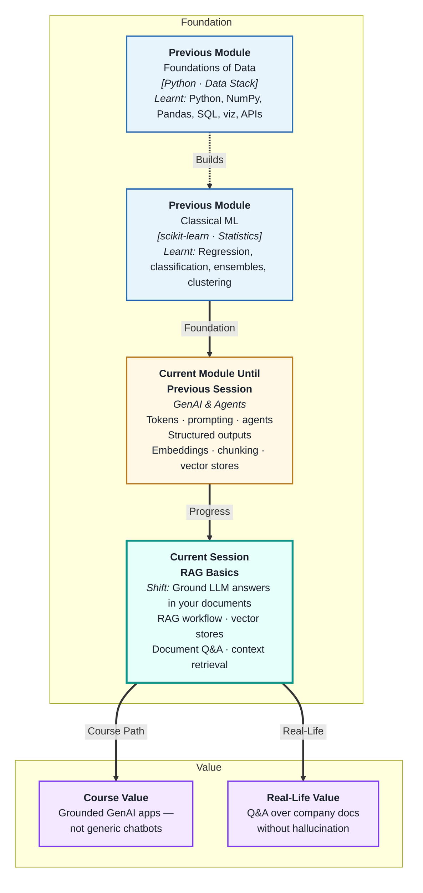
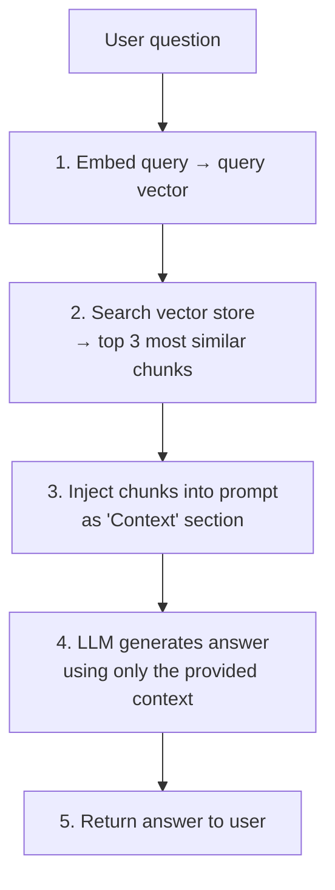
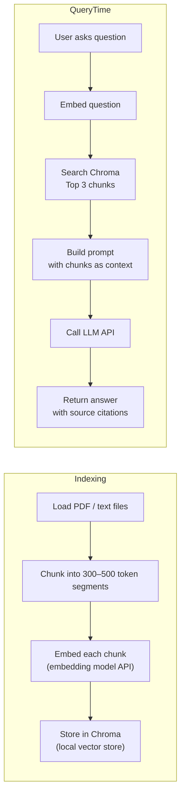

# Retrieval-Augmented Generation (RAG) Basics
---

## Mental Map



## What You'll Learn

In this pre-read, you'll discover:

- What **RAG** is and the core problem it solves
- How the **RAG workflow** connects a vector store to an LLM
- How to build a basic **document-based Q&A** system step by step
- How **context retrieval** works and what makes it succeed or fail
- What to check when RAG answers are wrong

---

## A. What Is RAG and Why Does It Exist?

> 💡 **Analogy:** A student who answers every question from memory alone makes mistakes on obscure topics. A student who first skims the relevant textbook pages before answering is far more accurate. **RAG** gives the LLM that textbook lookup — it retrieves relevant documents first, then generates a grounded answer.

**One-line definition:** **RAG (Retrieval-Augmented Generation)** is an architecture that improves LLM accuracy by retrieving relevant document chunks from a knowledge base and injecting them into the prompt, so the model answers from evidence rather than memory.

**The three problems RAG solves:**

| Problem | Without RAG | With RAG |
|---|---|---|
| Outdated knowledge | Model's knowledge is frozen at training cutoff | Retrieves from live/updated documents |
| Hallucination | Model invents plausible-sounding facts | Answer grounded in retrieved text |
| Private/company knowledge | Model has no company-specific data | Company docs indexed in vector store |

---

## B. The RAG Workflow

> 💡 **Analogy:** A smart librarian receives your question, walks to the right shelf, pulls three relevant pages, and hands them to an expert who reads those pages and answers you. The librarian is the retriever; the expert is the LLM. **The RAG workflow** is that two-stage process.

**One-line definition:** The **RAG workflow** is: embed the query → search the vector store → inject the top-K chunks into the prompt → generate an answer grounded in the retrieved context.



**Two phases you will build:**

| Phase | When | Steps |
|---|---|---|
| **Indexing** (offline) | Once, before queries | Load docs → chunk → embed → store in vector store |
| **Retrieval** (online) | Every user question | Embed query → search → retrieve → inject → generate |

---

## C. Connecting Vector Stores to LLMs

> 💡 **Analogy:** A plumber connects two pipes with a fitting that matches both ends. Connecting a vector store to an LLM requires the same care: the output of one (retrieved text chunks) must fit the input of the other (the LLM's context prompt) in the right format and size.

**One-line definition:** **Connecting a vector store to an LLM** means formatting the retrieved chunks into the prompt's context section with clear delimiters and instructions — so the model knows what is retrieved evidence vs what is the user's question.

**A well-structured RAG prompt:**

```
SYSTEM:
You are a helpful assistant for Acme Corp customers.
Answer ONLY using the context provided below.
If the answer is not in the context, say "I don't have that information."
Do not speculate or add information not in the context.

USER:
Context:
---
[Source: refund_policy.pdf, page 3]
Refunds are processed within 7 business days of the return being received.
---
[Source: refund_policy.pdf, page 4]
Digital downloads are non-refundable under any circumstances.
---

Question: Can I get a refund on a digital product I bought?
```

**Key design choices:**

| Choice | Recommendation | Why |
|---|---|---|
| Include source citations | Yes — `[Source: filename]` | Enables verification; model can attribute |
| Number of chunks (K) | 3–5 | More = higher cost; fewer = may miss answer |
| "Only use context" instruction | Always include | Prevents model from mixing in outside knowledge |
| Delimiter between chunks | `---` or `###` | Helps model understand chunk boundaries |

---

## D. Document-Based Q&A — Building the Basic System

> 💡 **Analogy:** A phone directory lets you find a number without reading the entire directory. A **document-based Q&A** system is the same idea at scale — it makes any large document collection instantly queryable without reading every page.

**One-line definition:** **Document-based Q&A** is an application of RAG where users ask natural language questions and the system returns answers sourced from a specific document collection rather than the LLM's general training.

**The full build in this session — step by step:**



**What you need to track at each step:**

| Step | Check |
|---|---|
| Chunking | Are chunks coherent? Does each contain one complete idea? |
| Embedding | Did the embedding API call succeed? Correct vector dimension? |
| Storage | Was the chunk stored with the correct metadata (source, page number)? |
| Retrieval | Are the top-K chunks actually relevant to the question? |
| Generation | Did the model use only the context? Are citations correct? |

---

## E. Handling Context Retrieval — What Goes Wrong and How to Fix It

> 💡 **Analogy:** A good search engine doesn't just return results — it shows you why each result matched. A **good RAG system** doesn't just retrieve — it retrieves the right chunks, in the right order, in the right size. When it fails, the answer is wrong even if the LLM is doing its job perfectly.

**One-line definition:** **Context retrieval quality** determines RAG answer quality — if the wrong chunks are retrieved, even a perfect LLM will produce wrong or incomplete answers; debugging retrieval is always the first step when RAG fails.

**Common retrieval failures and fixes:**

| Failure | Symptom | Fix |
|---|---|---|
| Wrong chunks retrieved | Answer is on a different topic | Review chunk content; adjust K; try hybrid search |
| Answer spans two chunks | Partial answer returned | Add overlap between chunks |
| Retrieval returns irrelevant chunks | Model says "I don't have that information" when it should | Tune chunk size; add metadata filters |
| Context too long | Model ignores early chunks | Reduce K; re-rank chunks before injection |
| No "use only context" instruction | Model mixes retrieved content with training knowledge | Always include the grounding instruction |

**Quick retrieval evaluation:**

Before worrying about the LLM's answer quality, print the retrieved chunks for a test question and ask: "Would a human, reading only these chunks, be able to answer this question correctly?" If yes, the problem is in context injection or generation. If no, fix the retrieval first.

---

## Practice Exercises

**1. Pattern Recognition**  
A RAG system retrieves these three chunks for the query "What documents do I need to apply for a student visa?": (A) General visa processing timelines. (B) Required documents for student visa applicants. (C) Fee payment process for visa applications. Label each chunk as: relevant, partially relevant, or irrelevant to the query. Then explain what a good retriever should return and what would happen if the LLM only received chunk A and C.

**2. Concept Detective**  
A company's RAG Q&A bot works well for most questions but consistently fails on questions about their newest product launched last month. The knowledge base was indexed three months ago. Using section A, explain which of the three RAG problems is occurring, and describe the two steps needed to fix it (hint: one is a data step, one is a process step).

**3. Real-Life Application**  
Design a document-based Q&A system for each: (a) a university answering questions about its 200-page admissions handbook, (b) a law firm letting associates query 5 years of case briefs, (c) a support team accessing 1,000 resolved ticket summaries. For each: describe the indexing pipeline, the prompt structure, and what the "don't hallucinate" instruction should say specifically for that domain.

**4. Spot the Error**  
A developer builds a RAG prompt that says only: "Here is some context: [chunks]. Answer the user's question." Without explicit grounding instructions, the LLM sometimes ignores the context and answers from its general training knowledge (especially for common topics). The developer doesn't notice because the answers "sound right." Using section C, identify the missing instruction, explain why the LLM defaults to training knowledge, and rewrite the system message.

**5. Planning Ahead**  
You are building a RAG system over your company's 300 internal policy documents. Employees will ask questions ranging from "how many sick days can I take" to "what is the expense reimbursement process." Design the full system: (a) indexing pipeline with chunk size and overlap choices, (b) embedding model, (c) vector store choice and why, (d) K value and reasoning, (e) context injection template, (f) how you would evaluate whether the system is answering correctly, and (g) what you would check first if employees report wrong answers.

---

> ✅ **You're done!** You now understand how RAG connects a vector store to an LLM to answer questions grounded in your own documents — and what to check when answers go wrong. Next: **Productionizing LLM Applications with FastAPI**, where you will wrap everything you've built into a real API endpoint, add logging, manage secrets, and deploy it so real users can call it.
