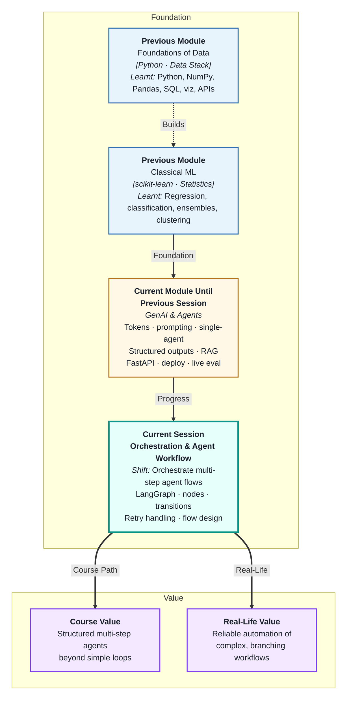
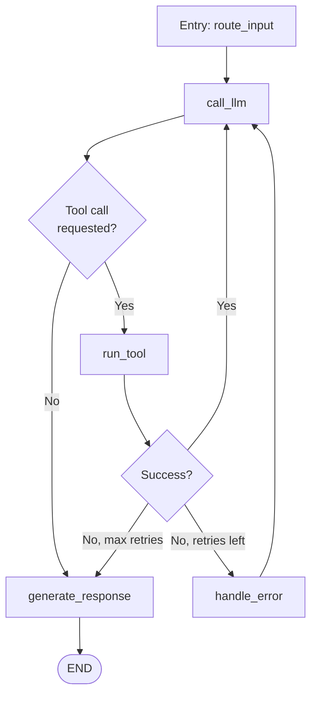
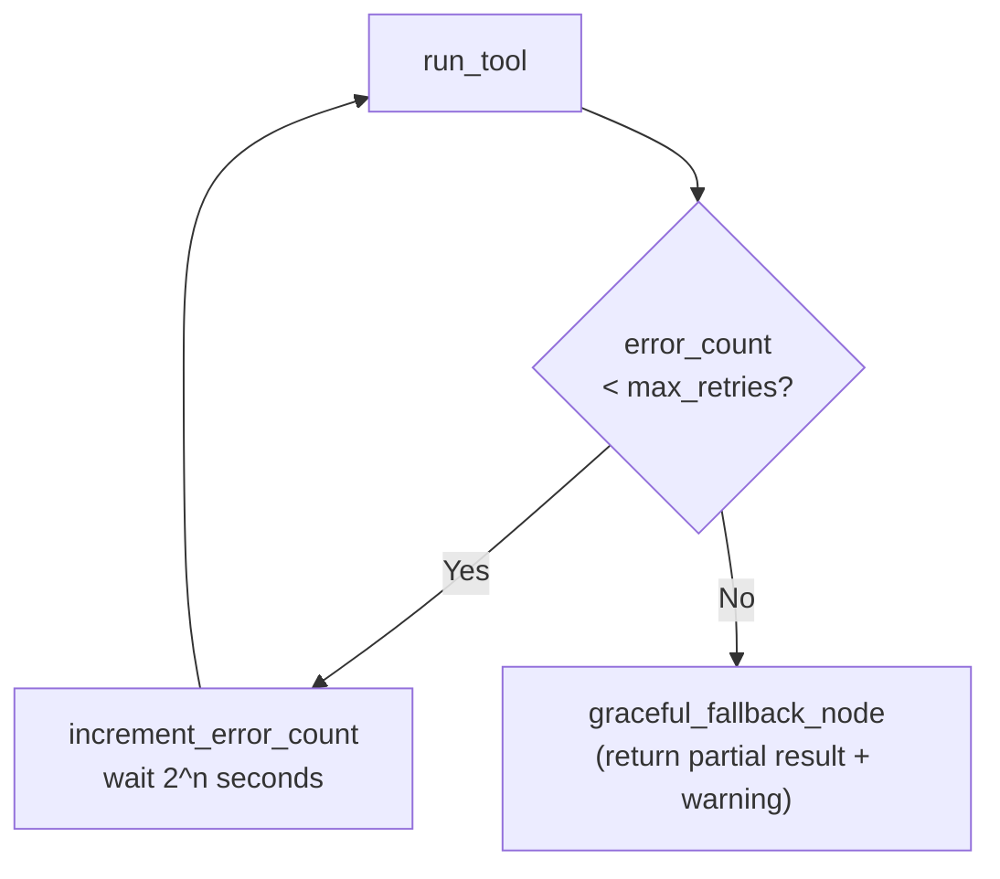
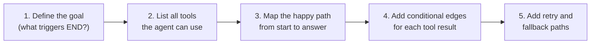

# Orchestration and Agent Workflow Design
---

## Mental Map



## What You'll Learn

In this pre-read, you'll discover:

- Why **orchestration frameworks** like LangGraph exist — and what problem they solve over plain Python loops
- What **nodes and transitions** are in a LangGraph workflow
- How **state** flows through a LangGraph graph
- How to design **retry handling** at the graph level
- How to design a **simple agent flow** that is debuggable, testable, and production-ready

---

## A. Why Orchestration Frameworks Exist

> 💡 **Analogy:** A small kitchen can run with verbal instructions between the chef and one cook. A restaurant with 5 stations (sauté, grill, prep, plating, dessert) needs a written flow chart, clear hand-off rules, and a way to re-route when one station is busy. **Orchestration frameworks** are that flow chart for multi-step agents.

**One-line definition:** An **orchestration framework** provides a structured way to define multi-step agent workflows as graphs — managing state, conditional routing, retries, and parallel execution in a way that plain Python `while` loops cannot cleanly handle.

**What happens when agent complexity grows:**

| Complexity | Plain Python loop | LangGraph |
|---|---|---|
| 1 tool, linear flow | Works fine | Overkill |
| 3+ tools, conditional branches | Gets messy fast | Clean graph definition |
| Retry on failure with different path | Complex if/else | Built-in conditional edges |
| Parallel tool calls | Requires async + manual state | Parallel nodes natively |
| Debug which step failed | Print statements everywhere | Per-node state inspection |
| Human-in-the-loop approval | Very hard to add cleanly | Interrupt nodes |

**When to introduce LangGraph:**

Use plain Python loops for simple single-tool agents. Switch to LangGraph when your workflow has more than 2–3 conditional paths, needs structured retry handling, or requires branching (e.g. "if tool result is an error, take a different path than if it succeeds").

---

## B. LangGraph Basics — Graphs, Nodes, and State

> 💡 **Analogy:** A flowchart has boxes (steps) connected by arrows (transitions). **LangGraph** is a code-level flowchart: each step is a Python function (a node), the arrows are edges that connect them, and a shared dictionary (the state) flows through every box, getting updated at each step.

**One-line definition:** In **LangGraph**, a graph is a directed set of nodes (Python functions) connected by edges (transitions) that route execution based on the current state — which is a typed dictionary shared across all nodes.

**Core concepts:**

| Concept | Description | Example |
|---|---|---|
| **State** | Typed dictionary passed through every node | `{"messages": [...], "tool_result": None, "step": 0}` |
| **Node** | Python function: takes state, returns updated state | `def call_llm(state): ...` |
| **Edge** | Connects one node to the next | `graph.add_edge("call_llm", "run_tool")` |
| **Conditional edge** | Chooses next node based on state | `if state["error"]: → retry_node` |
| **Entry point** | First node to execute | `graph.set_entry_point("start")` |
| **END** | Terminal state; execution stops | `graph.add_edge("respond", END)` |

**Minimal LangGraph structure:**



---

## C. Nodes and Transitions in Practice

> 💡 **Analogy:** Each station in a hospital has one job: triage → consultation → tests → diagnosis → prescription. Handing a patient "off the charts" to skip triage is not allowed. **LangGraph nodes** enforce the same discipline — each node does exactly one job, and transitions define exactly which node handles what next.

**One-line definition:** A **node** in LangGraph is a plain Python function that receives the current state dict and returns a dict of updates — keeping each step modular, independently testable, and easily swappable.

**Node implementation pattern:**

```python
from typing import TypedDict, Annotated
from langgraph.graph import StateGraph, END

class AgentState(TypedDict):
    messages: list[dict]
    tool_result: str | None
    error_count: int
    final_answer: str | None

def call_llm(state: AgentState) -> dict:
    """Call the LLM with current messages. Return tool call or final answer."""
    response = client.chat.completions.create(
        model="gpt-4o",
        messages=state["messages"]
    )
    msg = response.choices[0].message
    # Return only the fields we're updating
    return {"messages": state["messages"] + [{"role": "assistant", "content": msg.content}]}

def route_after_llm(state: AgentState) -> str:
    """Conditional edge: decide which node to go to next."""
    last_msg = state["messages"][-1]
    if "tool_call" in last_msg.get("content", ""):
        return "run_tool"
    return "respond"
```

**Key principles for node design:**

| Principle | Why |
|---|---|
| One responsibility per node | Easy to test, replace, and debug |
| Return only what changes | Clean state updates; no accidental overwrites |
| No side effects in conditional edge functions | They should only read state, not modify it |
| Each node should be independently callable in a test | Makes unit testing straightforward |

---

## D. Retry Handling at the Graph Level

> 💡 **Analogy:** An airport gate agent who encounters a boarding problem does not just re-scan the same ticket repeatedly — they route the passenger to a different queue (customer service) after two failed attempts. **Graph-level retry handling** routes to a recovery node rather than blindly repeating the same failing node.

**One-line definition:** **Graph-level retry handling** in LangGraph means designing explicit error paths — conditional edges that route to a dedicated error-handling node when a tool fails, with a counter in the state that triggers a different action after N failures.

**Retry graph pattern:**



**State fields for retry tracking:**

```python
class AgentState(TypedDict):
    messages: list[dict]
    tool_result: str | None
    error_count: int        # Incremented by error handler node
    last_error: str | None  # Stored for debugging and logging
    final_answer: str | None
```

**What the fallback node should do:**

- Return the best partial result the agent achieved so far
- Add a clear message explaining why it stopped: "Tool unavailable after 3 attempts"
- Log the full error chain (each error stored in state)
- Never return an empty response — always give the user something actionable

---

## E. Designing a Simple Agent Flow

> 💡 **Analogy:** A building's fire evacuation plan is drawn before there is a fire — not improvised during one. **Agent flow design** means drawing the graph before writing a single node: identify the states, the decisions, and the paths for both success and failure.

**One-line definition:** **Agent flow design** means mapping the full graph on paper before coding — identifying every node, every conditional edge, and every terminal state (success, partial result, and failure) so nothing is left to chance.

**Design process — 5 steps:**



**Example — Simple Research Agent design:**

| Node | Input from state | Action | Output to state |
|---|---|---|---|
| `parse_question` | `raw_input` | Extract search intent | `search_query` |
| `search_web` | `search_query` | Call search tool | `search_results` or `error_count++` |
| `synthesise_answer` | `search_results` | Call LLM to summarise | `final_answer` |
| `handle_error` | `last_error`, `error_count` | Format fallback response | `final_answer` (partial) |

**Before writing code — the design checklist:**

- [ ] Can I describe every node in one sentence?
- [ ] Is there a terminal state for success?
- [ ] Is there a terminal state for failure (max retries or unrecoverable error)?
- [ ] Does every conditional edge have a default path?
- [ ] Does the state carry enough information to resume from any node?

---

## Practice Exercises

**1. Pattern Recognition**  
Draw (in words or a simple diagram) the LangGraph graph for the following flow: "The agent receives a customer complaint. It first classifies the complaint as billing, shipping, or technical. For billing and technical, it searches the knowledge base. For shipping, it calls the order tracking API. In all cases, it generates a response using the retrieved context." Define the nodes, edges, and conditional routing logic.

**2. Concept Detective**  
A LangGraph agent has a `call_external_api` node that sometimes times out. A developer adds retry logic inside the Python function itself using a `for` loop — retrying up to 5 times before raising an exception. The exception crashes the entire graph run and loses all state. Using section D, explain what was done wrong, how the retry should be structured at the graph level instead, and what state fields are needed to implement it cleanly.

**3. Real-Life Application**  
Design the full LangGraph graph for a job application screener that: (a) receives a resume text, (b) extracts candidate details (name, skills, experience years) using a structured output node, (c) classifies fit as strong/moderate/weak, (d) if strong, queries a database for available matching roles, (e) generates a personalised outreach message. Define all nodes, the AgentState TypedDict, and all conditional edges.

**4. Spot the Error**  
A developer's LangGraph agent has a `generate_report` node that modifies `state["messages"]` directly (side effect) AND returns updated state. When the node is re-run after a retry, `messages` has been mutated twice — causing duplicate content in the context. Using section C, explain the design mistake, state the principle that was violated, and show how to rewrite the node return to avoid it.

**5. Planning Ahead**  
You are designing a LangGraph-based email triage agent that processes 200 incoming emails per day. It must: classify each email (urgent / non-urgent), for urgent emails search a knowledge base for relevant policy information, draft a reply using the retrieved context, and flag emails where confidence is low for human review. Design the full agent: AgentState definition, all nodes with their single-sentence responsibility, conditional edges, retry handling for the knowledge base search, and the human-in-the-loop interrupt point.

---

> ✅ **You're done with Module 3!** You now understand the full GenAI stack — from tokens and prompting all the way through agents, structured outputs, RAG, FastAPI deployment, and LangGraph orchestration. You are ready to build production-grade AI applications that plan, act, retrieve, validate, and self-correct. Congratulations on completing the module — the tools you have learned are the foundation of every serious LLM application being built today.
