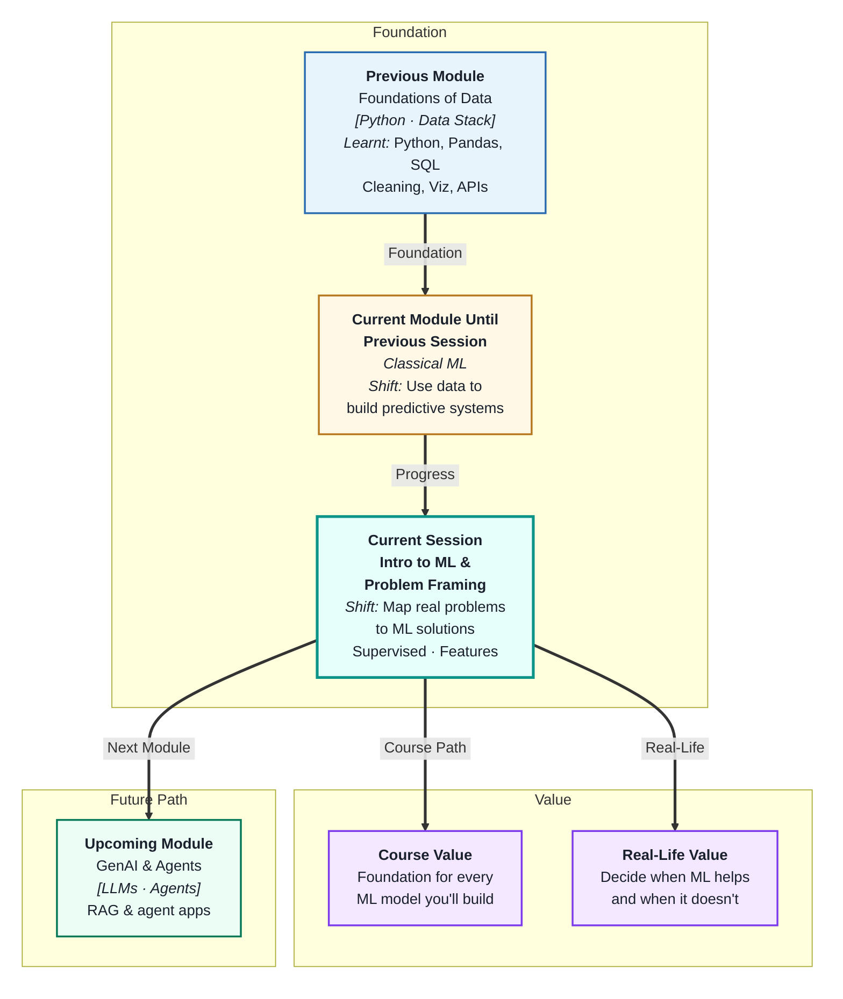
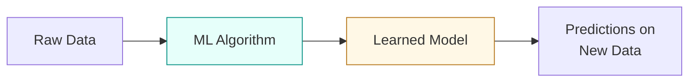
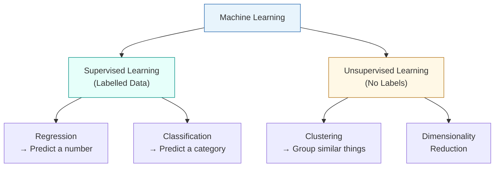
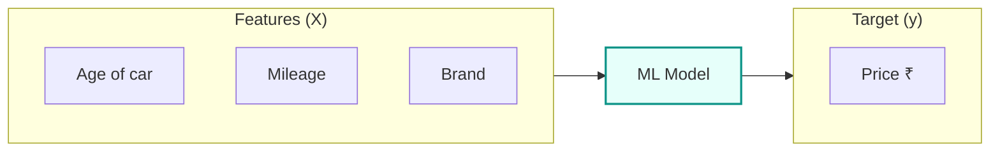

# Introduction to Machine Learning and Problem Framing
---

## Mental Map

---

## What You'll Learn

In this pre-read, you'll discover:

- What **machine learning** is and how it differs from traditional programming
- The difference between **supervised** and **unsupervised** learning
- When to use **regression** vs **classification**
- What **features** and **target variables** are and why they matter
- How to map a real business problem to the right ML approach

---

## A. What Is Machine Learning?

> 💡 **Analogy:** Imagine teaching a child to sort fruit. Instead of giving a rulebook ("if it's round and red, it's an apple"), you show them hundreds of examples and let them figure out the pattern. Machine learning works exactly the same way — you show the computer examples, and it learns the rules itself.

**One-line definition:** Machine learning is a way to train computers to find patterns in data and make predictions — without being explicitly programmed for every rule.

**Traditional programming vs machine learning:**

| Approach | Input | Process | Output |
|---|---|---|---|
| Traditional | Data + Rules | Fixed logic | Answers |
| Machine Learning | Data + Answers | Learns rules | Predictions on new data |

**Why it matters:** ML lets you solve problems that are too complex to write rules for — like spotting spam email, predicting house prices, or detecting fraud.

---

## B. Supervised vs Unsupervised Learning

> 💡 **Analogy:** Supervised learning is like studying with an answer key — every practice question has a correct answer, and you learn from those. Unsupervised learning is like sorting a pile of mixed coins with no labels — you group them by shape, size, and colour on your own.

**One-line definition:** Supervised learning trains on labelled data (input + correct answer); unsupervised learning finds structure in data with no labels.

| Type | Has Labels? | Goal | Example |
|---|---|---|---|
| Supervised | Yes | Predict outcomes | Predict house price |
| Unsupervised | No | Discover structure | Group customers |

---

## C. Regression vs Classification

> 💡 **Analogy:** Regression is like guessing the exact temperature tomorrow — you predict a continuous number. Classification is like deciding what to wear — the answer is a category ("coat", "t-shirt", "raincoat").

**One-line definition:** Regression predicts a numeric value; classification predicts which group or label something belongs to.

**How to tell which one you need:**

| Question Type | Task | Output |
|---|---|---|
| "How much?" / "How many?" | Regression | A number (e.g. ₹45,000) |
| "Which one?" / "Will it?" | Classification | A category (e.g. Yes/No) |

**Examples:**
- Will this customer churn? → **Classification** (Yes / No)
- What will this customer spend next month? → **Regression** (₹ amount)
- Is this email spam? → **Classification**
- How long will delivery take? → **Regression**

---

## D. Features and Target Variables

> 💡 **Analogy:** Think of buying a used car. The **features** are everything you observe — age, mileage, brand, colour, number of owners. The **target** is what you're trying to predict — the price. The model learns how features influence the target.

**One-line definition:** **Features** are the input columns your model learns from; the **target variable** is the output column your model tries to predict.

**Rules of thumb:**
- Features = columns you feed **into** the model
- Target = column you want the model to **predict**
- You must never include the target as a feature — that's cheating!

---

## E. Mapping Business Problems to ML

> 💡 **Analogy:** Before cooking, you check what ingredients you have and what you want to make. Before building an ML model, you do the same — check your data and define what you want to predict.

**One-line definition:** Problem framing means translating a real-world goal into a clear ML task with a defined input, output, and success measure.

**4-question framework:**

| Question | What you're defining |
|---|---|
| What do I want to predict? | Your target variable |
| What data do I have? | Your features |
| How will I measure success? | Your evaluation metric |
| Is this regression or classification? | Your task type |

**Common mistake:** Jumping to a model before clearly defining the problem. This leads to building something that technically works but doesn't solve the actual business need.

---

## Practice Exercises

**1. Pattern Recognition**
Look at these four business questions. Identify each as regression or classification — and explain why:
- "Will a loan applicant default?"
- "What will the next month's electricity bill be?"
- "Which product category will a user buy next?"
- "How many support tickets will we get tomorrow?"

**2. Concept Detective**
A team builds an ML model to predict customer churn. They include the column `churned_last_year` as a feature. The model scores 99% accuracy. What's wrong here?

**3. Real-Life Application**
List 3 everyday products or services that use machine learning under the hood. For each, describe: (a) what the features likely are, (b) what the target variable is, and (c) whether it's regression or classification.

**4. Spot the Error**
A data scientist says: "We have no labelled data, so we'll just use supervised learning with the raw data anyway." What is wrong with this statement?

**5. Planning Ahead**
You work at a food delivery app. You want to reduce late deliveries. Frame this as an ML problem: define the target variable, list 5 possible features, and decide whether it's regression or classification.

---

> ✅ **You're done!** You now understand the core ideas behind machine learning — what it is, how it differs from traditional programming, and how to frame real problems into ML tasks. These concepts are the foundation of every model you'll build in the sessions ahead. Next, you'll learn how to prepare and clean your data so it's ready for training.
