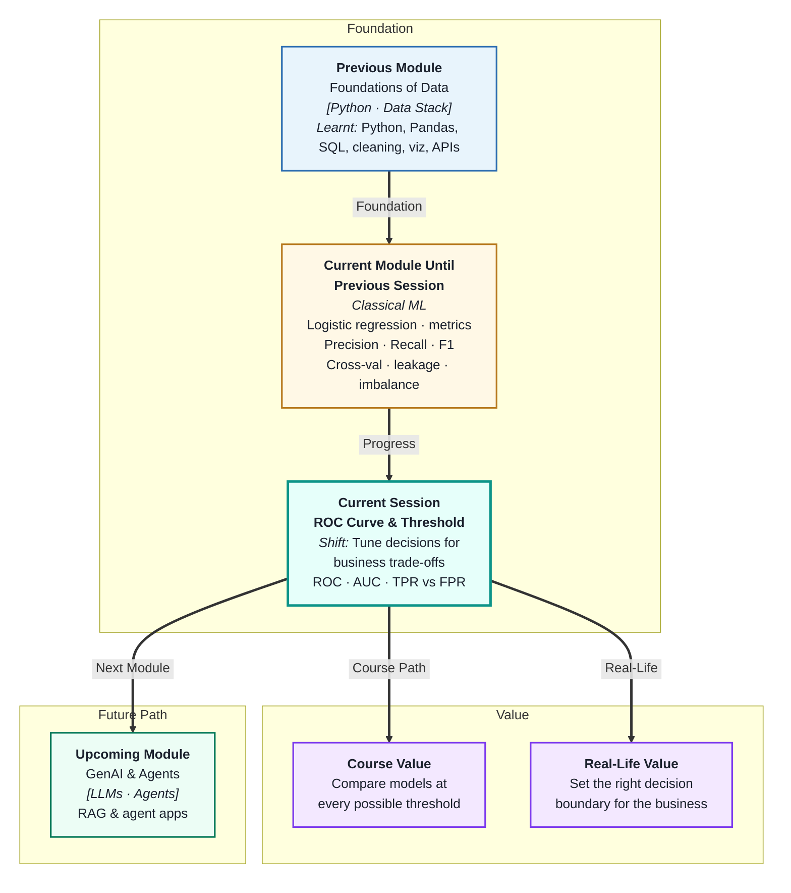
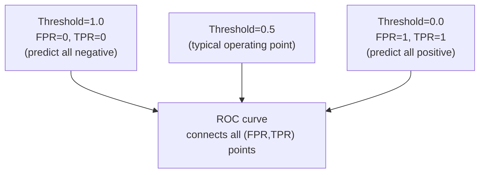
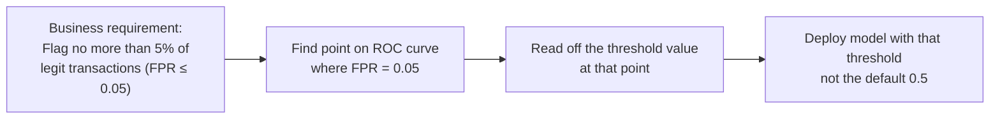
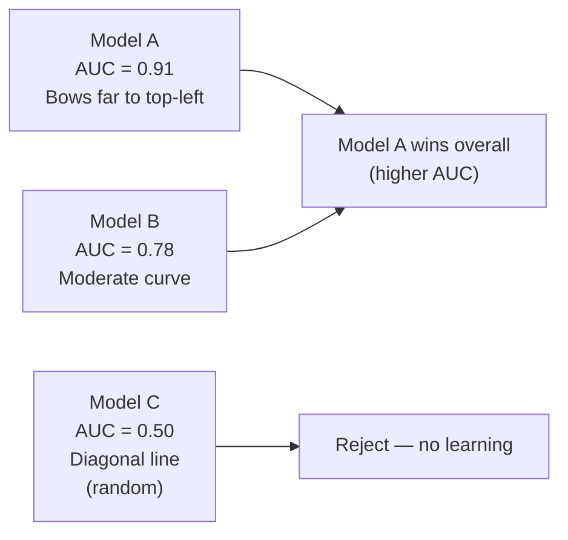

# ROC Curve and Threshold Optimization
---

## Mental Map



## What You'll Learn

In this pre-read, you'll discover:

- What the **ROC curve** shows and how to read it
- The difference between **True Positive Rate (TPR)** and **False Positive Rate (FPR)**
- How the **AUC score** summarises a model's discriminative ability in a single number
- How to use the ROC curve to **tune the threshold** for a specific business objective
- How to use ROC curves to **compare multiple models** fairly

---

## A. TPR and FPR — The Two Axes

> 💡 **Analogy:** A metal detector at an airport catches 95% of all weapons (TPR) but also false-alarms on 20% of innocent passengers (FPR). A better detector catches 95% of weapons but only false-alarms on 5% of passengers. The **ROC curve** plots every detector setting on these two axes simultaneously.

**One-line definition:** **True Positive Rate (TPR/Recall)** measures what fraction of real positives the model caught; **False Positive Rate (FPR)** measures what fraction of real negatives the model incorrectly flagged.

```
TPR (Recall) = TP / (TP + FN)   → "Of all actual positives, how many did we catch?"
FPR          = FP / (FP + TN)   → "Of all actual negatives, how many did we falsely flag?"
```

| Desired | TPR | FPR | Real meaning |
|---|---|---|---|
| High recall | High (↑) | Higher (↑) | Catch more positives, but more false alarms |
| Few false alarms | Lower (↓) | Low (↓) | Miss some positives, but very precise |

**The tradeoff:** Lowering the threshold increases TPR *and* FPR together. Raising it decreases both. The ROC curve visualises this tradeoff at every possible threshold from 0 to 1.

---

## B. The ROC Curve — Visualising All Thresholds

> 💡 **Analogy:** Instead of testing a security system at one sensitivity level and reporting that result, an engineer plots performance at every possible sensitivity setting. That full chart lets the customer pick the setting that fits their security-vs-inconvenience budget. The **ROC curve** is that chart for ML classifiers.

**One-line definition:** The **ROC curve** (Receiver Operating Characteristic) plots TPR on the Y-axis against FPR on the X-axis at every possible classification threshold — showing the complete tradeoff between catching positives and generating false alarms.



**Reading the curve:**

| Region on ROC curve | Meaning |
|---|---|
| Top-left corner (0,1) | Perfect model — 100% TPR, 0% FPR |
| Diagonal line (y=x) | Random guessing — no discriminative ability |
| Above diagonal | Better than random |
| Below diagonal | Worse than random (inverted predictions) |
| Steep initial rise | Model ranks true positives at the top of its confidence list |

A "good" ROC curve bows as far toward the top-left as possible. The further from the diagonal, the better the model distinguishes between classes.

---

## C. AUC Score — One Number to Rule Them All

> 💡 **Analogy:** Two road maps can both show all the same destinations, but one clearly covers more useful territory. **AUC** measures how much "useful territory" the ROC curve covers — it is the area under the curve, from 0 to 1.

**One-line definition:** **AUC (Area Under the ROC Curve)** is a single number from 0 to 1 that summarises the overall discriminative ability of a classifier — higher AUC means the model is better at separating positive from negative cases at all thresholds.

| AUC value | Interpretation |
|---|---|
| 1.00 | Perfect classifier |
| 0.90–0.99 | Excellent |
| 0.80–0.89 | Good |
| 0.70–0.79 | Fair |
| 0.60–0.69 | Poor |
| 0.50 | Random guessing — no better than coin flip |
| < 0.50 | Worse than random (flip predictions) |

**What AUC actually measures:**

AUC = probability that the model ranks a randomly chosen positive case higher than a randomly chosen negative case.

AUC = 0.85 means: "If I pick one fraudulent transaction and one legitimate transaction at random, there is an 85% chance the model gives the fraud a higher risk score."

**AUC vs F1:**

| | AUC | F1 |
|---|---|---|
| Depends on threshold? | No — averages all thresholds | Yes — computed at one threshold |
| Good for model comparison? | Yes | Only at a fixed threshold |
| Good for choosing operating point? | No — use the curve for that | Yes |

---

## D. Threshold Tuning Using the ROC Curve

> 💡 **Analogy:** An alarm system can be set to "sound at any movement" or "sound only for human-sized movement." The ROC curve shows you what you gain (TPR) and what you pay (FPR) at every setting — so you can choose deliberately rather than arbitrarily.

**One-line definition:** **Threshold tuning** means selecting the classification threshold that achieves the business-required balance between TPR and FPR, using the ROC curve as the guide.

**Threshold selection strategies:**

| Goal | Strategy | How |
|---|---|---|
| Maximise recall (catch all positives) | Set low threshold | Move to top-right of ROC curve |
| Minimise false positives | Set high threshold | Move to bottom-left of ROC curve |
| Balance TPR and FPR equally | Youden's J point | Find point maximising (TPR − FPR) |
| Meet a business SLA (e.g. "flag at most 5% of customers") | Fixed FPR constraint | Find threshold where FPR = 0.05 |



**Important:** The threshold you deploy in production is a *business* decision backed by the ROC curve — not a default. Different thresholds for the same model create very different operational realities.

---

## E. Comparing Models Using ROC Curves

> 💡 **Analogy:** Two job candidates both interview well for some questions and poorly for others. To compare them fairly, you need to see their overall profile — not just how they did on one question. Overlaying ROC curves does exactly that for models: it shows which one is generally better, not just at one threshold.

**One-line definition:** **Model comparison using ROC** means plotting multiple ROC curves on the same axes and comparing their AUC values — the model with the higher AUC is the better discriminator regardless of threshold.



**When to use AUC for comparison:**

| Scenario | Use AUC | Why |
|---|---|---|
| Comparing algorithms at any threshold | Yes | Threshold-independent |
| Comparing models on imbalanced data | Yes | Robust to class imbalance |
| Deciding the operating threshold for production | No — use the curve | AUC is an aggregate, not a threshold |

**Overlapping curves:** If two models have similar AUC but different curve shapes, choose based on where you plan to operate. If you need high recall, prefer the model with a higher curve in the left portion of the plot (low FPR region). If you need broad coverage, prefer the model with higher AUC across the whole curve.

---

## Practice Exercises

**1. Pattern Recognition**  
A fraud model at threshold=0.5 has TPR=0.62, FPR=0.08. At threshold=0.3, it has TPR=0.81, FPR=0.22. Using section D, explain what changed when the threshold dropped, what the business cost is of the new FPR, and which threshold you would choose for a fraud prevention team that has capacity to review 500 alerts per day from 10,000 daily transactions.

**2. Concept Detective**  
Model A has AUC=0.85. Model B has AUC=0.83. A colleague says "Model A is clearly better — let's always use it." Using section E, explain two scenarios where you might still prefer Model B in production, despite its lower AUC.

**3. Real-Life Application**  
Describe the threshold selection process for three applications: (a) a factory defect detector where missed defects cost ₹50,000 each but false alarms cost ₹200 each, (b) a news recommendation system that must not show offensive content, (c) an emergency patient triage model. For each: state the priority (high TPR or low FPR), say which direction to shift the threshold, and explain the operational consequence of getting it wrong.

**4. Spot the Error**  
A data scientist trains a logistic regression model, computes AUC=0.92, and deploys it with threshold=0.5. Three months later, the fraud team complains they are overwhelmed by false positives. Using sections B and D, explain what the data scientist should have done before choosing the threshold, and what the deployment step should have looked like.

**5. Planning Ahead**  
You are building a loan default prediction model and you need to compare three algorithms (Logistic Regression, Ridge, and a third you have not learned yet). You know the business requires false positive rate ≤ 10% (flagging no more than 10% of good loans as risky). Design the evaluation plan: how you would generate the ROC curve for each model, what AUC values you would compare, how you would select the deployment threshold, and what you would show the credit risk team in a one-page evaluation summary.

---

> ✅ **You're done!** You can now read ROC curves, interpret AUC, and choose thresholds deliberately based on business requirements — not defaults. Next: **Decision Trees**, where you will learn a completely different type of model — one that makes decisions by asking a sequence of yes/no questions about the data, and can be read almost like a flowchart.
