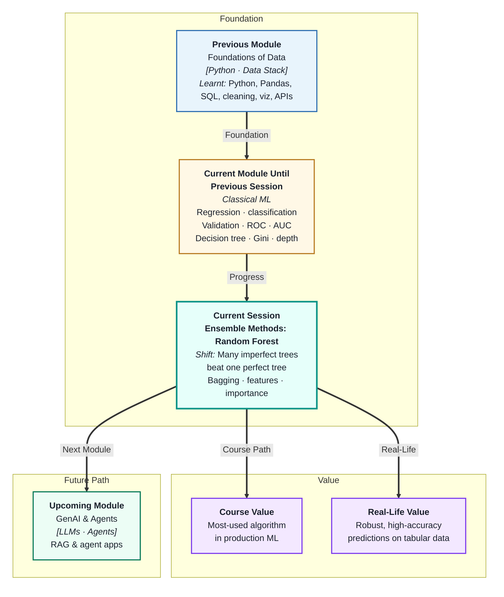
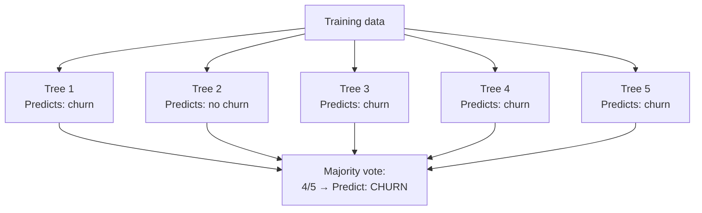
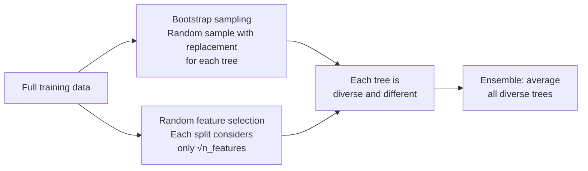
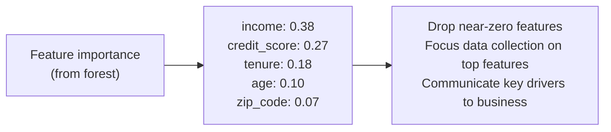

# Ensemble Methods: Random Forest
---

## Mental Map



## What You'll Learn

In this pre-read, you'll discover:

- What an **ensemble method** is and why combining models beats any single model
- How **Random Forest** uses bagging and random feature selection to build diverse trees
- How to read and use **feature importance** scores from a Random Forest
- What **model robustness** means and why Random Forest achieves it
- How Random Forest compares to a single decision tree across multiple dimensions

---

## A. The Ensemble Idea — Wisdom of the Crowd

> 💡 **Analogy:** Ask 100 people to guess the weight of a pumpkin. Most guesses will be off, but the *average* of all guesses is remarkably close to the true weight — far more accurate than any single individual. **Ensemble methods** apply this to ML: average many imperfect models and the errors cancel out.

**One-line definition:** An **ensemble method** combines the predictions of multiple independently trained models — averaging (regression) or voting (classification) — to produce a prediction that is more accurate and more stable than any single model.



**Why does averaging help?**

Each model has its own random errors. When models are *diverse* (not all making the same errors), those errors are uncorrelated — they cancel out when aggregated. The signal is reinforced; the noise is suppressed.

**Two key ensemble strategies:**

| Method | Strategy | Example algorithms |
|---|---|---|
| **Bagging** | Train models independently on different data samples | Random Forest |
| **Boosting** | Train sequentially — each model corrects previous errors | XGBoost, AdaBoost |

Random Forest uses bagging — all trees are trained independently, which makes it easy to parallelise.

---

## B. How Random Forest Works — Bagging + Random Features

> 💡 **Analogy:** A research team produces a better report when each member independently researches a random subset of sources (no one is copying anyone else). **Random Forest** creates diversity in two ways: different training samples and different features per tree — so each tree develops its own perspective.

**One-line definition:** **Random Forest** builds many decision trees, each trained on a random bootstrap sample of the data and using a random subset of features at each split — then aggregates all predictions by majority vote (classification) or averaging (regression).

**The two sources of randomness:**



| Source of randomness | What it does |
|---|---|
| Bootstrap sampling | Each tree sees ~63% of training rows (different rows) |
| Random feature subset | Each split can only use a random subset of features |

**Why random features matter:**

Without random feature selection, all trees would use the same strong features at the root (e.g. always split on `income` first) — producing correlated trees whose errors do *not* cancel. Random feature selection forces different trees to find different patterns.

**Key hyperparameters:**

| Parameter | Meaning | Default |
|---|---|---|
| `n_estimators` | Number of trees | 100 |
| `max_features` | Features at each split | √n_features (classification) |
| `max_depth` | Max depth of each tree | None (unlimited) |
| `min_samples_leaf` | Min samples in each leaf | 1 |

Start with `n_estimators=100` and the defaults. More trees always help — up to a point of diminishing returns (usually plateaus around 300–500).

---

## C. Feature Importance — What the Forest Learned

> 💡 **Analogy:** A management consultant reviewing 100 project decisions checks which factor — budget, timeline, or team size — showed up in the critical decisions most often. **Feature importance** does the same: it checks which features the trees used most for their most impactful splits.

**One-line definition:** **Feature importance** from a Random Forest measures how much each feature contributed to reducing impurity across all splits in all trees — higher importance means the feature was used more often and at more impactful splits.



**How to use feature importance:**

| Use case | Action |
|---|---|
| Feature selection | Drop features with importance near zero |
| Business reporting | "The top 3 factors driving churn are…" |
| Data collection priority | Invest in better data for top-importance features |
| Model debugging | Check if unexpected feature is top-ranked — possible leakage |

**Caution:** Random Forest feature importance is biased toward high-cardinality features (features with many unique values, like IDs). For unbiased importance estimates, use **permutation importance** (available in scikit-learn as `permutation_importance`).

---

## D. Model Robustness — Why Random Forest Generalises Better

> 💡 **Analogy:** A single expert's opinion can be brilliant or wildly wrong. A panel of diverse experts rarely produces catastrophically wrong consensus — individual errors are averaged out. **Robustness** in ML means the model's performance does not collapse on slightly different data.

**One-line definition:** **Model robustness** means the model's performance is stable and consistent across different samples of the data — Random Forest achieves this because individual trees' errors are uncorrelated and cancel out in the vote.

**Single tree vs Random Forest — key differences:**

| Dimension | Single Decision Tree | Random Forest |
|---|---|---|
| Variance | High — very sensitive to training data | Low — errors average out |
| Overfitting | Severe without depth limits | Resistant — diversity reduces overfit |
| Feature importance | From one split path | Averaged across all trees — more reliable |
| Interpretability | High — readable rules | Low — hundreds of trees, no single rule |
| Training time | Fast | Slower (n_estimators × tree training time) |
| Prediction accuracy | Moderate | Typically much higher |

**Out-of-Bag (OOB) evaluation:**

Because each tree only sees ~63% of the data (bootstrap sample), the remaining ~37% (out-of-bag rows) can be used as a free validation set — without needing a separate validation split.

```
OOB score = average accuracy of each tree on its out-of-bag rows
```

OOB score is often close to cross-validation performance and is computed automatically by setting `oob_score=True`.

---

## E. Comparing with Decision Trees — When to Use Which

> 💡 **Analogy:** A hammer is perfect for nails and overkill for a thumbtack. A Swiss Army knife handles most situations but is bulkier. **Choosing between a single tree and Random Forest** means asking: do you need the simplicity and explainability of one tool, or the robustness and accuracy of many?

**One-line definition:** Choose a **single decision tree** when interpretability is paramount and the model must be explained rule-by-rule; choose **Random Forest** when accuracy and robustness matter more and some loss of interpretability is acceptable.

| Criterion | Decision Tree | Random Forest |
|---|---|---|
| Accuracy | Lower | Higher |
| Overfitting risk | High | Low |
| Explainability | Full rule-by-rule | Feature importance only |
| Training speed | Fast | Slower (100× more trees) |
| Prediction speed | Fast | Moderate (averages 100 trees) |
| Hyperparameter tuning | 2–3 parameters | More parameters |
| Best use case | Regulated decisions, audit trails | Production models, tabular data |

**Random Forest in production reality:**

Random Forest is one of the most widely deployed ML algorithms for tabular data. Before deep learning dominated image and text tasks, it was often the first algorithm a practitioner would try after linear regression. It requires minimal preprocessing (no scaling needed), handles mixed feature types naturally, and produces reliable feature importances.

---

## Practice Exercises

**1. Pattern Recognition**  
A Random Forest with 10 trees makes the following individual tree predictions on one customer: `churn, churn, no-churn, churn, churn, no-churn, churn, no-churn, churn, churn`. What is the final forest prediction, and what is the "confidence" (as a fraction of trees)? If you added 90 more trees and 45 of them predicted "no churn," what would the final prediction be?

**2. Concept Detective**  
A single decision tree gives validation accuracy = 0.71. A Random Forest with 100 trees gives validation accuracy = 0.88. Both are trained on the same data. Using sections A, B, and D, explain specifically what the forest did differently that produced the improvement. Identify the two randomisation mechanisms and explain which one solved the variance problem.

**3. Real-Life Application**  
A bank uses a Random Forest to rank loan applications by risk. The feature importances are: `debt_to_income: 0.41, credit_score: 0.29, loan_amount: 0.18, age: 0.07, gender: 0.05`. A compliance officer flags `gender` in the importances. Using section C, explain what feature importance means, whether its presence indicates the model is discriminatory, and what additional investigation you would do.

**4. Spot the Error**  
A data scientist sets `n_estimators=1000, max_depth=None` and trains a Random Forest. It achieves excellent OOB score = 0.92 but takes 12 hours to train. They propose using this model in a real-time scoring pipeline with 50 ms latency budget. Using sections B and E, identify the practical problem and propose two adjustments to make the model production-viable.

**5. Planning Ahead**  
You are comparing a decision tree and a Random Forest for a hospital readmission prediction model. Patients who are incorrectly predicted as "low risk" and sent home (false negatives) face potentially life-threatening consequences. Design the comparison plan: which metric to prioritise, what `n_estimators` and `max_depth` starting points to use for the forest, how you would use feature importance to have a clinical conversation with doctors, and what you would sacrifice (accuracy or interpretability) if a regulator required a fully explainable model.

---

> ✅ **You're done!** You now understand why combining many diverse, imperfect trees produces a far more robust and accurate model than any single tree. Random Forest is one of the most important and widely used algorithms in applied ML. Next: **Clustering and Unsupervised Learning**, where you will shift gears entirely — learning how to find hidden structure in data when you have *no labels at all*.
