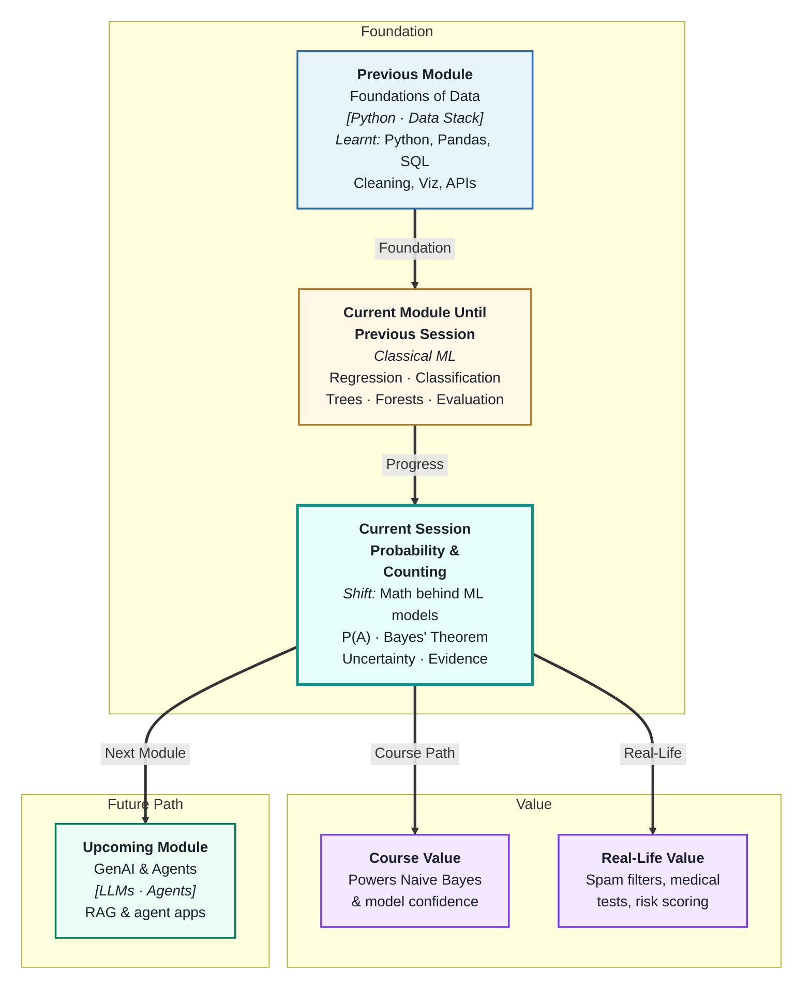
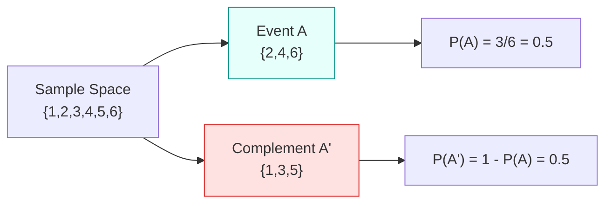
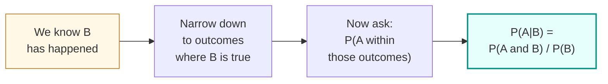

# Master Class: Probability & Counting — The Mathematics of Uncertainty
---

## Mental Map

---

## What You'll Learn

In this pre-read, you'll discover:

- What **probability** is and how to calculate it for simple events
- How to combine probabilities using the **addition** and **multiplication** rules
- What **conditional probability** is and why it changes everything
- How **Bayes' Theorem** updates your belief when new evidence arrives
- How probability underpins ML models that output confidence scores

---

## A. Probability Fundamentals

> 💡 **Analogy:** You're rolling a standard die. Before you roll, you have six equally likely outcomes. Probability is just a way of measuring how likely each outcome is — on a scale from 0 (impossible) to 1 (certain). Every ML model that outputs a "confidence score" is doing exactly this.

**One-line definition:** **Probability** is a number between 0 and 1 that measures how likely an event is to occur.

**Key terms:**

| Term | Meaning | Example |
|---|---|---|
| **Sample space** | All possible outcomes | {1, 2, 3, 4, 5, 6} for a die |
| **Event** | A specific outcome or set of outcomes | Rolling an even number |
| **P(A)** | Probability of event A | P(even) = 3/6 = 0.5 |
| **Complement P(A')** | Probability A does NOT happen | P(not even) = 1 − 0.5 = 0.5 |

**Rules:**
- P(A) is always between 0 and 1
- All probabilities in a sample space add up to 1
- P(A') = 1 − P(A)

---

## B. Combining Probabilities — Addition & Multiplication

> 💡 **Analogy:** The **addition rule** is for "OR" situations — like asking "what's the chance of rain OR sun today?" The **multiplication rule** is for "AND" situations — like asking "what's the chance it rains today AND I forget my umbrella?"

**One-line definition:** You combine probabilities with addition when asking about **either** event and multiplication when asking about **both** events happening.

**Addition Rule (OR):**
> P(A or B) = P(A) + P(B) − P(A and B)

*Why subtract P(A and B)?* Because if A and B can happen at the same time, you'd count that overlap twice.

**Multiplication Rule (AND) — for independent events:**
> P(A and B) = P(A) × P(B)

*Independent* means one event doesn't affect the other (like two separate coin flips).

**Examples with a standard deck of 52 cards:**

| Question | Rule | Calculation | Answer |
|---|---|---|---|
| P(King OR Heart) | Addition | 4/52 + 13/52 − 1/52 | 16/52 ≈ 0.31 |
| P(Head AND Head) on 2 coins | Multiplication | 0.5 × 0.5 | 0.25 |
| P(rolling 6 twice) on 2 dice | Multiplication | 1/6 × 1/6 | 1/36 ≈ 0.03 |

---

## C. Conditional Probability

> 💡 **Analogy:** Imagine you're trying to guess whether someone likes coffee. Normally it's 50/50. But then someone tells you they're a night-shift nurse. That new information changes your estimate. Conditional probability is how we mathematically update our guess when we learn something new.

**One-line definition:** **Conditional probability** P(A|B) is the probability of event A happening, given that we already know B has happened.

**Formula:** P(A|B) = P(A and B) / P(B)

**Example:** In a class of 30, 12 like maths and 8 like both maths and science.
- P(likes science | likes maths) = P(both) / P(maths) = (8/30) / (12/30) = 8/12 ≈ 0.67

**Why it matters in ML:** Classifiers like Naive Bayes are entirely built on conditional probability — they ask "given these features, what's the probability of each class?"

---

## D. Bayes' Theorem

> 💡 **Analogy:** You take a home COVID test and it comes back positive. But no test is perfect. Bayes' Theorem is how doctors calculate the actual probability you have COVID — weighing up the test's accuracy, how common COVID is, and the false positive rate. It combines what you knew before (prior) with what the test told you (evidence) to give an updated belief (posterior).

**One-line definition:** **Bayes' Theorem** is a formula for updating the probability of a hypothesis when new evidence arrives.

**The formula (conceptually):**

> Updated belief = (How likely this evidence is if hypothesis is true × Prior belief) / P(evidence)

| Term | Technical name | Meaning |
|---|---|---|
| P(H) | **Prior** | Your belief before the evidence |
| P(E\|H) | **Likelihood** | How likely is the evidence if H is true? |
| P(H\|E) | **Posterior** | Updated belief after seeing evidence |

**Worked example — Medical test:**
- Disease affects 1% of the population → P(disease) = 0.01
- Test is 99% accurate → P(positive | disease) = 0.99
- False positive rate is 5% → P(positive | no disease) = 0.05

You test positive. What's the real probability you have the disease?

Using Bayes: P(disease | positive) ≈ **0.17 (17%)** — much lower than you might think!

This is why Bayes' Theorem matters — it prevents us from jumping to conclusions based on a single piece of evidence.

---

## Practice Exercises

**1. Pattern Recognition**
You roll two dice. Identify which of the following questions uses the addition rule and which uses the multiplication rule:
- "What's the probability of rolling a 3 on the first die and a 5 on the second?"
- "What's the probability of rolling at least one 6?"

**2. Concept Detective**
A spam filter says an email is 92% likely to be spam. You know that 20% of all emails are spam, and the filter has a 10% false positive rate. Why might a 92% confidence score still be misleading without knowing the base rate?

**3. Real-Life Application**
List 3 real-world ML applications where probability outputs (confidence scores) are important — not just the predicted label. Explain what a wrong probability estimate could cost in each case.

**4. Spot the Error**
A student calculates P(A or B) = P(A) + P(B) = 0.4 + 0.5 = 0.9, where A = "user clicks ad" and B = "user buys product" (which requires clicking the ad). What mistake did they make?

**5. Planning Ahead**
You're building a disease screening model. The disease is rare (0.5% of people have it). Your model is 95% accurate. Design a plan for how you would communicate model predictions to doctors so they don't over-trust a single positive result.

---

> ✅ **You're done!** You now understand the mathematics of uncertainty — from basic probability rules to the powerful logic of Bayes' Theorem. These ideas sit at the core of classification models, confidence scores, and any system that has to make decisions under uncertainty. In the upcoming sessions, you'll see how clustering and model selection bring these ideas together in a complete ML pipeline.
