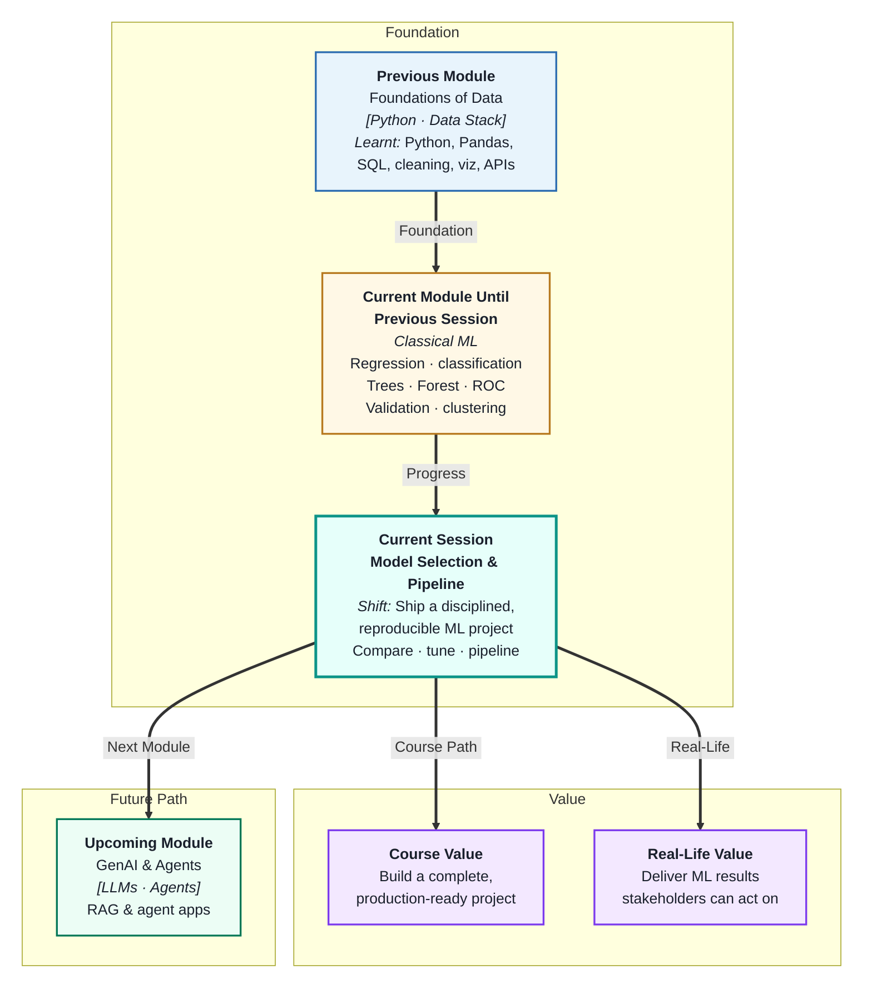
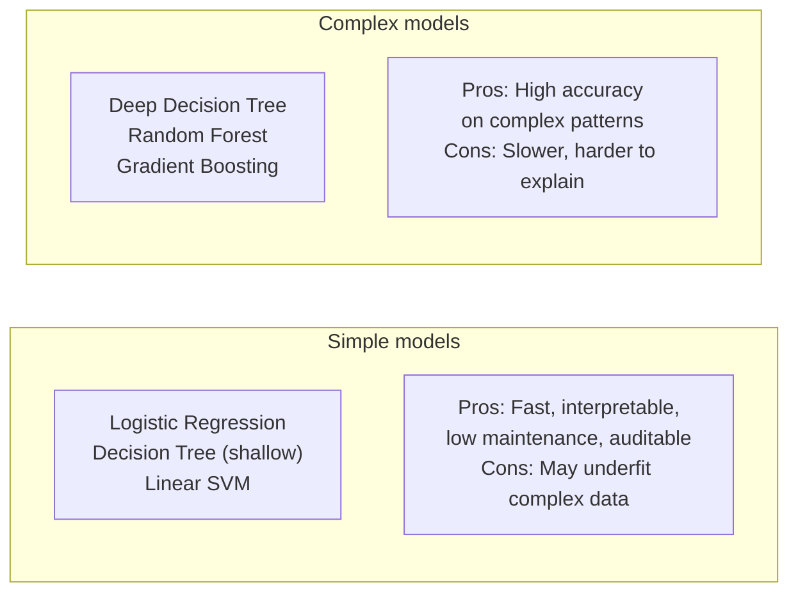
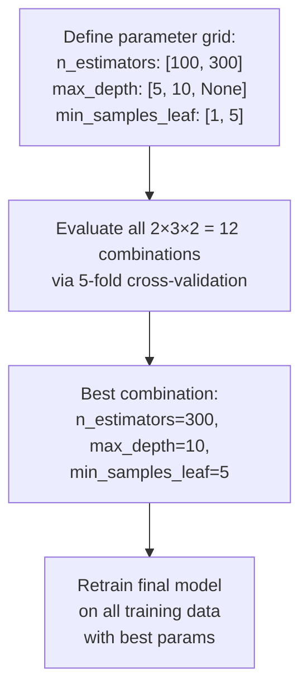
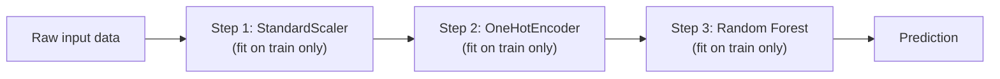
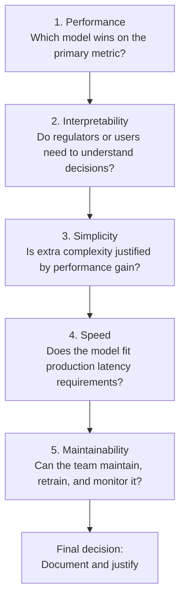

# Model Selection and End-to-End Pipeline
---

## Mental Map

## What You'll Learn

In this pre-read, you'll discover:

- How to **compare multiple models** on the same problem using a disciplined evaluation table
- Why **simpler models** should be preferred when performance is similar (Occam's Razor in ML)
- How **Grid Search** automates hyperparameter tuning across multiple settings
- What a **scikit-learn Pipeline** does and why it prevents leakage and simplifies deployment
- How to structure a **final model selection** decision that you can explain to any stakeholder

---

## A. Model Comparison — How to Choose Fairly

> 💡 **Analogy:** Hiring a chef based on a single tasting tells you less than watching them cook the same dish three times on different days. **Model comparison** means evaluating all candidates on the same data, the same metric, and the same validation protocol — not just the one you happened to train first.

**One-line definition:** **Model comparison** is the systematic process of training multiple algorithms on the same problem and selecting the best one based on a consistent metric computed on held-out data.

**The comparison table — standard practice:**

| Model | Val F1 | Val Recall | Train F1 | Overfit? | Notes |
|---|---|---|---|---|---|
| Baseline (majority class) | 0.00 | 0.00 | — | — | No learning |
| Logistic Regression | 0.72 | 0.68 | 0.74 | Minimal | Fast, interpretable |
| Decision Tree (depth=10) | 0.69 | 0.71 | 0.94 | Severe | Overfit — discard |
| Decision Tree (depth=5) | 0.73 | 0.75 | 0.78 | Mild | Better |
| Random Forest | 0.82 | 0.84 | 0.89 | Mild | Best F1 |

**Rules of fair comparison:**

1. All models use the same training and validation sets
2. All models are evaluated on the same metric
3. Cross-validation is used, not a single split
4. Training accuracy is recorded alongside validation — to detect overfit
5. A baseline is always included

The table above makes the choice obvious: Random Forest. But notice: if interpretability is required by a regulator, Logistic Regression (0.72 F1) might be chosen over Random Forest (0.82 F1) — the table documents why.

---

## B. Simplicity vs Performance — Occam's Razor in ML

> 💡 **Analogy:** A GPS that routes you accurately through three turns is better than one that uses 300 micro-turns to achieve the same journey time. Both arrive — but the simpler one is more trustworthy, cheaper to maintain, and faster to explain. **Simplicity matters** in ML too.

**One-line definition:** **Occam's Razor** in ML says: when two models perform similarly, prefer the simpler one — it is easier to interpret, less likely to overfit, faster to run, and cheaper to maintain in production.

**The simplicity–performance tradeoff:**

**Decision guide:**

| Scenario | Prefer simpler model when | Prefer complex model when |
|---|---|---|
| Performance gap | < 1–2% difference in metric | Clear significant improvement |
| Interpretability | Required (regulated industry) | Not critical |
| Training data | Small (< 10k rows) | Large (> 100k rows) |
| Latency in production | Real-time (< 100ms) | Batch scoring acceptable |
| Maintenance team | Small or non-ML | Dedicated ML team |

**A 1% improvement in F1 is rarely worth 10× more complexity** unless you have very high volume or very high stakes. Document this reasoning in your model card or evaluation report.

---

## C. Hyperparameter Tuning with Grid Search

> 💡 **Analogy:** A chef trying different oven temperatures and resting times for a roast systematically — not guessing — is doing a Grid Search. They try every combination in their plan and compare outcomes. **Grid Search** does exactly that for ML hyperparameters: it exhaustively evaluates every combination you specify.

**One-line definition:** **Grid Search** trains and evaluates a model at every combination of specified hyperparameter values, using cross-validation to estimate performance at each combination, and returns the best-performing configuration.

**How it works:**

**Grid Search vocabulary:**

| Term | Meaning |
|---|---|
| Parameter grid | Dictionary of hyperparameter names and lists of values to try |
| CV | Cross-validation folds used inside Grid Search |
| `best_params_` | The winning combination |
| `best_score_` | Cross-validation score of the winner |
| Refit | After search, Grid Search retrains on all training data with best params |

**Important:** Grid Search is done entirely on training (and validation) data — test data is still sealed. Only after Grid Search selects the best model do you evaluate once on the test set.

**Practical tip:** Grid Search with many parameters is computationally expensive. Start with a coarse grid (few values, wide range), then narrow down with a finer grid around the best candidate.

---

## D. The scikit-learn Pipeline — Preventing Leakage at Scale

> 💡 **Analogy:** A factory assembly line that processes every product in the same sequence, in the same order, every time — no worker skips a step or adds one spontaneously. A **scikit-learn Pipeline** enforces that same discipline for ML preprocessing + training, making it impossible to accidentally apply test-set statistics during training.

**One-line definition:** A **scikit-learn Pipeline** chains preprocessing steps and a model into a single object — fitting the entire sequence on training data and applying it consistently to any new data without any risk of leakage.

**What a pipeline looks like:**

**Why pipelines prevent leakage:**

Without a pipeline, it is easy to accidentally:
- Fit the scaler on the full dataset (including test rows) before splitting
- Apply an encoder trained on all data to the test set
- Use validation-set statistics to impute training missing values

A pipeline makes it *impossible* to do these things — `.fit()` only ever touches training data; `.predict()` applies the learned transforms to new data without refitting.

**Pipeline with Grid Search:**

You can wrap the entire pipeline inside `GridSearchCV`. This means Grid Search will tune hyperparameters *inside* the pipeline, including preprocessing parameters — the gold standard for real projects.

| With Pipeline + GridSearchCV | Without Pipeline |
|---|---|
| No leakage possible | Easy to accidentally leak |
| Reproducible — one `.fit()` call | Fragile — many steps to remember |
| Deployable as a single object | Must replicate all preprocessing at deploy time |

---

## E. Final Model Selection — Making the Decision

> 💡 **Analogy:** A product manager does not just pick the feature with the highest user engagement in an A/B test — they consider implementation cost, maintenance, user experience, and strategic alignment. **Final model selection** is the same: performance is one input, not the only input.

**One-line definition:** **Final model selection** is the decision-making process that weighs validation performance, simplicity, interpretability, inference speed, and business constraints to choose the model that will go into production.

**The five-factor selection framework:**

**Model card — what to document:**

| Section | Content |
|---|---|
| Problem | Prediction task, target variable, metric |
| Data | Source, size, split, preprocessing |
| Candidates evaluated | All models tried with train/val scores |
| Selected model | Name, hyperparameters, justification |
| Test set result | Final reported metric — computed once |
| Limitations | What the model does not handle well |
| Monitoring recommendation | What metric to watch in production |

**The test set evaluation — the last step:**

After all model comparison, hyperparameter tuning, and selection is done — and only then — evaluate the chosen model on the sealed test set. Record this number. This is your honest, unbiased estimate of production performance. You report this number, not the cross-validation score.

---

## Practice Exercises

**1. Pattern Recognition**  
Four models have been trained for a churn prediction problem: Logistic Regression (val F1=0.74), Decision Tree depth=15 (val F1=0.71, train F1=0.99), Random Forest (val F1=0.80), Gradient Boosting (val F1=0.82). Using section A, identify which model to eliminate first and why, then describe the decision between the two remaining candidates if the model will be deployed in a heavily regulated bank.

**2. Concept Detective**  
A data scientist's Grid Search identifies the best Random Forest hyperparameters, achieving CV F1=0.87. They report this as the final model performance. A reviewer flags this as incorrect. Using sections C and E, explain what the data scientist should have done after Grid Search, why the CV score is not the final reported metric, and what the correct sequence of steps is.

**3. Real-Life Application**  
You need to deliver a fraud detection model for a payments company. The model runs on every transaction (10 million per day, latency budget 20ms). Three candidates have similar F1 (within 1%) but different complexity: Logistic Regression, Random Forest, Gradient Boosting. Using section B, justify which model you would select, what trade-offs you are making, and how you would document the decision for the engineering and compliance teams.

**4. Spot the Error**  
A student's ML pipeline is: (1) apply StandardScaler to the full dataset, (2) split 80/20 train/test, (3) train Random Forest, (4) evaluate on test set, (5) report final accuracy. Identify all leakage risks in this pipeline and write the corrected pipeline steps in the right order, explaining what should be fitted on training data only.

**5. Planning Ahead**  
You are leading the model selection for a hospital readmission prediction project. The business requirement is: recall ≥ 0.80 (must catch at least 80% of high-risk patients); false positive rate ≤ 0.20 (cannot flag more than 20% of low-risk patients as high-risk). Design the complete end-to-end pipeline: data split strategy, preprocessing steps, baseline to establish, at least three models to compare, Grid Search parameters for the top candidate, how you would use the five-factor selection framework, and what you would put in the model card for the clinical team.

---

> ✅ **You've completed the Classical ML module!** You now have a complete, principled workflow: from splitting data and building baselines, through training regression and classification models, evaluating with the right metrics, validating with cross-validation, detecting and fixing data issues, and selecting a final model using a rigorous, documented comparison process. The next module — **GenAI & Agents** — will build directly on this foundation, applying the same disciplined problem-framing to language models, prompts, and AI-powered applications.
