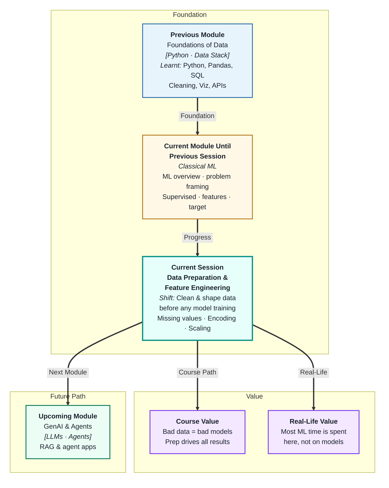
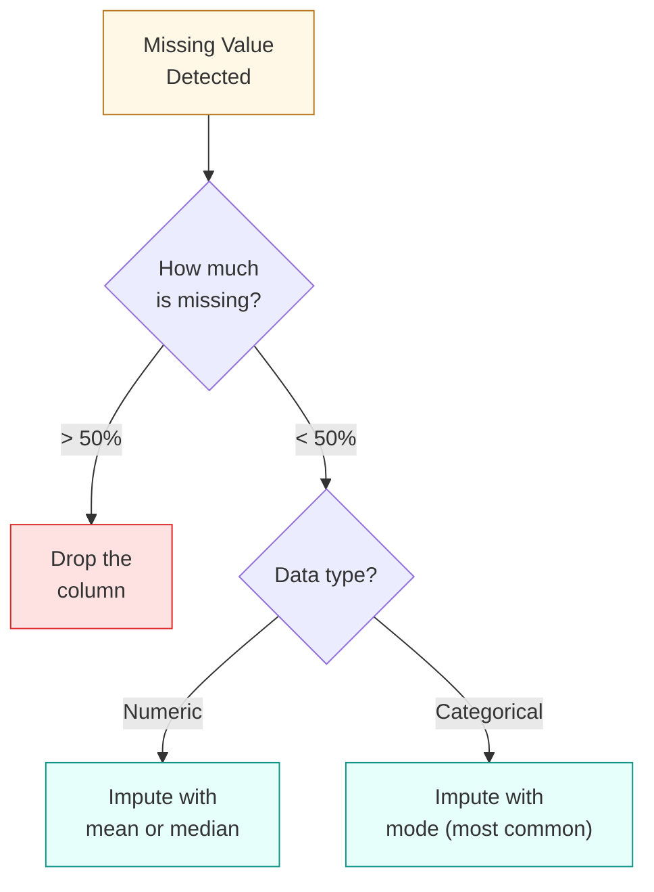
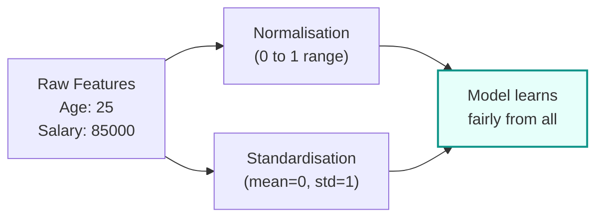

# Data Preparation and Feature Engineering
---

## Mental Map

---

## What You'll Learn

In this pre-read, you'll discover:

- Why **missing values** break ML models and how to handle them
- How to convert **categorical variables** (like "City" or "Gender") into numbers a model can use
- Why **feature scaling** matters and which technique to choose
- How to create new **engineered features** that make models smarter
- How to remove **duplicate rows** to prevent biased learning

---

## A. Handling Missing Values

> 💡 **Analogy:** Imagine filling out a survey and leaving some questions blank. A teacher can either ignore your blank answers, guess what you might have written, or ask you to fill them in. ML data prep does the same — you must decide what to do with every blank cell before training.

**One-line definition:** **Missing values** are gaps in your dataset where no data was recorded — and every ML model needs a strategy for dealing with them.

**Common strategies:**

| Strategy | When to use |
|---|---|
| Drop the row | Very few rows are missing (< 1%) |
| Drop the column | Column is > 50% empty |
| Fill with mean | Numeric data, roughly symmetric distribution |
| Fill with median | Numeric data with outliers |
| Fill with mode | Categorical data |

---

## B. Encoding Categorical Variables

> 💡 **Analogy:** Most ML models speak the language of numbers — they can't understand "Red" or "Blue". Encoding is like translating words into a numeric language. Label encoding gives each word a number; one-hot encoding gives each word its own column with a 1 or 0.

**One-line definition:** **Encoding** converts text-based categories into numbers so that ML algorithms can process them.

**Two main methods:**

| Method | How it works | Best for |
|---|---|---|
| **Label Encoding** | Assigns a unique integer to each category (Red=0, Blue=1, Green=2) | Ordinal categories (Small < Medium < Large) |
| **One-Hot Encoding** | Creates a new binary column for each category | Nominal categories (no order: City, Colour) |

**Watch out:** Label encoding on nominal data (like City names) implies a false ordering — as if "Paris" (1) is somehow "less than" "Tokyo" (2). Use one-hot instead.

---

## C. Feature Scaling

> 💡 **Analogy:** Imagine a recipe that mixes 1 teaspoon of salt with 5 litres of water. The salt completely dominates in proportion. Feature scaling is like bringing all your ingredients to the same measurement system so no one feature overwhelms the others.

**One-line definition:** **Feature scaling** re-ranges numeric columns so that no single feature dominates the model just because it has larger numbers.

| Technique | Formula | Result | Use when |
|---|---|---|---|
| **Normalisation** (Min-Max) | (x − min) / (max − min) | Range [0, 1] | Data has no large outliers |
| **Standardisation** (Z-score) | (x − mean) / std | Mean=0, Std=1 | Data has outliers; most ML models |

---

## D. Feature Engineering

> 💡 **Analogy:** A chef doesn't just throw raw ingredients into a pan — they chop, marinate, and combine them first. Feature engineering is the same: you transform raw data columns into new, more informative ones that help the model learn better.

**One-line definition:** **Feature engineering** creates new columns from existing ones to give the model more useful signals.

**Practical examples:**

| Raw Feature | Engineered Feature | Why it helps |
|---|---|---|
| `order_date` | `day_of_week`, `is_weekend` | Patterns differ by time |
| `created_at`, `updated_at` | `days_since_update` | Recency matters |
| `login_count` | `avg_logins_per_week` | Normalises for account age |
| `first_name`, `last_name` | `has_full_name` (True/False) | Profile completeness signal |

---

## E. Removing Duplicates

> 💡 **Analogy:** Imagine studying from a textbook where the same page appears three times. You'd learn that page much better than the rest — even if it's not the most important. Duplicate rows in a dataset have exactly this effect on a model.

**One-line definition:** **Duplicate rows** are identical (or near-identical) records that skew your model towards over-representing certain patterns.

- Duplicates can arise from data merges, form resubmissions, or system glitches
- Always check `df.duplicated().sum()` before training
- Drop with `df.drop_duplicates()` — but verify first that duplicates aren't legitimate (e.g. a user buying the same product twice)

---

## Practice Exercises

**1. Pattern Recognition**
You have a dataset with these columns: `age` (numeric), `city` (text), `income` (numeric), `education_level` (Low/Medium/High), `purchased` (Yes/No). For each column, identify: (a) does it need encoding? (b) does it need scaling? (c) which method would you use?

**2. Concept Detective**
A model predicting loan approval shows unusual performance — it gives very high weight to `credit_score` (range: 300–850) compared to `num_late_payments` (range: 0–10). What preprocessing step was likely skipped, and what would you do?

**3. Real-Life Application**
You're building a model to predict whether a restaurant receives a health inspection violation. List 3 engineered features you could create from the raw columns: `last_inspection_date`, `number_of_staff`, `seating_capacity`, and `cuisine_type`.

**4. Spot the Error**
A data scientist applies label encoding to the column `city` with values: Mumbai=0, Delhi=1, Bengaluru=2, Chennai=3. They then train a linear regression model. What problem might this cause?

**5. Planning Ahead**
You receive a raw CSV for a used-car price prediction task. The dataset has 12 columns. Walk through your complete data preparation plan — in order — before training any model.

---

> ✅ **You're done!** You now understand the key steps to prepare data for machine learning — handling missing values, encoding categories, scaling features, removing duplicates, and engineering better signals. Clean, well-prepared data is the single biggest factor in model performance. In the next session, you'll see how to actually train a model and set up a proper evaluation workflow.
