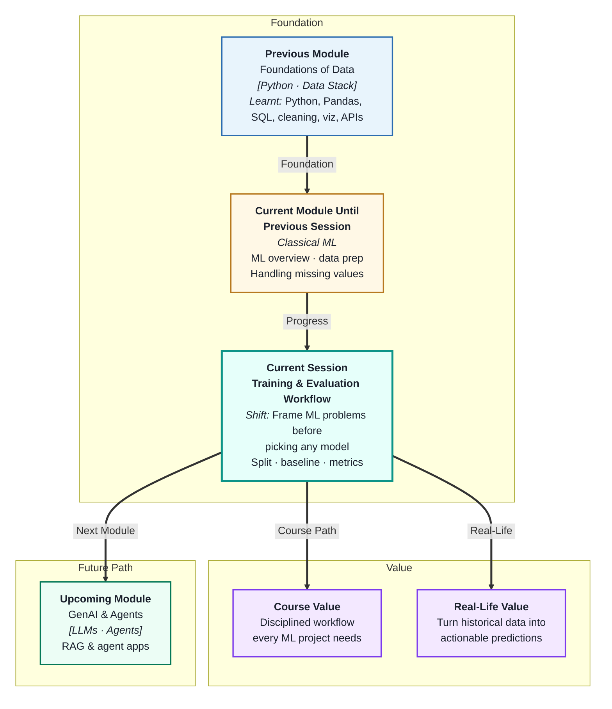
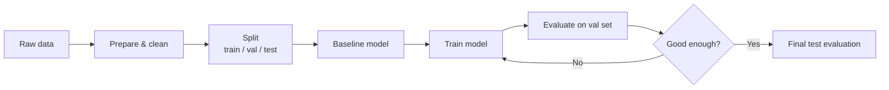
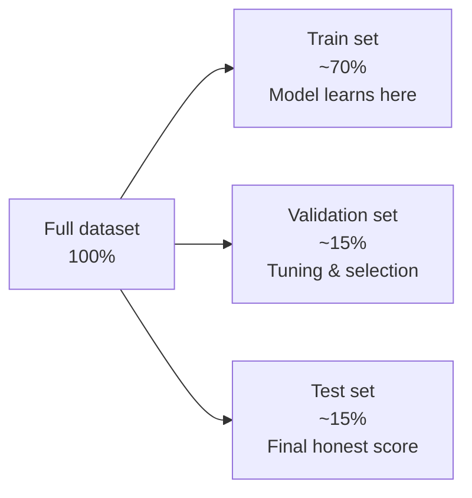

# Model Training and Evaluation Workflow
---

## Mental Map

## What You'll Learn

In this pre-read, you'll discover:

- Why data must be split into **train, validation, and test sets** — and what each is for
- What a **baseline model** is and why you build one before anything complex
- How the **model training process** works at a conceptual level
- Which **evaluation metrics** tell you whether your model is actually useful
- How to use a **metric comparison table** to choose between competing models

---

## A. The ML Workflow — A Map Before You Start

> 💡 **Analogy:** Before building a house, an architect draws a blueprint — not to avoid thinking, but to avoid wasted work. The **ML workflow** is your blueprint: a fixed sequence that stops you from training models on data you accidentally already tested on.

**One-line definition:** The **ML workflow** is the end-to-end sequence of steps — from raw data to a deployed, evaluated model — that every machine learning project follows.

| Workflow stage | Key question | What you do |
|---|---|---|
| Prepare | Is the data clean and usable? | Clean, encode, scale features |
| Split | How do I evaluate fairly? | Separate data before training |
| Baseline | What does "doing nothing clever" get? | Predict mean, most-common class |
| Train | What pattern does the model find? | Fit algorithm to training data |
| Evaluate | How well does it generalise? | Measure on held-out data |
| Compare | Which model is actually better? | Metric table across candidates |

Following this order is non-negotiable. Skipping the split, peeking at test data, or skipping a baseline are the most common reasons ML projects produce inflated, unreliable results.

---

## B. Train, Validation, and Test Splits

> 💡 **Analogy:** A driving school uses practice roads (training), mock tests on familiar routes (validation), and a final official test on an unknown route (test). Each serves a different purpose — and the final test is never used for practice.

**One-line definition:** **Data splitting** divides your dataset into three non-overlapping subsets: the model *learns* from training data, you *tune* using validation data, and you *report final performance* using test data — which is never touched until the very end.

| Set | Used for | Touched how often |
|---|---|---|
| Training | Fitting the model | Every training run |
| Validation | Comparing models, tuning | During development |
| Test | Final reported metric | **Once — at the very end** |

**The most important rule:** The test set is a time capsule. Seal it away, do not open it until you have finished all development decisions. Every time you peek at it to make a choice, it becomes contaminated — your reported accuracy will be optimistic and your model will perform worse in the real world.

**Stratified splits** — when your target column is imbalanced (e.g. 95% class 0, 5% class 1), use stratified splitting to ensure each split keeps the same class proportion. A random split might accidentally put all rare-class examples in one set.

---

## C. Baseline Models — Your Starting Point

> 💡 **Analogy:** Before hiring a delivery fleet, a logistics manager asks "what if we just delivered everything by the fastest existing route with no optimisation?" That is the baseline — the simplest answer. Any new model must beat it to be worth the cost.

**One-line definition:** A **baseline model** is the simplest possible prediction rule you can apply without training — it sets the minimum performance bar that any real model must exceed to justify its complexity.

**Common baselines:**

| Problem type | Baseline rule | Example |
|---|---|---|
| Regression | Predict the mean of the training target | If avg salary is ₹50k, always predict ₹50k |
| Classification | Predict the most frequent class | If 80% of emails are not spam, always predict "not spam" |
| Time series | Predict the last known value | Today's sales = yesterday's sales |

**Why baselines matter:**

A model that achieves 90% accuracy sounds impressive. But if 90% of your data is one class, the baseline (predict always that class) also gets 90% — for free, with zero learning. Without a baseline, you cannot know if your model learned anything useful at all.

Baselines also expose class imbalance problems early, before you waste time tuning a model that is secretly just learning the majority class.

---

## D. The Training Process — What "Fitting" Actually Means

> 💡 **Analogy:** A child learning multiplication does not memorise every possible multiplication — they learn the *rule*. A model does the same: it looks at training examples and adjusts its internal parameters until its predictions match the known answers as closely as possible.

**One-line definition:** **Model training** is the process of adjusting a model's internal parameters on the training data so its predictions minimise the gap between what it guesses and what the correct answers are.

**Conceptual steps:**

1. Model starts with random (or zero) parameters
2. Makes a prediction on a training example
3. Compares prediction to the true label — computes **error** (loss)
4. Adjusts parameters slightly to reduce error
5. Repeats across all training examples — one full pass is one **epoch**
6. Stops when error stops improving (or after a set number of rounds)

| Term | Plain meaning |
|---|---|
| **Parameters** | The numbers the model adjusts (e.g. slope and intercept in linear regression) |
| **Loss / error** | The gap between predicted and actual values |
| **Epoch** | One complete pass through the entire training dataset |
| **Convergence** | When the model's error stops improving significantly |
| **Overfitting** | Model learns training data too well — fails on new data |
| **Underfitting** | Model is too simple — fails on both training and new data |

---

## E. Evaluation Metrics — Knowing If Your Model Works

> 💡 **Analogy:** A student's grade is not just one number — a teacher looks at spelling, grammar, and comprehension separately. **Evaluation metrics** do the same for models: different metrics reveal different aspects of how well (or badly) the model performs.

**One-line definition:** **Evaluation metrics** are numbers that measure how closely a model's predictions match the true values — each metric highlights a different dimension of performance.

**Regression metrics (predicting a number):**

| Metric | What it measures | Sensitive to outliers? |
|---|---|---|
| MAE (Mean Absolute Error) | Average absolute gap between predicted and actual | No |
| RMSE (Root Mean Squared Error) | Square root of average squared gap | Yes — penalises large errors more |
| R² (R-squared) | % of variance in target explained by the model | Moderate |

**Classification metrics (predicting a category):**

| Metric | What it measures | Use when |
|---|---|---|
| Accuracy | % of correct predictions | Classes are balanced |
| Precision | Of all positive predictions, how many were right? | False positives are costly |
| Recall | Of all actual positives, how many did we catch? | False negatives are costly |
| F1-score | Harmonic mean of precision and recall | Both matter equally |

**Metric comparison table** — how to choose a winner:

Always evaluate multiple models on the same validation set using the same metric. Build a table:

| Model | MAE | RMSE | R² |
|---|---|---|---|
| Baseline (mean) | 12,000 | 16,000 | 0.00 |
| Linear Regression | 7,500 | 10,200 | 0.54 |
| Model B | 6,800 | 9,100 | 0.61 |

The table makes the winner obvious and documents your decision for anyone reviewing your work.

---

## Practice Exercises

**1. Pattern Recognition**  
You have 10,000 rows of customer data to train a churn prediction model. Describe how you would split this data — how many rows in each set, why you keep the test set sealed, and what "stratified" splitting means for a dataset where only 8% of customers actually churn.

**2. Concept Detective**  
A team trains a model and reports 94% accuracy on the test set. Their baseline (predict always "no churn") achieves 92% accuracy. Using the concepts from section C, explain whether the model has actually learned anything useful and what the team should do next.

**3. Real-Life Application**  
Think of three real-world prediction problems (e.g. predicting delivery delays, forecasting energy usage, classifying support tickets). For each: name whether it is a regression or classification problem, name the baseline you would use, and name the one metric that would matter most to the business.

**4. Spot the Error**  
A data scientist uses the test set to tune hyperparameters three times, then reports the best result as the model's final accuracy. Using section B, explain exactly what went wrong and why the reported accuracy is likely to be misleadingly high.

**5. Planning Ahead**  
You are starting a project to predict house prices (in ₹ lakh) from features like area, location, age, and number of rooms. Lay out the full workflow from sections A–E: how you would split the data, what your baseline would be, what "training" means for this problem, which two metrics you would report, and how you would structure the comparison table.

---

> ✅ **You're done!** You now understand the disciplined workflow that separates reliable ML from lucky guessing — split honestly, baseline first, train systematically, evaluate on held-out data, and compare with a metric table. Next session: **Linear Regression and Model Interpretation**, where you will build your first real predictive model and understand exactly what it learned.
