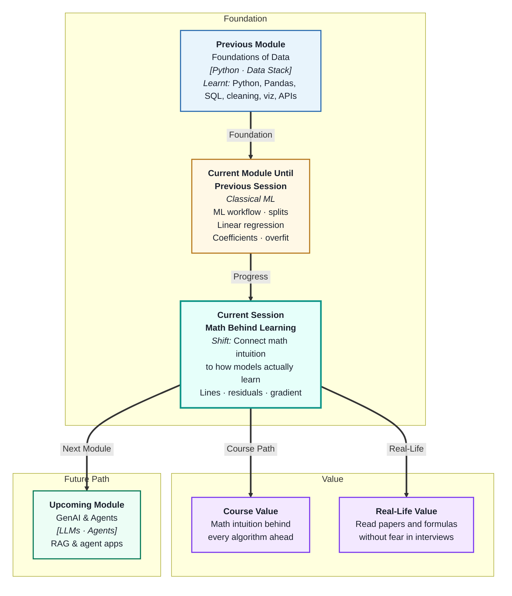
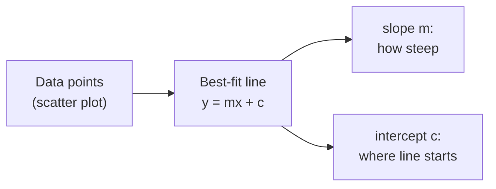
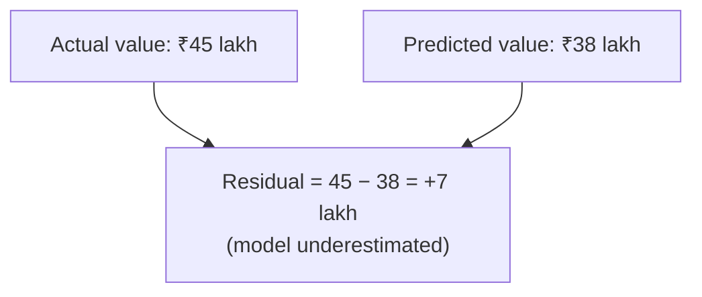
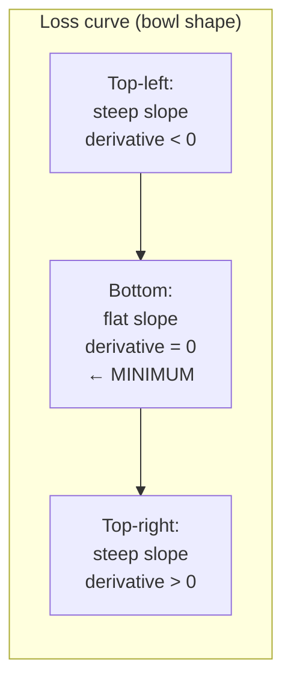
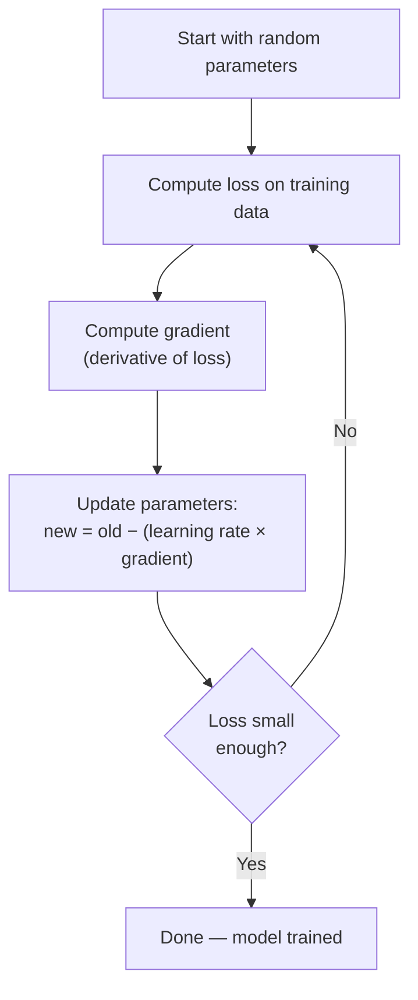

# Master Class: The Mathematics Behind Learning — Lines, Curves & Errors
---

## Mental Map



## What You'll Learn

In this pre-read, you'll discover:

- How the equation `y = mx + c` directly describes what Linear Regression learns
- What a **residual** is and why minimising residuals is the same as learning
- What a **derivative** means — conceptually, with no formulas required
- Why ML training is fundamentally a problem of **minimising a curve**
- How **gradient descent** works as a picture, not a formula

---

## A. The Line Equation — What Linear Regression Literally Is

> 💡 **Analogy:** A tailor who measures hundreds of customers and draws a "best fit" height-to-sleeve-length chart is doing linear regression by hand. The line on that chart *is* the model — and `y = mx + c` is its recipe.

**One-line definition:** `y = mx + c` describes a straight line where `m` is the slope (steepness) and `c` is the y-intercept (where the line crosses the vertical axis when x = 0).



**What each part means in ML:**

| Term | Math symbol | In a house-price model |
|---|---|---|
| Prediction | `ŷ` (y-hat) | Predicted price |
| Slope / coefficient | `m` or `b₁` | Price change per sq ft |
| Intercept | `c` or `b₀` | Base price with no features |
| True label | `y` | Actual sale price |

**Multiple features — extend the line to a plane:**

With two features the "line" becomes a flat plane in 3-D space. With ten features it becomes a hyperplane — impossible to visualise, but the math is identical: `ŷ = b₀ + b₁x₁ + b₂x₂ + … + b₁₀x₁₀`.

You trained this model last session. This masterclass explains *why* training works — what the algorithm is mathematically doing when it "fits the line."

---

## B. Residuals — Error as a Number

> 💡 **Analogy:** A GPS navigation app predicts your arrival time. When you actually arrive, the difference between the prediction and reality is the error. **Residuals** are that difference — one per data point, measuring exactly how wrong the line was.

**One-line definition:** A **residual** is the signed difference between the true value and the model's prediction for one data point: `residual = actual − predicted`.



**Residuals tell you everything:**

| Residual | Meaning |
|---|---|
| Zero | Perfect prediction |
| Positive | Model underestimated |
| Negative | Model overestimated |
| Large absolute value | Model got this point badly wrong |
| Consistently positive in one region | Model is biased — missing a pattern |

**The loss function — summing up all residuals:**

The training algorithm needs one number that represents "how wrong is the model overall." The most common choice for regression is **Mean Squared Error (MSE)**:

```
MSE = average of (each residual)²
```

Squaring does two things: it makes all values positive (negative errors do not cancel positive ones) and it penalises large errors more than small ones. Training the model means finding the line that makes this number as small as possible.

---

## C. What Is a Derivative? — The Slope of a Slope

> 💡 **Analogy:** A car's speedometer shows how fast your position is changing. A derivative is the speedometer for any quantity — it tells you *how fast that quantity is changing at this exact moment*. A derivative of zero means the quantity is momentarily flat — not changing.

**One-line definition:** A **derivative** measures the instantaneous rate of change of a function at a specific point — it is the slope of the curve *at that point*, not the slope of the whole curve.

**Visual intuition — no formula needed:**



**Three key observations:**

- On the left side of the bowl: derivative is **negative** (curve is going down)
- At the bottom of the bowl: derivative is **zero** (curve is flat — this is the minimum)
- On the right side of the bowl: derivative is **positive** (curve is going up)

**Why this matters for ML:** The loss function (MSE) plotted against a model parameter looks like a bowl. The derivative at any point on that bowl tells you which direction to move to get closer to the bottom. The bottom is where loss is minimised — where the model's parameters are their best values.

---

## D. Minimising Error — Finding the Bottom of the Bowl

> 💡 **Analogy:** You are blindfolded on a hillside and want to reach the lowest point. You cannot see the whole valley — but you *can* feel whether the ground slopes downward under your feet. **Minimisation** is the process of repeatedly stepping in the downhill direction until you reach flat ground.

**One-line definition:** **Minimising the loss function** means finding the model parameters (slope and intercept) that make the total prediction error across all training examples as small as possible.

**Two ways to find the minimum:**

| Method | How it works | When to use |
|---|---|---|
| **Closed-form (OLS)** | Algebra formula gives exact answer instantly | Small datasets, linear models |
| **Gradient descent** | Iteratively step toward minimum | Large data, neural networks, most modern ML |

**Why the derivative is the compass:**

At any point on the loss curve, the derivative tells you:
- Which direction is "downhill" (negative derivative = go right; positive = go left)
- How steep the slope is (big derivative = take a bigger step; small = take a careful step)

When the derivative reaches zero, you have found the minimum — training is complete.

---

## E. Gradient Descent — Walking Downhill

> 💡 **Analogy:** A hiker lost in fog uses one rule: "always take a step in the downhill direction." They cannot see the whole valley, but step by step they reach the lowest point. **Gradient descent** is that hiker — it nudges model parameters downhill, one small step at a time.

**One-line definition:** **Gradient descent** is an iterative optimisation algorithm that repeatedly adjusts model parameters in the direction that reduces the loss function, guided by the derivative (gradient) at each step.



**The learning rate — step size matters:**

| Learning rate | Effect |
|---|---|
| Too large | Overshoots the minimum — bounces around |
| Too small | Takes forever to converge |
| Just right | Smooth, steady descent to the minimum |

**Key vocabulary:**

| Term | Plain meaning |
|---|---|
| **Gradient** | The derivative (direction and steepness) at the current point |
| **Learning rate** | How big a step to take each iteration |
| **Iteration / step** | One parameter update |
| **Epoch** | One full pass through all training data |
| **Convergence** | When updates become so small they are negligible |

**The connection to what you already know:** When you call `model.fit(X_train, y_train)`, scikit-learn is running this loop internally — computing gradients, updating coefficients, repeating until convergence. The numbers in `model.coef_` are the parameters sitting at the bottom of the loss bowl when training finished.

---

## Practice Exercises

**1. Pattern Recognition**  
A model has residuals: `+1200, −800, +3500, −200, +100`. (a) Which prediction was furthest off? (b) Is the model systematically over- or under-predicting? (c) If MSE is computed, which residual contributes the most and why?

**2. Concept Detective**  
A training run starts with MSE = 15,000. After 100 iterations it is 9,000. After 200 iterations it is 8,950. After 500 iterations it is 8,948. What does this pattern suggest about convergence, and is continuing to train for another 1000 iterations a good use of compute time?

**3. Real-Life Application**  
Think of three real optimisation problems outside of ML — planning the fastest delivery route, adjusting a recipe to minimise waste, or calibrating a machine. For each: describe what the "bowl" (loss function) represents, what the "derivative" tells you at any step, and what reaching the minimum would mean in practice.

**4. Spot the Error**  
A student sets a very high learning rate, runs gradient descent, and finds the loss bounces between 50,000 and 48,000 repeatedly without ever going lower. Using sections D and E, explain what is happening geometrically and what the student should change.

**5. Planning Ahead**  
You are training a linear regression model to predict electricity consumption from three features. Describe — in plain steps, no code — what gradient descent is doing: starting state, what one iteration looks like, how you know it is converging, and what the final coefficients represent in terms of the loss bowl.

---

> ✅ **You're done!** You now see the mathematical engine inside every model you train: a line defined by coefficients, residuals that measure its error, a loss bowl that summarises all residuals into one number, and gradient descent that rolls the parameters to the bottom of that bowl. Next: **Regression Evaluation and Error Analysis** — where you will put names and scales on the error metrics you now understand mathematically.
