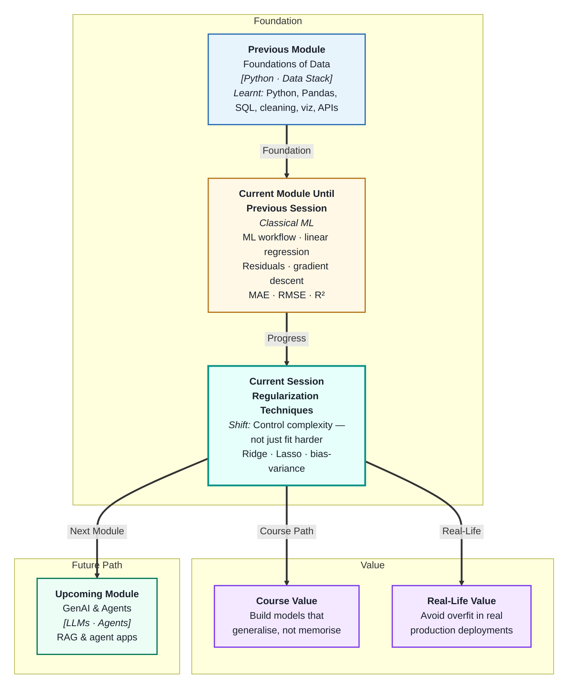
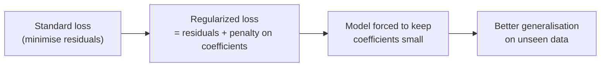
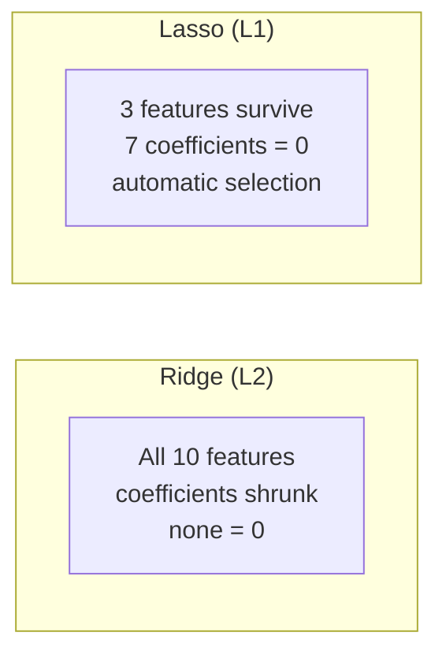
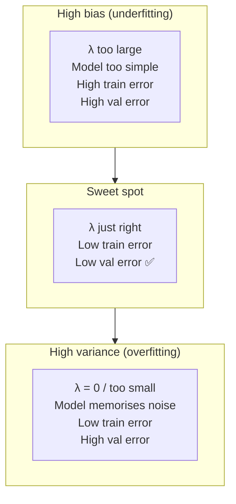

# Regularization Techniques
---

## Mental Map



## What You'll Learn

In this pre-read, you'll discover:

- What **regularization** is and why it prevents overfitting without changing your data
- How **Ridge regression** shrinks coefficients to control complexity
- How **Lasso regression** goes further — shrinking some coefficients all the way to zero
- How the **bias–variance tradeoff** explains why regularization helps generalisation
- How to tune the regularization strength using **hyperparameter tuning basics**

---

## A. Why Regularization? — The Overfitting Problem Revisited

> 💡 **Analogy:** A student memorising every past exam answer word-for-word will fail a slightly rephrased question. A teacher who adds a rule "you must explain the reasoning, not just the answer" forces the student to learn the underlying concept. **Regularization** is that rule — it forces the model to learn patterns, not noise.

**One-line definition:** **Regularization** adds a penalty term to the loss function that discourages the model from assigning very large coefficients — effectively limiting complexity and reducing overfitting.



**The core intuition:**

Without regularization, the model can assign any coefficient values — including very large ones that memorise specific training examples. Adding a penalty means the model must balance two goals:
1. Fit the training data well (minimise residuals)
2. Keep coefficients small (satisfy the penalty)

This tension forces the model toward simpler, more generalisable solutions.

| Without regularization | With regularization |
|---|---|
| Coefficients can be huge | Coefficients are constrained to stay small |
| Low training error, high validation error | Slightly higher training error, lower validation error |
| Memorises training noise | Learns the general pattern |

---

## B. Ridge Regression — Shrink Everything

> 💡 **Analogy:** A city council sets a budget rule: "no single department can spend more than double the average." Every department still gets funded, but no single one dominates. **Ridge** does the same — every coefficient gets reduced, but none go to zero.

**One-line definition:** **Ridge regression** adds the sum of *squared* coefficients as a penalty — it shrinks all coefficients toward zero but keeps all features in the model.

```
Ridge loss = MSE + λ × (sum of all b²)
```

| Symbol | Meaning |
|---|---|
| λ (lambda) | Regularization strength — how hard you push coefficients toward zero |
| λ = 0 | No regularization → ordinary linear regression |
| λ large | Strong penalty → coefficients shrink toward zero |
| λ too large | Underfitting — model becomes too simple |

**Effect on coefficients:**

| Scenario | What Ridge does |
|---|---|
| Many weakly relevant features | Spreads weight across all — none dominates |
| Highly correlated features (multicollinearity) | Distributes coefficient across correlated group |
| Features with no signal | Shrinks them close to (but not at) zero |

Ridge is the default choice when you have many features that are all somewhat useful and you want to prevent any one from dominating.

---

## C. Lasso Regression — Shrink and Select

> 💡 **Analogy:** A strict editor cutting a news article does not just shorten every paragraph a little (Ridge) — they cut entire paragraphs that add nothing. **Lasso** does the same to features: it removes the irrelevant ones entirely by setting their coefficients to exactly zero.

**One-line definition:** **Lasso regression** adds the sum of *absolute* coefficients as a penalty — it shrinks coefficients and drives irrelevant ones all the way to zero, performing automatic feature selection.

```
Lasso loss = MSE + λ × (sum of |b|)
```



| | Ridge | Lasso |
|---|---|---|
| Penalty type | Sum of b² (L2) | Sum of \|b\| (L1) |
| Effect on coefficients | Shrink toward zero | Shrink; some become exactly zero |
| Feature selection | No | Yes — auto removes irrelevant features |
| Handles multicollinearity | Well | Picks one from correlated group, drops others |
| Use when | All features possibly useful | You suspect many features are irrelevant |

**Elastic Net** combines both penalties and is useful when you want some feature selection *and* stable coefficient shrinkage for correlated features.

---

## D. The Bias–Variance Tradeoff

> 💡 **Analogy:** A weather forecast system calibrated only on last summer's data will be biased for this winter. One that recalibrates on every single day's noise will be so variable it is useless. **Bias–variance tradeoff** is finding the sweet spot between these two failure modes.

**One-line definition:** **Bias** is the error from a model that is too simple to fit the true pattern; **variance** is the error from a model that is too sensitive to training-set noise; regularization controls the tradeoff between them.



| λ value | Bias | Variance | Total error |
|---|---|---|---|
| Very large | High | Low | High (underfitting) |
| Just right | Moderate | Moderate | Low ✅ |
| Zero | Low | High | High (overfitting) |

Regularization moves you left on this axis — from high variance toward higher bias. The optimal λ sits where the total error (bias² + variance) is minimised, which is found through hyperparameter tuning.

---

## E. Hyperparameter Tuning Basics

> 💡 **Analogy:** An oven dial has many settings — the right temperature depends on what you are baking. You cannot know the best setting without trying a few and seeing what works. **Hyperparameter tuning** is that process of trying settings and measuring which produces the best result.

**One-line definition:** **Hyperparameter tuning** means systematically searching over possible values of model settings (like λ) to find the combination that produces the best validation performance.

**The λ search process:**

```
candidates = [0.001, 0.01, 0.1, 1, 10, 100]

for each λ:
    train Ridge(λ) on training set
    evaluate on validation set
    record validation MAE / R²

pick λ with best validation score
```

**Grid Search** does this systematically across one or more hyperparameters:

| Method | What it does | When to use |
|---|---|---|
| Manual search | Try a few values by intuition | Quick initial check |
| Grid Search | Try every combination in a defined grid | When grid is small |
| Random Search | Sample combinations randomly | Large search space |

**Important:** Always tune λ using the **validation set**, never the test set. Tuning on the test set leaks future information and produces misleadingly optimistic results.

| What to tune | What to watch |
|---|---|
| λ (regularization strength) | Validation MAE / R² |
| Type (Ridge vs Lasso) | Whether you need feature selection |
| Feature scaling | Required before Ridge/Lasso — normalise first |

---

## Practice Exercises

**1. Pattern Recognition**  
A Ridge model is trained with three λ values: 0.01, 1, 100. The training R² scores are: 0.95, 0.88, 0.62. The validation R² scores are: 0.61, 0.84, 0.59. Which λ would you choose and why? What does the pattern of scores tell you about the bias–variance tradeoff at each setting?

**2. Concept Detective**  
A data scientist trains Lasso on a dataset with 50 features. After training, 42 of the 50 coefficients are exactly zero. A colleague says "Lasso deleted useful features." Using sections C and D, explain what Lasso actually did and whether this is a problem or a feature.

**3. Real-Life Application**  
Describe three real prediction scenarios where regularization would be important: (a) a medical model with 200 lab test features, (b) a price model for similar products with highly correlated size features, (c) a fraud detection model where only 5 of 100 transaction features are genuinely predictive. For each, say whether Ridge or Lasso is more appropriate and why.

**4. Spot the Error**  
A student tunes Ridge λ by trying values 0.001, 0.01, 0.1, 1 and picks λ = 0.1 because it gives the best *test set* R². They report this as their final model. Identify the mistake using section E and explain what the correct procedure should have been.

**5. Planning Ahead**  
You are building a house price model with 30 features, and your plain linear regression gives train R² = 0.93, val R² = 0.54. Plan a full regularization strategy: which technique to try first, the range of λ values to search, which metric to compare across λ values, how you will decide between Ridge and Lasso, and what you expect the val R² to look like after tuning.

---

> ✅ **You're done!** You now understand why regularization exists, how Ridge shrinks all coefficients and Lasso performs automatic feature selection, and how hyperparameter tuning finds the right balance. These ideas apply not just to regression but to every ML model you will meet. Next: **Logistic Regression for Classification**, where you will learn to predict *categories* instead of numbers.
