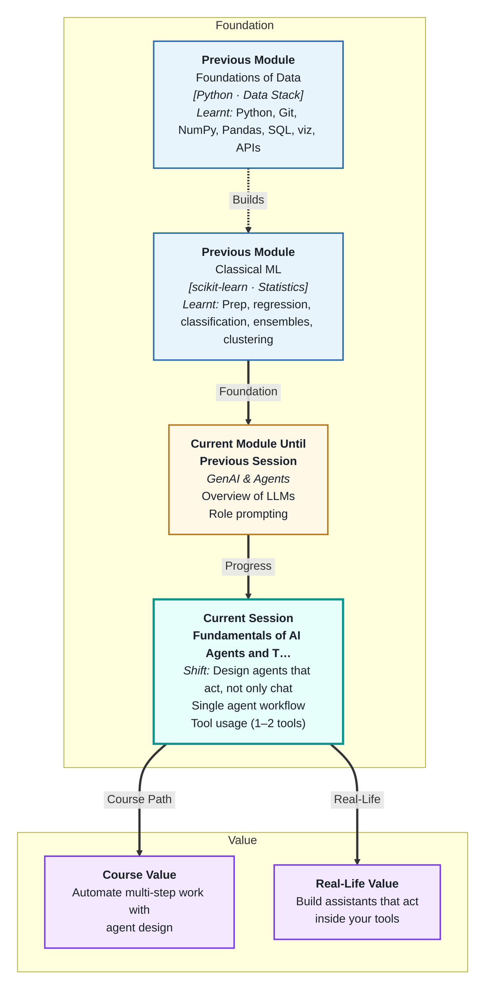

# Fundamentals of AI Agents and Tool Usage



## What You'll Learn

In this pre-read, you'll discover:
- What an **AI agent** is and how it differs from a model that simply answers questions
- How agents use **tools** to act on the world rather than just respond to it
- Why **structured inputs and outputs** matter when an agent calls a tool
- What **retries and hard stops** are — and why an agent without them is dangerous to run
- How a single-agent workflow ties all of these pieces into a working system

---

## A. What Is an AI Agent?

**Everyday analogy:** Think about the difference between calling a bank's helpline and speaking to a recorded voice menu versus speaking to a human executive. The recorded menu can only answer questions it was pre-programmed to handle. The human executive can look up your account, transfer funds, file a complaint, and escalate to a supervisor — all in one call. They are not just responding. They are taking actions in systems on your behalf. An AI agent is the executive, not the menu.

**One-line definition:** An **AI agent** is a system where a language model is given a goal, a set of tools it can call, and the ability to decide — step by step — which tool to use next until the goal is achieved.

---

## B. Why Does This Matter?

- **Answering questions is not enough.** A model that only generates text cannot send an email, query a database, or read a file. Agents close that gap by connecting the model's reasoning to real actions.
- **Agents operate in loops.** Unlike a single prompt and response, an agent runs a cycle: observe the situation, decide on an action, execute it, observe the result, decide again. That loop is what makes it capable of multi-step tasks.
- **Without guardrails, agents break.** An agent that can take actions in the world can also take the wrong actions repeatedly. Retries, backoff, and hard stops are what keep an agent from running indefinitely or causing unintended damage.

---

## C. From Known to New

**The painful way:** A data analyst at a logistics company in Hyderabad receives a CSV file every morning with delivery records. She manually opens it, filters for exceptions, calculates averages, and pastes a summary into a Slack message — every single day. The task is mechanical, repetitive, and takes forty minutes she could spend on actual analysis.

**The better way:** A CSV Analyst agent is given the file path and a goal. It calls a tool to read the file, calls another to run calculations, and calls a third to send the summary. The analyst reviews the output. The forty minutes becomes two.

```
Goal: "Summarise today's delivery exceptions from the CSV"
         |
         v
  [Agent decides: first, read the file]
         |
         v
  [Tool: read_csv] --> Returns data
         |
         v
  [Agent decides: next, calculate exception rate]
         |
         v
  [Tool: run_calculation] --> Returns result
         |
         v
  [Agent decides: goal achieved, return summary]
         |
         v
  Final Output delivered to analyst
```

The model does not execute the tools itself. It decides which tool to call and what to pass in. The tools do the work. The model does the reasoning.

---

## D. Core Components

| Term | Simple Meaning | Example |
|---|---|---|
| **Agent** | A model running in a loop, choosing actions until a goal is met | CSV Analyst that reads, calculates, and summarises without manual steps |
| **Tool** | A function the agent can call to interact with external systems | `read_csv`, `search_web`, `send_email` |
| **JSON Schema** | A structured definition of what inputs a tool expects and what it will return | Tool expects `{"file_path": "string", "column": "string"}` |
| **Retry** | Calling a tool again after a failure, in case the failure was temporary | Re-calling an API that timed out |
| **Backoff** | Waiting progressively longer between retries to avoid overloading a system | Wait 1 second, then 2, then 4 before each retry |
| **Hard Stop** | A rule that terminates the agent if it has not succeeded after a fixed number of attempts | Stop after 3 failed retries and return an error |
| **Single Agent Workflow** | One agent, one goal, one set of tools, running in a single loop | FAQ bot that searches a knowledge base and returns an answer |

---

## E. How a Tool Call Works

When an agent decides to use a tool, it does not call the tool in plain English. It produces a structured request — a JSON object — that matches the tool's schema exactly. The schema defines what fields are required, what type each field must be, and what the tool will return.

```
Caption: A structured tool call from an agent to a CSV reading tool

Agent's decision:
"I need to read column 'delivery_status' from the file."

Tool schema (what the tool expects):
{
  "file_path": "string",
  "column":    "string"
}

Agent produces:
{
  "file_path": "deliveries_2024_07_27.csv",
  "column":    "delivery_status"
}

Tool returns:
{
  "values": ["delivered", "delayed", "failed", "delivered", ...]
}
```

If the agent passes a field the schema does not expect, or leaves out a required field, the tool call fails. The schema is the contract between the model's reasoning and the tool's execution.

---

## F. Retries, Backoff, and Hard Stops

| Mechanism | What It Does | Why It Exists |
|---|---|---|
| **Retry** | Repeats a failed tool call | Temporary failures — network timeouts, busy APIs — often resolve on their own |
| **Backoff** | Increases the wait time between retries | Prevents the agent from hammering a struggling system and making it worse |
| **Hard Stop** | Ends the agent loop after N failures | Prevents the agent from running forever and consuming resources or causing repeated errors |

**Everyday analogy:** Think of calling a busy customer care line in Mumbai during peak hours. You call, get a busy tone, wait a moment, call again. If it is busy five times in a row, you give up and try a different channel. Retry is calling again. Backoff is waiting longer each time. Hard stop is deciding to stop after five attempts. An agent without a hard stop would keep calling forever.

---

## G. Putting It All Together

**Mini case study:** An e-commerce company in Bengaluru builds a FAQ bot for its seller portal. Sellers ask questions like "What is the commission rate for electronics?" The agent's workflow:

| Step | What Happens |
|---|---|
| Seller submits question | Agent receives the query as its goal |
| Agent calls search tool | JSON schema: `{"query": "string", "knowledge_base": "string"}` |
| Tool returns top matches | Agent reads the results |
| Match found | Agent formats and returns the answer |
| No match found | Agent retries with a rephrased query |
| Three retries fail | Hard stop triggers — agent returns "I could not find an answer, please contact support" |

The hard stop is not a failure of the system. It is the system working correctly — recognising its own limits and handing off gracefully rather than looping indefinitely or returning a hallucinated answer.

---

## Practice Exercises

**1. Pattern Recognition**
Look at the CSV Analyst workflow in Section C. At which step is the model doing reasoning and at which steps is it delegating to tools? What would happen if the model tried to read the CSV file using its own knowledge rather than calling a tool?

**2. Concept Detective**
An agent is calling an external weather API to answer questions about travel conditions. The API is under maintenance and returning errors. The agent has no retry logic and no hard stop. Describe what happens, and explain what each of the three mechanisms — retry, backoff, and hard stop — would change about that outcome.

**3. Spot the Error**
A developer builds an agent and defines a tool schema with the field `"date"` as a required input. The agent calls the tool but passes the field as `"Date"` with a capital D. The tool fails. What specifically caused the failure, and what does this tell you about how agents must handle structured outputs?

**4. Real-Life Application**
Think of a repetitive task in any work context — generating a weekly report, answering common customer queries, pulling data from a shared file. Describe it as a single-agent workflow: what is the goal, what tools would the agent need, and what would the hard stop condition be?

**5. Planning Ahead**
The session includes a mini build — either a CSV Analyst or an FAQ bot. Before attending, what do you think will be the hardest part to get right: defining the tool schema, writing the retry logic, or setting the hard stop condition? What makes that part harder than the others?
