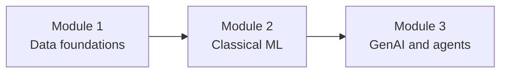

# Lecture Script: AI, ML & GenAI Landscape
> **Instructor Reference** — Module 1: Foundations of Data | Session 1 | Duration: 2 Hours

---

## Session Overview

**Goal:** Students leave with a clear mental map of AI, ML, and GenAI — and can classify real use cases without jargon or hype.

**Student profile at this point:** Complete beginners. Many have used ChatGPT or seen AI headlines but have no formal computer science or data background. Some may conflate all "smart" software with ML.

**Key outcome:** Every student can explain AI, ML, and GenAI in one sentence each, classify at least six real products into the right category, and map two business scenarios to the correct approach (rules, ML, or GenAI).

---

## Timing Breakdown

| Segment | Duration | Cumulative |
|---|---|---|
| Opening & Icebreaker | 5 min | 0:05 |
| **Concept 1:** AI as the Umbrella — Rules vs Learning | 10 min | 0:15 |
| **Practical 1:** Sort the Headlines — Classification Activity | 15 min | 0:30 |
| **Concept 2:** ML Problem Types & the Data Loop | 10 min | 0:40 |
| **Practical 2:** E-commerce Scenario Cards — Supervised or Not? | 15 min | 0:55 |
| **BREAK** | 10 min | 1:05 |
| **Concept 3:** GenAI vs Traditional ML — Compose vs Score | 10 min | 1:15 |
| **Practical 3:** When NOT to Use GenAI — Spot the Wrong Tool | 15 min | 1:30 |
| **Concept 4:** The AI Ecosystem — Roles, Data, and Course Roadmap | 10 min | 1:40 |
| **Practical 4:** Map Use Cases in Pairs — Full Problem Framing | 10 min | 1:50 |
| Summary & Wrap-Up | 5 min | 1:55 |
| Q&A & Doubt Solving | 5 min | 2:00 |

---

## SEGMENT 1: Opening & Hook (8 min)


**Hook:** Display three headlines on screen (or read aloud):

1. *"Netflix's recommendation engine drives 80% of what people watch."*
2. *"ChatGPT helps students draft essay outlines in seconds."*
3. *"Smart traffic lights adjust timing based on fixed rush-hour schedules."*

**Ask the class:** *"Which of these is AI? Which is ML? Which is GenAI? Are they all three?"*

Let students call out answers — do not correct yet. Write their guesses on the board.

**Context to set:** This course takes you from Python basics → data wrangling → classical ML → GenAI agents. Today is the map of the territory. If you leave knowing *which tool fits which problem*, every future session will feel connected — not like random topics.

**Learning contract for today:**
- Define AI, ML, and GenAI in plain language
- Classify real products and headlines into the right bucket
- Frame a business problem before anyone says "let's use ChatGPT"

**Say:** *"You do not need to memorise buzzwords. You need a decision instinct: given this problem, what kind of system fits?"*

---

## SEGMENT 2: AI Umbrella — Rules vs Learning (13 min)


### The Nested Picture

Draw three nested circles on the board (or show slide):

```
        ┌─────────────────────────────┐
        │  Artificial Intelligence    │
        │   ┌─────────────────────┐   │
        │   │  Machine Learning   │   │
        │   │   ┌─────────────┐   │   │
        │   │   │ Deep Learn  │   │   │
        │   │   │  / GenAI    │   │   │
        │   │   └─────────────┘   │   │
        │   └─────────────────────┘   │
        └─────────────────────────────┘
```

**Key teaching point:** **AI is not one product.** It is a field — like "medicine" covers surgery, pharmacy, and physiotherapy.

| Category | How it works | When it fits |
|---|---|---|
| Rule-based AI | Hand-written if-then logic | Rules are known and stable |
| Machine Learning | Learns patterns from data | Patterns exist but rules are too complex |
| Generative AI | Creates new text/media from prompts | Output is open-ended language or content |

**Examples on the board:**

| Product | Category | Why |
|---|---|---|
| Thermostat: if temp > 25°C → AC on | Rule-based AI | Fixed threshold, no training |
| Spam filter | ML (classification) | Learns from millions of labelled emails |
| ChatGPT | GenAI | Generates novel text from prompts |
| Face unlock on phone | ML (classification) | Learns your face from photos |

**Ask:** *"Is a calculator AI?"* → Discuss: it computes but does not mimic human judgment. Not everything automated is AI.

**Ask:** *"Is Excel with formulas AI?"* → Formulas are rules. A pivot table summarising data is analytics, not ML — unless you add a forecast function trained on history.

**Write on board:** **AI = umbrella | ML = learns from data | GenAI = creates content**

---

## SEGMENT 3: Sort the Headlines Lab (15 min)


### Setup (2 min)

**Say:** *"You are now product analysts. Your job is to sort real features into the right bucket — and defend your choice."*

Form pairs. Give each pair a handout (physical cards or shared doc) with **8 items** below. They have **8 minutes** to sort. Each item goes in exactly one primary bucket: **Rules**, **ML**, or **GenAI**.

### The 8 Cards

| # | Feature / Headline | Correct bucket | Reasoning |
|---|---|---|---|
| 1 | Face unlock on smartphone | ML | Trained on face images; classification |
| 2 | Bank SMS: "Transaction over ₹10,000 — reply YES to confirm" | Rules | Fixed threshold trigger |
| 3 | DALL·E generating an image from a text prompt | GenAI | Creates new visual content |
| 4 | Excel formula: `=IF(A1>100,"High","Low")` | Rules | Hand-written logic |
| 5 | Spotify Discover Weekly playlist | ML | Recommendation from listening history |
| 6 | Siri reading today's weather from a database | Rules + lookup | Fetches data; no learning in the query step |
| 7 | K-means customer segmentation for marketing | ML (unsupervised) | Finds groups without pre-set labels |
| 8 | GitHub Copilot suggesting the next line of code | GenAI | Generates code from context |

**Optional stretch card (if fast pairs finish early):**

| # | Feature | Tricky answer |
|---|---|---|
| 9 | Google Maps ETA prediction | ML | Uses traffic patterns from historical data |

### Facilitation Script

**Minute 0–8:** Pairs sort silently. Walk the room. Listen for debates — "Is Siri AI or not?" is a good sign.

**Minute 8–12:** Call on 3 pairs to defend one card each. Ask dissenters: *"What would change your mind?"*

**Minute 12–15:** Reveal answer key. Highlight the tricky ones:

- **Siri weather** — mostly rules + data lookup. The *voice recognition* part is ML; reading weather is not.
- **Excel IF** — not ML. If someone says "AI" because Excel is smart, clarify: *automation ≠ learning*.
- **K-means** — ML but **unsupervised**. No "correct answer" in training data.

**Debrief question:** *"Which cards could fit two buckets depending on how the product is built?"* → Face unlock could use rules in very old phones; modern ones use ML.

**Write on board:** When sorting, ask: **Does it learn from data, follow fixed rules, or generate new content?**

---

## SEGMENT 4: ML Problem Types & Data Loop (13 min)


### The Four Question Shapes

| ML task | Question it answers | Output type | Business example |
|---|---|---|---|
| Regression | How much? | Number | Next month's revenue |
| Classification | Which category? | Label (yes/no, A/B/C) | Will customer churn? |
| Clustering | What groups exist? | Segments | Shopper personas |
| Recommendation | What should we suggest next? | Ranked list | "Customers also bought…" |

**The ML loop — draw on board:**

```
Historical data → Train model → Trained model
                                      ↓
New input ─────────────────────→ Prediction
```

**Teaching point:** ML always needs **data** and a **clear question**. "Use ML" without both is a recipe for failure.

### Supervised vs Unsupervised — Quick Table

| | Supervised | Unsupervised |
|---|---|---|
| Has labels in training? | Yes | No |
| Example question | "Will this loan default?" | "What customer groups exist?" |
| Common algorithms | Logistic regression, random forest | K-means, PCA |
| Evaluation | Compare prediction to known answer | Harder — use business judgment |

**Ask:** *"HR wants to predict who will quit in the next 90 days. Supervised or unsupervised?"* → Supervised (past quitters are labelled).

**Ask:** *"Marketing wants to discover new audience segments. Supervised or unsupervised?"* → Unsupervised (no pre-defined segment labels).

---

## SEGMENT 5: E-commerce Scenario Cards (15 min)


### Setup

**Say:** *"Same company, four problems. For each: name the ML task type and whether it is supervised."*

Display or hand out:

| # | Scenario | Task type | Supervised? |
|---|---|---|---|
| 1 | Predict December sales in rupees | Regression | Yes |
| 2 | Flag fraudulent orders before shipping | Classification | Yes |
| 3 | Group customers by purchase behaviour for campaigns | Clustering | No |
| 4 | Recommend products on the homepage | Recommendation | Usually yes (implicit feedback) |

**Activity (10 min):** Pairs fill a table with four columns: **Scenario | AI/ML/GenAI | Task type | What data is needed**

Example row for scenario 2:

| Scenario | Category | Task | Data needed |
|---|---|---|---|
| Fraud flag | ML | Classification | Past orders labelled fraud/not fraud |

**Walkthrough (5 min):** Review answers on board. Stress data requirements:

- Regression needs historical sales numbers
- Classification needs labelled fraud examples (often imbalanced — few frauds, many legit)
- Clustering needs behavioural features (RFM: recency, frequency, monetary)
- GenAI is **not** the first choice for fraud — you need auditable scores

**Ask:** *"What happens if you have no labelled fraud data?"* → You cannot train a supervised classifier yet. Options: rule-based starter, partner with bank, or manual review queue.

---

## BREAK (10 min)

---


*Suggested break prompt:* Ask students to open one app on their phone and identify one feature that is probably ML and one that is probably rules. They will share one finding after the break.

---

## SEGMENT 6: GenAI vs ML — Compose vs Score (13 min)


### The One-Line Distinction

**Write on board:** **ML scores or labels. GenAI composes.**

| | Traditional ML | Generative AI |
|---|---|---|
| Typical output | Number, category, score | Paragraph, code, image |
| Training data | Structured tables, labels | Massive text/media corpora |
| Evaluation | Accuracy, precision, RMSE | Harder — human review, rubrics |
| Best for | Prediction, ranking, detection | Drafting, explaining, brainstorming |
| Risk profile | Wrong number | Confident wrong answer (hallucination) |

### What GenAI Is Good At (in 2025)

- Drafting emails, summaries, meeting notes
- Explaining code or generating boilerplate
- Answering natural-language questions *when grounded in documents* (RAG — Module 3)
- Brainstorming marketing copy or interview prep

### What GenAI Is NOT a Substitute For

- Loan approval from structured financial features → **ML classifier**
- Inventory forecast from sales history → **ML regression**
- Guaranteed-correct legal or medical advice → **needs human expert + guardrails**
- Real-time fraud scoring at millisecond latency → **trained ML model in production**

**Ask:** *"Why would a bank not rely on ChatGPT alone for fraud detection?"*

Expected answers: latency, cost, hallucination, audit trail, no access to private transaction data in a public model.

**Key message:** GenAI is a powerful **interface layer**. Classical ML is often the **decision engine** underneath. This course teaches both — in the right order.

---

## SEGMENT 7: When NOT to Use GenAI (15 min)


### The "AI Solution" Pitch Game

Read four startup pitches aloud. Students vote: **Good fit**, **Wrong tool**, or **Needs hybrid**.

| # | Pitch | Verdict | Why |
|---|---|---|---|
| 1 | "We'll use ChatGPT to predict employee attrition from HR spreadsheets." | Wrong tool | Structured prediction → ML classification |
| 2 | "We'll use a fine-tuned LLM to draft personalised onboarding emails from employee profiles." | Good fit / hybrid | Generation task; may combine with templates |
| 3 | "We'll use GenAI to cluster customers by purchase history." | Wrong tool | Clustering is unsupervised ML on numeric features |
| 4 | "We'll use RAG so support agents query our policy PDFs in plain English." | Good fit | GenAI + retrieval — Module 3 topic |

**Activity (8 min):** Pairs rewrite pitch #1 correctly. One sentence: *"Given employee history, the system should output leave probability."* Then name the right approach.

**Share (5 min):** 2–3 pairs read their rewrite. Class votes.

**Minimal code optional (2 min):** If room has laptops, show that "classification" is a one-liner conceptually — no full training today:

```python
# Conceptual only — not training a real model today
# ML classification OUTPUT: a label and often a probability
example_output = {"employee_id": 1042, "churn_risk": "high", "probability": 0.87}
print(example_output)

# GenAI OUTPUT: open-ended text
genai_output = "Based on the profile, this employee may be disengaged because..."
print(genai_output)
```

**Say:** *"See the shape difference? One is a score you can threshold. One is prose you must interpret."*

**Expected output:**

```
{'employee_id': 1042, 'churn_risk': 'high', 'probability': 0.87}
Based on the profile, this employee may be disengaged because...
```

---

## SEGMENT 8: Ecosystem & Roadmap (12 min)


### Who Does What

| Role | Primary focus | Example deliverable |
|---|---|---|
| Data analyst | Explore and report | Weekly sales dashboard |
| Data engineer | Pipelines and storage | Nightly sync from app to data warehouse |
| Data scientist | Model training and evaluation | Churn model with 0.85 AUC |
| ML engineer | Production deployment | Fraud API serving 1000 req/sec |
| GenAI / AI engineer | LLM integration, agents | Policy Q&A bot with citations |
| Product manager | Problem definition, metrics | PRD: "Reduce support tickets 20%" |

**Ask:** *"Who owns the question 'Is this model fair to all customer segments?'"* → Data scientist + product + domain expert. Not the model alone.

### The Data Foundation

**Say:** *"Every role above depends on clean, accessible data. That is Module 1."*

Show course roadmap slide:

| Module | Topics | You will be able to… |
|---|---|---|
| Module 1 — Foundations of Data | Python, Pandas, SQL, EDA, APIs | Load, clean, query, and visualise data |
| Module 2 — Classical ML | scikit-learn, validation, metrics | Train and compare predictive models |
| Module 3 — GenAI & Agents | LLMs, RAG, tools, guardrails | Build grounded AI products |



**Career paths — quick mention:**

- Love spreadsheets and charts → analyst track
- Love coding and pipelines → engineer track
- Love models and experiments → scientist track
- Love products and users → PM with AI literacy

No single path is "best." Today's session helps you see where *you* might fit.

---

## SEGMENT 9: Problem Framing Lab (10 min)


### Four Business Scenarios

Pairs complete a worksheet with columns: **Problem | Output type | Rules / ML / GenAI | Supervised? | Data needed**

| # | Scenario | Expected framing |
|---|---|---|
| 1 | HR: screen 500 resumes for "Python" skill | Hybrid: keyword rules or ML ranking; GenAI for summary drafts only |
| 2 | Retail: forecast inventory for monsoon season | ML regression; historical sales + weather features |
| 3 | Support: answer FAQs from a fixed policy doc | GenAI + RAG (Module 3); not pure prompt-only |
| 4 | Fintech: detect anomalous login locations | ML classification or anomaly detection; labelled past fraud helps |

**Timing:** 6 min work, 4 min debrief — one scenario from two pairs.

**Instructor Say for scenario 1:** *"Is 'contains the word Python' ML?"* → Rule. *"Is 'rank best fit candidates' ML?"* → Often yes, if trained on past hire outcomes.

**Exit ticket (last 2 min):** On a sticky note or chat, one sentence each:
- AI is…
- ML is…
- GenAI is…

Collect or read a sample aloud.

---

## SEGMENT 10: Summary & Wrap (8 min)


**What we covered today:**
- AI as the umbrella — rules, ML, and GenAI inside it
- ML task types: regression, classification, clustering, recommendation
- Supervised vs unsupervised — labels matter
- GenAI composes; ML scores — do not swap them blindly
- Ecosystem roles and the Module 1 → 2 → 3 path

**Bridge to next session:** *"Next class you open Google Colab and write real Python — variables, types, and your first interactive programs. Every model and dashboard later is built from those bricks."*

**Homework / self-practice:**
1. Pick three apps you use daily. For each feature, label it Rules, ML, or GenAI and write one sentence why.
2. Read the pre-read section E again. Which role sounds most interesting to you? Write two sentences on why.
3. Optional: find one news headline about "AI" this week and rewrite it with the correct term (ML, GenAI, or rules).

---

## Q&A & Doubt Solving (5 min)

**Likely questions and suggested answers:**

**Q: Is deep learning the same as ML?**
→ Deep learning is a *subset* of ML using neural networks with many layers. All deep learning is ML; not all ML is deep learning. Logistic regression is ML but not deep learning.

**Q: Do I need to learn classical ML if GenAI can do everything?**
→ Yes. Production systems combine both. GenAI is expensive and non-deterministic for many tasks. A ₹0.001 fraud score from a small ML model beats a ₹0.50 LLM call.

**Q: What's the difference between data analyst and data scientist?**
→ Analysts focus on exploration, reporting, and insights. Scientists focus on building and evaluating predictive models. Overlap exists — titles vary by company.

**Q: Is ChatGPT "AI" or "GenAI"?**
→ Both. It is a GenAI product (generates text). GenAI is a type of AI. In interviews, be specific: "GenAI assistant" is clearer than "AI."

**Q: Can a rule-based system ever be better than ML?**
→ Yes. When rules are complete, stable, and auditable — tax brackets, OTP thresholds, eligibility cutoffs. ML adds value when rules cannot capture the pattern.

---

## Instructor Notes

- **No laptop required** for most of this session — cards and board work well. Optional Python snippet in Practical 3 if time and devices allow.
- **Common student mistake:** Calling everything "AI" because it is automated. Push back gently: *"Does it learn from data?"*
- **Another mistake:** Assuming GenAI replaces data cleaning. Emphasise Module 1 data skills as non-negotiable foundation.
- **Engagement tip:** The Sort the Headlines activity is the energy peak — debrief thoroughly; do not rush.
- **Time check:** If running long before break, shorten Practical 2 walkthrough and assign e-commerce table as homework.
- **If running long after break:** Shorten Practical 4 to two scenarios instead of four.
- **Materials to prepare:** 8 (+1 optional) printed or digital cards; course roadmap slide; exit ticket sticky notes or chat form.
- **Diversity note:** Use Indian context examples (UPI fraud alerts, monsoon inventory, ₹ thresholds) — students relate faster than US-only examples.

---

## Common Errors (Student Mental Models to Correct)

| Misconception | Correction |
|---|---|
| "AI = ChatGPT" | AI is a field; ChatGPT is one GenAI product |
| "More AI is always better" | Match tool to problem; rules are often enough |
| "ML works with no data" | ML needs examples; quality and quantity matter |
| "GenAI always tells the truth" | Hallucination is a core risk; verify outputs |
| "I can skip Python and jump to LLMs" | Data and code skills underpin every AI role |

---

## Appendix: Full Classification Answer Key (Instructor Only)

| Item | Bucket | One-line defence |
|---|---|---|
| Face unlock | ML | Learns face patterns from images |
| Bank OTP threshold | Rules | Fixed amount trigger |
| DALL·E | GenAI | Creates images from text |
| Excel IF | Rules | User-written logic |
| Discover Weekly | ML | Learns taste from history |
| Siri weather | Rules + lookup | Retrieves API data |
| K-means segments | ML (unsupervised) | Finds clusters in data |
| Copilot | GenAI | Generates code suggestions |
| Maps ETA | ML | Predicts from traffic patterns |


---

## SEGMENT 11: Supplemental Code Demos (Instructor Optional)

### Demo A — Rule threshold vs ML score (3 min)

```python
amount = 15000
if amount > 10000:
    print("RULE: OTP required for ₹", amount)
fraud_score = 0.82
if fraud_score > 0.7:
    print("ML: Review transaction — score", fraud_score)
```

**Output:**
```
RULE: OTP required for ₹ 15000
ML: Review transaction — score 0.82
```

**Break it down:**
- First block is rule-based — same threshold for everyone
- fraud_score simulates a trained model output
- Production UPI uses both rules and ML

**Ask:** Where would you draw the line between rule and ML for a ₹50,000 transfer?

**Common mistake:** Putting every check in ML.

**Fix:** Keep hard regulatory limits as auditable rules; use ML for pattern anomalies.

### Demo B — Churn risk toy loop (3 min)

```python
customers = [
    {"name": "Asha", "days_idle": 120, "churned": 1},
    {"name": "Ravi", "days_idle": 5, "churned": 0},
    {"name": "Meera", "days_idle": 95, "churned": 1},
]
for c in customers:
    risk = "high" if c["days_idle"] > 90 else "low"
    print(c["name"], "→", risk, "| actual:", c["churned"])
```

**Output:**
```
Asha → high | actual: 1
Ravi → low | actual: 0
Meera → high | actual: 1
```

**Break it down:**
- List of dicts represents a customer table
- Simple rule mimics what ML learns automatically
- Labels in churned column — supervised learning target

**Ask:** What features would Flipkart use to predict delivery delay?

**Common mistake:** Saying ML needs no data.

**Fix:** List features: distance, prep time, rain, traffic, time of day.

### Demo C — Compose vs score (3 min)

```python
customer, issue = "Priya", "late delivery"
draft = f"Dear {customer}, we apologise for the {issue}. ₹100 credit applied."
print("GENAI DRAFT:", draft)
score = 0.91
print("ML FRAUD SCORE:", score)
```

**Output:**
```
GENAI DRAFT: Dear Priya, we apologise for the late delivery. ₹100 credit applied.
ML FRAUD SCORE: 0.91
```

**Break it down:**
- f-string draft simulates GenAI-style composition
- Single numeric score suits audit and thresholds
- Same company may use both in one workflow

**Ask:** Why should fraud score not be a free-form GenAI paragraph?

**Common mistake:** Using GenAI for numeric decisions without validation.

**Fix:** Use ML classifier with logged features and reproducible scores.

### Indian context scenario bank (reference)

| # | Scenario | Expected category | Notes |
|---|---|---|---|
| 1 | BHIM UPI daily limit check | Rules | Fixed ₹1,00,000/day |
| 2 | Zomato restaurant ranking | ML | Learning from ratings and orders |
| 3 | Bank chatbot draft for failed txn | GenAI | Open-ended language |
| 4 | IRCTC tatkal queue position display | Rules + lookup | Not predictive ML |
| 5 | Paytm fraud anomaly flag | ML | Learns unusual patterns |
| 6 | Canva text-to-image banner | GenAI | Creates new media |
| 7 | GST slab calculation | Rules | Statutory brackets |
| 8 | Swiggy rain surge multiplier | Rules or ML hybrid | Business chooses design |

### Facilitation timing cheat sheet

| Minute | Activity | Instructor move |
|---|---|---|
| 0–5 | Headline hook | Write guesses, no corrections |
| 5–15 | AI umbrella | Draw nested circles |
| 15–30 | Sort headlines | Walk room during pair work |
| 30–40 | ML problem types | Draw data loop |
| 40–55 | E-commerce cards | Stress data requirements |
| 55–65 | Break | Prompt: one ML + one rule feature on phone |
| 65–75 | GenAI vs ML | Emphasise compose vs score |
| 75–90 | Wrong tool pitches | Pairs rewrite pitch #1 |
| 90–100 | Ecosystem | Show Module 1→3 roadmap |
| 100–110 | Problem framing | Exit ticket three definitions |
| 110–120 | Q&A + quiz | Collect exit tickets |

### Exit ticket rubric

| Response quality | AI definition | ML definition | GenAI definition |
|---|---|---|---|
| Strong | Field / umbrella | Learns from data | Creates content |
| Acceptable | Smart computers | Prediction from data | ChatGPT-like |
| Needs follow-up | "ChatGPT" only | "Advanced AI" vague | Same as AI |

### Pre-read alignment notes

| Pre-read section | Live session segment | Do not repeat |
|---|---|---|
| A — AI umbrella | Segment 2 | Full history timeline |
| B — ML types | Segment 4 | Every algorithm name |
| C — GenAI | Segment 6 | Transformer architecture depth |
| D — Framing | Segment 9 | Full responsible AI policy |
| E — Ecosystem | Segment 8 | Salary discussions |

### Student worksheet — Problem framing template

```
Scenario name: _______________________
Given (inputs): _______________________
The system should output: _______________________
Output type (circle): number | label | text/media
Best approach (circle): Rules | ML | GenAI
Supervised? yes / no / n/a
One data source needed: _______________________
One responsible AI question: _______________________
```

### Stretch activities for fast pairs

1. Debate: Should Swiggy ETA be rules or ML? Defend with data needs.
2. Rewrite a news headline that says "AI" with the precise term.
3. Sketch a hybrid flow: UPI txn → rule limit → ML anomaly → GenAI customer SMS draft → human approve.

### Glossary wall (post on LMS)

| Term | One-line student definition |
|---|---|
| AI | Computers doing tasks that seem intelligent |
| ML | Systems that improve by learning patterns in data |
| GenAI | AI that creates new text, code, or images |
| Supervised | Learning from examples with known answers |
| Unsupervised | Finding structure without labels |
| Hallucination | GenAI stating false facts confidently |
| RAG | Search docs first, then generate answer |
| Regression | Predicting a number |
| Classification | Predicting a category |

---

## End-of-Session Quiz (5 Questions)

1. Define AI, ML, and GenAI in one sentence each.
2. Classify: UPI OTP above ₹10,000; Swiggy ETA; ChatGPT email draft.
3. What ML problem type is "predict monthly sales"?
4. Name two responsible AI habits when using GenAI for customer support.
5. Which role builds nightly data pipelines — analyst, engineer, or scientist?

**Answer key (instructor):** AI=umbrella field; ML=learns from data; GenAI=creates content. Rules/ML/GenAI respectively. Regression. Human review; verify facts. Data engineer.

---

## Homework Rubric

| Criterion | Excellent (4) | Good (3) | Needs Work (2) | Incomplete (1) |
|---|---|---|---|---|
| Use-case mapping | 4 clear categories with data sources | 3 mostly correct | 2 with gaps | 1 or missing |
| Headline sort | 8/8 defended | 6–7/8 | 4–5/8 | <4 |
| Written framing | 2 scenarios with I/O types | 2 partial | 1 complete | 0 |
| Reflection | Thoughtful responsible AI note | Good | Brief | Missing |

**Total:** /16 — Pass threshold: 10/16

---

## Materials Checklist

- [ ] Slide: nested AI / ML / GenAI diagram
- [ ] 8 (+1 optional) classification cards
- [ ] Course roadmap slide (Modules 1–3)
- [ ] Whiteboard markers
- [ ] Exit ticket form or sticky notes
- [ ] Timer visible to students

---

## Timing Contingencies

| Situation | Action |
|---|---|
| Running 10 min behind before break | Shorten Practical 2 walkthrough; assign e-commerce table as homework |
| Running long after break | Shorten Practical 4 to two scenarios instead of four |
| Low energy | Stand/sit vote on one headline card |
| Advanced students finish early | Stretch: Google Maps ETA — ML or rules? |
| No projector | Use chat poll for headline sort |

---

## FAQ — Q&A (8+ Questions)

**Q: Is ChatGPT "AI" or "GenAI"?** → Both. GenAI product inside AI field. Say "GenAI assistant" in interviews.

**Q: Can a rule-based system beat ML?** → Yes when rules are complete, stable, auditable.

**Q: Do I need math for ML?** → Module 1 builds Python/data first; Module 2 adds needed math.

**Q: Is Excel with formulas AI?** → Formulas are rules. Forecast on history is ML.

**Q: What's deep learning vs ML?** → Deep learning uses neural nets with many layers.

**Q: Will GenAI replace data jobs?** → No — pipelines and cleaning stay essential.

**Q: What is RAG?** → Retrieval + generation — Module 3 topic.

**Q: How pick a career path?** → Match ecosystem role to what excites you.


---

## SEGMENT 12: Instructor Deep-Dive — Indian Market Examples

### Case study table — classify together

| Product feature | Rules | ML | GenAI | Notes |
|---|---|---|---|---|
| NPCI UPI txn limit | ✓ | | | Regulatory cap |
| Paytm fraud alert | | ✓ | | Scores from history |
| Swiggy menu description AI | | | ✓ | Draft text |
| IRCTC waitlist number | ✓ | | | Deterministic queue |
| Amazon "customers also bought" | | ✓ | | Recommendation |
| Bank GenAI email draft | | | ✓ | Human review required |

### Code block — framing helper

```python
def frame_problem(given: str, output: str) -> dict:
    kind = "unknown"
    if output in ("number", "label"):
        kind = "ML"
    elif output == "text":
        kind = "GenAI"
    elif output == "rule":
        kind = "Rules"
    return {"given": given, "output": output, "suggested": kind}

print(frame_problem("past sales", "number"))
print(frame_problem("policy PDF question", "text"))
```

**Output:**
```
{'given': 'past sales', 'output': 'number', 'suggested': 'ML'}
{'given': 'policy PDF question', 'output': 'text', 'suggested': 'GenAI'}
```

**Break it down:**
- Function returns a dict summary — preview of structured thinking
- Output type drives suggested category
- Real projects start with this conversation before coding

**Ask:** What output type for "is this email spam?"

**Common mistake:** Skipping the output-type question and jumping to tools.

**Fix:** Write one sentence: *Given ___, output ___.*

### Interview prep — one-liners

| Term | One-liner for interviews |
|---|---|
| AI | Field of systems mimicking intelligent tasks |
| ML | Subset that learns patterns from data |
| GenAI | Creates new content from prompts |
| Supervised | Learning with labelled examples |
| Hallucination | Confident but wrong GenAI output |

### Session 1 exit checklist

- [ ] Student can define AI, ML, GenAI
- [ ] Student sorted 6+ headline cards correctly
- [ ] Student completed one framing worksheet row
- [ ] Student named one responsible AI habit
- [ ] Student knows Module 1→3 roadmap

