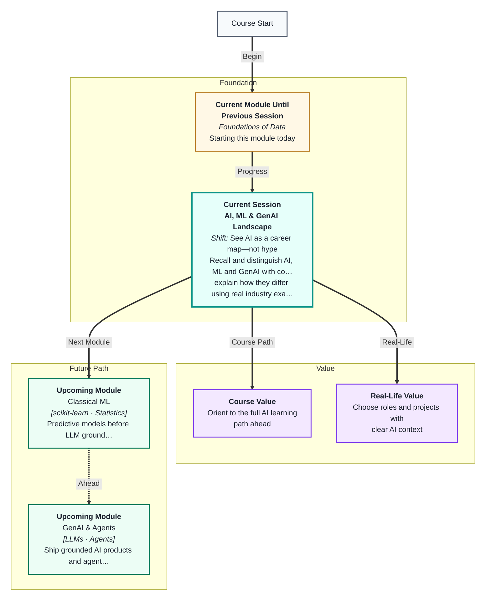
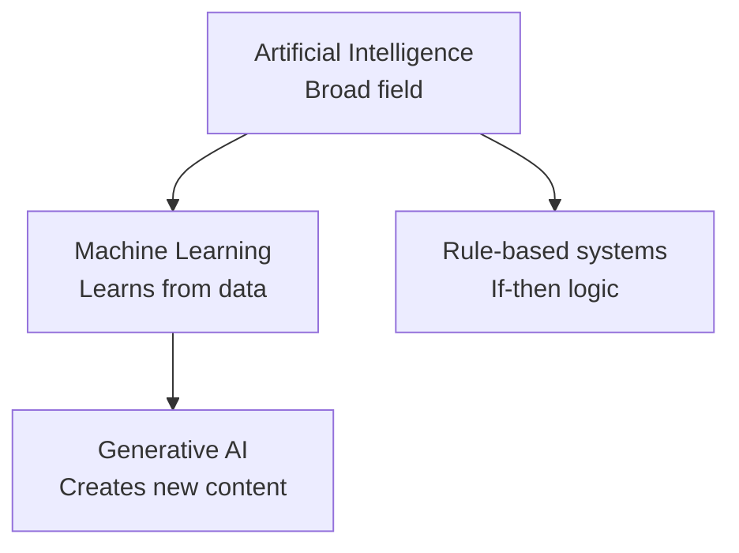
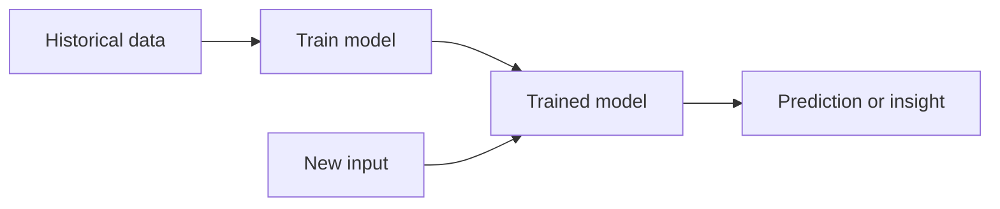
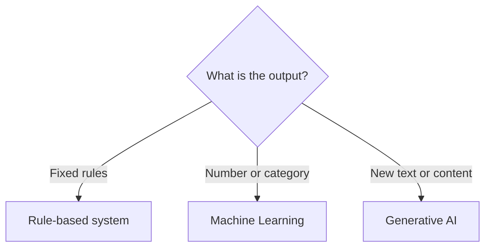

# AI, ML & GenAI Landscape
---

## Mental Map

## What You'll Learn

In this pre-read, you'll discover:

- What **AI**, **ML**, and **GenAI** mean — in plain language, not buzzwords
- Real **industry examples** that show where each term applies
- The main **types of ML problems** (prediction, grouping, generation)
- How the **AI/ML ecosystem** fits together — data, models, apps, and people
- How to **map a business use case** to the right category before writing code

---

## A. Artificial Intelligence — The Big Umbrella

> 💡 **Analogy:** AI is like the entire **transport industry** — cars, buses, trains, and planes all move people, but they work in different ways. ML and GenAI are specific vehicles inside that industry.

**One-line definition:** **Artificial Intelligence (AI)** is any computer system designed to perform tasks that normally require human intelligence — like understanding language, recognising images, or making decisions.

| Term | What it does | Example |
|---|---|---|
| AI | Mimics intelligent behaviour | Voice assistant, chess engine |
| ML | Learns patterns from data | Spam filter, price prediction |
| GenAI | Generates text, images, code | ChatGPT, image generators |

---

## B. Machine Learning — Learning From Data

> 💡 **Analogy:** Teaching a child to recognise fruits by showing hundreds of photos works better than listing rules like "if red and round, it's an apple." **ML** learns from examples instead of hand-written rules.

**One-line definition:** **Machine Learning (ML)** is a branch of AI where systems improve at a task by finding patterns in data — without being explicitly programmed for every case.

| ML type | Has labels? | Goal | Example |
|---|---|---|---|
| Supervised | Yes | Predict known outcomes | Will customer churn? |
| Unsupervised | No | Find hidden structure | Customer segments |
| Reinforcement | Rewards | Learn best actions | Game-playing bots |

---

## C. Generative AI — Creating New Content

> 💡 **Analogy:** A **photocopier** copies what exists. A **GenAI** tool is more like a skilled writer who has read millions of books and can draft a new paragraph in your style — original output, trained on existing data.

**One-line definition:** **Generative AI (GenAI)** uses large models trained on vast text or media to **create** new content — answers, summaries, code, images — from a prompt.

| Traditional ML | GenAI |
|---|---|
| Predicts a number or category | Generates open-ended text or media |
| Needs structured training data | Trained on language or multimodal data |
| Output is fixed (0/1, price) | Output is flexible (paragraphs, code) |

---

## D. Mapping Use Cases to the Right Category

> 💡 **Analogy:** Before ordering food, you decide: dine-in, takeaway, or cook at home. Picking **AI vs ML vs GenAI** is the same — match the tool to the job.

**One-line definition:** **Problem framing** means naming what you want the system to do so you choose the right approach — rules, ML model, or GenAI assistant.

| Use case | Best fit | Why |
|---|---|---|
| Sort emails into folders with fixed rules | Rules / classic AI | Logic is known upfront |
| Predict next month's sales | ML (regression) | Pattern in historical numbers |
| Draft a customer support reply | GenAI | Open-ended language generation |
| Group shoppers by behaviour | ML (clustering) | No pre-defined labels |

---

## Practice Exercises

**1. Pattern Recognition** — For each item, label it AI, ML, or GenAI: (a) Netflix recommending shows, (b) a chatbot writing an email draft, (c) a thermostat following "if temp > 25, turn on AC."

**2. Concept Detective** — A startup wants to "use AI" to detect fraudulent credit card transactions. Which category fits best? What kind of ML problem is it?

**3. Real-Life Application** — List three jobs in your city that touch AI, ML, or GenAI. For each, say which term applies and one task they might do.

**4. Spot the Error** — Someone says: "We don't need ML — we'll just use ChatGPT to predict whether a loan should be approved." What is wrong with this plan?

**5. Planning Ahead** — Pick one app you use daily. Sketch whether it likely uses rules, ML, GenAI, or a mix — and what data it might need.

---

> ✅ **You're done!** You can now tell AI, ML, and GenAI apart and place real products in the right bucket. Next session you will write your first Python programs in Colab — the language everything else builds on.
