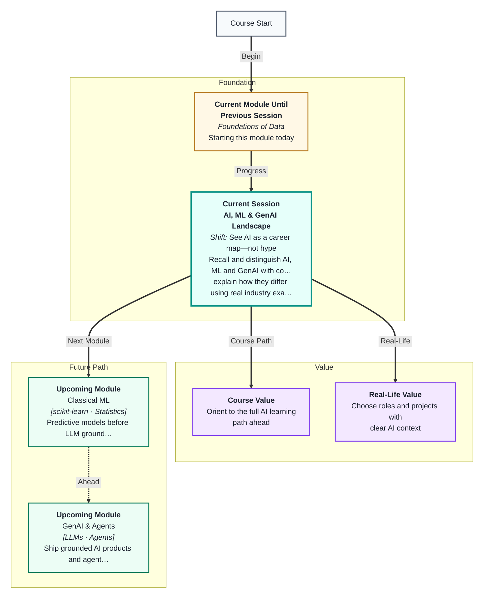
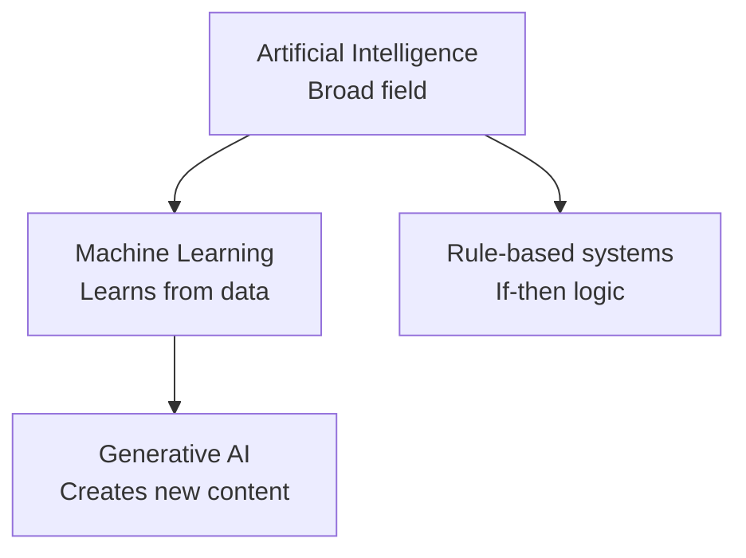
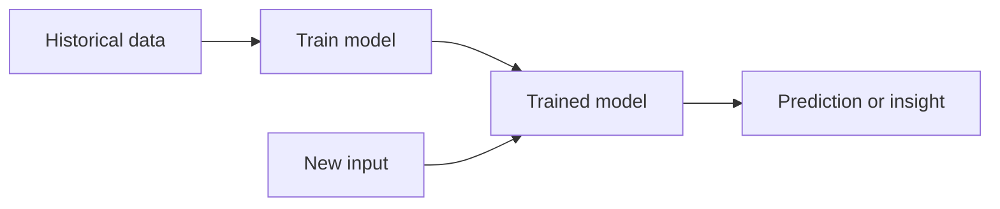
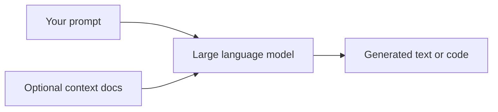
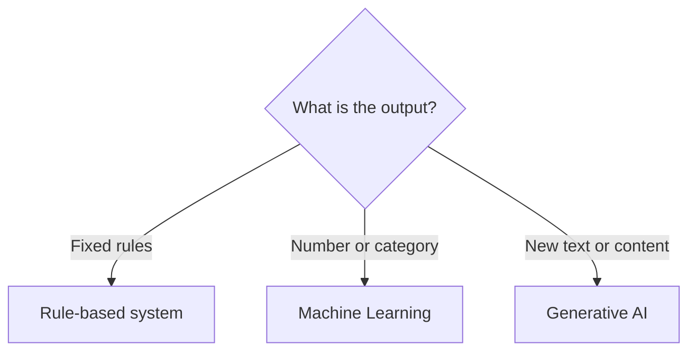
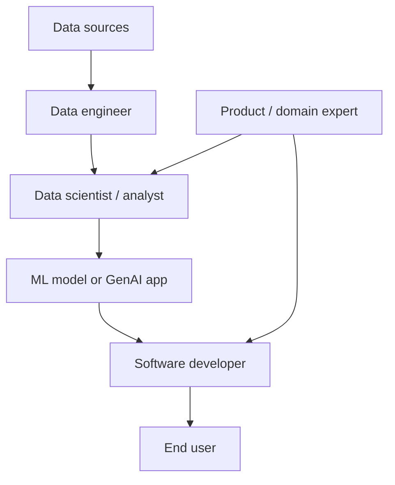
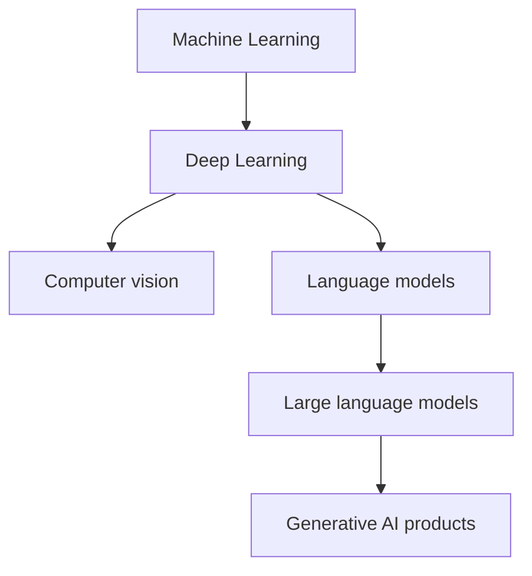
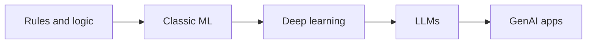
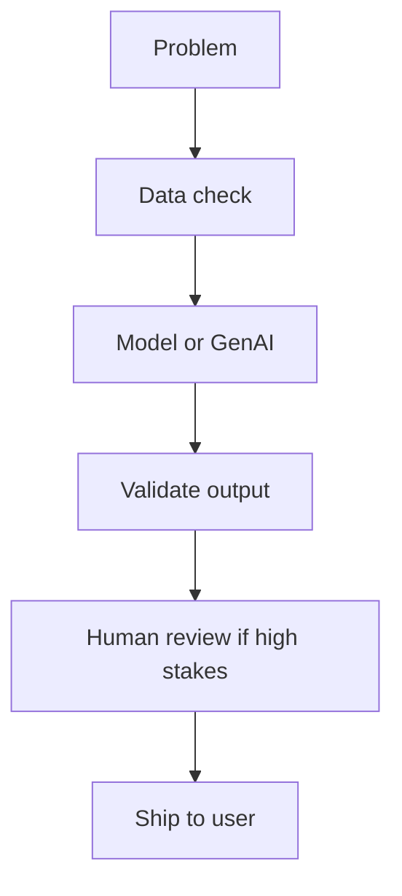
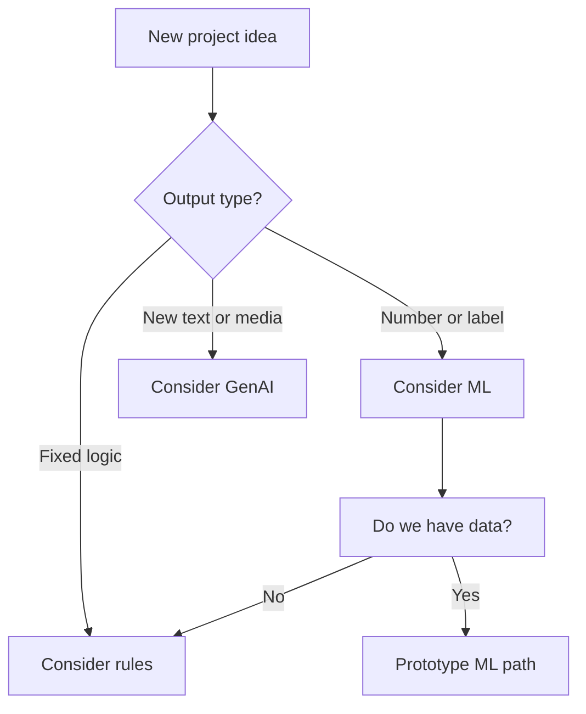

# AI, ML & GenAI Landscape
---

## Mental Map

## What You'll Learn

In this pre-read, you'll discover:

- What **AI**, **ML**, and **GenAI** mean — in plain language, not buzzwords
- Real **industry examples** that show where each term applies in India and globally
- The main **types of ML problems** (prediction, grouping, generation) and when each fits
- How the **AI/ML ecosystem** fits together — data, models, apps, and people
- How to **map a business use case** to the right category before writing code
- Where **deep learning** and **GenAI** sit inside the bigger picture
- Why **responsible AI** matters even when you are just starting out

---

## A. Artificial Intelligence — The Big Umbrella

> 💡 **Analogy:** AI is like the entire **transport industry** — cars, buses, trains, and planes all move people, but they work in different ways. ML and GenAI are specific vehicles inside that industry.

**One-line definition:** **Artificial Intelligence (AI)** is any computer system designed to perform tasks that normally require human intelligence — like understanding language, recognising images, or making decisions.

When someone says "we use AI," they might mean anything from a simple rule ("if balance is low, send alert") to a deep learning model that reads X-rays. The word **AI** is broad. Your job as a learner is to ask: *What kind of AI? What does it actually do?*

| Term | What it does | Example in daily life |
|---|---|---|
| AI | Mimics intelligent behaviour | Voice assistant, chess engine |
| ML | Learns patterns from data | Spam filter, price prediction |
| GenAI | Generates text, images, code | ChatGPT, image generators |
| Rules | Follows fixed instructions | OTP alert above ₹10,000 |

**Rule-based AI** uses hand-written logic. A thermostat that turns on AC when temperature exceeds 25°C is AI — but nobody trained it on data. It follows fixed instructions.

**Data-driven AI** (ML and GenAI) improves by learning from examples. That is the path this course emphasises because real-world problems rarely fit neat if-then rules.

**Worked example — UPI payment alert:**

| Step | System type | Why |
|---|---|---|
| Transaction amount > ₹10,000 | Rule-based | Fixed threshold, no training |
| "Is this transaction unusual for this user?" | ML (anomaly) | Learns normal spending patterns |
| Chatbot explains why payment failed | GenAI | Generates natural-language reply |

**Key idea:** Not every "smart" product uses ML. Knowing the difference stops you from over-engineering simple problems or under-investing in complex ones.

---

## B. Machine Learning — Learning From Data

> 💡 **Analogy:** Teaching a child to recognise fruits by showing hundreds of photos works better than listing rules like "if red and round, it's an apple." **ML** learns from examples instead of hand-written rules.

**One-line definition:** **Machine Learning (ML)** is a branch of AI where systems improve at a task by finding patterns in data — without being explicitly programmed for every case.

The ML loop is always the same at a high level: collect historical data, train a model to find patterns, then use that model on new inputs.

| ML type | Has labels? | Goal | Example |
|---|---|---|---|
| Supervised | Yes | Predict known outcomes | Will customer churn? |
| Unsupervised | No | Find hidden structure | Customer segments |
| Reinforcement | Rewards | Learn best actions | Game-playing bots |

**Supervised learning** is the most common in business. You have past examples with known answers: "this customer left," "this transaction was fraud," "this house sold for ₹50 lakh." The model learns to predict the answer for new cases.

**Unsupervised learning** finds groups or patterns when nobody labelled the data. Marketing teams use it to discover customer segments they did not know existed.

**Reinforcement learning** learns by trial and error with rewards — common in robotics and game AI, less common in day-one data jobs.

| Problem shape | ML task type | Output |
|---|---|---|
| How much will sales be next month? | Regression | A number |
| Is this email spam? | Classification | A category (yes/no) |
| Which customers behave similarly? | Clustering | Groups |
| Which product should we recommend? | Recommendation | Ranked list |

**Worked example — Flipkart delivery ETA:**

1. **Input data:** past orders, distance, traffic, weather, time of day
2. **Training:** model learns which factors predict late vs on-time delivery
3. **Output:** "Arrives by 6 PM" shown in the app — a predicted number or time window
4. **Category:** supervised regression or classification depending on design

**Key idea:** ML needs data — usually lots of it — and a clear question. "Use ML" without defining the question leads to confusion.

---

## C. Generative AI — Creating New Content

> 💡 **Analogy:** A **photocopier** copies what exists. A **GenAI** tool is more like a skilled writer who has read millions of books and can draft a new paragraph in your style — original output, trained on existing data.

**One-line definition:** **Generative AI (GenAI)** uses large models trained on vast text or media to **create** new content — answers, summaries, code, images — from a prompt.

GenAI burst into public view with tools like ChatGPT, but the idea builds on years of **deep learning** — neural networks with many layers that learn rich representations from data.

| Traditional ML | GenAI |
|---|---|
| Predicts a number or category | Generates open-ended text or media |
| Needs structured training data | Trained on language or multimodal data |
| Output is fixed (0/1, price) | Output is flexible (paragraphs, code) |
| Easier to measure accuracy | Harder to judge "correctness" |

**What GenAI is good at:**
- Drafting emails, summaries, and documentation
- Explaining code or generating boilerplate
- Brainstorming ideas and rephrasing content
- Answering questions when paired with search (RAG — covered later in the course)

**What GenAI struggles with:**
- **Hallucination** — confident-sounding answers that are factually wrong
- Precise numeric prediction without proper data pipelines
- Decisions that require strict audit trails without guardrails
- Tasks where a small, cheap ML model would be faster and more reliable

**Worked example — support email draft vs fraud score:**

| Task | Right tool | Wrong tool | Why |
|---|---|---|---|
| Draft reply to angry customer | GenAI | Rule-only | Language is open-ended |
| Score transaction fraud 0–1 | ML classifier | GenAI alone | Needs auditable numeric score |
| Summarise 50-page policy PDF | GenAI + RAG | Manual copy-paste | Generation + retrieval |

**Key idea:** GenAI *composes*; traditional ML *scores* or *labels*. A fraud system needs a classifier trained on labelled transactions. A support agent might use GenAI to draft replies — but a human or rule should approve them.

---

## D. Mapping Use Cases to the Right Category

> 💡 **Analogy:** Before ordering food, you decide: dine-in, takeaway, or cook at home. Picking **AI vs ML vs GenAI** is the same — match the tool to the job.

**One-line definition:** **Problem framing** means naming what you want the system to do so you choose the right approach — rules, ML model, or GenAI assistant.

Before any project, ask three questions:

1. **What is the output?** A number, a label, or new text/media?
2. **Do we have historical examples?** ML needs data; rules need known logic.
3. **How wrong can we afford to be?** High-stakes decisions need validation, not just a chatbot.

| Use case | Best fit | Why |
|---|---|---|
| Sort emails into folders with fixed rules | Rules / classic AI | Logic is known upfront |
| Predict next month's sales | ML (regression) | Pattern in historical numbers |
| Draft a customer support reply | GenAI | Open-ended language generation |
| Group shoppers by behaviour | ML (clustering) | No pre-defined labels |
| Detect credit card fraud | ML (classification) | Learns subtle patterns from past fraud |
| Answer questions about company policy | GenAI + search (RAG) | Needs flexible language, grounded in docs |

**Step-by-step framing exercise:**

1. Write: *"Given ___, the system should output ___."*
2. Circle the output type: number, label, or text/media
3. Pick rules, ML, or GenAI from the table above
4. List one data source you would need

**Example:** *"Given past sales and festival dates, the system should output next month's revenue in rupees."* → Output is a number → ML regression → needs historical sales CSV.

**Common mistake:** Using GenAI for everything because it is trendy. Predicting loan default from structured financial data is an ML classification problem — not a prompt to ChatGPT.

**Key idea:** One clear sentence about input and output usually reveals the right category before anyone opens an IDE.

---

## E. The AI/ML Ecosystem — People, Data, and Products

> 💡 **Analogy:** Making a movie needs writers, actors, cameras, and editors — not just one star. **AI products** need data engineers, scientists, developers, and domain experts working together.

**One-line definition:** The **AI ecosystem** is the network of roles, tools, and data flows that turn raw information into intelligent applications.

| Role | Main focus | Example task |
|---|---|---|
| Data analyst | Explore and report on data | Build sales dashboard in Excel or Python |
| Data engineer | Move and store data reliably | Build nightly pipeline from app to warehouse |
| Data scientist | Train and evaluate models | Build churn prediction model |
| ML engineer | Deploy models to production | Serve fraud model with low latency |
| AI/GenAI engineer | Integrate LLMs and agents | Build RAG chatbot over company docs |
| Product manager | Define problem and success metrics | Decide what "good recommendation" means |

**Data** sits at the centre of everything in this course. Module 1 teaches you to wrangle data with Python, Pandas, and SQL. Module 2 teaches classical ML. Module 3 teaches GenAI and agents. You cannot skip the foundation.

| Course module | You learn | Typical job tasks |
|---|---|---|
| Module 1 — Foundations of Data | Python, Pandas, SQL, EDA | Clean data, query tables, visualise trends |
| Module 2 — Classical ML | scikit-learn, validation, metrics | Train predictors, compare models |
| Module 3 — GenAI & Agents | LLMs, RAG, tools, guardrails | Build assistants and agent workflows |

**Worked example — who touches a churn model?**

| Role | Contribution |
|---|---|
| Product manager | Defines "churn" (no purchase in 90 days?) |
| Data engineer | Builds nightly feature table from app logs |
| Data analyst | Explores which features correlate with churn |
| Data scientist | Trains and evaluates the model |
| ML engineer | Deploys API that returns churn score |
| Developer | Shows "at risk" badge in the app UI |

**Key idea:** You do not need to be all roles on day one. But knowing who does what helps you pick a career path and speak clearly in interviews.

---

## F. Deep Learning and the Path to GenAI

> 💡 **Analogy:** If ML is learning to ride a bicycle, **deep learning** is learning on a multi-gear racing bike with many moving parts — more power, but you need more practice and better roads (data).

**One-line definition:** **Deep learning** is machine learning that uses **neural networks** with many layers to learn complex patterns — especially in images, audio, and language.

| Layer | What it learns | Example product |
|---|---|---|
| Shallow ML | Simple patterns in tables | Logistic regression for spam |
| Deep learning | Rich patterns in images/text | Face unlock, speech recognition |
| Large language models | Language from huge text corpora | ChatGPT, Gemini, Claude |
| Multimodal models | Text + images + audio | Image captioning, voice assistants |

**You do not need to build neural networks on day one.** This course gives you the data and Python foundation first. Module 2 introduces classical ML. Module 3 connects to LLMs and agents.

| Question | Classical ML | Deep learning / GenAI |
|---|---|---|
| Data size | Often works with thousands of rows | Often needs millions of examples |
| Interpretability | Often easier to explain | Often harder ("black box") |
| Cost to run | Cheap on a laptop | LLM API calls cost money per request |
| Best for tabular business data | Often yes | Sometimes overkill |

**Key idea:** GenAI is the **product layer** many users see. Underneath it is deep learning. Underneath that is still the same data discipline you start building in Module 1.

---

## G. A Short Timeline — How We Got Here

> 💡 **Analogy:** Smartphones did not appear overnight — landlines, flip phones, and touch screens each built on the last. **AI history** is the same: decades of progress, then a visible burst.

**One-line definition:** **AI history** helps you see that today's GenAI tools stand on decades of research — not magic — and that hype cycles come and go while useful techniques remain.

| Era | Highlight | Why it matters to you |
|---|---|---|
| 1950s–60s | "AI" coined; early chess programs | Shows rules-based AI is old, not new |
| 1990s–2000s | Spam filters, search ranking | ML in products you already use |
| 2012+ | Deep learning wins image contests | Neural nets become practical |
| 2017+ | Transformer architecture | Foundation for modern LLMs |
| 2022+ | ChatGPT public launch | GenAI enters mainstream workflows |

**Hype vs substance checklist:**

| Signal | Hype | Substance |
|---|---|---|
| Claim | "AI will replace all jobs tomorrow" | "AI automates specific repetitive tasks" |
| Proof | Buzzwords only | Demo with real data and metrics |
| Plan | "Use ChatGPT for everything" | Problem framed with clear output type |

**Key idea:** When you read AI news, ask: *Is this rules, ML, or GenAI — and what data made it possible?* That question keeps you grounded.

---

## H. Responsible AI — Start With Good Habits

> 💡 **Analogy:** Learning to drive includes seatbelts and speed limits before highway merges. **Responsible AI** means building safety and fairness habits before you ship anything to real users.

**One-line definition:** **Responsible AI** means designing and using AI systems fairly, transparently, and safely — especially when decisions affect people.

| Principle | Plain English | Example |
|---|---|---|
| Fairness | System should not discriminate by group | Loan model checked across regions |
| Transparency | Users know when AI is involved | "Drafted by AI — please review" |
| Privacy | Personal data protected | No customer PII in public prompts |
| Accuracy | Verify before acting | Human approves medical or legal drafts |
| Safety | Block harmful outputs | Filters on user-generated content |

**GenAI-specific risks:**

| Risk | What goes wrong | Starter habit |
|---|---|---|
| Hallucination | False facts stated confidently | Always verify critical claims |
| Bias | Unfair stereotypes in text | Review outputs; diversify test prompts |
| Data leakage | Secrets pasted into public chat | Never put passwords or keys in prompts |
| Over-reliance | Skipping human judgment | Keep human in the loop for decisions |

**Worked example — HR resume screening:**

| Approach | Risk | Better practice |
|---|---|---|
| GenAI alone ranks candidates | Opaque, may bias | ML on labelled hires + audit metrics |
| GenAI drafts interview questions | Lower risk | Human recruiter reviews before sending |
| Rules-only keyword match | Misses good candidates | Hybrid: rules + human review |

**Key idea:** Responsibility is not a Module 3-only topic. The framing choices you make in Session 1 — rules vs ML vs GenAI — are already ethical engineering decisions.

---

## I. Quick Reference — Decision Cheat Sheet

| If the output is… | And data looks like… | Start with… |
|---|---|---|
| Fixed yes/no from known rules | Thresholds, law, policy | Rules |
| A number or category from history | Labelled tables, logs | ML |
| New sentences or images | Language/media prompt | GenAI |

**Worked example — PhonePe support triage:**

| Step | Tool | Why |
|---|---|---|
| Block txn over daily limit | Rules | Statutory / product cap |
| Flag unusual merchant category | ML | Learns user history |
| Draft SMS explaining decline | GenAI | Natural language |
| Human approves SMS | Process | Responsible AI gate |

**Key idea:** Most Indian fintech products you use daily combine all three layers — not just "AI."

---

## Practice Exercises

**1. Pattern Recognition** — For each item, label it AI, ML, or GenAI (some may fit more than one — explain why): (a) Netflix recommending shows, (b) a chatbot writing an email draft, (c) a thermostat following "if temp > 25, turn on AC," (d) Google Photos grouping faces, (e) a bank rules engine blocking transactions over ₹10 lakh without OTP, (f) Swiggy predicting delivery time, (g) DALL·E creating a logo from a text prompt.

**2. Concept Detective** — A startup wants to "use AI" to detect fraudulent credit card transactions. Which category fits best? What kind of ML problem is it (regression, classification, or clustering)? What data would they need? Name one responsible AI check they should plan for.

**3. Real-Life Application** — List three jobs in your city that touch AI, ML, or GenAI. For each, name the role (analyst, engineer, etc.), which term applies, and one task they might do in a typical week.

**4. Spot the Error** — Someone says: "We don't need ML — we'll just use ChatGPT to predict whether a loan should be approved." What is wrong with this plan? Name at least three risks (accuracy, audit, data type, cost, or fairness).

**5. Planning Ahead** — Pick one app you use daily (food delivery, banking, social media). Sketch whether it likely uses rules, ML, GenAI, or a mix. For each feature, note what data the app might collect to power that feature and one responsible AI question you would ask as a product owner.

---

> ✅ **You're done!** You can now tell AI, ML, and GenAI apart, spot real industry examples, map use cases to the right approach, and name starter responsible AI habits before anyone writes code. Next session you will open Google Colab and write your first Python programs — the language everything else in this course builds on.
