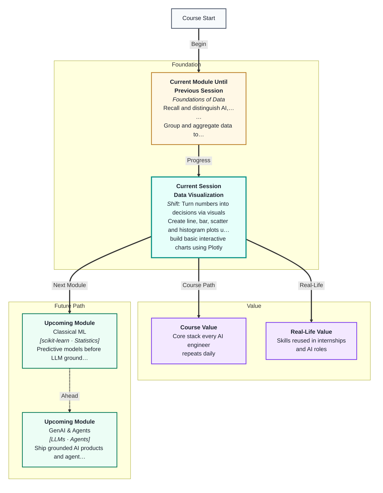
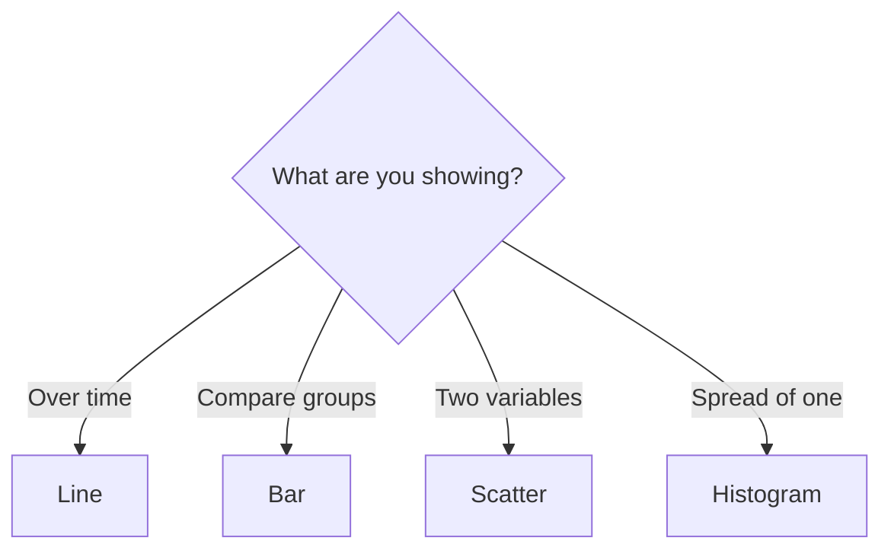

# Data Visualization
---

## Mental Map



## What You'll Learn

In this pre-read, you'll discover:

- When to use **line, bar, scatter, and histogram** charts
- How to add **titles, labels, and legends** in Matplotlib
- How **Plotly** makes interactive charts
- How chart choice depends on **variable type and goal**
- How good visuals support decisions, not decoration

---

## A. Choosing the Right Chart

> 💡 **Analogy:** You wouldn't use a pie chart to show temperature every hour — like using a photo when you need a timeline. **Chart type** must match the question.

| Question | Chart | X | Y |
|---|---|---|---|
| Trend over time | Line | Time | Metric |
| Compare categories | Bar | Category | Value |
| Relationship | Scatter | Var A | Var B |
| Distribution | Histogram | Bins | Count |



---

## B. Matplotlib Basics

```python
import matplotlib.pyplot as plt

months = ["Jan", "Feb", "Mar"]
sales = [120, 150, 130]
plt.bar(months, sales)
plt.title("Monthly Sales")
plt.ylabel("Units")
plt.show()
```

Always label axes and title — your future self (and your manager) will thank you.

---

## C. Plotly for Interactivity

Plotly charts zoom, hover, and filter — useful in dashboards and notebooks shared with non-coders.

---

## Practice Exercises

**1. Pattern Recognition** — Show exam scores for 30 students' distribution — histogram or line?

**2. Concept Detective** — Revenue by product category — which chart?

**3. Real-Life Application** — One misleading chart you have seen (truncated axis, etc.).

**4. Spot the Error** — Scatter plot with 2 categories on x-axis only — better alternative?

**5. Planning Ahead** — Sketch axes for website visits per day for one month.

---

> ✅ **You're done!** You can match charts to questions. Next: **EDA and business thinking** on real datasets.
