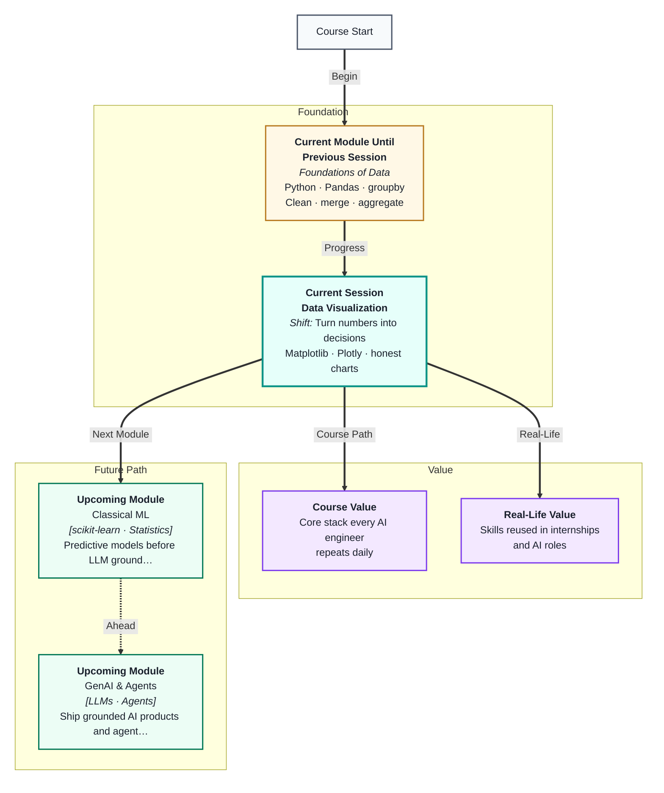
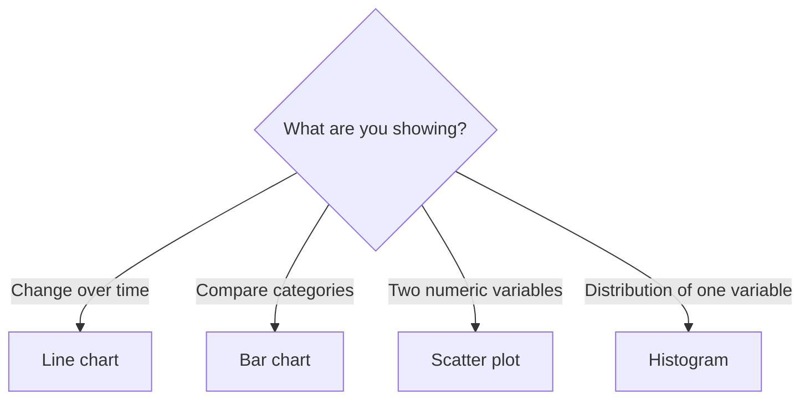
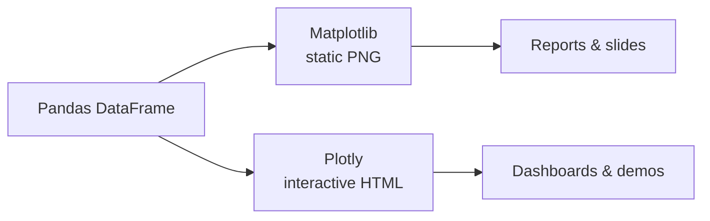

# Data Visualization
---

## Mental Map



## What You'll Learn

In this pre-read, you'll discover:

- How to **choose the right chart** — line, bar, scatter, or histogram — for your question
- How to build clear charts in **Matplotlib** with titles, axis labels, and legends
- How **Plotly** adds interactivity — zoom, hover, and pan — without extra code
- Why **labels and titles** turn a chart from decoration into a decision tool
- How good visuals support **business thinking**, not just pretty notebooks

---

## A. Why Visualize Data?

> 💡 **Analogy:** Reading a spreadsheet of 365 daily temperatures is like reading a phone book. A **line chart** of those same numbers is like watching a weather forecast — the pattern jumps out instantly.

**One-line definition:** **Data visualization** turns numbers into pictures so your brain can spot trends, comparisons, and outliers faster than scanning raw tables.

**What charts help you see:**

| Pattern | Example question | Hard to see in a table? |
|---|---|---|
| Trend over time | Are sales growing month by month? | Yes — rows blur together |
| Comparison across groups | Which product sold most? | Moderate — need mental sorting |
| Relationship between two numbers | Does higher price mean fewer units sold? | Very hard without a plot |
| Distribution / spread | How spread out are exam scores? | Nearly impossible in a table |

Good charts answer a **specific question**. Bad charts show data with no question in mind — that is decoration, not analysis.

---

## B. Choosing the Right Chart

> 💡 **Analogy:** You would not use a timeline to compare flavours of ice cream, or a bar chart to show temperature every hour. **Chart type** must match the question — like picking the right lens for a camera.

**One-line definition:** **Chart choice** depends on your variable types (category vs number vs time) and the question you are trying to answer.

| Question you are asking | Best chart | X-axis | Y-axis |
|---|---|---|---|
| How does this change over time? | **Line chart** | Time (dates, months) | Numeric metric |
| How do categories compare? | **Bar chart** | Category names | Numeric value |
| Is there a link between two numbers? | **Scatter plot** | Numeric variable A | Numeric variable B |
| What does the spread of one variable look like? | **Histogram** | Value ranges (bins) | Count / frequency |



**Common mistakes to avoid:**

| Mistake | Why it fails | Better choice |
|---|---|---|
| Bar chart for a time series with 365 days | Too many bars, unreadable | Line chart |
| Line chart for 5 product categories | Lines imply continuity between unrelated labels | Bar chart |
| Pie chart with 12 slices | Humans compare angles poorly | Horizontal bar chart |
| Scatter with only 3 points | Not enough data to see a pattern | Table or bar chart |

**Rule:** Write the question first. Then pick the chart. Never the reverse.

---

## C. Matplotlib Basics — Your Foundation Library

> 💡 **Analogy:** **Matplotlib** is like a basic art kit — pencils, rulers, and paper. It gives you full control over every line and label. Most Python charts you see start here.

**One-line definition:** **Matplotlib** is Python's core plotting library — you pass it data and styling commands, and it draws static charts you can save as images.

**The basic workflow:**

```python
import matplotlib.pyplot as plt

# 1. Prepare data
months = ["Jan", "Feb", "Mar", "Apr"]
sales = [120, 150, 130, 175]

# 2. Create the chart
plt.bar(months, sales)

# 3. Add labels — never skip these
plt.title("Monthly Sales — Q1 2026")
plt.xlabel("Month")
plt.ylabel("Units Sold")

# 4. Show or save
plt.tight_layout()
plt.show()
```

**Four essential chart types in Matplotlib:**

```python
import matplotlib.pyplot as plt

days = [1, 2, 3, 4, 5, 6, 7]
visits = [120, 135, 128, 150, 142, 160, 155]
categories = ["A", "B", "C"]
values = [40, 65, 50]
x = [1, 2, 3, 4, 5]
y = [2, 4, 5, 4, 5]
scores = [55, 60, 62, 65, 70, 72, 75, 78, 80, 85, 88, 90, 92, 95, 98]

# Line chart — trend over time
plt.figure(figsize=(8, 4))
plt.plot(days, visits, marker='o', color='steelblue', linewidth=2)
plt.title("Daily Website Visits")
plt.xlabel("Day")
plt.ylabel("Visits")
plt.show()

# Bar chart — compare categories
plt.figure(figsize=(6, 4))
plt.bar(categories, values, color=['#4C72B0', '#DD8452', '#55A868'])
plt.title("Sales by Category")
plt.ylabel("Revenue (₹ thousands)")
plt.show()

# Scatter plot — relationship between two variables
plt.figure(figsize=(6, 4))
plt.scatter(x, y, color='coral', s=80)
plt.title("Study Hours vs Test Score")
plt.xlabel("Hours studied")
plt.ylabel("Score")
plt.show()

# Histogram — distribution of one variable
plt.figure(figsize=(6, 4))
plt.hist(scores, bins=8, color='steelblue', edgecolor='white')
plt.title("Exam Score Distribution")
plt.xlabel("Score")
plt.ylabel("Number of students")
plt.show()
```

**Figure size tip:** Use `plt.figure(figsize=(width, height))` before plotting. `(8, 4)` or `(10, 6)` work well for slides and notebooks.

---

## D. Titles, Labels, and Legends — Making Charts Readable

> 💡 **Analogy:** A chart without labels is like a map with no street names — you see shapes but cannot navigate. **Titles and labels** are the signposts that tell your audience what they are looking at.

**One-line definition:** Every chart needs a **title** (the insight or topic), **axis labels** (what each axis measures and in what units), and a **legend** when multiple series appear on the same chart.

| Element | Bad example | Good example |
|---|---|---|
| Title | "Chart" | "Q1 Sales: March Peak at 175 Units" |
| X-axis label | "x" | "Month" |
| Y-axis label | missing | "Units Sold" |
| Legend | missing when 2+ lines | "Online" vs "In-store" |

```python
import matplotlib.pyplot as plt

months = ["Jan", "Feb", "Mar"]
online = [80, 95, 110]
store  = [40, 55, 65]

plt.figure(figsize=(8, 4))
plt.plot(months, online, marker='o', label='Online', linewidth=2)
plt.plot(months, store,  marker='s', label='In-store', linewidth=2)

plt.title("Sales Channel Comparison — Q1 2026")
plt.xlabel("Month")
plt.ylabel("Units Sold")
plt.legend(loc='upper left')   # show which line is which
plt.grid(axis='y', alpha=0.3)  # light grid helps read values
plt.tight_layout()
plt.show()
```

**When to use a legend:**
- Two or more lines on one line chart
- Multiple bar groups on one chart
- Scatter points coloured by category

**Saving charts to file:**

```python
plt.savefig("sales_chart.png", dpi=150, bbox_inches='tight')
plt.close()   # free memory — important in loops
```

---

## E. Plotly — Interactive Charts

> 💡 **Analogy:** Matplotlib is a printed poster on the wall. **Plotly** is a touch screen — you can zoom in, hover for exact values, and pan across the data without redrawing.

**One-line definition:** **Plotly** is a Python charting library that creates **interactive** charts — hover tooltips, zoom, and pan — ideal for dashboards and shared notebooks.

**Matplotlib vs Plotly:**

| Feature | Matplotlib | Plotly |
|---|---|---|
| Interactivity | Static image | Zoom, hover, pan |
| Learning curve | Lower | Slightly higher |
| Best for | Reports, slides, publications | Dashboards, exploration, sharing |
| Output | PNG, PDF | HTML (embeddable in web apps) |
| Syntax style | `plt.plot()`, `plt.bar()` | `px.line()`, `px.bar()`, `go.Figure()` |

```python
import plotly.express as px
import pandas as pd

# Plotly works beautifully with DataFrames
df = pd.DataFrame({
    "month": ["Jan", "Feb", "Mar", "Apr"],
    "sales": [120, 150, 130, 175],
    "region": ["North", "North", "South", "South"]
})

fig = px.bar(
    df,
    x="month",
    y="sales",
    color="region",
    title="Monthly Sales by Region",
    labels={"sales": "Units Sold", "month": "Month"}
)
fig.show()   # interactive — hover to see exact values
```

```python
# Line chart with Plotly Express
fig = px.line(
    df,
    x="month",
    y="sales",
    color="region",
    markers=True,
    title="Sales Trend by Region"
)
fig.update_layout(hovermode="x unified")
fig.show()
```

```python
# Scatter plot — explore relationship
scatter_df = pd.DataFrame({
    "hours": [1, 2, 3, 4, 5, 6, 7, 8],
    "score": [45, 52, 58, 65, 70, 78, 85, 90]
})

fig = px.scatter(
    scatter_df,
    x="hours",
    y="score",
    trendline="ols",   # optional: add trend line
    title="Study Hours vs Exam Score",
    labels={"hours": "Hours Studied", "score": "Exam Score (%)"}
)
fig.show()
```

**Install:** `pip install plotly`. Works in Jupyter/Colab — charts render inline.



---

## F. Chart Choice by Variable Type

> 💡 **Analogy:** Matching chart to data is like matching shoes to activity — running shoes for a race, formal shoes for an interview. The wrong match works technically but feels wrong and misleads.

**One-line definition:** The **type of your variables** — categorical, numeric, or datetime — determines which chart types are valid.

| Variable type | Examples | Suitable charts |
|---|---|---|
| **Categorical** | Product name, city, gender | Bar, grouped bar, count plot |
| **Numeric (continuous)** | Price, temperature, score | Histogram, line, scatter |
| **Datetime** | Order date, timestamp | Line, area |
| **Numeric + Numeric** | Price vs quantity | Scatter |
| **Categorical + Numeric** | Sales by region | Bar, box plot |

**Decision checklist before plotting:**

1. What is my **question** in one sentence?
2. What **type** is each variable involved?
3. How many **categories** or **data points** do I have?
4. Who is the **audience** — technical team or business manager?
5. Do I need **interactivity** (Plotly) or a **static image** (Matplotlib)?

**Honest charts — avoid misleading visuals:**

| Bad practice | Why it misleads | Fix |
|---|---|---|
| Y-axis starts at 95 instead of 0 | Small changes look huge | Start at 0 for bar charts |
| 3D pie chart | Angles distort comparison | Horizontal bar chart |
| Too many colours | Eye cannot track categories | Highlight one series, grey the rest |
| No sample size noted | "Average of 3" vs "Average of 3,000" | Add n= in subtitle |

---

## G. Subplots — Multiple Charts in One Figure

> 💡 **Analogy:** A dashboard page with four panels — each panel answers a different question, but they share one screen.

**One-line definition:** **`plt.subplots(nrows, ncols)`** creates a grid of axes so you can place multiple related charts in one figure.

```python
import matplotlib.pyplot as plt

fig, axes = plt.subplots(2, 2, figsize=(12, 9))

axes[0, 0].plot([1, 2, 3], [10, 15, 12])
axes[0, 0].set_title("Trend")

axes[0, 1].bar(["A", "B"], [40, 65])
axes[0, 1].set_title("Categories")

axes[1, 0].scatter([1, 2, 3], [2, 4, 3])
axes[1, 0].set_title("Relationship")

axes[1, 1].hist([55, 60, 62, 65, 70, 72, 75, 80, 85], bins=5)
axes[1, 1].set_title("Distribution")

plt.suptitle("Four-Chart Dashboard", fontsize=14)
plt.tight_layout()
plt.show()
```

| Parameter | Purpose |
|---|---|
| `figsize=(w, h)` | Overall figure size in inches |
| `plt.suptitle()` | Master title above all subplots |
| `plt.tight_layout()` | Prevent label overlap |
| `axes[r, c]` | Target one panel by row, column |

**Plotly subplots:** `make_subplots()` from `plotly.subplots` — same idea, interactive output.

---

## H. Honest Charts — Ethics and Clarity

> 💡 **Analogy:** A speedometer that starts at 80 km/h makes 85 look like maximum speed. **Truncated axes** exaggerate small differences.

**One-line definition:** An **honest chart** uses appropriate type, clear labels, fair axis scales, and states limitations (sample size, time range).

| Bad practice | Why it misleads | Fix |
|---|---|---|
| Y-axis starts at 95 on bar chart | Small change looks huge | Start bars at 0 |
| 3D pie with 12 slices | Angles distort comparison | Horizontal bar |
| No title or units | Audience guesses meaning | Title + axis labels + units |
| Cherry-picked date range | Hides context | Show full period or note range |
| Missing n= | "Average of 3" vs 3000 | Add sample size in subtitle |

```python
# MISLEADING vs HONEST — same data
fig, axes = plt.subplots(1, 2, figsize=(10, 4))
values = [100, 102, 105]
axes[0].bar(["Jan", "Feb", "Mar"], values)
axes[0].set_ylim(90, 110)
axes[0].set_title("MISLEADING: Y starts at 90")

axes[1].bar(["Jan", "Feb", "Mar"], values)
axes[1].set_ylim(0, 120)
axes[1].set_title("HONEST: Y starts at 0")
plt.tight_layout()
plt.show()
```

**Before presenting:** (1) State the question. (2) Name chart type and why. (3) Add units. (4) Write one insight sentence a manager can act on.

## Practice Exercises

**1. Pattern Recognition**  
You have daily website visit counts for 30 consecutive days and want to show whether traffic is trending up or down. Should you use a line chart, bar chart, scatter plot, or histogram? Explain your choice in one sentence.

**2. Concept Detective**  
A colleague plots exam scores for 200 students using a bar chart with 200 separate bars on the x-axis. What is wrong with this approach, and which chart type would better show the **distribution** of scores?

**3. Real-Life Application**  
Name three charts you have seen in apps or news articles (e.g., stock price, COVID cases, election results). For each, identify the chart type and the question it was designed to answer.

**4. Spot the Error**  
```python
plt.bar(["Mon", "Tue", "Wed"], [120, 135, 150])
plt.show()
```
List three missing elements that would make this chart unsuitable for a manager's presentation. Add the code lines needed to fix each one.

**5. Planning Ahead**  
You have a CSV with columns: `date`, `product`, `region`, `units_sold`, `revenue`. You need to answer: "Which region had the highest total revenue in Q1?" Sketch (in words) your chart choice, x-axis, y-axis, title, and whether you would use Matplotlib or Plotly — and why.

---

> ✅ **You're done!** You now know how to match chart types to questions, build clear Matplotlib charts with proper titles and labels, and create interactive Plotly visuals for exploration and sharing. Visualization turns the aggregations you learned in Pandas into decisions a business audience can act on. Next up: **EDA and business thinking** — where you combine cleaning, grouping, and charting into a structured analysis of a real dataset.

> **Chart critique 1:** Find one chart in news media — identify chart type and one potential honesty issue.

> **Chart critique 2:** Find one chart in news media — identify chart type and one potential honesty issue.

> **Chart critique 3:** Find one chart in news media — identify chart type and one potential honesty issue.
