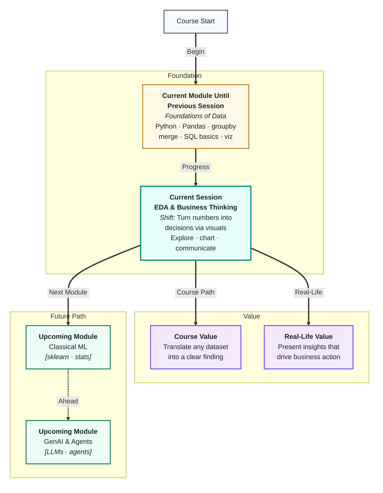
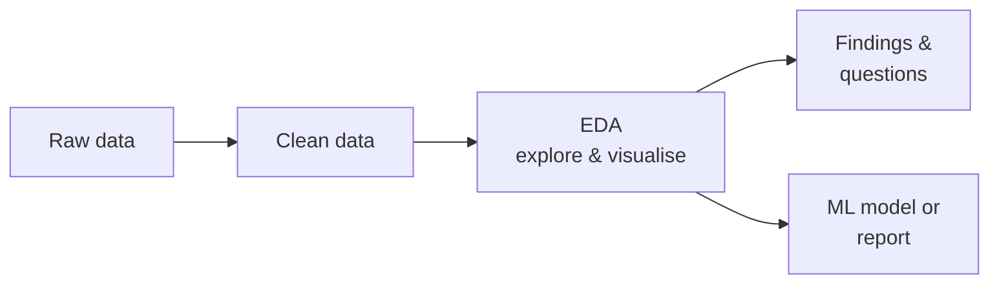
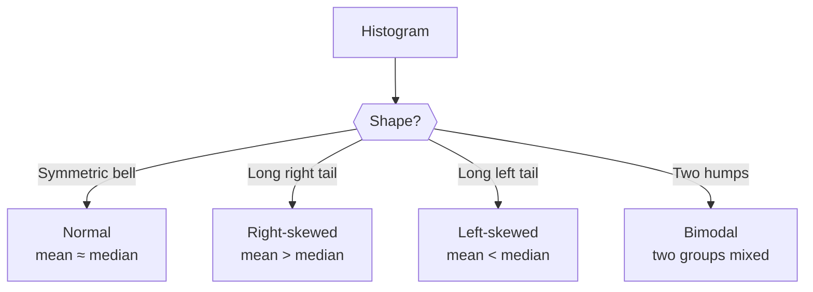

# EDA & Business Thinking
---

## Mental Map



## What You'll Learn

In this pre-read, you'll discover:

- What **Exploratory Data Analysis (EDA)** is and why it always comes before modelling
- How to use a repeatable **EDA checklist** to interrogate any new dataset
- Which **chart type** to reach for depending on what you want to show
- How **distributions** reveal the shape of your data — skews, outliers, and peaks
- How **business thinking** turns a chart into a decision stakeholders can act on
- How to **segment, drill down, and frame KPIs** during exploration
- How to **present findings** without drowning your audience in charts

---

## A. What Is EDA — and Why Do It First?

> 💡 **Analogy:** A doctor does not prescribe medicine before examining the patient. **EDA** is your examination of the dataset before you build anything.

**One-line definition:** **Exploratory Data Analysis (EDA)** is the process of summarising, visualising, and questioning a dataset to understand its structure, patterns, and problems before modelling or reporting.

EDA sits between data cleaning and modelling. Cleaning fixes what is broken; EDA discovers what is *interesting* and what still needs attention.



**What EDA reveals:**

| EDA activity | Tool | What you learn |
|---|---|---|
| Shape and types | `df.shape`, `df.dtypes` | Row count, column types |
| Summary stats | `df.describe()` | Mean, std, min, max, quartiles |
| Missing values | `df.isna().sum()` | Remaining gaps |
| Distributions | Histogram, box plot | Spread, skew, outliers |
| Relationships | Scatter plot, heatmap | Correlations between columns |
| Counts by category | Bar chart, `value_counts()` | Frequency of each category |
| Business segments | `groupby` + chart | Which region/category drives the metric |

**When EDA stops being useful:** When you can answer the business question with confidence, document 3–5 findings, and list what still needs a model or more data. EDA is not an excuse to make 50 charts with no narrative.

---


## B. Distributions — The Shape Behind the Numbers

> 💡 **Analogy:** A crowd photo from above shows whether people are spread evenly or bunched at the front. A **distribution** shows the same thing about your data.

**One-line definition:** A **distribution** describes how values in a column are spread — whether they are symmetric, skewed to one side, or have multiple peaks.



| Shape | What it suggests | Business action |
|---|---|---|
| Symmetric (bell) | Even spread, no extremes | Mean is reliable for reporting |
| Right-skewed | A few very high values pull the mean up | Use median; flag whale customers |
| Left-skewed | A few very low values drag the mean down | Use median; check for floor effects |
| Bimodal (two peaks) | Two distinct subgroups in the data | Split analysis by segment |
| Flat (uniform) | Values equally likely | Rare in real data; verify source |

**Box plots** show distribution shape at a glance: the box is the middle 50% of values, the line inside is the median, and dots beyond the whiskers are **outliers**. Compare many groups side-by-side with one chart.

**Percentiles in business language:**

| Percentile | Plain meaning | Example |
|---|---|---|
| 25th (Q1) | Bottom quarter boundary | "75% of orders are above this value" |
| 50th (median) | Typical middle value | "Half of customers spend less than this" |
| 75th (Q3) | Top quarter boundary | "Only 25% exceed this spend" |
| IQR (Q3 − Q1) | Spread of the middle half | Stable metric for skewed revenue |

---


## C. Choosing the Right Chart

> 💡 **Analogy:** You would not use a knife to tighten a screw. Every chart type is built for a specific job.

**One-line definition:** A **chart type** is a visual format designed for a specific relationship in data — distribution, comparison, trend, composition, or correlation.

| What you want to show | Best chart | Avoid |
|---|---|---|
| Distribution of one numeric column | Histogram or box plot | Pie chart |
| Comparison across categories | Bar chart (vertical or horizontal) | 3-D bar chart |
| Trend over time | Line chart | Scatter plot for time |
| Relationship between two numeric cols | Scatter plot | Bar chart |
| Composition (parts of a whole) | Stacked bar (max 5 slices) | Exploded 3-D pie |
| Correlation of many columns at once | Heatmap | 20 separate scatter plots |


**Decision rule:** Write the question first. *"Which region has the highest profit margin?"* → bar chart by region. Never pick a chart because it "looks nice." 

---


## D. The EDA Checklist — A Repeatable Workflow

> 💡 **Analogy:** A pilot follows a pre-flight checklist every single time — not because they forget, but because skipping steps causes crashes.

**One-line definition:** An **EDA checklist** is a fixed sequence of questions you answer on every new dataset, so you never skip something that matters.

**The four EDA questions (memorise these):**

```
1. SHAPE    — rows, columns, types, nulls, duplicates
2. DISTRIBUTION — min/max, mean/median, skew, outliers
3. RELATIONSHIP — correlation, scatter patterns, category breakdowns
4. CHANGE    — trends over time or across groups
```

**Step-by-step checklist:**

1. **Load and inspect** — `shape`, `head()`, `dtypes`, `info()`
2. **Summary statistics** — `describe()` for numeric; `value_counts()` for categorical
3. **Missing values** — count per column; decide if they need fixing
4. **Distributions** — histogram for every numeric column; note skew and outliers
5. **Categorical counts** — bar chart for every category column; note imbalances
6. **Relationships** — scatter plots for correlated pairs; heatmap for all numerics
7. **Time trends** (if date column exists) — line chart by date
8. **Outlier investigation** — box plots; decide whether to keep, cap, or remove

| Step | What you find | What you decide |
|---|---|---|
| Missing values | Which columns have gaps | Fill, drop, or flag |
| Distribution shape | Skewed columns | Transform for ML or note for reports |
| Outliers | Extreme values | Keep (real) or remove (error) |
| Correlation | Columns that move together | Feature candidates for ML |
| Category imbalance | One value dominates | Handle before classification |

After EDA, write a short **findings summary**: 3–5 bullet observations that tell the next reader what the data says and what questions it raises.

---


## E. Business Thinking — From Chart to Decision

> 💡 **Analogy:** A news headline is not the full article — it is the one sentence that makes you want to read more. A **chart title** does the same job.

**One-line definition:** **Business thinking in EDA** means framing every visual around a decision: what happened, why it matters, and what action follows.

A chart that needs a long explanation has failed. A good chart answers one question and labels that answer directly.

**Anatomy of an effective chart:**

| Element | Bad example | Good example |
|---|---|---|
| Title | "Sales Chart" | "Western Region Leads Q1 Sales by ₹1.2M" |
| Axes | Unlabelled | "Order Sales (₹)" / "Number of Orders" |
| Annotations | None | Arrow: "Chairs: −₹2,400 avg profit" |
| Colours | 10 different colours | 2 colours max; one highlight |
| Legend | Always shown | Only when comparing 2+ series |

**The Chart → Insight → Recommendation pipeline:**

```
Observation:    "Furniture has the most negative profit outliers"
     ↓
Context:        "Average discount on Furniture is 35% vs 15% for Tech"
     ↓
Insight:        "Deep discounts on Furniture destroy margins"
     ↓
Recommendation: "Cap Furniture discounts at 20%; review Tables pricing"
```

Every chart you build should complete this pipeline. If it cannot, the chart is decoration — not analysis.

---


## F. Business Metrics and KPIs During EDA

> 💡 **Analogy:** A cricket scoreboard shows runs, wickets, and overs — not every stat ever recorded. **KPIs** focus attention on what the business actually cares about.

**One-line definition:** A **KPI (Key Performance Indicator)** is a measurable value that shows whether a business is hitting its goals — EDA should connect raw columns to KPIs early.

| Raw column(s) | Typical KPI | EDA question |
|---|---|---|
| `sales`, `cost` | Profit margin | Which category has lowest margin? |
| `order_date`, `amount` | Revenue trend | Is revenue growing month over month? |
| `customer_id`, `order_id` | Repeat purchase rate | What % of customers order twice? |
| `delivery_days` | On-time delivery % | Which city has the longest tail? |
| `discount`, `profit` | Discount effectiveness | Do deep discounts ever increase profit? |

**Leading vs lagging indicators:**

| Type | Meaning | EDA example |
|---|---|---|
| Lagging | Measures past results | Total revenue last quarter |
| Leading | Predicts future results | Cart abandonment rate this week |

During EDA, name which KPI each chart supports. A manager cares about *profit by region*, not *histogram of row 47*.

---


## G. Segment Analysis and Drill-Down

> 💡 **Analogy:** When sales drop, you do not panic about the whole company — you ask *which product, which city, which week*. **Drill-down** is structured narrowing.

**One-line definition:** **Segment analysis** splits the dataset by a category (region, tier, product line) and compares metrics within each segment.


| Drill-down level | Pandas pattern | Business question |
|---|---|---|
| Overall | `df["profit"].sum()` | Are we profitable? |
| By region | `df.groupby("Region")["Profit"].sum()` | Which region drags total? |
| By category | `df.groupby(["Region","Category"])["Profit"].mean()` | Which product line? |
| By time | `df.groupby("Year")["Profit"].sum()` | When did it start? |

**Simpson's paradox warning:** A trend in the aggregate can reverse in every segment. Always check segments before recommending a global policy.

---


## H. Presenting EDA Findings to Stakeholders

> 💡 **Analogy:** A movie trailer shows the best three scenes — not the entire film. Your **EDA presentation** should show the 3–5 charts that drive the decision.

**One-line definition:** **Stakeholder-ready EDA** packages findings for people who will not open your notebook — clear titles, one insight per slide, and explicit recommendations.

**Presentation structure (5 slides max for a first readout):**

| Slide | Content | Time |
|---|---|---|
| 1 | Business question + data snapshot | 30 sec |
| 2 | Shape/quality — anything that limits trust | 1 min |
| 3 | Key finding #1 with chart | 2 min |
| 4 | Key finding #2 with chart | 2 min |
| 5 | Recommendation + next steps | 1 min |

**Language that works with managers:**

| Avoid | Prefer |
|---|---|
| "The correlation is −0.42" | "Higher discounts are linked to lower profit" |
| "There's an outlier at row 891" | "Three sub-categories sell at a loss" |
| "I made 12 charts" | "Two issues explain 80% of the profit drop" |

**Before you present:** Can you state the recommendation in one sentence without pointing at a chart? If not, keep exploring.

---


## I. Superstore Lab Reference

| Business question | EDA question | Chart |
|---|---|---|
| Is profit declining? | CHANGE | Line by year |
| Which category loses money? | RELATIONSHIP | Bar avg profit by sub-category |
| Do discounts hurt margin? | RELATIONSHIP | Scatter discount vs profit |
| Where are outliers? | DISTRIBUTION | Box plot profit by category |

## J. Matplotlib + Seaborn Quick Reference

| Task | Code pattern |
|---|---|
| Histogram | `plt.hist(df['Sales'], bins=50)` or `sns.histplot` |
| Box by group | `sns.boxplot(x='Category', y='Profit', data=df)` |
| Bar totals | `df.groupby('Region')['Sales'].sum().plot(kind='bar')` |
| Heatmap corr | `sns.heatmap(df[numeric].corr(), annot=True)` |

## K. Business Story Template (copy into notebook)

```
FINDING: [one sentence with number]
EVIDENCE: [chart name]
CONTEXT: [comparison or segment]
RECOMMENDATION: [action a manager can take]
```

## Reference: Four EDA Questions Applied to Superstore

| # | Question | Code | Chart |
|---|---|---|---|
| 1 | SHAPE | `df.shape`, `df.info()` | — |
| 2 | DISTRIBUTION | `df.describe()`, histogram | Hist / box |
| 3 | RELATIONSHIP | `df.corr()`, scatter | Scatter / heatmap |
| 4 | CHANGE | `groupby('Year').Profit.sum()` | Line |

## Reference: Chart Title Before/After

| Before | After |
|---|---|
| Sales | Western Region Leads Q1 Sales by ₹1.2M |
| Profit Chart | Furniture Discounts Drive 80% of Loss-Making Orders |
| Scatter | Higher Discount Correlates with Negative Profit on Large Orders |

## Reference: Pandas EDA One-Liners

```python
df.head(3)                    # first rows
df['Category'].value_counts() # category counts
df.groupby('Region')['Profit'].agg(['sum','mean','count'])
df['Order Date'] = pd.to_datetime(df['Order Date'])
df.assign(Year=df['Order Date'].dt.year).groupby('Year')['Profit'].sum()
```

## Reference: Business vs Technical Language

| Technical | Business |
|---|---|
| r = −0.67 | Strong negative link between discount and profit |
| Right-skewed | A few very large orders pull the average up |
| 1877 negative profit rows | Nearly 19% of orders lose money |
| Outlier at Q3+1.5×IQR | Unusually high delivery time — investigate carrier |

## Reference: Session 13 Lab Rubric

| Criterion | Points |
|---|---|
| Four EDA questions addressed | 25 |
| Four charts with labelled titles | 25 |
| One insight per chart | 25 |
| Written recommendation | 25 |

## L. Extended Practice Scenarios

**Scenario A — E-commerce:** Cart abandonment rises 12%. List three EDA charts, the KPI each supports, and one drill-down path.

**Scenario B — Logistics:** Delivery times spike in one city. Which distribution shape do you expect? Mean or median for SLA reporting?

**Scenario C — Retail:** Marketing wants proof discounts work. Which scatter plot and correlation caveat do you cite?

## M. Glossary

| Term | Plain English |
|---|---|
| EDA | Systematic first look at data before modelling |
| KPI | Metric the business tracks |
| IQR | Spread of the middle 50% of values |
| Drill-down | Splitting data by segment to find root cause |
| Simpson's paradox | Aggregate trend reverses in every segment |

## Reference Card — Quick Review Before Class

| Section | Core idea | Before-class action |
|---|---|---|
| A | First major concept | Read analogy + definition aloud |
| B | Second concept | Sketch one tiny example |
| C | Third concept | Name one common mistake |
| D | Fourth concept | Link to prior session tool |
| E | Fifth concept | Complete practice #1 |
| F | Extension | Optional stretch |
| G | Extension | Optional stretch |
| H | Extension | Optional stretch |

**Active recall:** Close the doc; write one-line definitions for A, C, E from memory; reopen and check.

**Tool checklist:** Install Jupyter, MySQL Workbench, or Excel/Sheets per session overview.

**Dataset checklist:** Download Superstore or open shared workbook before class.

**Peer prep:** Bring one business question for a dataset in your domain.

**Time box:** 25–35 minutes on this pre-read; finish at least three practice exercises.

## Practice Exercises

**1. Pattern Recognition**  
A histogram of `delivery_days` shows a long right tail with most deliveries in 1–3 days but a few reaching 30 days. Identify the distribution shape, say whether mean or median better describes "typical delivery time," and name one chart you would use to compare delivery times across cities.

**2. Concept Detective**  
A teammate shows a pie chart with 12 slices to represent sales by product category. Viewers say the chart is "confusing." Name the chart design problem, which section of this pre-read explains it, and suggest a better chart type with a reason.

**3. Real-Life Application**  
Choose a dataset from daily life — commute times, monthly expenses, or fitness steps. For each of the four EDA questions (shape, distribution, relationship, change), say what you would check and what chart you would use.

**4. Spot the Error**  
A bar chart comparing city sales starts its y-axis at ₹90,000 instead of zero. Mumbai shows a bar twice as tall as Delhi. The actual values are Mumbai: ₹1,00,000 and Delhi: ₹95,000. What visual storytelling rule does this violate, and what impression does it incorrectly create?

**5. Planning Ahead**  
You receive a fresh e-commerce dataset with columns: `order_date`, `customer_city`, `category`, `amount`, `delivery_days`, `rating`. Design a full EDA plan: list at least 6 charts, what question each answers, which KPI each supports, and which chart would be most useful to a manager improving delivery.

**6. Business Framing**  
Profit is down 8% year over year. Write the drill-down sequence (three groupby levels) you would use before recommending a fix. Name one KPI per level.

**7. Stakeholder Communication**  
Rewrite this technical sentence for a sales VP: "Discount and profit have Pearson r = −0.67 with p < 0.01 in the Furniture category." Include observation, context, and recommendation.

**8. Integration**  
Connect the Superstore EDA lab to one KPI your team would track weekly. Name the chart, the EDA question (shape/distribution/relationship/change), and one action if the KPI turns red.

**9. Tool choice**  
For a 10,000-row dataset updated daily, would you run EDA in Excel or Python first? Give two reasons for your choice.

**10. Interview prep**  
Explain the four EDA questions in 60 seconds without jargon — as if to a product manager who has never used Pandas.

**Pre-class checklist:** Download Superstore CSV · open Jupyter · skim sections A–H · complete exercises 1 and 5.

**Time box:** Allow 25–35 minutes for this pre-read; stop after three completed exercises if short on time.

**Active recall:** Before class, write the four EDA questions from memory on one sticky note.

---

> ✅ **You're done!** You now know how to explore any dataset systematically, connect findings to business KPIs, drill down by segment, and present insights that drive action. Next up: **Master class — From Tables to Relationships**, where you will see the mathematics behind every chart and statistic you use in EDA.
