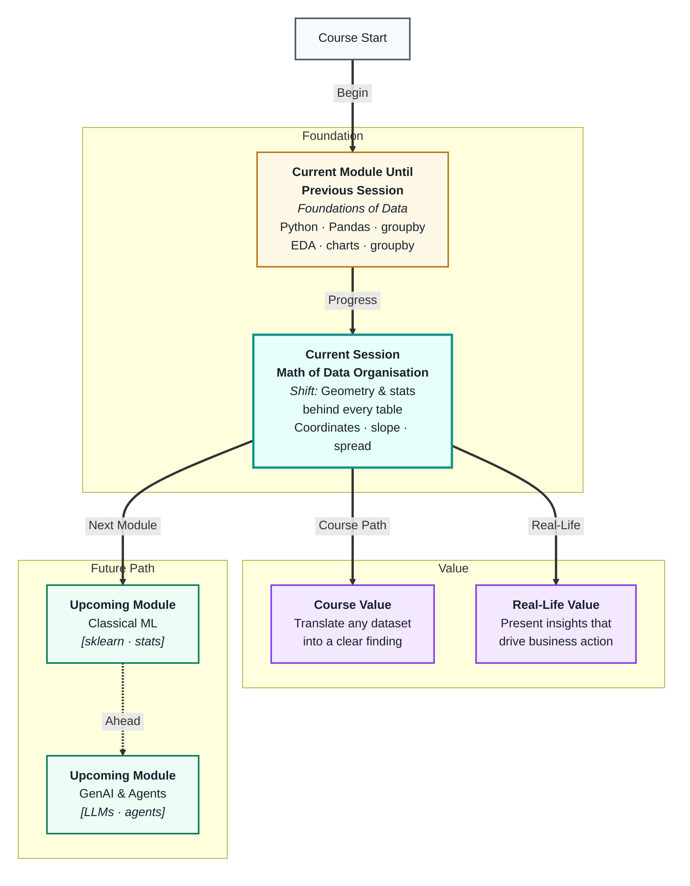
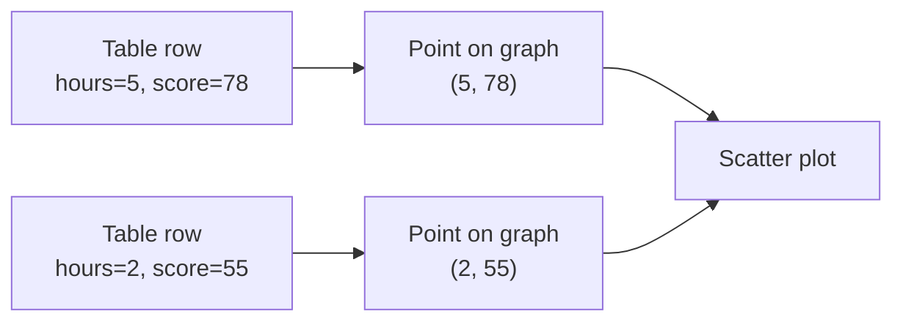
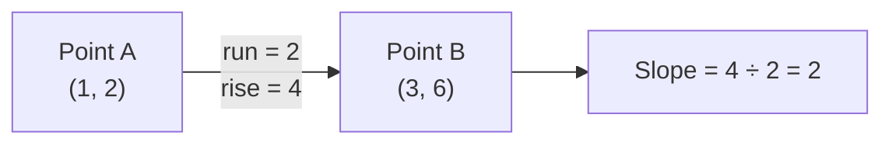

# Master Class: From Tables to Relationships — The Mathematics of Data Organisation
---

## Mental Map



## What You'll Learn

In this pre-read, you'll discover:

- How the **Cartesian plane** lets you visualise any two columns as a scatter plot
- What the **slope of a line** means — and why it is the seed of everything in ML
- How **mean, median, and mode** each tell a different story about your data
- Why the **mean lies** when data is skewed, and what to use instead
- How **variance and standard deviation** measure how spread out your data is

---

## A. The Cartesian Plane — Plotting Two Columns

> 💡 **Analogy:** A cinema seat is described by two numbers — row and column. Every seat is a unique point. A **Cartesian plane** works exactly the same way: any row of data becomes a point described by two numbers.

**One-line definition:** The **Cartesian plane** is a grid with a horizontal x-axis and a vertical y-axis, where any point is located by two coordinates: `(x, y)`.

When you plot data, every row of your table becomes one point on this grid:

- x-axis → one column (e.g. hours studied)
- y-axis → another column (e.g. exam score)



This is all a **scatter plot** is: each row mapped to one `(x, y)` coordinate. When points cluster in a rising pattern from left to right, you are seeing a **relationship** between two columns — the foundation of correlation and regression in ML.

| Table column | Axis | What you see on the plot |
|---|---|---|
| Independent (cause) | x (horizontal) | Spread of input values |
| Dependent (effect) | y (vertical) | Spread of output values |
| Each row | One dot | The relationship between the two |

**Why this matters for ML:** Algorithms like Linear Regression are literally finding the *best line* through a scatter plot. Understanding the plane first makes that idea click instantly when you meet it.

---

## B. Slope of a Line — Rise Over Run

> 💡 **Analogy:** A road sign "8% gradient" means for every 100 metres you travel forward, you rise 8 metres. That ratio — *how much you go up for every step forward* — is exactly what **slope** measures.

**One-line definition:** **Slope** is the rate at which y changes for every one-unit increase in x, calculated as rise ÷ run.

```
slope = (change in y) ÷ (change in x)
      = rise ÷ run
```

**Visualising slope:**



| Slope value | What it means | Example |
|---|---|---|
| Positive (e.g. +2) | y increases as x increases | More study → higher score |
| Negative (e.g. −1) | y decreases as x increases | More errors → lower grade |
| Zero | y does not change with x | Height vs exam score (no link) |
| Large magnitude | Steep relationship | Small input change, big output change |

The equation of a line is `y = mx + c`, where:
- `m` is the **slope** (how steep)
- `c` is the **y-intercept** (where the line crosses the y-axis when x = 0)

**Connection to ML:** When you train a Linear Regression model, it is finding the value of `m` and `c` that best fits your data points. The slope you learn here is literally the same number the algorithm will compute.

---

## C. Mean, Median, and Mode — Three Ways to Describe the Centre

> 💡 **Analogy:** Three friends describe the "typical" price of meals at a restaurant: one averages all bills, one picks the middle bill, one says the most common price. All three are right — but they answer different questions. That is what mean, median, and mode do.

**One-line definition:** **Mean**, **median**, and **mode** are three measures of the *centre* of a dataset — the typical or most common value — each suited to different situations.

| Measure | How to compute | Best for |
|---|---|---|
| **Mean** | Sum of all values ÷ count | Symmetric data with no extreme outliers |
| **Median** | Middle value when sorted | Skewed data or data with outliers |
| **Mode** | Most frequently occurring value | Categorical data or finding peaks |


**Why the mean lies when data is skewed:**

Imagine 9 employees earn ₹30,000/month and 1 earns ₹10,00,000. The mean salary is about ₹1,27,000 — but nobody actually earns near that. The median (₹30,000) is far more honest. This is why salary and income data always uses median, not mean.

---

## D. Range, Variance, and Standard Deviation — How Spread Out Is the Data?

> 💡 **Analogy:** Two classes both average 70 marks. In Class A, everyone scored between 65 and 75. In Class B, scores ranged from 10 to 100. Same average, very different situations. **Spread** is what the average hides.

**One-line definition:** **Variance** and **standard deviation** measure how far values typically are from the mean — a high value means data is widely spread, a low value means it is tightly clustered.

**Building up from range:**

- **Range** = max − min → the simplest spread measure, but easily broken by one outlier
- **Variance** = average of squared distances from the mean → penalises large gaps more
- **Standard deviation (SD)** = square root of variance → same units as original data, easier to interpret

| Measure | Formula idea | What it tells you |
|---|---|---|
| Range | max − min | Total span; breaks with outliers |
| Variance | avg of (each value − mean)² | Overall spread, squared units |
| Standard deviation | √variance | Typical distance from mean |

**Reading standard deviation:**

- Low SD → values are close together (consistent)
- High SD → values are spread wide (variable)

In ML, SD is used constantly: to detect outliers, to **standardise** (scale) features, and to understand model confidence. Seeing `mean = 50, SD = 2` vs `mean = 50, SD = 30` immediately tells you two very different datasets.

---

## E. From Stats to Relationships — Correlation Preview

> 💡 **Analogy:** You notice that every time it rains, umbrella sales go up. Both variables move *together*. **Correlation** is a number that captures how consistently two columns rise or fall together.

**One-line definition:** **Correlation** is a value between −1 and +1 that measures how strongly and in what direction two columns are linearly related.

| Correlation value | Meaning |
|---|---|
| Close to +1 | Strong positive — both go up together |
| Close to −1 | Strong negative — one goes up, other goes down |
| Close to 0 | Little or no linear relationship |


**Key caution:** Correlation does not mean causation. Ice cream sales and drowning incidents both rise in summer — they are correlated, but ice cream does not cause drowning. Both have a third cause: hot weather. Always ask "is there a real mechanism here?" before acting on a correlation.

This connects directly to **EDA & Visual Storytelling** (upcoming session), where you will visualise correlations, and to **Regression** in Module 2, where the slope you learned in section B becomes a model's trained parameter.

---

## Reference: Slope Calculation Worked Example

Points (2, 45) and (8, 85): rise = 40, run = 6, slope = 6.67 → each hour adds ~6.7 marks.

## Reference: Mean vs Median Decision Tree

| Data type | Report |
|---|---|
| Salaries, house prices | Median |
| Symmetric test scores | Mean |
| ML validation metrics | Mean ± std |

## Reference: Standard Deviation Interpretation

| SD relative to mean | Meaning |
|---|---|
| Low | Values cluster tightly |
| High | Wide spread — mean less representative |

## Reference: np.polyfit vs Manual Line

```python
import numpy as np
coeffs = np.polyfit(x, y, 1)
slope, intercept = coeffs
print(slope, intercept)
```

## Reference: Correlation Caveats Checklist

- [ ] Is relationship linear?
- [ ] Any confounding variable?
- [ ] Outliers inflating r?
- [ ] Causation claim justified?

## F. Skewness — When the Tail Pulls the Mean

> 💡 **Analogy:** A few billionaires walk into a room of salaried workers — average wealth jumps but the typical person is unchanged.

**One-line definition:** **Skewness** describes asymmetry — right-skewed data has a long upper tail pulling the mean above the median.

| Skew type | Mean vs median | Real example |
|---|---|---|
| Symmetric | Mean ≈ Median | Heights, symmetric exam scores |
| Right-skewed | Mean > Median | Income, order sizes, Mumbai house prices |
| Left-skewed | Mean < Median | Age at product failure |

**Business rule:** Report median for salary, price, and delivery-time KPIs when histograms show a long tail.

---

## G. Tables as Points in Space

> 💡 **Analogy:** Every row in a spreadsheet can sit on a map if you pick two numeric columns — that map is a scatter plot.

**One-line definition:** A table row with two numeric fields corresponds to one point `(x, y)` on the Cartesian plane.

| Concept | Table | Geometry | ML (Module 2) |
|---|---|---|---|
| Record | Row | Point | Example |
| Field | Column | Axis | Feature |
| Two numeric cols | x and y values | Scatter plot | Feature pair |
| Best-fit line | — | Slope + intercept | Linear regression |

---

## H. Descriptive Stats Across Tools

> 💡 **Analogy:** Mean in Pandas, `AVG()` in SQL, and `AVERAGE()` in Excel answer the same question — only the syntax changes.

**One-line definition:** Summary statistics are tool-independent; organisation tools differ, mathematics does not.

| Statistic | Pandas | SQL | Excel |
|---|---|---|---|
| Mean | `.mean()` | `AVG(col)` | `=AVERAGE(range)` |
| Median | `.median()` | `PERCENTILE_CONT(0.5)` | `=MEDIAN(range)` |
| Std dev | `.std()` | `STDDEV(col)` | `=STDEV.S(range)` |
| Group mean | `.groupby().mean()` | `GROUP BY` + `AVG` | Pivot table |

**Practice connection:** Session 13 EDA charts show these stats visually; Session 15 computes them in SQL; Session 16 in Excel.

## I. Practice Exercises (continued)

**6. Skewness spot check:** Given mean ₹85L and median ₹42L for house prices, name the skew direction and which statistic a buyer should trust.

**7. Slope interpretation:** Slope of study hours vs score is 6.5. What does that mean in one sentence for a student?

**8. Spread comparison:** Class A scores: mean 70, std 5. Class B: mean 70, std 15. Which class has more predictable outcomes?

**9. Correlation caution:** Ice cream sales and drowning both rise in summer. Name the confounder and why causation fails.

**10. Tool translation:** Write how you would compute median profit by region in Pandas, SQL, and Excel pivot.

## J. Formula Reference Card

| Formula | Meaning |
|---|---|
| slope = rise / run | Rate of y change per unit x |
| mean = sum / count | Arithmetic average |
| variance = avg of (x − mean)² | Squared spread |
| std = √variance | Spread in original units |
| r = correlation | Linear association −1 to +1 |

## K. Module 2 Bridge

Linear Regression finds the best slope and intercept through your scatter plot. Embeddings place text as points in high-dimensional space. Today's 2D intuition scales to those ideas — coordinates first, dimensions later.

## L. Worked Examples — By Hand

**Example 1 — Mean vs median:** Data: 10, 12, 14, 16, 200. Mean = 50.4, Median = 14. Report median for "typical value."

**Example 2 — Slope:** Points (1, 2) and (4, 11). Rise = 9, run = 3, slope = 3.

**Example 3 — Std dev intuition:** Scores 68, 70, 72 cluster tightly; 40, 70, 100 spread wide — same mean possible, different std.

## M. Section Cross-Reference

| If you need… | Read section |
|---|---|
| Plot two columns | A — Cartesian plane |
| Rate of change | B — Slope |
| Typical value | C — Mean/median/mode |
| Spread | D — Variance/std |
| Two columns moving together | E — Correlation |
| Asymmetric data | F — Skewness |
| Table ↔ geometry | G — Tables as points |
| Pandas vs SQL vs Excel | H — Descriptive stats across tools |

## Reference Card — Quick Review Before Class

| Section | Core idea | Before-class action |
|---|---|---|
| A | First major concept | Read analogy + definition aloud |
| B | Second concept | Sketch one tiny example |
| C | Third concept | Name one common mistake |
| D | Fourth concept | Link to prior session tool |
| E | Fifth concept | Complete practice #1 |
| F | Extension | Optional stretch |
| G | Extension | Optional stretch |
| H | Extension | Optional stretch |

**Active recall:** Close the doc; write one-line definitions for A, C, E from memory; reopen and check.

**Tool checklist:** Install Jupyter, MySQL Workbench, or Excel/Sheets per session overview.

**Dataset checklist:** Download Superstore or open shared workbook before class.

**Peer prep:** Bring one business question for a dataset in your domain.

**Time box:** 25–35 minutes on this pre-read; finish at least three practice exercises.

## Practice Exercises

**1. Pattern Recognition**  
A dataset has these exam scores: `45, 50, 50, 55, 95`. Compute or estimate the mean, median, and mode. Which one best represents a "typical" student, and why does the mean mislead here?

**2. Concept Detective**  
A data report says "average house price in the city is ₹80 lakh." You look at the raw data and find that 90% of houses are priced below ₹45 lakh, but a handful of luxury apartments go up to ₹5 crore. Which measure should the report have used instead, and which concept from section C explains why?

**3. Real-Life Application**  
Think of three pairs of real-world variables you would expect to correlate (e.g. temperature and electricity bills). For each pair: (a) say whether you expect a positive or negative correlation and why, (b) suggest one confounding factor that might make the correlation misleading.

**4. Spot the Error**  
A student says: "I plotted hours of screen time vs productivity score and got a slope of −3. That means watching TV *causes* you to be less productive." Identify two conceptual errors in this statement using what you learned about slope and correlation.

**5. Planning Ahead**  
You have a sales dataset with columns `ad_spend`, `units_sold`, `price`, and `region`. Plan how you would use the ideas from this masterclass to describe the dataset before building a model: which statistics would you check for each column, which pairs would you want to scatter-plot, and what would a very high or very low standard deviation on `units_sold` tell you?

**Study note:** Review sections A–H; complete at least three practice exercises before class.


**Study note:** Review sections A–H; complete at least three practice exercises before class.


**Study note:** Review sections A–H; complete at least three practice exercises before class.


**Study note:** Review sections A–H; complete at least three practice exercises before class.


**Study note:** Review sections A–H; complete at least three practice exercises before class.


**Study note:** Review sections A–H; complete at least three practice exercises before class.


**Study note:** Review sections A–H; complete at least three practice exercises before class.


**Study note:** Review sections A–H; complete at least three practice exercises before class.


**Study note:** Review sections A–H; complete at least three practice exercises before class.


**Study note:** Review sections A–H; complete at least three practice exercises before class.


**Study note:** Review sections A–H; complete at least three practice exercises before class.


**Study note:** Review sections A–H; complete at least three practice exercises before class.


**Study note:** Review sections A–H; complete at least three practice exercises before class.


**Study note:** Review sections A–H; complete at least three practice exercises before class.


**Study note:** Review sections A–H; complete at least three practice exercises before class.


**Study note:** Review sections A–H; complete at least three practice exercises before class.


**Study note:** Review sections A–H; complete at least three practice exercises before class.


**Study note:** Review sections A–H; complete at least three practice exercises before class.


**Study note:** Review sections A–H; complete at least three practice exercises before class.


**Study note:** Review sections A–H; complete at least three practice exercises before class.


**Study note:** Review sections A–H; complete at least three practice exercises before class.


**Study note:** Review sections A–H; complete at least three practice exercises before class.


**Study note:** Review sections A–H; complete at least three practice exercises before class.


**Study note:** Review sections A–H; complete at least three practice exercises before class.


**Study note:** Review sections A–H; complete at least three practice exercises before class.


**Study note:** Review sections A–H; complete at least three practice exercises before class.


**Study note:** Review sections A–H; complete at least three practice exercises before class.


**Study note:** Review sections A–H; complete at least three practice exercises before class.


**Study note:** Review sections A–H; complete at least three practice exercises before class.


**Study note:** Review sections A–H; complete at least three practice exercises before class.


**Study note:** Review sections A–H; complete at least three practice exercises before class.


**Study note:** Review sections A–H; complete at least three practice exercises before class.

---

> ✅ **You're done!** You see the math behind every chart and statistic. Next up: **SQL with MySQL Workbench**.
