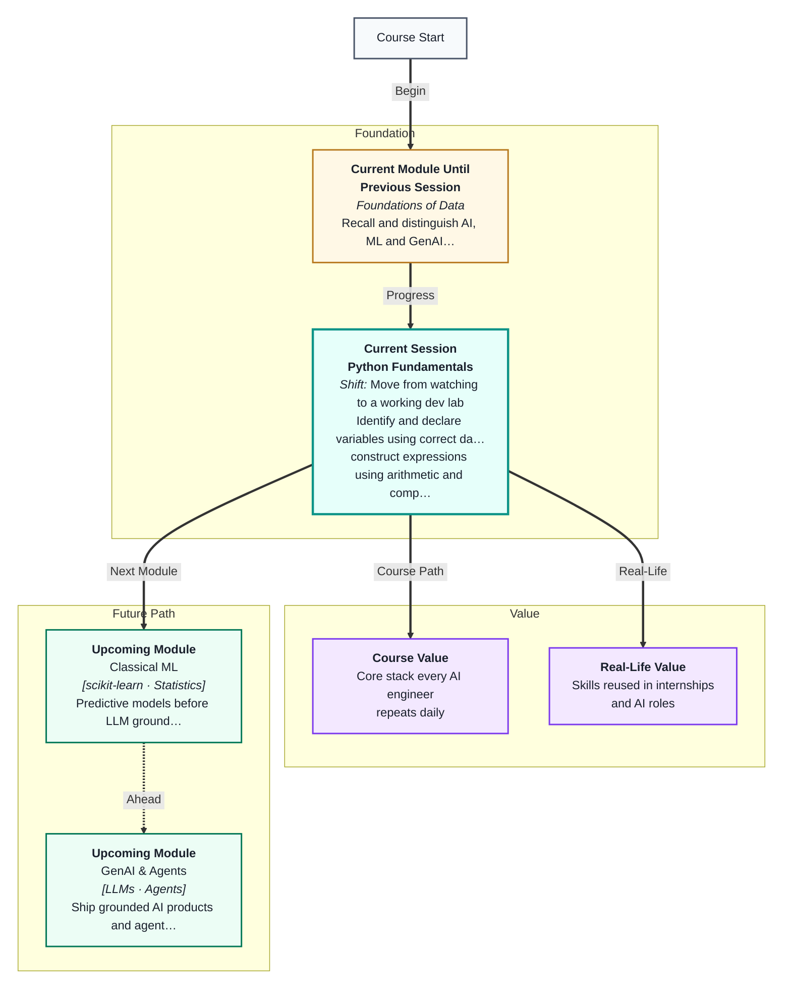
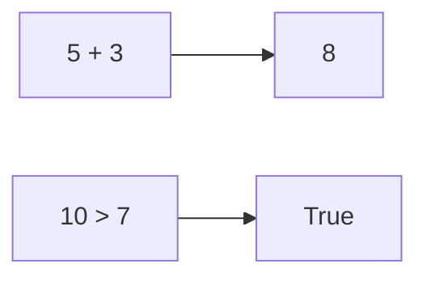

# Python Fundamentals
---

## Mental Map



## What You'll Learn

In this pre-read, you'll discover:

- How to **declare variables** and pick the right **data types**
- How **operators** let you compute and compare values
- How **input and output** connect your program to the user
- How **f-strings** format readable messages
- Good **Colab notebook habits** so your work stays organised

---

## A. Variables — Named Storage Boxes

> 💡 **Analogy:** A **variable** is like a labelled lunch box. You put food in, close the lid, and next time you open "Monday lunch," the same contents are there — unless you swap them.

**One-line definition:** A **variable** is a name that points to a value stored in memory.

```python
age = 25          # int
price = 19.99     # float
name = "Priya"    # str
is_student = True # bool
```

| Type | Example | Use when |
|---|---|---|
| int | 42 | Whole numbers |
| float | 3.14 | Decimals |
| str | "hello" | Text |
| bool | True, False | Yes/no flags |

---

## B. Operators — Doing Math and Comparisons

> 💡 **Analogy:** Operators are kitchen tools: **+** is a mixer, **>** is a taste test ("is this spicier than that?").

**One-line definition:** **Operators** are symbols that perform calculations or comparisons on values.

| Arithmetic | Comparison | Result type |
|---|---|---|
| + − * / | == != | number or bool |
| // % ** | < > <= >= | |



---

## C. Input, Output, and f-strings

> 💡 **Analogy:** **print()** is announcing your order number. **input()** is the cashier asking your name. **f-strings** are name tags that auto-fill the details.

**One-line definition:** **Input/output** lets programs talk to users; **f-strings** embed variables inside text.

```python
name = input("Your name: ")
score = 87
print(f"Hello {name}, you scored {score}%")
```

---

## D. Colab Notebook Discipline

> 💡 **Analogy:** A notebook is a lab journal — one idea per cell, run in order, note what each experiment showed.

**Rules:**
- One logical step per cell
- Run cells top to bottom after changes
- Add a short markdown note above tricky cells
- Restart kernel if variables behave oddly

---

## Practice Exercises

**1. Pattern Recognition** — What type is each value: `3.0`, `"3.0"`, `3`, `True`?

**2. Concept Detective** — `print(10 / 4)` vs `print(10 // 4)` — why are the outputs different?

**3. Real-Life Application** — Name three values you'd store for a food delivery app order.

**4. Spot the Error** — `age = input("Age: ")` then `print(age + 1)` crashes. Why?

**5. Planning Ahead** — Write pseudocode for a tip calculator: ask bill amount, compute 15% tip, print total with f-string.

---

> ✅ **You're done!** Variables, types, and I/O are the atoms of every Python program. Next you will add **decisions** with if/elif/else.
