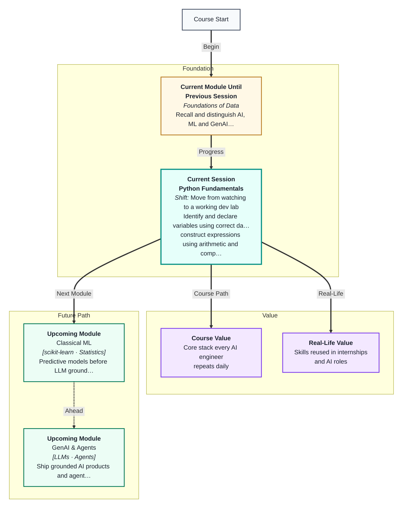
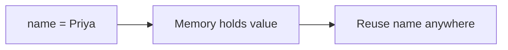
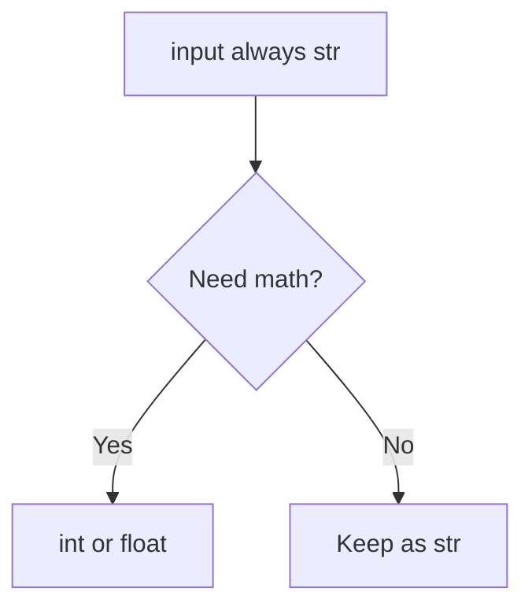
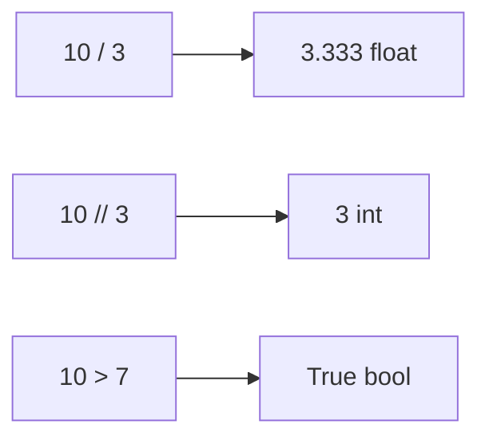
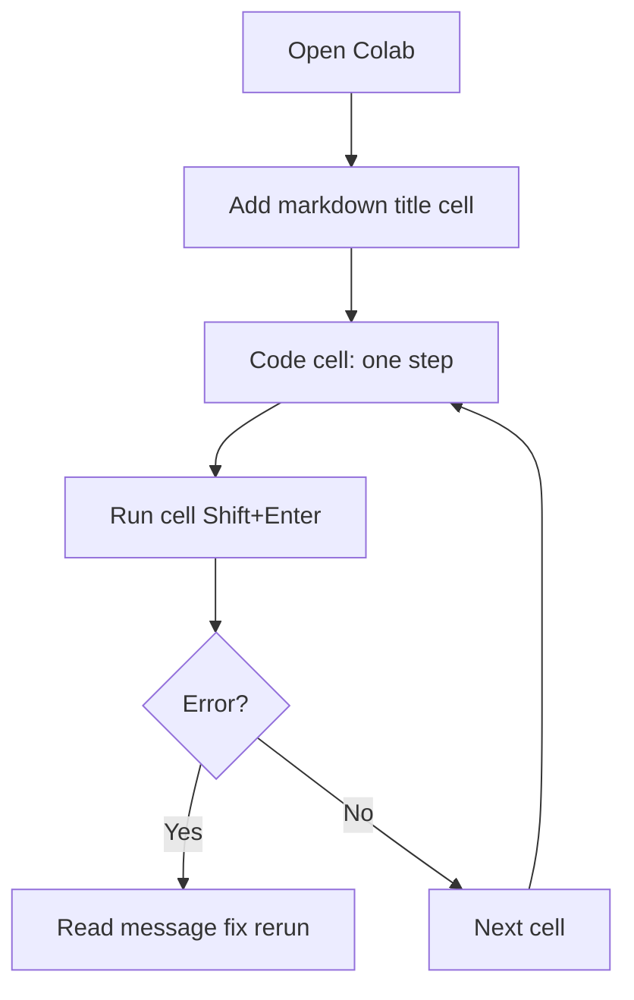
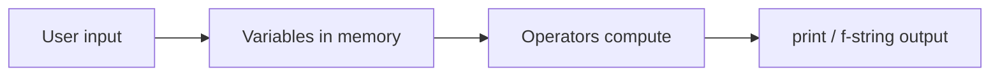
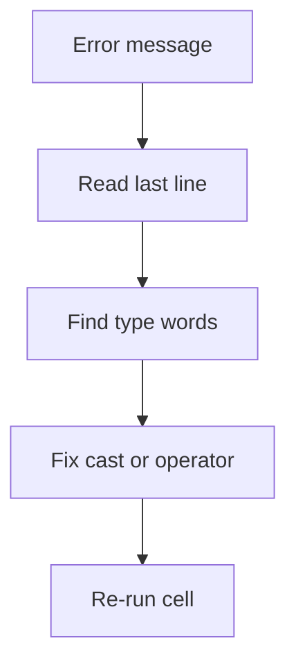
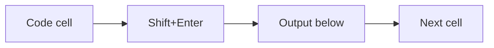
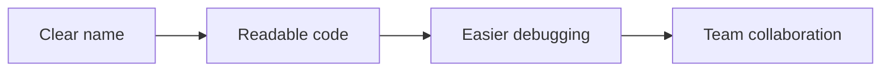

# Python Fundamentals
---

## Mental Map



## What You'll Learn

In this pre-read, you'll discover:

- How to **declare variables** and pick the right **data types** for your data
- How **operators** let you compute, compare, and combine values
- How **input and output** connect your program to the person using it
- How **f-strings** format readable messages with variables inside
- Good **Colab notebook habits** so your work stays organised and reproducible
- How Python shows up inside **Indian apps** you already use every day

---

## A. Variables — Named Storage Boxes

> 💡 **Analogy:** A **variable** is like a labelled lunch box. You put food in, close the lid, and next time you open "Monday lunch," the same contents are there — unless you swap them for something else.

**One-line definition:** A **variable** is a name that points to a value stored in memory so you can reuse and update it later.

```python
age = 25          # int — whole number
price = 19.99     # float — decimal number
name = "Priya"    # str — text (string)
is_student = True # bool — True or False
```

| Type | Example | Use when |
|---|---|---|
| int | 42, -7, 0 | Whole counts — age, quantity, year |
| float | 3.14, 99.5 | Decimals — price, temperature, score |
| str | "hello", 'Python' | Text — names, messages, IDs as text |
| bool | True, False | Yes/no flags — is_active, passed |



**Worked example — Swiggy order receipt:**

| Variable | Type | Sample value |
|---|---|---|
| `restaurant` | str | "Biryani House" |
| `item_count` | int | 3 |
| `subtotal` | float | 450.00 |
| `is_premium` | bool | False |

**Key idea:** The **type** tells Python how to treat the value. `"5"` (text) and `5` (number) look similar but behave very differently in math.

---

## B. Data Types — Why `"5"` and `5` Are Not the Same

> 💡 **Analogy:** A phone contact labelled "Home" with the number 555-0100 is not the same as typing the word "five-five-five" into the dialer.

**One-line definition:** A **data type** is the category of a value that controls what operations Python allows on it.

```python
print(type(42))        # <class 'int'>
print(type(3.14))      # <class 'float'>
print(type("hello"))   # <class 'str'>
print(type(True))      # <class 'bool'>
```

| Value | Type | What happens with `+ 1` |
|---|---|---|
| `5` | int | `6` — math works |
| `5.0` | float | `6.0` — math works |
| `"5"` | str | Error — cannot add text and number |
| `True` | bool | `2` — True acts like 1 in math (avoid this habit) |

**Type conversion** (casting):

```python
age_text = "25"
age_number = int(age_text)
print(age_number + 1)        # 26

upi_amount = "1500"
amount = float(upi_amount)
print(f"Paid ₹{amount:.2f}")
```



**Key idea:** `input()` always returns a **string**. If you ask for age or bill amount and want math, you must convert.

---

## C. Operators — Doing Math and Comparisons

> 💡 **Analogy:** Operators are kitchen tools: **+** is a mixer, **==** is a taste test, and **>** asks "is this portion bigger?"

**One-line definition:** **Operators** are symbols that perform calculations or comparisons on values and return a result.

| Operator | Name | Example | Result |
|---|---|---|---|
| + | Addition | `10 + 3` | 13 |
| - | Subtraction | `10 - 3` | 7 |
| * | Multiplication | `10 * 3` | 30 |
| / | Division | `10 / 3` | 3.333… |
| // | Floor division | `10 // 3` | 3 |
| % | Modulo | `10 % 3` | 1 |
| ** | Exponent | `2 ** 3` | 8 |

| Operator | Meaning | Example |
|---|---|---|
| == | Equal to | `5 == 5` → True |
| != | Not equal | `5 != 3` → True |
| >, <, >=, <= | Greater / less | `10 > 7` → True |



**Worked example — splitting a ₹1,200 dinner bill among 5 friends:**

```python
bill = 1200
people = 5
each_pays = bill / people      # 240.0 float
whole_groups = bill // people  # 240 int
leftover = bill % people       # 0
```

**Key idea:** `/` always gives a float in Python 3, even when the answer is whole: `10 / 2` is `5.0`, not `5`.

---

## D. Input, Output, and f-strings

> 💡 **Analogy:** **print()** announces your order number. **input()** asks your name. **f-strings** are name tags that auto-fill your details.

**One-line definition:** **Input/output (I/O)** lets programs talk to users; **f-strings** embed variables inside text cleanly.

```python
name = input("Your name: ")
print("Hello,", name)

name = "Priya"
score = 87
print(f"Hello {name}, you scored {score}%")

bill = 1200.50
tip_pct = 15
tip = bill * tip_pct / 100
print(f"Bill: ₹{bill:.2f}, Tip: ₹{tip:.2f}, Total: ₹{bill + tip:.2f}")
```

| Format style | Example | When to use |
|---|---|---|
| f-string | `f"Hi {name}"` | Best default — readable |
| comma in print | `print("Hi", name)` | Quick debug |
| str + str | `"Hi " + name` | Works but clumsy for many values |

**Key idea:** f-strings make your output readable. You will use them in every lab and project in this course.

---

## E. Comments and Readable Code

> 💡 **Analogy:** Comments are sticky notes on a recipe — they explain *why* you preheat the oven.

**One-line definition:** A **comment** is a note Python ignores, written for humans reading your code.

```python
# Ask for the user's name
name = input("Name: ")
bill = 500  # bill amount in rupees
```

| Good habit | Bad habit |
|---|---|
| `monthly_salary = 45000` | `ms = 45000` |
| Explain business rule in comment | Comment every obvious line |
| One idea per line when learning | Five statements crammed on one line |

**Key idea:** Clear names beat clever shortcuts. Your future self (and your teammate) reads this code in six months.

---

## F. Colab Notebook Discipline

> 💡 **Analogy:** A notebook is a lab journal — one experiment per cell, run in order.

**One-line definition:** **Colab discipline** means organising notebook cells so your code runs predictably top to bottom.



| Rule | Why it matters |
|---|---|
| One logical step per cell | Easier to debug |
| Run cells top to bottom | Variables exist in order |
| Add markdown headers | You find sections later |
| Restart runtime if variables act odd | Clears stale state |
| Save a copy to Drive | Colab sessions expire |

| Action | Shortcut |
|---|---|
| Run cell | Shift + Enter |
| Add code cell | Ctrl + M, then B |
| Add markdown cell | Ctrl + M, then M |

**Key idea:** Professional data work lives in notebooks. Building good habits now saves hours when datasets get large.

---

## G. Python Behind Apps You Use in India

> 💡 **Analogy:** You do not see the kitchen when you order biryani on Swiggy — but variables and math still run behind the app.

**One-line definition:** Every feature you tap — UPI pay, delivery ETA, coupon codes — is built from the same primitives you learn today: store values, compute, show text.

| App feature | Variables involved | Type mix |
|---|---|---|
| UPI amount entry | `amount`, `upi_id`, `verified` | float, str, bool |
| Swiggy delivery fee | `distance_km`, `base_fee`, `surge` | float, float, float |
| IRCTC passenger count | `adults`, `children`, `quota` | int, int, str |
| PhonePe cashback | `cashback_pct`, `order_total` | float, float |



**Worked example — UPI receipt message (pseudocode):**

```
store payer_name as string
store amount as float after converting input
store txn_id as string
print f-string with rupee symbol and two decimals
```

**Key idea:** Session 2 feels small, but it is the same language powering payment apps, recommendation engines, and GenAI tools later in the course.

---

## H. Debugging TypeErrors — Read the Error Message

> 💡 **Analogy:** A TypeError is the fire alarm telling you two things do not fit together — like pouring milk into a petrol tank.

**One-line definition:** A **TypeError** happens when you use an operator or function on the wrong data type.

| Error snippet | Likely cause | Fix |
|---|---|---|
| `can only concatenate str (not "int") to str` | Added string + number | Convert with `str()` or `int()` |
| `unsupported operand type(s) for +: 'int' and 'str'` | Mixed types in math | Cast input before `+` |
| `invalid literal for int()` | User typed "twenty" | Validate input or use try/except later |

```python
# Broken
age = input("Age: ")
print(age + 1)

# Fixed
age = int(input("Age: "))
print(age + 1)
```



**Key idea:** Errors are teachers, not enemies. Read the last line of the traceback — it usually names the types that clashed.

---


## I. Running Your First Cells — Step by Step

| Step | Action | What you should see |
|---|---|---|
| 1 | New Colab notebook | Empty code cell |
| 2 | `print("Hello")` + Shift+Enter | `Hello` below cell |
| 3 | `name = "Asha"` then `print(name)` | `Asha` |
| 4 | `type(name)` | `<class 'str'>` |
| 5 | Restart runtime + rerun from top | Same results if order preserved |



**Worked example — chai shop receipt variables:**

```python
shop = "Corner Chai"
cups = 2
price_per_cup = 15.0
total = cups * price_per_cup
print(f"{cups} cups from {shop}: ₹{total:.2f}")
```

| Variable | Type | Role |
|---|---|---|
| shop | str | Shop name on receipt |
| cups | int | Count of items |
| price_per_cup | float | Rupees with paise |
| total | float | Computed line amount |

**Common beginner questions:**

| Question | Short answer |
|---|---|
| Why `3.0` not int? | Decimal point makes it float |
| Can I change a variable? | Yes — reassignment replaces value |
| What if cell order wrong? | NameError — rerun from top |

**Key idea:** Treat the notebook like a recipe — ingredients (variables) must exist before you cook (compute).

---

## J. Variable Naming — Do's and Don'ts

| Do | Don't | Why |
|---|---|---|
| `monthly_salary` | `ms` | Readable in six months |
| `item_count` | `item count` | Spaces invalid |
| `total_gst` | `Total_GST` mixed | Pick one case style |
| `is_active` | `active` alone | bool names read as questions |



**Worked example — renaming unclear code:**

| Before | After | Improvement |
|---|---|---|
| `x = 45000` | `monthly_salary = 45000` | Meaning clear |
| `t = 18` | `gst_percent = 18` | Unit obvious |
| `f = True` | `is_gst_inclusive = True` | bool reads as yes/no |

**Key idea:** You spend more time reading code than writing it — names are documentation.

---

## K. Print Debugging — Your First Superpower

Before fancy debuggers, use **print** to see variable values:

```python
bill = 800
tip_pct = 15
tip = bill * tip_pct / 100
print("DEBUG bill:", bill, "tip:", tip)
```

| When stuck | Print this |
|---|---|
| Wrong total | intermediate variables |
| Unexpected type | `type(x)` |
| Which branch ran | message inside each if branch |

**Key idea:** `print("DEBUG:", variable)` is professional habit — not just for beginners.

---

## Practice Exercises

**1. Pattern Recognition** — For each value, name the type: (a) `3.0`, (b) `"3.0"`, (c) `3`, (d) `True`, (e) `"True"`. Which pairs look alike but behave differently?

**2. Concept Detective** — A student runs `print(10 / 4)` and gets `2.5`, then `print(10 // 4)` and gets `2`. Explain why both are correct but different.

**3. Real-Life Application** — You are building a Zomato-style receipt. List five values as variables with types (include int, float, str). Name each variable clearly.

**4. Spot the Error** — This code crashes: `age = input("Age: "); print(age + 1)`. What error type appears? What two-line fix would you apply?

**5. Planning Ahead** — Write pseudocode for a tip calculator: ask bill amount in rupees, compute 15% tip, print bill + tip + total with an f-string. Mention where you convert types.

---

> ✅ **You're done!** Variables, types, operators, and I/O are the atoms of every Python program in this course — from data cleaning to machine learning to GenAI agents. Next session you will add **decisions** with if/elif/else so your programs branch like real apps do.
