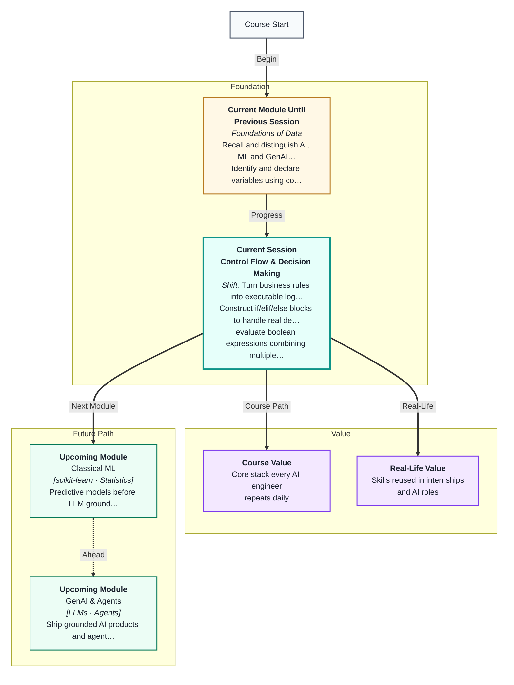
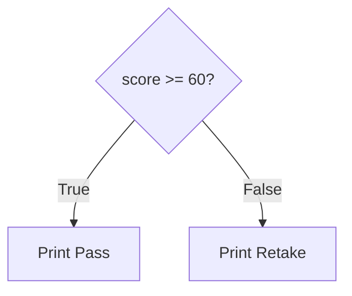
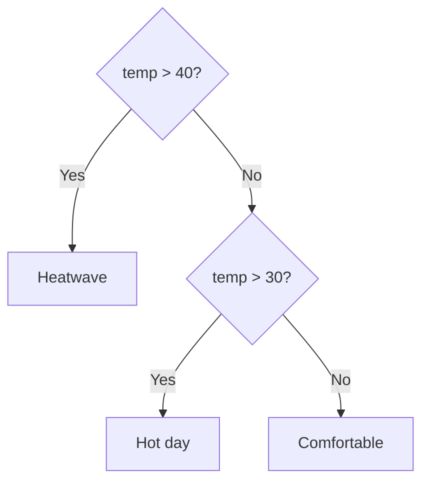
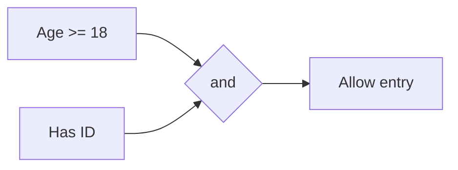
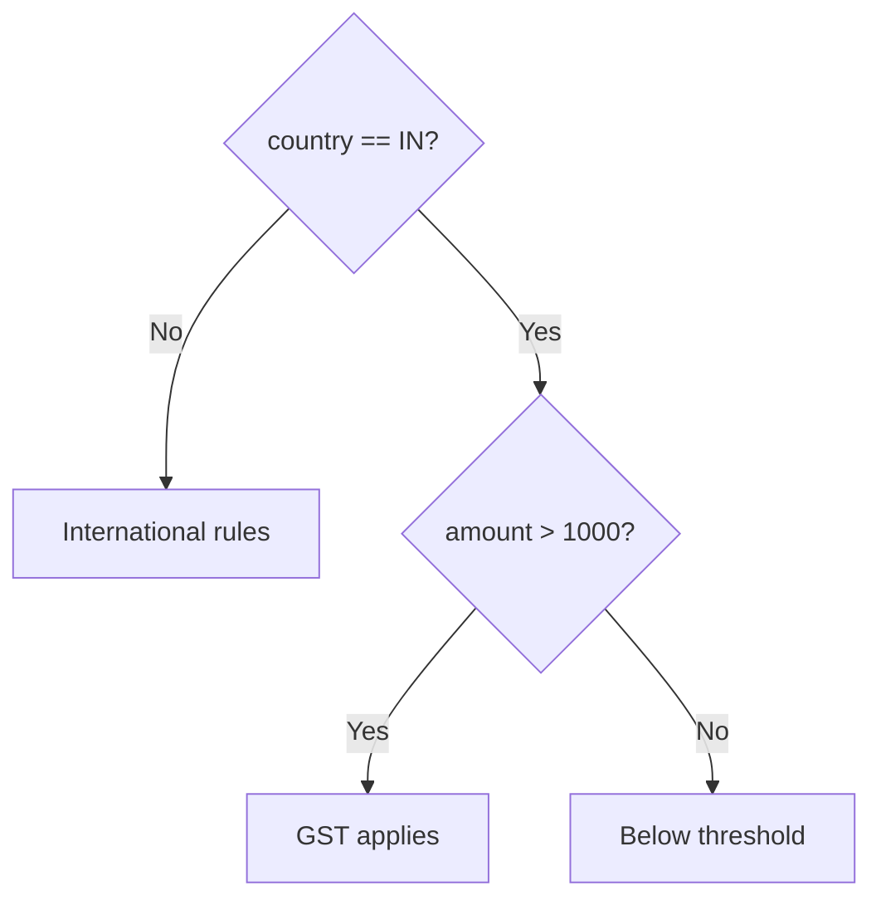
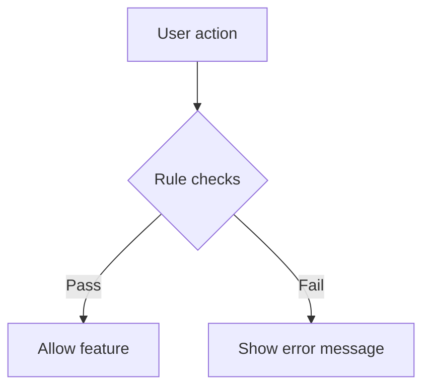
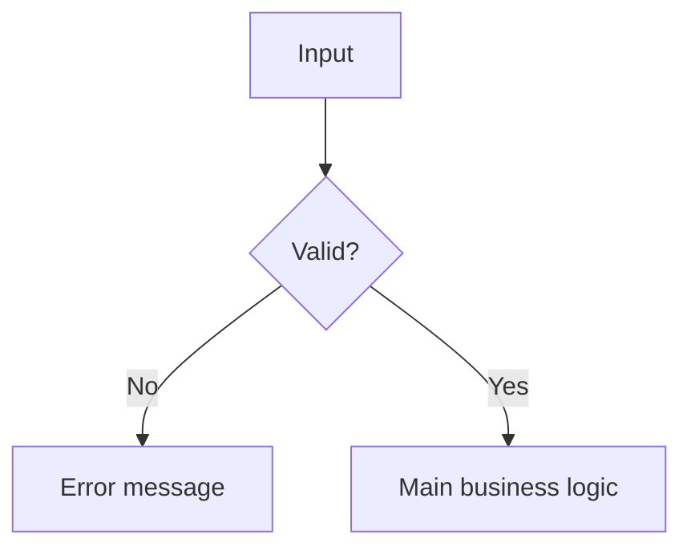
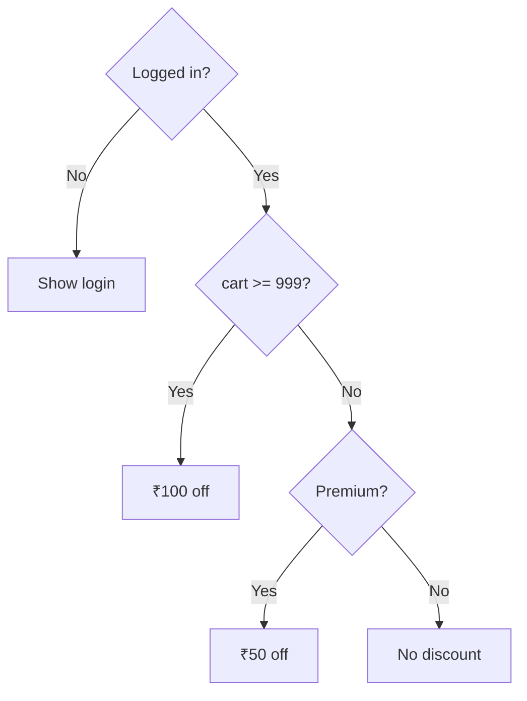
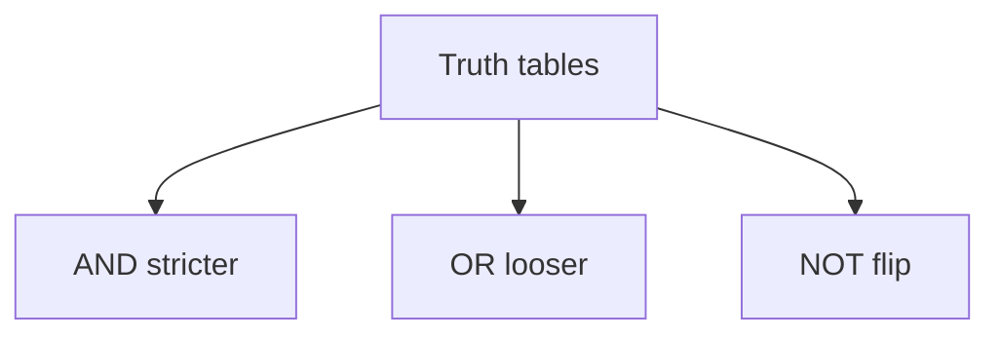

# Control Flow & Decision Making
---

## Mental Map



## What You'll Learn

In this pre-read, you'll discover:

- How **if / elif / else** run different code paths based on conditions
- How **boolean logic** (and, or, not) combines multiple tests
- How **comparison operators** produce True or False values
- How to **trace nested conditions** step by step and predict output
- How real apps — UPI limits, Swiggy surge, loan checks — use decisions every second

---

## A. The if Statement — One Fork in the Road

> 💡 **Analogy:** At a traffic junction, if the light is green you go; otherwise you stop.

**One-line definition:** An **if statement** runs a block of code only when a **condition** evaluates to **True**.

```python
score = 72
if score >= 60:
    print("Pass")
else:
    print("Retake")
```



| Part | Role |
|---|---|
| `if` | Start the decision |
| condition | Expression that is True or False |
| `:` | Starts the block |
| indented body | Code that runs when True |
| `else` | Optional — runs when False |

**Key idea:** Python checks the condition once. If True, it runs the `if` block and **skips** the `else`.

---

## B. elif and else — Multiple Branches

> 💡 **Analogy:** A restaurant menu with Veg / Non-veg / Dessert — you pick **one** path.

**One-line definition:** **elif** adds extra conditions between `if` and `else` so your program can choose among three or more outcomes.

```python
temp = 38
if temp > 40:
    print("Heatwave alert")
elif temp > 30:
    print("Hot day")
else:
    print("Comfortable")
```

| temp value | Branch that runs |
|---|---|
| 45 | First `if` — Heatwave |
| 38 | First `elif` — Hot day |
| 22 | `else` — Comfortable |



**Key idea:** Order matters. Put the strictest or highest threshold first when ranges overlap.

---

## C. Boolean Logic — AND, OR, NOT

> 💡 **Analogy:** Entering a concert needs a **ticket and** valid ID. A sale applies if you are a **member or** have a coupon.

**One-line definition:** **Boolean logic** combines True/False conditions using `and`, `or`, and `not`.

| Operator | True when | Everyday read |
|---|---|---|
| A and B | Both True | "Both must hold" |
| A or B | At least one True | "Either is enough" |
| not A | A is False | "Opposite of A" |

**AND truth table:**

| A | B | A and B |
|---|---|---|
| True | True | True |
| True | False | False |
| False | True | False |
| False | False | False |

**OR truth table:**

| A | B | A or B |
|---|---|---|
| True | True | True |
| True | False | True |
| False | True | True |
| False | False | False |



**Key idea:** `and` is stricter. `or` is looser. Use `()` when mixing them.

---

## D. Comparison Operators — Building Conditions

> 💡 **Analogy:** A luggage scale compares your bag's weight to the limit.

**One-line definition:** **Comparison operators** test how two values relate and always return a **bool**.

| Operator | Meaning | Example |
|---|---|---|
| == | equal to | `score == 100` |
| != | not equal | `status != "banned"` |
| >, <, >=, <= | greater / less | `age > 18` |

| Symbol | Meaning |
|---|---|
| `=` | Assign a value to a variable |
| `==` | Compare two values for equality |

```python
x = 5      # assignment
x == 5     # comparison — True

score = 82
if 75 <= score < 90:
    print("Grade B")
```

**Key idea:** Conditions inside `if` must evaluate to True or False — not assignment statements.

---

## E. Nested Conditions — Decisions Inside Decisions

> 💡 **Analogy:** An outer gate checks your ticket. An inner gate checks your seat section.

**One-line definition:** A **nested condition** is an if statement inside another if block.

```python
country = "IN"
amount = 1500

if country == "IN":
    if amount > 1000:
        print("GST applies")
    else:
        print("Below GST threshold")
else:
    print("International order")
```

| country | amount | Output |
|---|---|---|
| IN | 1500 | GST applies |
| IN | 500 | Below GST threshold |
| US | 1500 | International order |



**Key idea:** Deep nesting (4+ levels) gets hard to read. Often `and` / `or` or early `elif` chains are clearer.

---

## F. Tracing Execution — Predict Before You Run

> 💡 **Analogy:** Following a board game rulebook move by move before rolling dice.

**One-line definition:** **Tracing** is following each condition in order to determine which lines execute.

```python
x = 15
if x > 20:
    print("A")
elif x > 10:
    print("B")
else:
    print("C")
# Output: B
```

| Step | Check | Result |
|---|---|---|
| 1 | `x > 20` | False — skip |
| 2 | `x > 10` | True — print B |
| 3 | `else` | Skipped |

**Key idea:** Tracing is a core interview and debugging skill.

---

## G. Decisions in Indian Apps — UPI, Swiggy, IRCTC

> 💡 **Analogy:** Every "Proceed to pay" button hides dozens of if-statements checking balance, limits, and fraud flags.

**One-line definition:** Production apps encode **business rules** as conditions — the same if/elif/else you write in Colab.

| App | Condition (plain English) | Python-style sketch |
|---|---|---|
| PhonePe | If amount > ₹1,00,000 require extra OTP | `if amount > 100000 and not otp_verified:` |
| Swiggy | If rain alert and peak hour, add surge fee | `if is_raining and is_peak:` |
| IRCTC | If waitlist number <= 10 show high chance | `if waitlist <= 10:` |
| Paytm | If KYC incomplete block wallet send | `if not kyc_complete:` |



**Worked example — UPI daily limit:**

| Variable | Value | Rule |
|---|---|---|
| `daily_spent` | 45000 | Max ₹1,00,000 per day |
| `this_txn` | 60000 | Would exceed limit |
| Result | Block | `if daily_spent + this_txn > 100000:` |

**Key idea:** Session 1 taught you that banks mix **rules** and **ML**. Session 3 teaches you to write the rule half yourself.

---

## H. Validation Before You Decide

> 💡 **Analogy:** A bouncer checks ID format before checking age — garbage input gets rejected early.

**One-line definition:** **Input validation** uses if-statements to reject bad data before main logic runs.

```python
score = int(input("Score (0-100): "))
if score < 0 or score > 100:
    print("Invalid score")
else:
    if score >= 60:
        print("Pass")
    else:
        print("Retake")
```

| Check | Why |
|---|---|
| Range 0–100 | Prevents nonsense grades |
| Non-empty string | Prevents blank usernames |
| Positive amount | Prevents negative UPI transfers |



**Key idea:** Validate first, decide second. Real apps never trust raw input.

---


## I. Combining Decisions — Real Rule Chains

> 💡 **Analogy:** Airport security: domestic vs international (outer), then baggage weight (inner), then random screening (extra check).

**One-line definition:** **Rule chains** stack conditions the way apps stack checks before showing a feature.

```python
logged_in = True
is_premium = False
cart_total = 1200

if logged_in:
    if cart_total >= 999:
        discount = 100
    elif is_premium:
        discount = 50
    else:
        discount = 0
    print(f"Discount: ₹{discount}")
else:
    print("Please log in")
```

| logged_in | cart_total | is_premium | discount |
|---|---|---|---|
| True | 1200 | False | 100 |
| True | 500 | True | 50 |
| True | 500 | False | 0 |
| False | any | any | login message |



**Swiggy-style surge (sketch):**

| Condition | Message |
|---|---|
| rain and peak | "+₹30 surge fee" |
| rain only | "+₹15 surge fee" |
| else | standard fee |

**Key idea:** Apps feel "smart" because many small if-checks run in sequence — you are learning to write that logic.

---

## J. Truth Table Practice — AND / OR / NOT

Fill before class (answers below for instructor):

| A | B | A and B | A or B |
|---|---|---|---|
| True | True | ? | ? |
| True | False | ? | ? |
| False | True | ? | ? |
| False | False | ? | ? |

| A | not A |
|---|---|
| True | ? |
| False | ? |



**PhonePe example:** `pin_ok and balance_ok and not blocked` — all must pass for send money.

**Key idea:** When in doubt, draw a two-row truth table on paper before coding compound conditions.

---

## K. Comparison Pitfalls — = vs ==

| Code | Valid? | Meaning |
|---|---|---|
| `x = 5` | Yes | assign 5 to x |
| `x == 5` | Yes | compare x to 5 |
| `if x = 5:` | **No** | SyntaxError |
| `if x == 5:` | Yes | branch when equal |

```python
status = "gold"
if status == "gold":
    print("15% loyalty discount")
```

**IRCTC sketch:** `if quota == "TATKAL" and age >= 12` — two comparisons with and.

**Key idea:** One equals assigns; two equals compares — the most common beginner syntax error in Session 3.

**Quick check:** Before Session 3 class, rewrite `if age = 18` correctly on paper.

---

## Practice Exercises

**1. Pattern Recognition** — Without running code, what prints when `x = 5` then when `x = 2` in an if/else that prints "A" when `x > 3` else "B"?

**2. Concept Detective** — Login needs valid email **and** password length >= 8. Write the condition using `and`.

**3. Real-Life Application** — List three apps that use if/else today. Describe one condition each checks.

**4. Spot the Error** — Why does `if age = 18:` fail? What single character fixes it?

**5. Planning Ahead** — Design grade bands A ≥ 90, B ≥ 75, C ≥ 60, else F with if/elif/else pseudocode. Explain why order matters.

---

> ✅ **You're done!** You can now branch code like real products — pass/fail, eligibility, discounts, and tax rules all start with if/elif/else. Next session you will add **loops** so programs repeat without copy-pasting.
