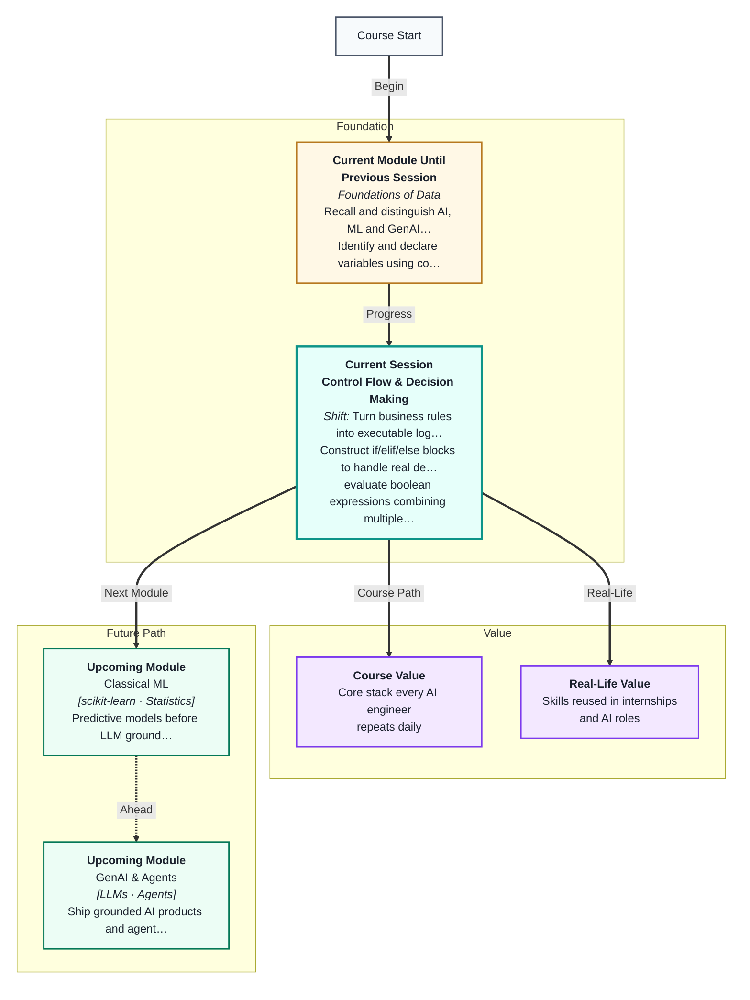
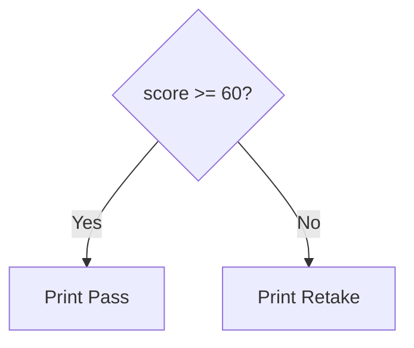

# Control Flow & Decision Making
---

## Mental Map



## What You'll Learn

In this pre-read, you'll discover:

- How **if / elif / else** run different code paths
- How **boolean logic** combines multiple conditions
- How **comparison operators** test values
- How to **trace nested conditions** and predict output
- How real apps use decisions (login, discounts, eligibility)

---

## A. The if Statement — One Fork in the Road

> 💡 **Analogy:** At a junction, if the light is green you go; otherwise you stop. **if** is that traffic decision for your code.

**One-line definition:** An **if statement** runs a block of code only when a condition is **True**.

```python
score = 72
if score >= 60:
    print("Pass")
else:
    print("Retake")
```



---

## B. elif and else — Multiple Branches

> 💡 **Analogy:** A menu with Veg / Non-veg / Dessert — pick **one** path. **elif** is the middle options.

```python
temp = 38
if temp > 40:
    print("Heatwave")
elif temp > 30:
    print("Hot")
else:
    print("Comfortable")
```

---

## C. Boolean Logic — AND, OR, NOT

> 💡 **Analogy:** Entering a club needs ID **and** age 18+. A sale applies if member **or** coupon. **NOT** flips yes to no.

| Operator | True when |
|---|---|
| A and B | Both true |
| A or B | At least one true |
| not A | A is false |

```python
age = 20
has_id = True
if age >= 18 and has_id:
    print("Entry allowed")
```

---

## D. Nested Conditions

> 💡 **Analogy:** Outer gate: ticket check. Inner gate: seat assignment. Each **nest** is another decision inside the previous one.

Trace carefully: only the inner block runs if the outer condition already passed.

---

## Practice Exercises

**1. Pattern Recognition** — What prints? `x=5` then `if x>3: print("A")` else `print("B")`

**2. Concept Detective** — Login needs email **and** password length ≥ 8. Write the condition in English, then Python.

**3. Real-Life Application** — List three apps that use if/else on your phone today.

**4. Spot the Error** — `if age = 18:` — why is this invalid?

**5. Planning Ahead** — Design grade bands: A ≥90, B ≥75, C ≥60, else F. Write pseudocode only.

---

> ✅ **You're done!** You can branch code like real products do. Next: **loops** for repeating actions without copy-paste.
